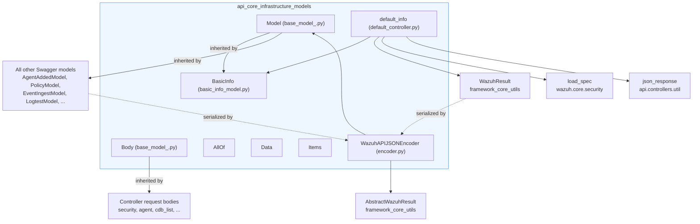
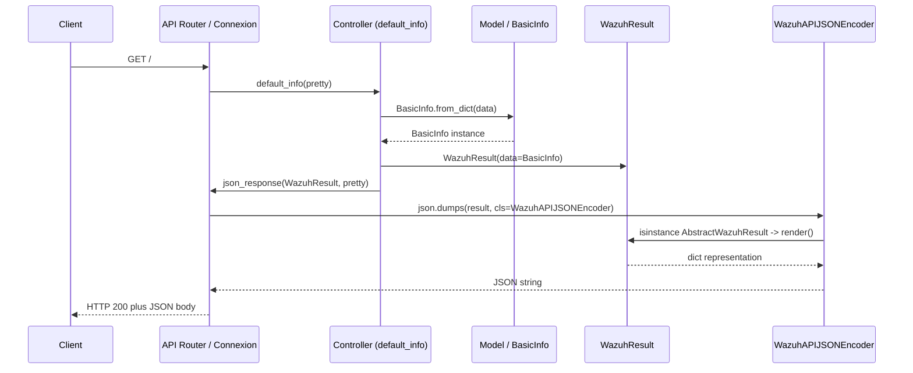
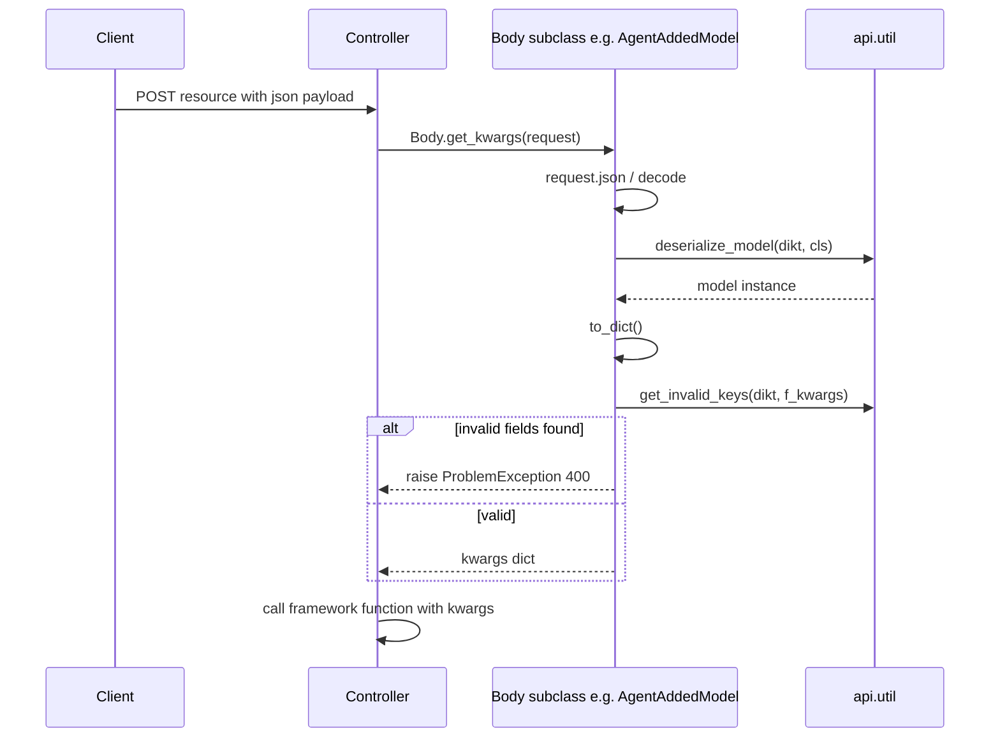
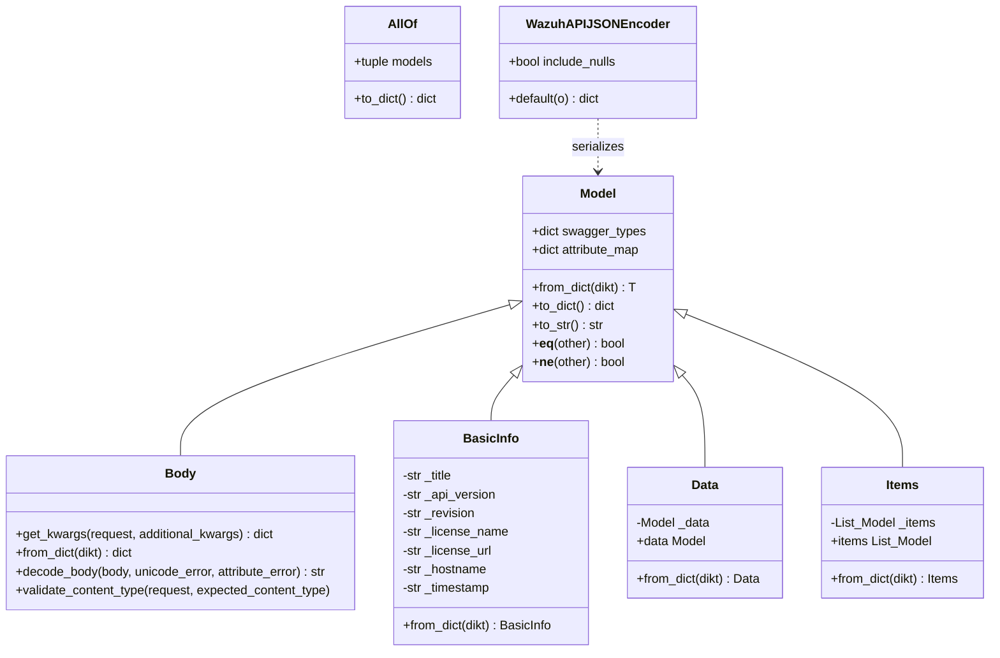
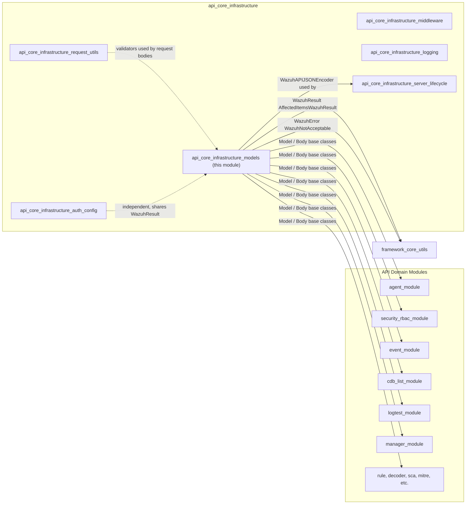
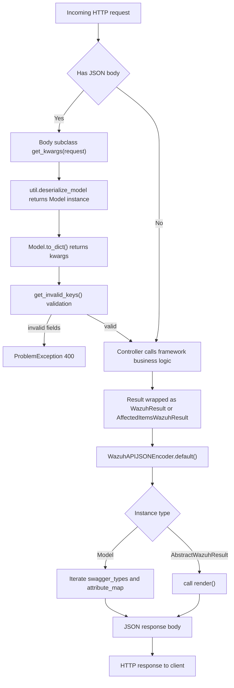

# API Core Infrastructure — Models

## Introduction

The **api_core_infrastructure_models** module provides the foundational data-modeling layer for the Wazuh REST API. It defines the base classes that every Swagger/OpenAPI-generated model in the API inherits from, the generic wrapper types used to shape JSON responses (`Data`, `Items`, `AllOf`), the custom JSON encoder that knows how to serialize these models and Wazuh result objects, and the single unauthenticated endpoint (`/` — `default_info`) that reports basic API metadata.

This module sits at the bottom of the API's dependency stack: nearly every other API sub-module (`agent_module`, `security_rbac_module`, `event_module`, `logtest_module`, etc.) depends on the `Model`/`Body` base classes defined here to implement their own request/response models. It has no dependencies on other API sub-modules, only on the `framework_core_utils` layer (`wazuh.core.results`, `wazuh.core.exception`, `wazuh.core.utils`) and on the API's generic `api.util` helper functions.

## Purpose and Scope

This module is responsible for:

1. **Base model contract** (`Model` class in `base_model_.py`) — defines `swagger_types`, `attribute_map`, `to_dict()`, `from_dict()`, `to_str()`, equality operators. Every generated Swagger model (`AgentAddedModel`, `PolicyModel`, `EventIngestModel`, etc., found in sibling modules such as [agent_module](agent_module.md) and [security_rbac_module](security_rbac_module.md)) inherits from `Model`.
2. **Request body contract** (`Body` class) — adds asynchronous JSON parsing (`get_kwargs`), content-type validation, and body decoding utilities used by all controller endpoints that accept a JSON payload (e.g., `create_user`, `add_agent`, `run_command`).
3. **Generic composition wrappers**:
   - `AllOf` — merges multiple model dictionaries into one (used for polymorphic/composed Swagger schemas).
   - `Data` — wraps a single model instance under a `data` key.
   - `Items` — wraps a list of model instances under an `items` key.
4. **JSON encoding** (`WazuhAPIJSONEncoder` in `encoder.py`) — a `connexion` `JSONEncoder` subclass that knows how to serialize `Model` instances (using `swagger_types`/`attribute_map`) and `AbstractWazuhResult` instances (via their `render()` method), enabling `WazuhResult`/`AffectedItemsWazuhResult` objects (defined in [framework_core_utils](framework_core_utils.md)) to be returned directly from controllers.
5. **Basic API information** (`BasicInfo` model + `default_info` controller) — implements the root `/` endpoint that returns API title, version, revision, license, hostname and timestamp without requiring authentication.

## Architecture Overview

## Component Relationships

| Component | Type | Responsibility | Key Consumers |
|---|---|---|---|
| `Model` | Base class | Generic `to_dict`/`from_dict`/`to_str`/equality for Swagger models | All model classes across every API sub-module |
| `Body` | Base class (extends `Model`) | Async request-body parsing/validation for controller POST/PUT payloads | Controllers in `agent_module`, `security_rbac_module`, `event_module`, `cdb_list_module`, etc. |
| `AllOf` | Composition helper | Merges multiple model `to_dict()` outputs (Swagger `allOf`) | Composed/inherited Swagger schemas |
| `Data` | Wrapper model | Wraps a single `Model` under `data` | Endpoints returning a single object |
| `Items` | Wrapper model | Wraps a `List[Model]` under `items` | Endpoints returning collections |
| `BasicInfo` | Concrete model | Represents API metadata (title, version, revision, license, hostname, timestamp) | `default_info` controller |
| `default_info` | Controller | Handles `GET /` — returns `BasicInfo` wrapped in a `WazuhResult` | API root route, health-check tooling |
| `WazuhAPIJSONEncoder` | JSON encoder | Serializes `Model` and `AbstractWazuhResult` instances to JSON | Connexion/FastAPI response serialization pipeline used by every controller in the API |

## Data Flow: Serving a Model-Based Response

## Data Flow: Parsing a Request Body

## Class Diagram

## Core Components

### `Model` and `Body` (`api/api/models/base_model_.py`)

`Model` is the root class used by every auto-generated Swagger model in the codebase. It provides:

- `swagger_types` / `attribute_map`: dictionaries mapping Python attribute names to their types and their JSON key names, populated by each subclass constructor.
- `to_dict()`: recursively converts the model (and nested models/lists/dicts) into plain Python dictionaries, delegating to `api.util.serialize` for scalar values.
- `from_dict()`: delegates to `api.util.deserialize_model` to build a model instance from a raw dict (typically parsed JSON).
- `to_str()` / `__repr__`: pretty-printing support for debugging and logging.
- `__eq__` / `__ne__`: structural equality based on `__dict__`.

`Body` extends `Model` and is used specifically for models that represent HTTP request payloads. It adds:

- `get_kwargs(request, additional_kwargs)`: an async classmethod that reads the JSON body from a request (or accepts an already-parsed dict), deserializes it into the model, converts it to a kwargs dictionary, and validates that no unexpected/invalid fields were supplied (raising a `ProblemException` HTTP 400 otherwise). This is the standard entry point used by controllers across the API (see [agent_module](agent_module.md), [security_rbac_module](security_rbac_module.md), [cdb_list_module](cdb_list_module.md), [event_module](event_module.md)) to convert incoming JSON into function arguments for the `framework/wazuh` business-logic layer.
- `decode_body()`: decodes raw bytes into UTF-8 text, raising `WazuhError` codes on failure — used for endpoints accepting raw file content (e.g., rule/decoder/CDB list uploads).
- `validate_content_type()`: enforces the expected MIME type of the request, raising `WazuhNotAcceptable` if mismatched.

### `AllOf`, `Data`, `Items` (`api/api/models/base_model_.py`)

These are lightweight composition helpers reflecting common OpenAPI schema patterns:

- **`AllOf`** is not itself a `Model` — it is a plain composition wrapper that takes multiple model instances and merges their `to_dict()` outputs into a single dictionary, mirroring the OpenAPI `allOf` keyword used for schema composition/inheritance.
- **`Data`** wraps a single nested `Model` instance under the `data` attribute/JSON key. It is used whenever an endpoint's response schema is a single object nested under `data`.
- **`Items`** wraps a `List[Model]` under the `items` attribute/JSON key, used for paginated/listing endpoints whose schema nests results under `items`.

### `BasicInfo` (`api/api/models/basic_info_model.py`)

A concrete `Model` subclass representing the payload returned by the API root endpoint. Fields: `title`, `api_version`, `revision`, `license_name`, `license_url`, `hostname`, `timestamp`. Each field has a generated getter/setter pair following the standard Swagger-codegen pattern.

### `default_info` controller (`api/api/controllers/default_controller.py`)

Implements the unauthenticated `GET /` endpoint:

1. Loads the OpenAPI specification via `wazuh.core.security.load_spec()` to extract `title`, `version`, `x-revision`, and `license` metadata.
2. Adds the machine `hostname` (via `socket.gethostname()`) and the current UTC `timestamp` (via `wazuh.core.utils.get_utc_now()`, formatted with `wazuh.core.common.DATE_FORMAT`).
3. Wraps the resulting dict in a `BasicInfo` model and then in a `WazuhResult` (from [framework_core_utils](framework_core_utils.md)).
4. Returns the response via `json_response()`, honoring the `pretty` query parameter for human-readable formatting.

This controller has no authentication/authorization requirements and is typically used as a lightweight health/version check, complementing the manager status endpoints found in [manager_module](manager_module.md).

### `WazuhAPIJSONEncoder` (`api/api/encoder.py`)

A `connexion.jsonifier.JSONEncoder` subclass registered as the default JSON encoder for the API application (wired up during server startup — see [api_core_infrastructure_server_lifecycle](api_core_infrastructure_server_lifecycle.md)). Its `default()` method handles two special cases that the standard `json` module cannot serialize:

- **`Model` instances**: iterates `swagger_types`, skips `None` values (unless `include_nulls` is `True`), and remaps attribute names to their JSON keys via `attribute_map`.
- **`AbstractWazuhResult` instances** (`WazuhResult`, `AffectedItemsWazuhResult` from [framework_core_utils](framework_core_utils.md)): delegates to the result's own `render()` method, which produces the standard Wazuh API response envelope (`data`, `message`, `error`, etc.).

Two convenience functions, `dumps()` and `prettify()`, wrap `json.dumps()` with this encoder for use elsewhere in the API stack (e.g., logging middleware, WebSocket/CLI tooling).

## How This Module Fits Into the System

- **Upstream dependency**: relies on [framework_core_utils](framework_core_utils.md) for `WazuhResult`/`AffectedItemsWazuhResult`/`AbstractWazuhResult` (result rendering) and for exception types (`WazuhError`, `WazuhNotAcceptable`).
- **Sibling modules within `api_core_infrastructure`**:
  - [api_core_infrastructure_server_lifecycle](api_core_infrastructure_server_lifecycle.md) wires `WazuhAPIJSONEncoder` into the Connexion/FastAPI application at startup.
  - [api_core_infrastructure_middleware](api_core_infrastructure_middleware.md) and [api_core_infrastructure_logging](api_core_infrastructure_logging.md) may serialize `WazuhResult`/error objects using the same encoder for access logs and error responses.
  - [api_core_infrastructure_request_utils](api_core_infrastructure_request_utils.md) provides field validators (`format_*` functions) commonly used alongside `Body` subclasses to validate individual model attributes before deserialization.
  - [api_core_infrastructure_auth_config](api_core_infrastructure_auth_config.md) is independent of this module but its token/user objects are ultimately rendered through the same `WazuhResult`/encoder pipeline for consistency.
- **Downstream consumers**: virtually every domain module that exposes API controllers ([agent_module](agent_module.md), [security_rbac_module](security_rbac_module.md), [event_module](event_module.md), [cdb_list_module](cdb_list_module.md), [logtest_module](logtest_module.md), [manager_module](manager_module.md), [rule_module](rule_module.md), [decoder_module](decoder_module.md), [sca_module](sca_module.md), [mitre_module](mitre_module.md), [rootcheck_module](rootcheck_module.md), [syscheck_module](syscheck_module.md), [syscollector_module](syscollector_module.md), [task_module](task_module.md), [active_response_module](active_response_module.md), [ciscat_module](ciscat_module.md)) defines its own Swagger-generated `Model`/`Body` subclasses that inherit directly from the base classes provided here.

## Process Flow: Request Lifecycle Involving Models

## Summary

The `api_core_infrastructure_models` module is a small but foundational piece of the Wazuh API: it standardizes how every request/response schema is represented in Python (`Model`/`Body`), how composite/wrapped schemas are expressed (`AllOf`/`Data`/`Items`), how these objects are serialized back to JSON (`WazuhAPIJSONEncoder`), and provides a concrete example of the full request→model→result→JSON pipeline through the `default_info`/`BasicInfo` root endpoint. Because nearly all other API modules build their domain-specific models on top of these base classes, changes here have wide-reaching effects across the entire [api_core_infrastructure](api_core_infrastructure.md) tree and all its consumer modules.
