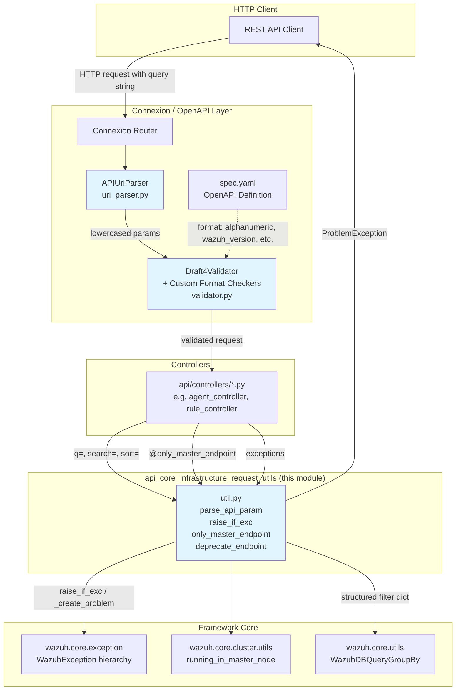
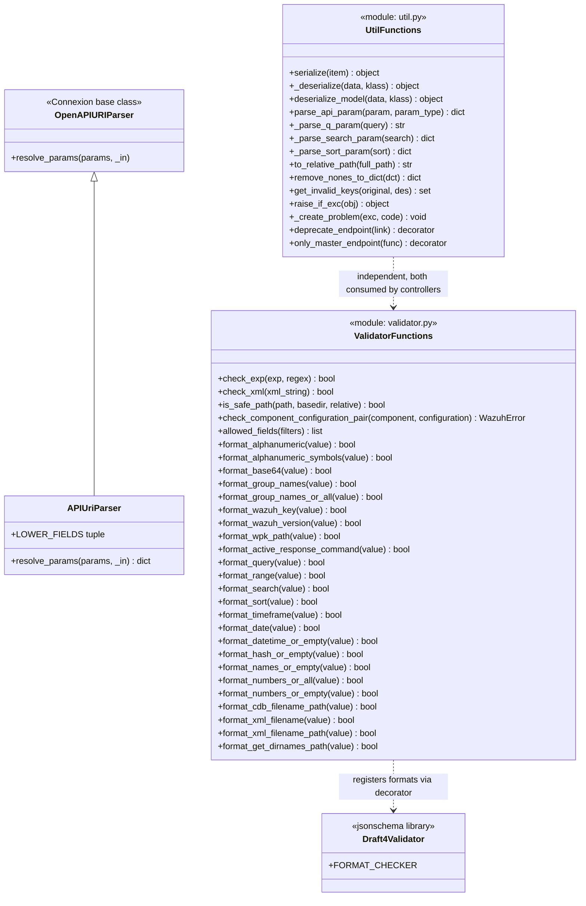
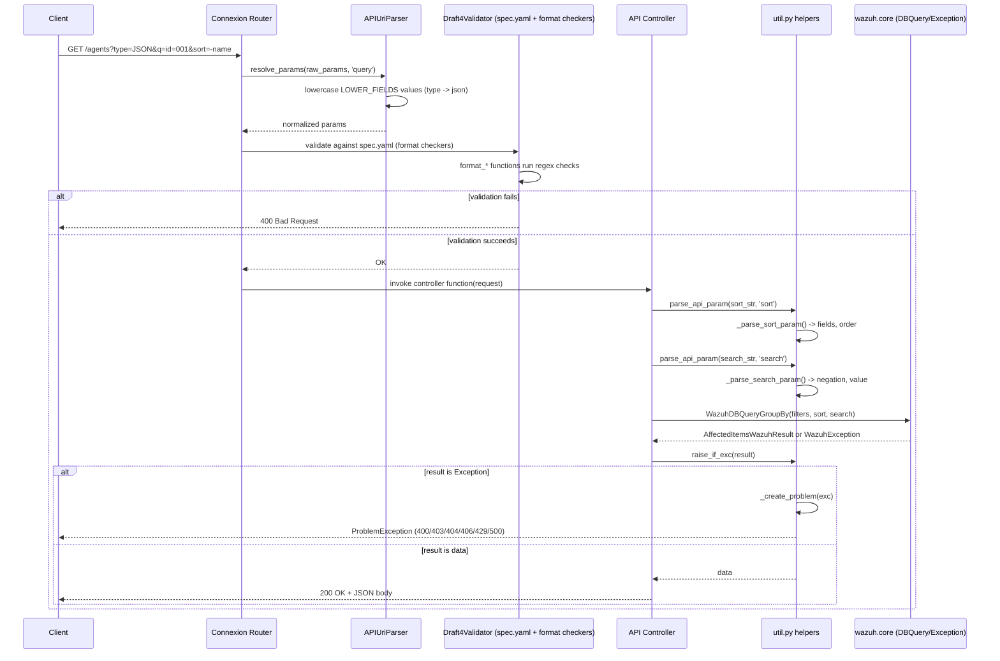
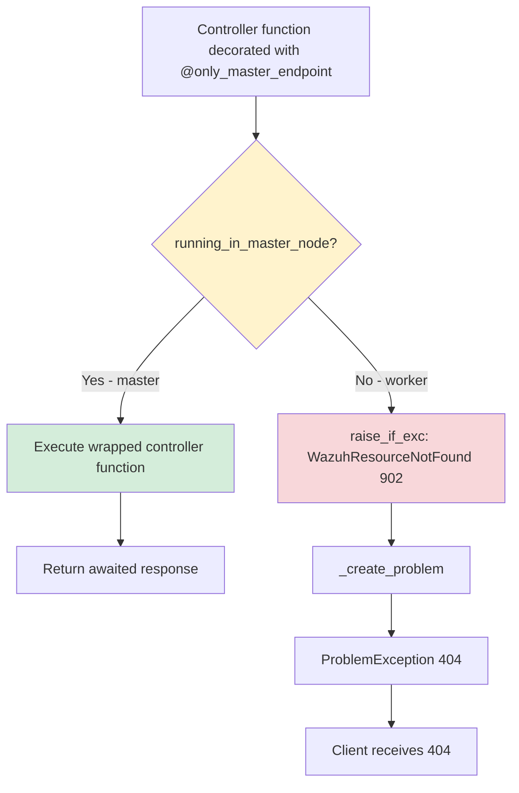
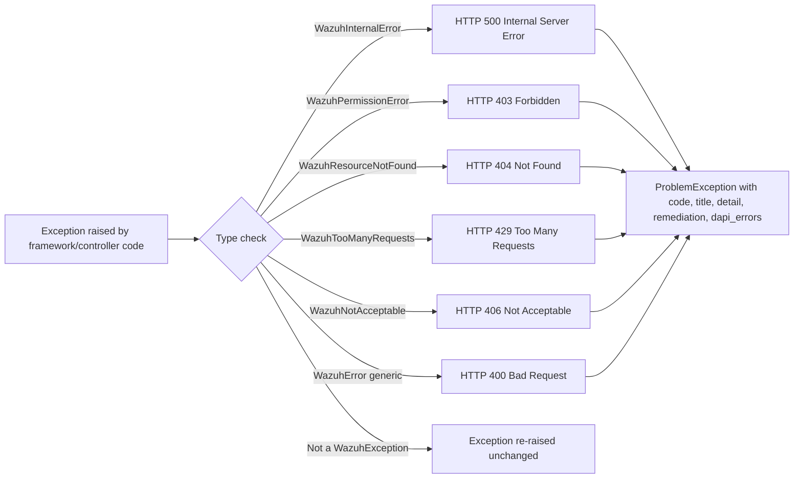
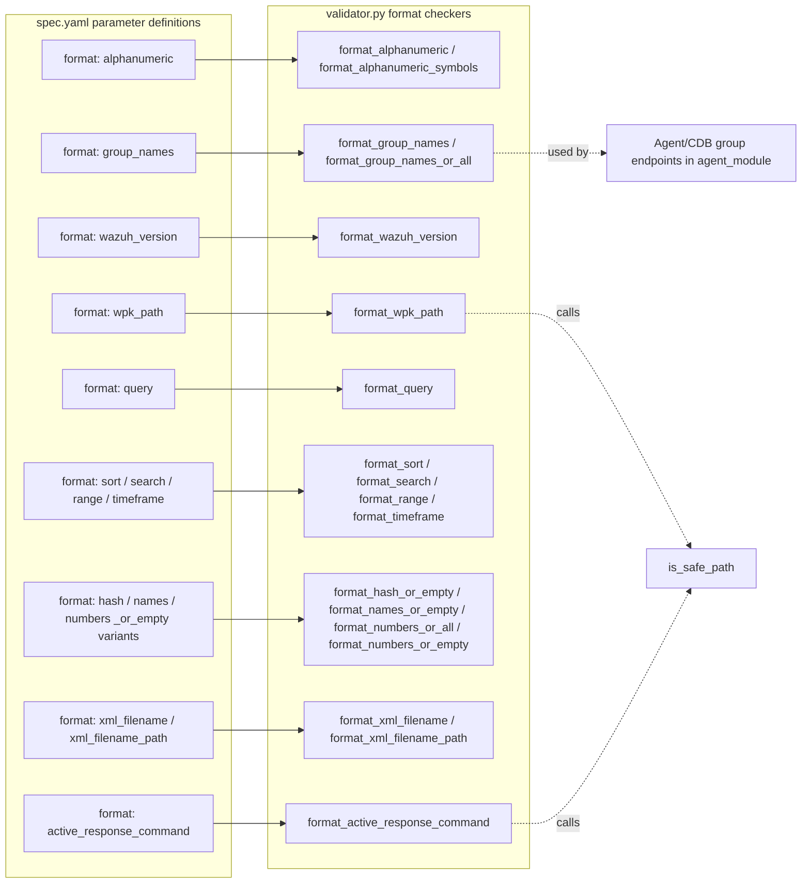
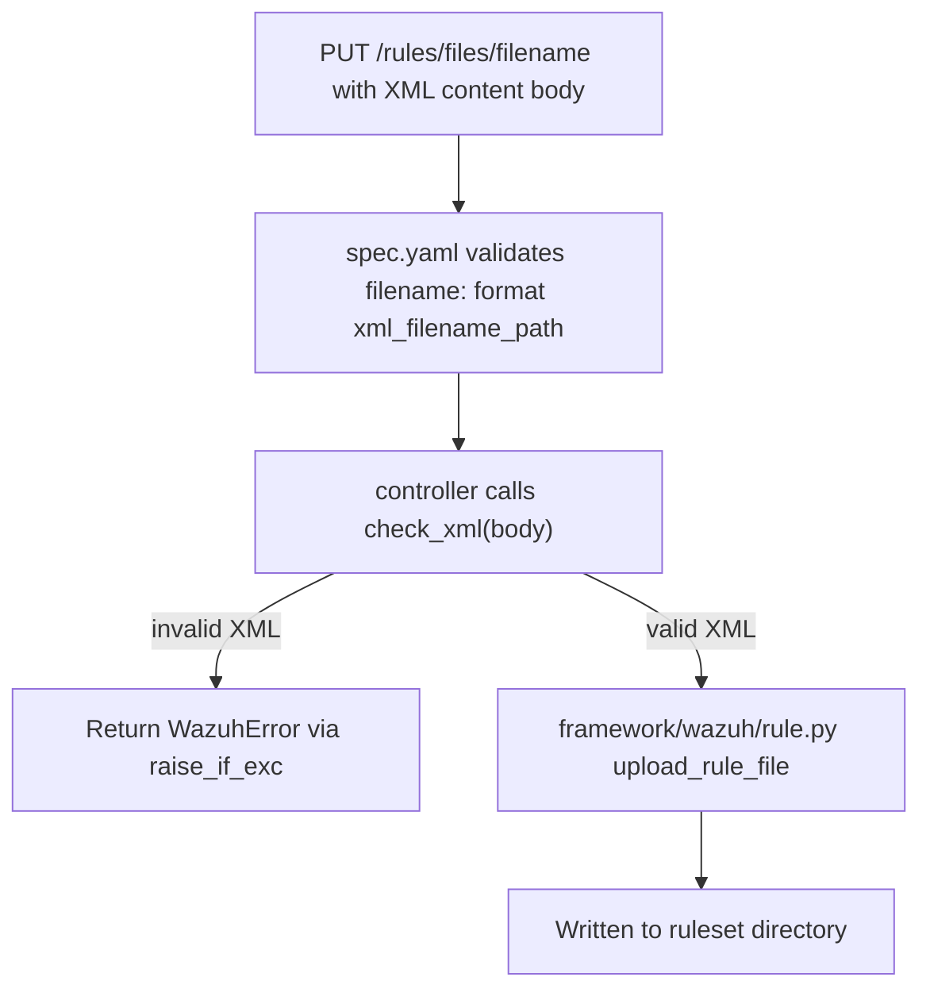

# API Core Infrastructure — Request Utils

## Introduction

The **Request Utils** module is a foundational part of the Wazuh REST API's core infrastructure. It provides the low-level plumbing that every incoming HTTP request passes through before it reaches a controller: URI parameter normalization, OpenAPI/JSON-Schema format validators, and a collection of parsing/serialization helper functions used throughout the API layer.

This module does not expose its own HTTP endpoints. Instead, it is consumed transparently by the [Connexion](https://connexion.readthedocs.io/) framework (OpenAPI request routing) and by every API controller (via `wazuh.core.exception` translation, parameter parsing, and Swagger `format` keyword validation declared in the `spec.yaml`).

It is one of five sibling sub-modules that together make up the parent `api_core_infrastructure` module:

| Sibling module | Responsibility |
|---|---|
| [api_core_infrastructure_server_lifecycle](api_core_infrastructure_server_lifecycle.md) | Process startup/shutdown, SSL configuration |
| [api_core_infrastructure_auth_config](api_core_infrastructure_auth_config.md) | Authentication/token decoding, worker auth init |
| [api_core_infrastructure_middleware](api_core_infrastructure_middleware.md) | ASGI middlewares (rate limiting, IP blocking, access logging) |
| [api_core_infrastructure_logging](api_core_infrastructure_logging.md) | API logging setup and JSON formatting |
| **api_core_infrastructure_request_utils** (this module) | URI parsing, parameter parsing, field/format validation |
| [api_core_infrastructure_models](api_core_infrastructure_models.md) | Base Connexion models, JSON encoder, default controller |

## Purpose and Core Functionality

This module has three closely related responsibilities, one per file:

1. **`api/api/uri_parser.py` — `APIUriParser`**
   A Connexion `OpenAPIURIParser` subclass that normalizes (lower-cases) a fixed set of query-string parameters (`component`, `configuration`, `hash`, `requirement`, `status`, `type`, `section`, `tag`, `level`, `resource`) before Connexion validates them against the OpenAPI spec enums. This guarantees that case-insensitive user input (e.g. `?type=JSON`) still matches lowercase enum values defined in `spec.yaml`.

2. **`api/api/util.py` — Generic request/response helpers**
   A set of stand-alone functions used across the API layer:
   - `serialize()` / `_deserialize*()` / `deserialize_model()` — convert between Python model objects, primitives, dates and JSON-friendly structures (Swagger codegen style).
   - `_parse_q_param()`, `_parse_search_param()`, `_parse_sort_param()` — convert raw API query string fragments (`q=`, `search=`, `sort=`) into structured dictionaries consumable by the Wazuh framework's DB query engine (see [framework_core_utils](framework_core_utils.md) `WazuhDBQueryGroupBy`, `AffectedItemsWazuhResult`, etc.).
   - `parse_api_param()` — dispatch helper that picks the correct parser (`search`/`sort`) by name.
   - `to_relative_path()` — strips the Wazuh installation base path from an absolute path (delegates to `wazuh.core.common.WAZUH_PATH`).
   - `raise_if_exc()` / `_create_problem()` — central translation point that converts `WazuhException` subclasses (from `framework/wazuh/core/exception.py`) into Connexion `ProblemException` HTTP responses with proper status codes (400/403/404/406/429/500).
   - `deprecate_endpoint()` — decorator that stamps `Deprecated`/`Link` HTTP headers on a controller's response.
   - `only_master_endpoint()` — decorator that rejects requests on a worker node (HTTP 404 / WazuhResourceNotFound 902) unless the API is running on the cluster master; relies on `framework/wazuh/core/cluster/utils.py::running_in_master_node` (see [cluster_utils](cluster_utils.md)).

3. **`api/api/validator.py` — Field-level validators & JSON-Schema format checkers**
   A large collection of compiled regular expressions (`_alphanumeric_param`, `_group_names`, `_wazuh_version`, `_wpk_path`, etc.) each of which is registered as a custom **JSON-Schema `format` checker** via `Draft4Validator.FORMAT_CHECKER.checks(...)`. These are referenced by name (`format: alphanumeric`, `format: wazuh_version`, etc.) inside the OpenAPI `spec.yaml` used by every controller's request/response schema. It also defines:
   - `check_xml()` — validates that a string is well-formed XML (used by CDB list/rule/decoder file upload endpoints).
   - `is_safe_path()` — path-traversal protection, ensuring uploaded/queried paths stay inside `WAZUH_PATH`.
   - `check_component_configuration_pair()` — validates `component`/`configuration` combinations against `WAZUH_COMPONENT_CONFIGURATION_MAPPING` (used by manager/cluster "get configuration on demand" endpoints).
   - `security_config_schema` / `api_config_schema` — full JSON-Schema definitions for the security and API YAML configuration files, used when validating `PUT` requests that change server configuration.

## Architecture

## Component Relationships

## Request Processing Data Flow

The following sequence shows how a typical `GET` request with query parameters (`q`, `search`, `sort`, and an enum field) flows through this module's components.

## Master-Node Restriction Flow

Several cluster/manager endpoints must only run on the master node. `only_master_endpoint` enforces this centrally rather than duplicating the check in every controller.

This decorator depends on `framework/wazuh/core/cluster/utils.py::running_in_master_node` — documented in [cluster_utils](cluster_utils.md) — and on the exception hierarchy documented alongside [framework_core_utils](framework_core_utils.md) (`WazuhResourceNotFound`).

## Exception-to-HTTP Mapping

`raise_if_exc` / `_create_problem` in `util.py` is the single translation point between the Wazuh framework's internal exception hierarchy (`framework/wazuh/core/exception.py`, see [framework_core_utils](framework_core_utils.md)) and the HTTP responses the API returns.

## Validator Format Registry

Every regex-based checker in `validator.py` is registered against `jsonschema`'s `Draft4Validator.FORMAT_CHECKER`, which is then wired into Connexion's OpenAPI request validation (declared as `format: <name>` in `api/spec/spec.yaml` for individual path/query parameters). This lets controller authors declare constraints declaratively instead of writing manual validation code.

Path-related validators (`format_wpk_path`, `format_active_response_command`, `format_get_dirnames_path`, `format_path`) all funnel through `is_safe_path()`, which blocks directory-traversal sequences (`../`, `..\`) and confirms the resolved real path stays inside `WAZUH_PATH` (defined in `framework/wazuh/core/common.py`, see [framework_core_utils](framework_core_utils.md)).

## How Controllers Use This Module

Nearly every controller across the API (see [agent_module](agent_module.md), [rule_module](rule_module.md), [cdb_list_module](cdb_list_module.md), [manager_module](manager_module.md), [cluster_api_controller](cluster_api_controller.md), etc.) uses the utilities in this module in one of these patterns:

1. **Query parameter parsing** — `parse_api_param(request.query_params.get('sort'), 'sort')` to build a filter dict passed into a `WazuhDBQuery*` subclass constructor.
2. **Response/error translation** — `raise_if_exc(await dapi.distributed_api_call())` at the end of nearly every controller function, converting a `DistributedAPI` response (see [cluster_dapi](cluster_dapi.md)) into either the raw result or an HTTP problem.
3. **Master-only restriction** — controllers such as `manager_controller.put_restart` or several `cluster_controller` endpoints are decorated with `@only_master_endpoint`.
4. **Path safety** — file-upload/download endpoints (CDB lists, rules, decoders) rely on `format_cdb_filename_path`, `format_xml_filename_path` and `is_safe_path` declared through the OpenAPI spec to reject malicious paths before the controller body executes.
5. **XML validation** — endpoints accepting raw XML content bodies (rule/decoder/CDB list uploads) call `check_xml()` directly to reject malformed XML before persisting it to disk.

## Key Design Notes

- **Stateless & side-effect free**: all functions in this module are pure or rely only on module-level compiled regex objects; there is no persistent state, making the module trivially thread/async safe for use inside the ASGI request pipeline (see [api_core_infrastructure_middleware](api_core_infrastructure_middleware.md) for the surrounding middleware stack that wraps every request).
- **Declarative validation over imperative code**: by registering format checkers against `jsonschema`, most input constraints live in `spec.yaml` rather than scattered across controllers, improving consistency and auditability of allowed input patterns.
- **Centralized exception boundary**: `raise_if_exc`/`_create_problem` is the *only* place where internal Wazuh exceptions are converted into HTTP-facing `ProblemException` objects, ensuring consistent error payload shape (`type`, `title`, `detail`, `remediation`, `dapi_errors`) across the entire API surface.
- **Cluster awareness**: `only_master_endpoint` integrates with the cluster utilities module to keep master-only operations (e.g., certain configuration writes, restarts) from executing on worker nodes, returning a well-formed 404 instead of an inconsistent partial operation.

## Related Documentation

- [api_core_infrastructure_server_lifecycle](api_core_infrastructure_server_lifecycle.md) — process bootstrap, SSL configuration, and signal handling that starts the ASGI app this module's validators run inside.
- [api_core_infrastructure_auth_config](api_core_infrastructure_auth_config.md) — authentication/token decoding that runs before request routing.
- [api_core_infrastructure_middleware](api_core_infrastructure_middleware.md) — ASGI middleware stack (rate limiting, IP blocking, access logging) surrounding the request lifecycle.
- [api_core_infrastructure_logging](api_core_infrastructure_logging.md) — API access/error logging configuration.
- [api_core_infrastructure_models](api_core_infrastructure_models.md) — base Connexion models and JSON encoder used to serialize controller responses.
- [framework_core_utils](framework_core_utils.md) — `WazuhException` hierarchy, `WazuhDBQuery*` classes, and `common.WAZUH_PATH` referenced throughout this module.
- [cluster_utils](cluster_utils.md) — `running_in_master_node`, used by `only_master_endpoint`.
- [cluster_dapi](cluster_dapi.md) — `DistributedAPI`, whose responses are typically passed through `raise_if_exc`.
