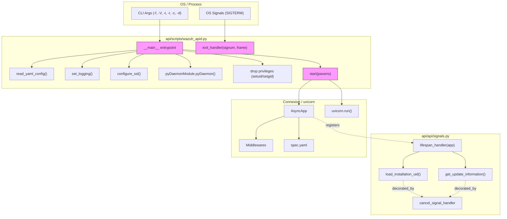
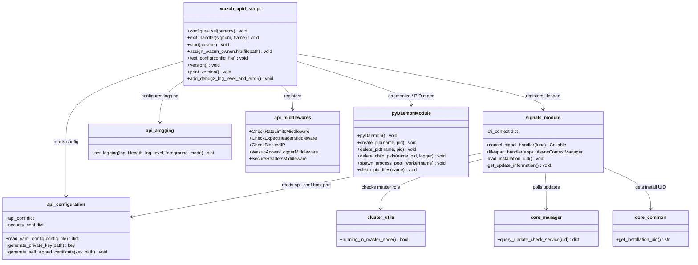
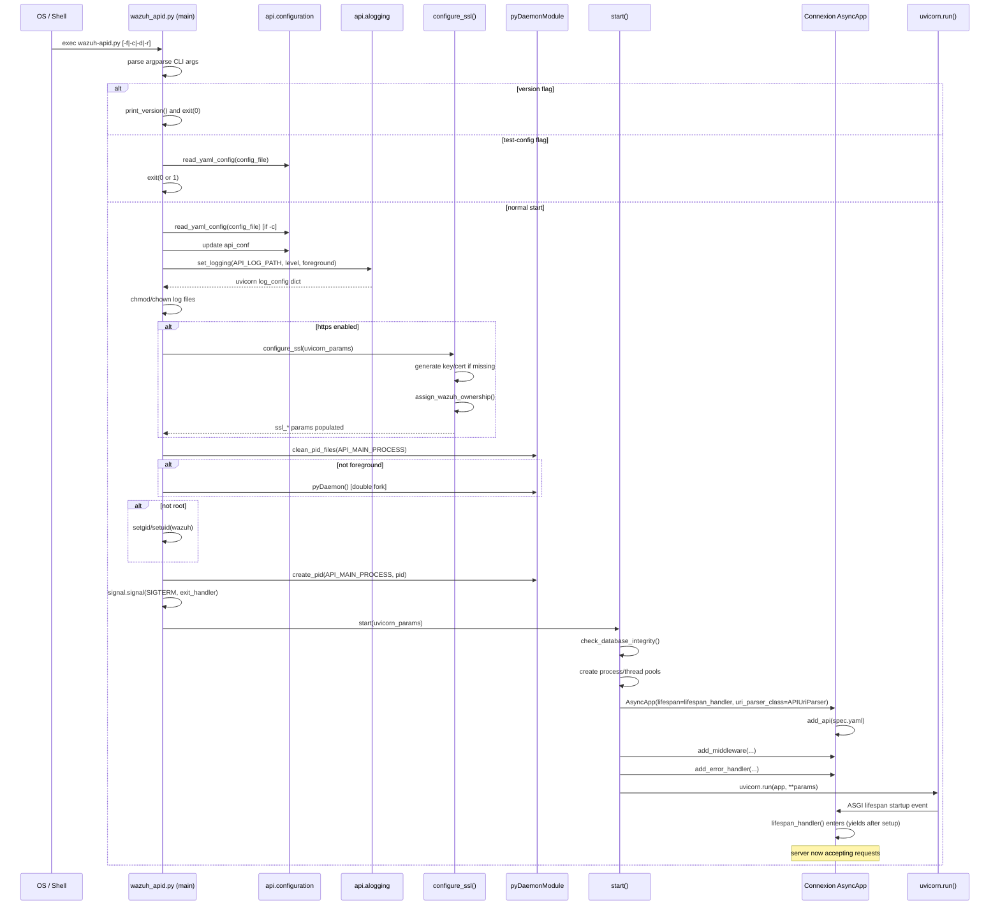
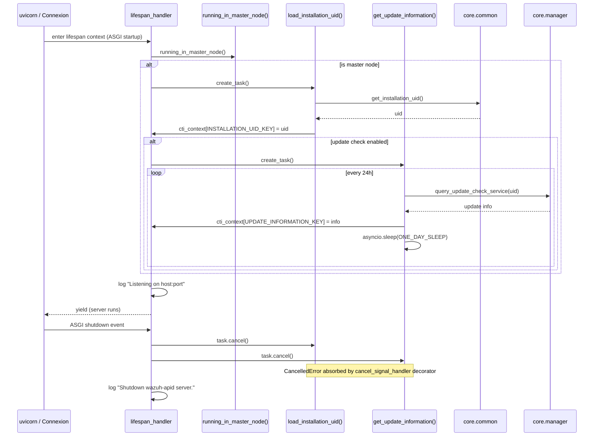
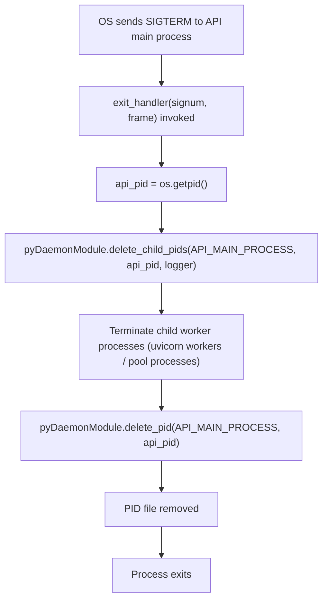
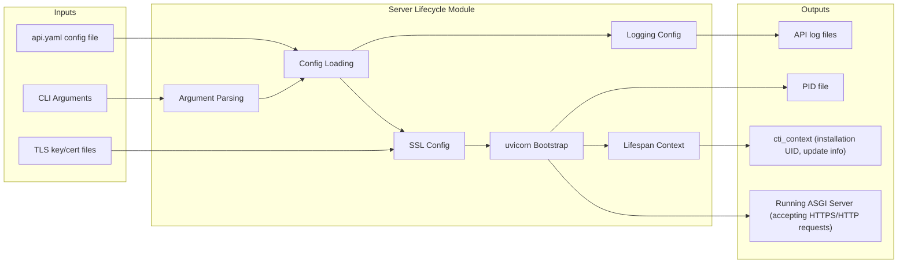

# API Core Infrastructure — Server Lifecycle

## Introduction

The **Server Lifecycle** module is the entry point and orchestration layer for the Wazuh REST API process (`wazuh-apid`). It is responsible for bootstrapping the API daemon — parsing CLI arguments, configuring logging and TLS, wiring middlewares, starting the underlying [Connexion](https://connexion.readthedocs.io/)/[uvicorn](https://www.uvicorn.org/) ASGI server — as well as gracefully tearing it down on shutdown or signal reception (`SIGTERM`). It also manages a small set of asynchronous background tasks (installation UID discovery, update-check polling) that run for the lifetime of the API process.

This module is a child of [api_core_infrastructure](api_core_infrastructure.md), which in turn groups all the foundational (non-business) building blocks of the Wazuh API. It sits at the very top of the API bootstrap chain: it is the only module that actually calls `uvicorn.run(...)`, all other API infrastructure modules (authentication, middleware, logging, request utilities, models) are *consumed* by this module during startup, rather than the other way around.

Two files make up this module:

| File | Responsibility |
|---|---|
| `api/scripts/wazuh_apid.py` | Daemon entry point (`__main__`): CLI parsing, daemonization, privilege drop, SSL configuration, uvicorn startup/shutdown, signal handling. |
| `api/api/signals.py` | Connexion **lifespan** context manager and cooperative background tasks (installation UID + CTI update-check polling), plus a decorator to safely cancel those tasks. |

---

## Responsibilities & Scope

- Parse command-line arguments (`-f` foreground, `-V` version, `-t` test-config, `-r` run-as-root, `-c` config file, `-d` debug level).
- Load and validate the YAML API configuration (delegates to `api.configuration`, see [api_core_infrastructure_auth_config.md](api_core_infrastructure_auth_config.md)).
- Configure the Python logging subsystem for the API process (delegates to `api.alogging.set_logging`, see [api_core_infrastructure_logging.md](api_core_infrastructure_logging.md)).
- Generate/validate TLS private key & certificate and configure uvicorn SSL parameters (`configure_ssl`).
- Daemonize the process (double-fork) or stay in foreground, drop privileges to the `wazuh` user/group, and manage the PID file.
- Build the Connexion `AsyncApp`, load the OpenAPI spec (`spec.yaml`), register all HTTP middlewares (rate limiting, Expect-header validation, blocked-IP checking, access logging, secure headers, CORS, content-size limiting) — see [api_core_infrastructure_middleware.md](api_core_infrastructure_middleware.md).
- Register error handlers that translate exceptions into API-formatted problem responses.
- Register the `lifespan_handler` (from `signals.py`) with Connexion so that startup/shutdown hooks and background asyncio tasks are properly managed.
- Handle `SIGTERM` (`exit_handler`) to clean up child worker processes and PID files on shutdown.
- Provide `cancel_signal_handler`, a decorator used to gracefully absorb `asyncio.CancelledError` in the lifespan background coroutines.
- On startup (master node only), asynchronously discover/persist an installation UID and periodically poll the Update Check Service (CTI) for available Wazuh version updates.

## What This Module Does NOT Do

- It does not implement authentication/token logic — see [api_core_infrastructure_auth_config.md](api_core_infrastructure_auth_config.md).
- It does not implement the HTTP middleware classes themselves — see [api_core_infrastructure_middleware.md](api_core_infrastructure_middleware.md).
- It does not define the logging formatter/handlers — see [api_core_infrastructure_logging.md](api_core_infrastructure_logging.md).
- It does not implement request parsing/validation helpers — see [api_core_infrastructure_request_utils.md](api_core_infrastructure_request_utils.md).
- It does not define API response models or the default `/` info endpoint — see [api_core_infrastructure_models.md](api_core_infrastructure_models.md).
- It does not implement business-logic controllers (agents, rules, security, cluster, etc.) — each of those lives in its own module (e.g. [agent_module.md](agent_module.md), [security_rbac_module.md](security_rbac_module.md), [cluster_api_controller.md](cluster_api_controller.md)).
- Process-pool worker spawning primitives (`pyDaemonModule.spawn_process_pool_worker`) and generic daemon utilities are implemented in [framework_core_utils.md](framework_core_utils.md); this module only *invokes* them.
- Cluster-role detection (`running_in_master_node`) is implemented in [cluster_utils.md](cluster_utils.md).

---

## Architecture Overview

## Component Relationships

---

## Process Flow: Daemon Startup

## Process Flow: Lifespan Background Tasks

## Process Flow: Signal-Driven Shutdown (SIGTERM)

---

## Key Components

### `configure_ssl(params)`
Prepares TLS for the API server:
1. Generates a private key and self-signed certificate if the configured files do not exist (via `api.configuration.generate_private_key` / `generate_self_signed_certificate`).
2. Resolves the configured SSL protocol string (`tls`, `tlsv1`, `tlsv1.1`, `tlsv1.2`, `auto`) to the corresponding `ssl.PROTOCOL_*` constant, and logs a deprecation warning for legacy TLSv1/1.1 protocols.
3. Ensures the key/cert files are owned by the `wazuh` user/group (`assign_wazuh_ownership`).
4. Populates the `params` dict (passed by reference) with `ssl_version`, `ssl_certfile`, `ssl_keyfile`, optionally `ssl_cert_reqs`/`ssl_ca_certs` (mutual TLS) and `ssl_ciphers`, which are later forwarded directly into `uvicorn.run(**params)`.
5. Raises a well-formed `APIError` (code `2003`) on any SSL/IO configuration failure.

### `exit_handler(signum, frame)`
Registered as the `SIGTERM` handler. Ensures a clean shutdown by delegating to [`pyDaemonModule`](framework_core_utils.md) to kill any child processes spawned by the API (process pools, worker processes) and to remove the daemon's PID file, preventing stale PID entries.

### `start(params)`
The main server bootstrap function (module-level, central to the flow):
- Validates RBAC database integrity via `wazuh.rbac.orm.check_database_integrity` (see [security_rbac_module.md](security_rbac_module.md)).
- Creates the process pools used for local requests and security-event processing, falling back to a thread pool when `/dev/shm` is inaccessible.
- Instantiates the Connexion `AsyncApp`, loads `spec.yaml`, wires the `lifespan_handler` and `APIUriParser` (see [api_core_infrastructure_request_utils.md](api_core_infrastructure_request_utils.md)).
- Registers all middleware classes (see [api_core_infrastructure_middleware.md](api_core_infrastructure_middleware.md)) and error handlers.
- Calls `uvicorn.run(app, **params)`, translating port-in-use errors (`errno 98`) into `APIError(2010)`.

### `cancel_signal_handler(func)`
A decorator applied to the two lifespan background coroutines. It wraps the coroutine body in a `try/except asyncio.CancelledError: pass`, so that when `lifespan_handler` cancels these tasks during shutdown, no unhandled exception/traceback is produced.

### `lifespan_handler(app)`
An `asynccontextmanager` registered with Connexion's `AsyncApp(lifespan=...)`. On entry (ASGI startup):
- If the current node is the cluster master (checked via [`running_in_master_node`](cluster_high_level_api.md)), schedules:
  - `load_installation_uid()` — persists/reads a unique installation identifier used for telemetry/update-check correlation (`INSTALLATION_UID_PATH`).
  - `get_update_information()` — if enabled via `update_check_is_enabled()` (see [framework_core_utils.md](framework_core_utils.md) `core.configuration`), polls the CTI **Update Check Service** once per day (`ONE_DAY_SLEEP` = 24h) via `wazuh.core.manager.query_update_check_service`, storing results in the module-level `cti_context` dict for later consumption by other endpoints (e.g. `manager_controller.check_available_version` in [manager_module.md](manager_module.md)).
- Logs the "Listening on `host:port`" startup message.
- Yields control back to uvicorn to serve requests.
- On shutdown (ASGI shutdown event), cancels and awaits both background tasks, then logs the shutdown message.

---

## Data Flow

---

## Dependencies

| Dependency | Purpose | Documentation |
|---|---|---|
| `api.configuration` (`api_conf`, `security_conf`, `read_yaml_config`, `generate_private_key`, `generate_self_signed_certificate`) | Loads/validates YAML configuration and provides certificate generation utilities. | [api_core_infrastructure_auth_config.md](api_core_infrastructure_auth_config.md) |
| `api.alogging.set_logging` | Builds the uvicorn/logging `dictConfig` used for the API logger. | [api_core_infrastructure_logging.md](api_core_infrastructure_logging.md) |
| `api.middlewares.*` | HTTP middleware classes registered on the Connexion app. | [api_core_infrastructure_middleware.md](api_core_infrastructure_middleware.md) |
| `api.uri_parser.APIUriParser` | Custom URI/query parsing used by Connexion routing. | [api_core_infrastructure_request_utils.md](api_core_infrastructure_request_utils.md) |
| `api.api_exception.APIError`, `api.error_handler` | Standardized API error formatting for HTTP responses. | [api_core_infrastructure_models.md](api_core_infrastructure_models.md) |
| `wazuh.core.pyDaemonModule` | Daemonization, PID file management, process pool worker spawning. | [framework_core_utils.md](framework_core_utils.md) |
| `wazuh.core.common` | Wazuh path/UID/GID helpers, `get_installation_uid`, multiprocessing pools context var. | [framework_core_utils.md](framework_core_utils.md) |
| `wazuh.core.utils.to_relative_path`, `clean_pid_files` | Path utilities and PID cleanup used at startup. | [framework_core_utils.md](framework_core_utils.md) |
| `wazuh.core.manager.query_update_check_service` | Queries the CTI Update Check Service for version updates. | [manager_module.md](manager_module.md) |
| `wazuh.core.cluster.utils.running_in_master_node` | Determines whether background tasks (UID/update-check) should run on this node. | [cluster_utils.md](cluster_utils.md) |
| `wazuh.rbac.orm.check_database_integrity` | Validates the RBAC SQLite database before serving requests. | [security_rbac_module.md](security_rbac_module.md) |
| Connexion `AsyncApp`, uvicorn | Third-party ASGI framework/server that this module configures and drives. | External |

---

## Configuration Touch-Points

The module reads (but does not define) the following `api.yaml` sections, all modeled/validated in [api_core_infrastructure_auth_config.md](api_core_infrastructure_auth_config.md):

- `host`, `port` — bind address for uvicorn.
- `https.*` (`enabled`, `key`, `cert`, `ca`, `use_ca`, `ssl_protocol`, `ssl_ciphers`) — TLS configuration consumed by `configure_ssl`.
- `access.max_request_per_minute` — toggles `CheckRateLimitsMiddleware`.
- `max_upload_size` — toggles `ContentSizeLimitMiddleware`.
- `cors.*` — toggles and configures `CORSMiddleware`.
- `logs.level` — passed to `set_logging`.
- `drop_privileges` — controls whether the process drops to the `wazuh` user after binding.
- `cache.enabled` (deprecated) — triggers a deprecation warning log at startup.

---

## Error Handling Summary

| Condition | Resulting Error | Code |
|---|---|---|
| Private key/cert mismatch | `APIError` | 2003 |
| PEM passphrase incorrect | `APIError` | 2003 |
| Certificate file permission error | `APIError` | 2003 |
| Port already in use (`OSError errno 98`) | `APIError` | 2010 |
| RBAC DB integrity failure | `APIError` | 2012 |

These error codes/messages are formatted using the shared API error model described in [api_core_infrastructure_models.md](api_core_infrastructure_models.md).

---

## Summary

The Server Lifecycle module is intentionally thin: it does not contain business logic, models, or middleware implementations itself. Its role is purely **orchestration** — gluing together configuration, logging, TLS, middleware, RBAC checks, and the ASGI server runtime into a single daemon process, and ensuring a clean startup/shutdown lifecycle including cooperative asyncio background tasks. Any change to how the API daemon starts, drops privileges, binds TLS, or shuts down should be made here; changes to *what* the API does when serving a request belong in the sibling infrastructure modules or in the individual controller modules referenced above.
