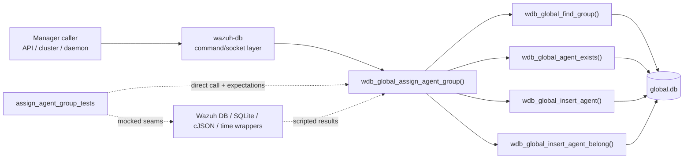
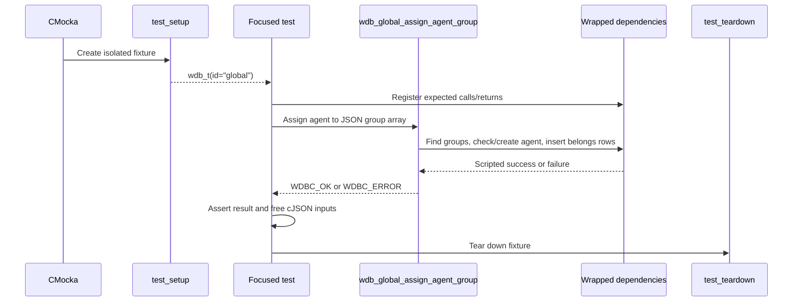
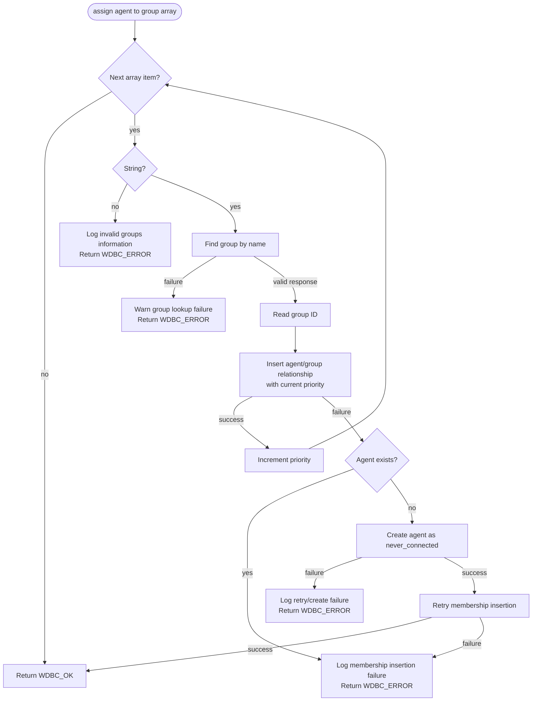
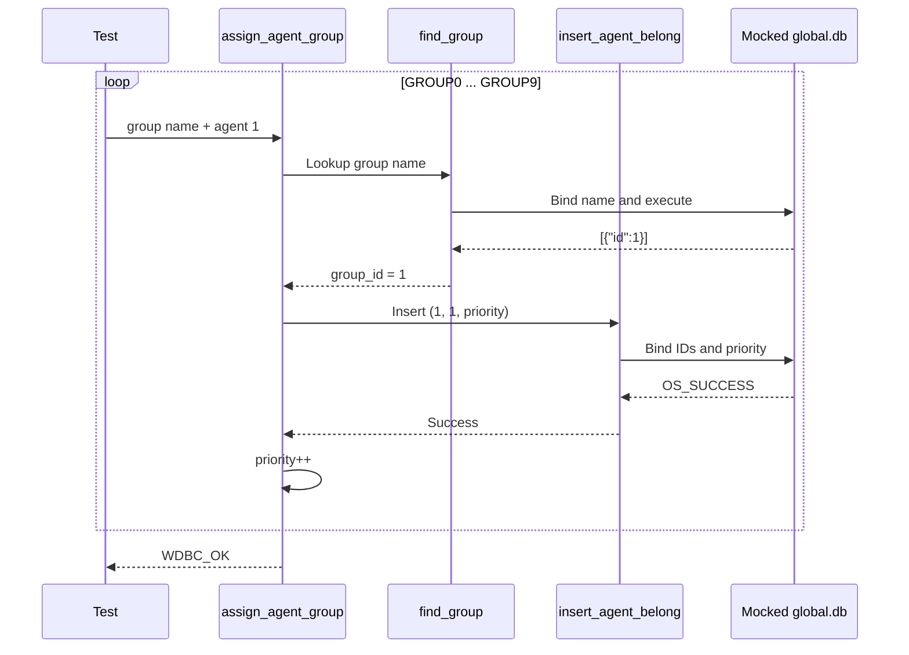
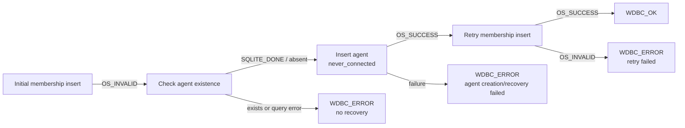

# `assign_agent_group_tests`

## Introduction

`assign_agent_group_tests` documents the focused CMocka coverage for
`wdb_global_assign_agent_group()`, the Wazuh DB operation that resolves group
names and creates agent-to-group membership records. The tests are defined in
`src/unit_tests/wazuh_db/test_wdb_global.c`; the production implementation is
part of [`wazuh_db_global`](wazuh_db_global.md).

This module does not implement assignment logic. It verifies the orchestration
and error handling of the production function through mocked Wazuh DB, SQLite,
cJSON, logging, and time boundaries. General fixture and wrapper behavior is
covered by [`test_wdb_global_test_infrastructure`](test_wdb_global_test_infrastructure.md)
and [`wazuh_db_wrappers_global`](wazuh_db_wrappers_global.md).

## Scope

The module contains three focused tests:

| Test | Scenario | Expected result |
|---|---|---|
| `test_wdb_global_assign_agent_group_success` | Existing agent; ten valid group names resolve to the same group ID and are inserted with increasing priorities. | `WDBC_OK` |
| `test_wdb_global_assign_agent_group_agent_not_exists_success` | The requested agent is absent, so the function creates it in a `never_connected` state and retries the membership insert. | `WDBC_OK` |
| `test_wdb_global_assign_agent_group_agent_not_exists_insert_fail` | The agent is absent and creation succeeds, but the retrying membership insert fails. | `WDBC_ERROR` |

The wider file also tests group validation, membership deletion, group context
and hash updates, and bulk group-setting modes. Those behaviors are documented
in [`test_wdb_global`](test_wdb_global.md) and are not duplicated here.

## Position in the system

The function under test is a server-side Wazuh DB operation. A caller such as
the Wazuh API, cluster code, remoted, or another manager component normally
reaches it through the Wazuh DB command/socket layer; the unit test invokes it
directly with a synthetic `wdb_t` and replaces its dependencies with linker
wrappers.

## Test harness architecture

Each case is registered with `cmocka_unit_test_setup_teardown`, so the test
fixture is isolated per test. `test_setup()` allocates a minimal `wdb_t`, sets
its ID to `global`, allocates a synthetic SQLite-handle slot, initializes Wazuh
DB configuration, and exposes the fixture through CMocka state. `test_teardown()`
releases those allocations and calls `wdb_free_conf()`.

## Production interaction being verified

The assignment input is a cJSON array of group-name strings. For every valid
element, the production operation:

1. Validates that the JSON element is a string.
2. Looks up the group by name using `wdb_global_find_group()`.
3. Extracts the numeric group ID from the lookup response.
4. Inserts `(group_id, agent_id, priority)` through
   `wdb_global_insert_agent_belong()`.
5. Advances the priority for the next group.

The test uses ten names (`GROUP0` through `GROUP9`) and a lookup response of
`[{"id":1}]`. Consequently, the expected priority values are `0` through `9`
while the group ID remains `1`.

## Scenario: existing agent

`test_wdb_global_assign_agent_group_success` represents the normal path. The
test prepares ten group names and, for each iteration, scripts:

- a successful transaction and statement-cache setup for `wdb_global_find_group()`;
- successful text binding of the group name;
- a JSON lookup response containing group ID `1`;
- successful transaction/cache setup for `wdb_global_insert_agent_belong()`;
- bindings for group ID `1`, agent ID `1`, and the current priority;
- successful execution of the insert.

The test asserts `WDBC_OK`. It also expects the production code to delete each
lookup response, which verifies ownership cleanup for the cJSON result.

## Scenario: missing agent and recovery

The two `agent_not_exists` tests cover the compensating path. The first
membership insert is deliberately made to fail. The production code then
checks the agent with `wdb_global_agent_exists()`.

The mocked existence query returns `SQLITE_DONE`, indicating that no matching
agent exists. The function uses the supplied `agent_name` (`agent-01`) and the
mocked current time (`0`) to call `wdb_global_insert_agent()` with:

- agent ID `1`;
- name `agent-01`;
- IP and registration IP `0.0.0.0`;
- date added `0`;
- the initial group information.

After agent creation, it retries `wdb_global_insert_agent_belong()`.

`test_wdb_global_assign_agent_group_agent_not_exists_success` scripts a
successful recovery and asserts `WDBC_OK`. The failure variant scripts the
retry as `OS_INVALID`, expects the diagnostic
`Unable to insert group 'test_group' for agent '1', retry failed after creating
agent in never_connected state.`, and asserts `WDBC_ERROR`.

## Dependency map

| Dependency | Why this module mocks it |
|---|---|
| `wdb_global_find_group()` | Controls group-ID resolution without a real SQLite database. |
| `wdb_global_insert_agent_belong()` | Controls the initial and recovery membership insert. |
| `wdb_global_agent_exists()` | Distinguishes an ordinary insertion failure from the missing-agent recovery path. |
| `wdb_global_insert_agent()` | Controls creation of the absent agent. |
| `wdb_begin2()` / `wdb_stmt_cache()` | Verifies transaction and prepared-statement setup in each nested operation. |
| SQLite bind wrappers | Verify exact group names, IDs, priorities, agent metadata, and return codes. |
| `wdb_exec_stmt()` / `wdb_exec_stmt_silent()` | Supplies lookup JSON and insert outcomes. |
| cJSON wrappers | Supplies group arrays and lookup responses, and verifies cleanup. |
| Logging wrappers | Assert warnings/debug messages for lookup and insertion failures. |
| `time()` | Makes the created agent’s registration timestamp deterministic. |

The complete wrapper contract and linker-isolation strategy are maintained in
[`wazuh_db_wrappers_global`](wazuh_db_wrappers_global.md); the module relies on
that shared infrastructure rather than redefining it.

## Assertions and failure semantics

The tests establish these observable contracts:

- valid group strings are processed in input order;
- membership priorities start at the supplied initial priority and increment
  for each successful assignment;
- a failed membership insert can trigger agent creation only when the agent is
  confirmed absent;
- successful creation is followed by exactly one membership-insert retry;
- failure of the retry is surfaced as `WDBC_ERROR` with a recovery-specific
  diagnostic;
- lookup and cJSON resources are cleaned up along the path that owns them.

The tests intentionally mock internal calls instead of asserting SQL text.
This keeps them focused on orchestration, argument propagation, branch
selection, return-code translation, and logging. Lower-level SQLite behavior is
covered by the broader [`test_wdb_global`](test_wdb_global.md) suite and the
shared Wazuh DB wrapper tests.

## Maintenance guidance

When changing `wdb_global_assign_agent_group()` or its recovery behavior,
update these tests if any of the following contracts change:

- the group lookup response shape or required group-name validation;
- the priority calculation or insertion order;
- the definition of an absent agent;
- the metadata used to create a never-connected agent;
- whether a failed insert is retried;
- the returned `wdbc_result` or diagnostic message.

For changes to fixture allocation, wrapper behavior, or the overall global DB
test organization, update the linked infrastructure documents instead of
duplicating those details here.

