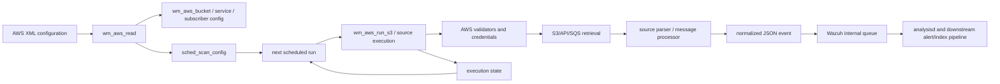
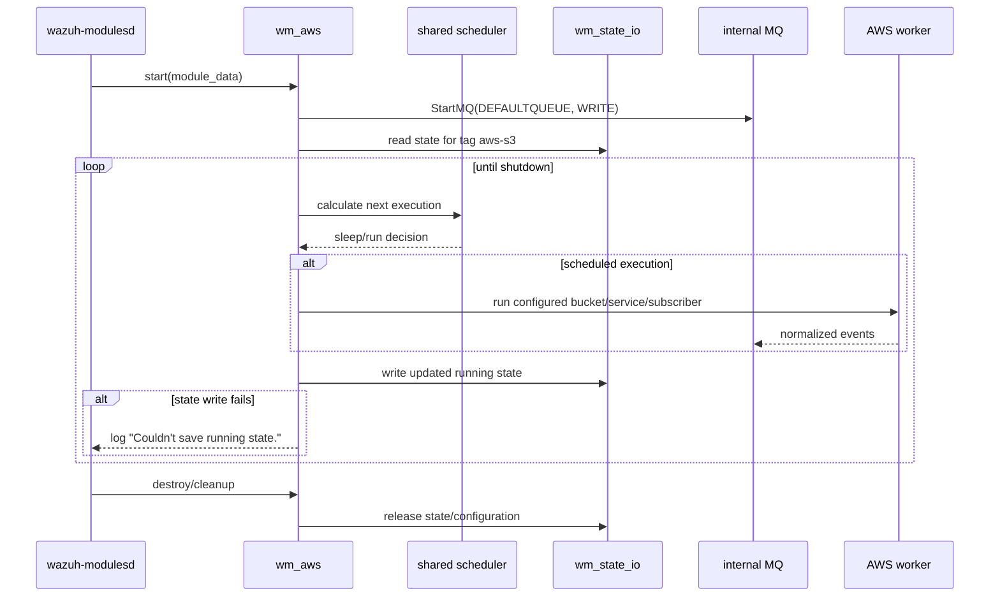
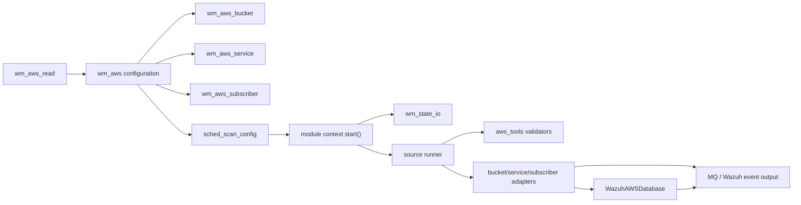
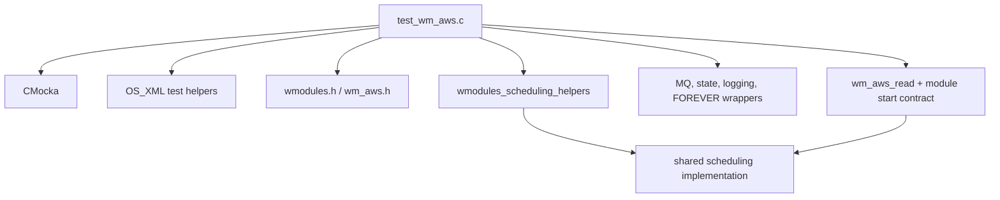

# AWS integration module

The AWS module connects Wazuh to AWS log and security-data sources. It has two cooperating layers: the native `wazuh-modulesd` AWS wodule, which reads `<wodle name="aws-s3">` configuration and schedules work, and Python wodle implementations that retrieve, decode, normalize, and forward AWS records. The supplied unit tests focus on the native layer’s configuration and scheduling contract.

## Purpose and scope

The module supports AWS data ingestion through three source families:

- S3 buckets, including CloudTrail, AWS Config, GuardDuty, load-balancer access logs, server access logs, VPC Flow Logs, WAF, Cisco Umbrella, and custom buckets.
- AWS services such as CloudWatch Logs and Inspector.
- SQS-backed subscribers for S3 notifications and Security Lake-style messages.

The native component owns lifecycle, configuration validation, scheduling, state I/O, and delivery into Wazuh’s internal message queue. The Python component owns AWS SDK/API interaction and source-specific parsing. This separation keeps cloud-provider logic out of the long-running C daemon while preserving a common scheduling and delivery model.

## Position in the system

AWS is a cloud-integration child of the [native agent and manager daemons](Agent_&_Manager_Native_Daemons_(C).md). It shares daemon lifecycle and scheduling facilities with other periodic modules, especially the [shared scheduling utilities](shared_lib_system_utils_config_scheduling.md), and uses the common message-queue infrastructure described in [Shared Library](shared_lib.md) and [Queue](Queue.md).

```mermaid
graph TB
    CONF["ossec.conf\n<wodle name=\"aws-s3\">"] --> PARSE["wm_aws_read()\nXML/configuration parser"]
    DAEMON["wazuh-modulesd"] --> LIFE["wm_aws_setup()\nstart / stop / destroy"]
    LIFE --> PARSE
    PARSE --> SCHED["sched_scan_config\ninterval/day/wday/time"]
    SCHED --> LOOP["wodule execution loop"]
    LOOP --> STATE["wm_state_io()\ncheckpoint state"]
    LOOP --> MQ["StartMQ(DEFAULTQUEUE)\ninternal Wazuh queue"]
    LOOP --> PY["Python AWS wodle"]

    subgraph AWS sources
      S3["S3 buckets"]
      SERVICE["CloudWatch Logs / Inspector"]
      SQS["SQS subscribers"]
    end
    PY --> S3
    PY --> SERVICE
    PY --> SQS
    S3 --> EVENTS["normalized AWS events"]
    SERVICE --> EVENTS
    SQS --> EVENTS
    EVENTS --> MQ
    MQ --> ANALYSISD["analysisd / event pipeline"]
```

## Component architecture

### Native wodule layer

The native files are:

| Component | Responsibility |
|---|---|
| `src/wazuh_modules/wm_aws.c` | AWS wodule registration, XML parsing, lifecycle, scheduling, execution dispatch, and cleanup. |
| `src/wazuh_modules/wm_aws.h` | `wm_aws`, `wm_aws_bucket`, `wm_aws_service`, `wm_aws_subscriber`, and module-state declarations. |
| `src/wazuh_modules/wmodules.c` / `wmodules_def.h` | Shared module registry, worker lifecycle, validation, and state-management contracts. |
| `src/shared/schedule_scan.c` / `src/headers/schedule_scan.h` | Common interval, time-of-day, day-of-week, and day-of-month scheduling. |
| `src/shared/mq_op.c` and queue headers | Connection to the internal Wazuh message queue. |
| `src/shared/state` helpers | Persistence of the last execution/checkpoint state. |

The AWS configuration is represented as a `wm_aws` object containing source-specific configuration and a `sched_scan_config`. A bucket entry includes at least a type, name, path/prefix, and optional AWS profile in the tested configuration. The header also exposes service and subscriber structures for non-S3 integrations.

### Python ingestion layer

The Python files under `wodles/aws/` are organized by acquisition method:

| Package | Main elements | Role |
|---|---|---|
| `wodles/aws/aws_s3.py` | `main` | Process entry point for AWS ingestion. |
| `wodles/aws/aws_tools.py` | argument and AWS-setting validators, `handler` | Validate account IDs, regions, bucket names, IAM roles, SQS names, dates, and log-group keys. |
| `wodles/aws/buckets_s3/` | bucket base plus CloudTrail, Config, GuardDuty, load-balancer, server-access, Umbrella, VPC-flow, WAF implementations | Interpret objects from S3 according to their producer’s format. |
| `wodles/aws/services/` | `AWSService`, `AWSCloudWatchLogs`, `AWSInspector` | Pull records from AWS APIs/services. |
| `wodles/aws/subscribers/` | `AWSSQSQueue`, message processors, subscriber buckets | Consume notification queues and dispatch referenced payloads. |
| `wodles/aws/wazuh_integration.py` | `WazuhAWSDatabase` | Persist/reconcile AWS integration metadata and support deduplication or incremental collection. |

The Python implementation is reached through the native module’s execution path or its configured helper command, depending on the deployment and source type. The tree does not expose a single public C-to-Python function boundary; maintainers should treat the native module as the scheduler/launcher and the Python packages as the provider-specific workers.

## Configuration model

The test fixture establishes the basic XML shape:

```xml
<disabled>no</disabled>
<interval>10m</interval>
<run_on_start>no</run_on_start>
<skip_on_error>yes</skip_on_error>
<bucket type="config">
    <name>wazuh-aws-wodle</name>
    <path>config</path>
    <aws_profile>default</aws_profile>
</bucket>
```

`wm_aws_read()` parses module-level settings and delegates timing tags to the shared scheduler. Unknown tags are rejected: the test supplies `<fake-tag>` and expects the exact configuration error `No such tag 'fake-tag' at module 'aws-s3'.` This makes configuration failures explicit instead of silently ignoring misspelled options.

The tested schedule forms are:

| XML form | Normalized behavior verified by tests |
|---|---|
| `<interval>10m</interval>` | `interval = 600` seconds; no day or weekday constraint. |
| `<time>01:11</time>` | Daily scheduling; the shared default day interval is used. |
| `<day>6</day>` plus `<time>15:05</time>` | Monthly schedule; interval becomes one month and `scan_day = 6`. |
| `<wday>Monday</wday>` plus `<time>13:03</time>` | Weekly schedule; `scan_wday = 1` and interval becomes 604800 seconds. |

When a calendar constraint is supplied without a compatible interval, the scheduler repairs the interval and logs a warning. The tests assert the repairs `1M`, `1w`, and `1d` for month-day, weekday, and time-of-day configurations respectively.

## Runtime data flow



The test replaces `wm_aws_run_s3()` with a no-op specifically so it can observe schedule timing without contacting AWS. In production, that execution boundary is where a configured bucket is handed to the S3 worker; analogous service and subscriber paths use their corresponding Python implementations.

## Scheduling and execution process



The interval test configures a ten-minute interval, sets `next_scheduled_scan_time` to zero, runs the module loop for several synthetic dates, and expects a state read followed by state writes. It also expects the module to continue reporting state-write failures while execution proceeds, demonstrating that checkpoint persistence is observable and error-logged rather than treated as a silent success.

## Component interaction



## Error handling and lifecycle

- Invalid or unknown XML tags fail `wm_aws_read()` and identify the offending module/tag.
- Calendar constraints take precedence over incompatible intervals; the shared scheduler normalizes the interval and emits a warning.
- Queue startup is part of module execution setup. The test expects a write connection to `DEFAULTQUEUE`.
- State persistence failures emit an error (`Couldn't save running state.`) for each failed write. The test deliberately returns `-1` to verify this path.
- Setup and teardown own all allocated module data, bucket strings, XML nodes, and scheduler memory. The test fixture explicitly frees bucket fields, profile, trail prefix, type, module data, and tag, and calls `sched_scan_free()` for scheduler state.
- `disabled`, `run_on_start`, and `skip_on_error` are parsed as module behavior controls. Their detailed shared semantics belong to the [Wazuh modules daemon](Wazuh_Modules_Daemon_(C).md) documentation.

## Testing contract

The principal test file is `src/unit_tests/wazuh_modules/aws/test_wm_aws.c`. It uses CMocka and separates tests into two groups:

1. Startup/execution tests: initialize a realistic AWS module, set `wm_max_eps`, mock queue startup and state I/O, then invoke the module context’s `start()` callback.
2. Configuration tests: parse isolated XML snippets and verify rejected tags, interval conversion, day/month scheduling, weekday conversion, time parsing, and cleanup.

The test’s dependency chain is:



The tests do not validate AWS credentials, SDK calls, individual AWS log formats, or every Python adapter. Those concerns are covered by the source-specific Python test suites and should be documented alongside the corresponding wodle components when available.

## Related modules

- [Native agent and manager daemons](Agent_&_Manager_Native_Daemons_(C).md) — common native wodule registration and lifecycle.
- [Shared scheduling utilities](shared_lib_system_utils_config_scheduling.md) — interval and calendar scheduling semantics.
- [Queue](Queue.md) — shared queue primitives used to deliver events.
- [Wmodules Config](Wmodules_Config.md) — configuration data structures shared by wodules.
- [Wazuh modules core](wazuh_modules_core.md) — common module-daemon organization and cloud-integration grouping.
- [Shared library infrastructure](Shared_Modules_Infrastructure_(C++).md) — broader shared infrastructure; AWS’s primary queue and scheduler dependencies are native C shared-library components.
