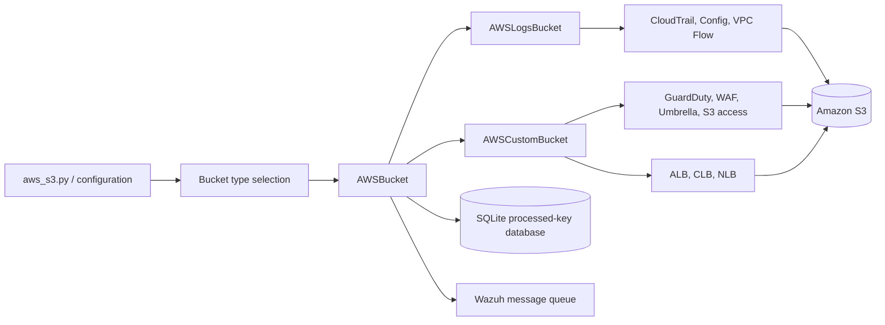
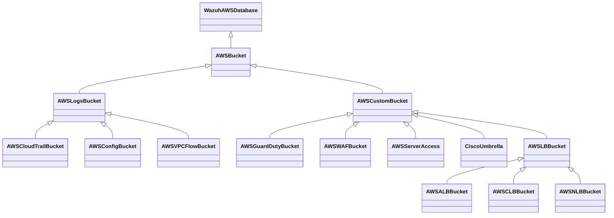
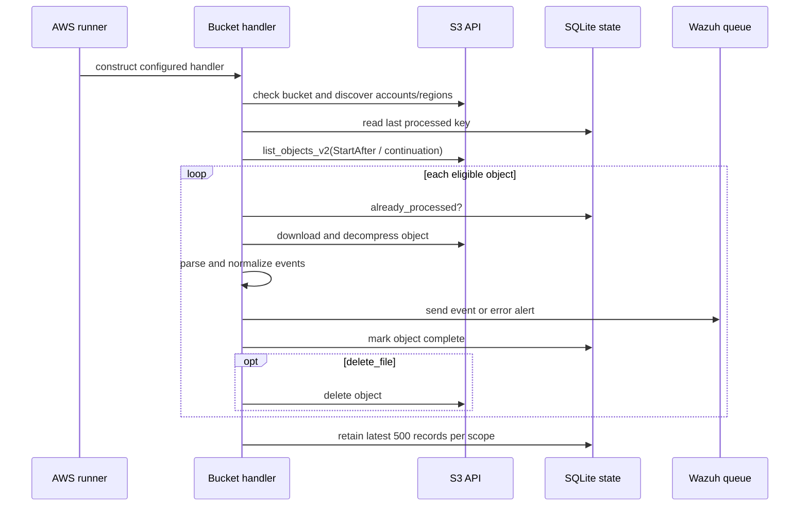

# AWS S3 bucket log ingestion

The `aws_buckets_s3` module implements the S3-backed side of Wazuh's AWS log collection. It discovers objects, resumes from the last processed key, downloads and decompresses files, parses service-specific formats, normalizes event fields, and forwards events to Wazuh. It supports AWS-native service layouts as well as custom S3-delivered logs.

The module is consumed by the AWS integration entry point in `wodles/aws/aws_s3.py` and shares credentials, AWS clients, scheduling, messaging, and SQLite integration with the surrounding [aws_core](aws_core.md) module. The common bucket behavior is detailed in [aws_buckets_s3_core](aws_buckets_s3_core.md).

## Architecture

The inheritance hierarchy separates orchestration from parsing:

## Processing flow

## Sub-modules

| Area | Responsibility | Detailed documentation |
|---|---|---|
| Common bucket engine | S3 traversal, pagination, markers, deduplication, error handling, event envelopes, and retention state | [aws_buckets_s3_core](aws_buckets_s3_core.md) |
| AWS service layouts | CloudTrail JSON, AWS Config date ordering/normalization, GuardDuty native and legacy layouts | [aws_buckets_s3_service_logs](aws_buckets_s3_service_logs.md) |
| Network and access logs | ALB/CLB/NLB, VPC Flow Logs, and S3 server-access parsing | [aws_buckets_s3_network_and_access_logs](aws_buckets_s3_network_and_access_logs.md) |
| Security and DNS logs | WAF JSON-lines/header normalization and Cisco Umbrella CSV variants | [aws_buckets_s3_security_and_dns_logs](aws_buckets_s3_security_and_dns_logs.md) |

## Format and state contracts

All handlers emit an AWS envelope containing `integration: aws`, `aws.log_info` metadata, and a normalized `aws.source`. The base implementation supports JSON arrays, concatenated JSON objects, and delimiter-separated text through subclass overrides. `skip_on_error` determines whether malformed objects produce an error event and processing continues, or terminate the collector.

The SQLite database is a resume ledger, not an event store. Keys are scoped by bucket path and, depending on the handler, account, region, and flow-log ID. `reparse` bypasses normal resume filtering while preserving the common traversal and parsing path. Maintenance removes entries older than the newest retained 500 records in each scope.

## Integration boundary

The module does not schedule itself or define the AWS CLI contract. Those concerns belong to [aws_core](aws_core.md). This module receives an already-resolved configuration and returns side effects through the AWS SDK, the Wazuh database helper, and the Wazuh messaging interface.
