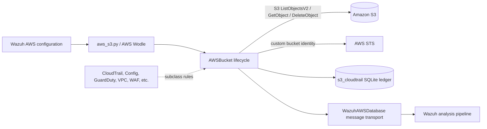
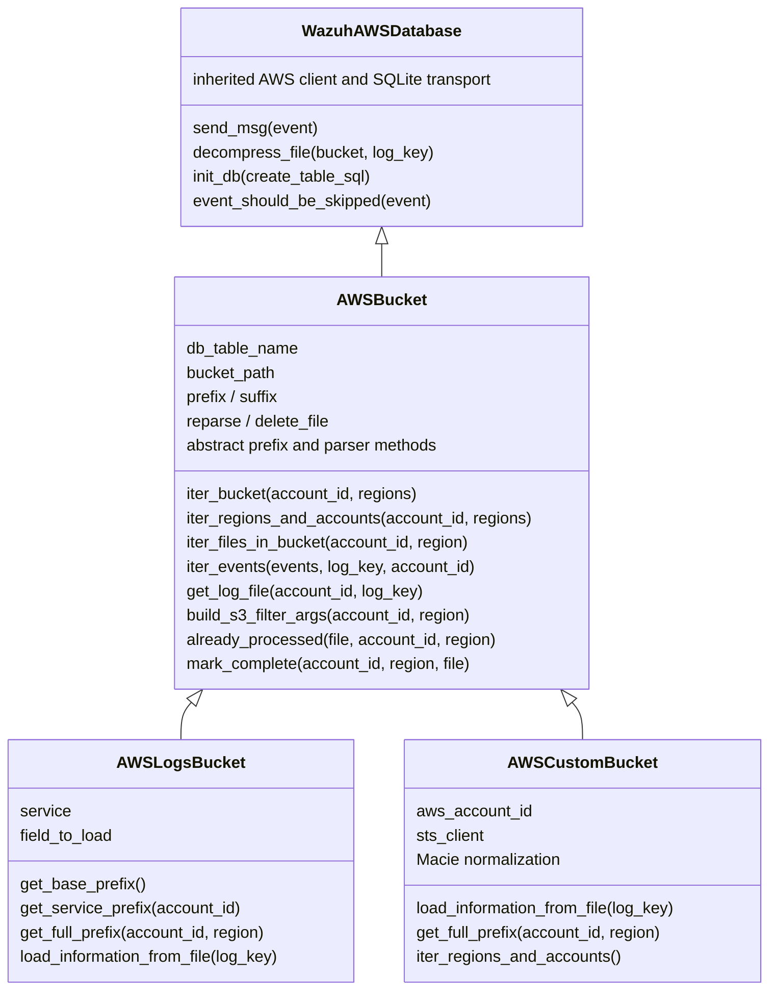
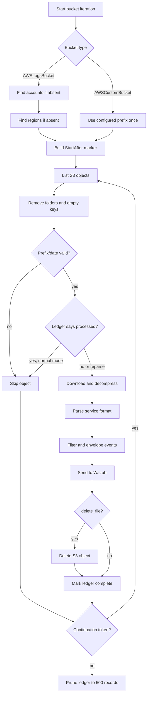
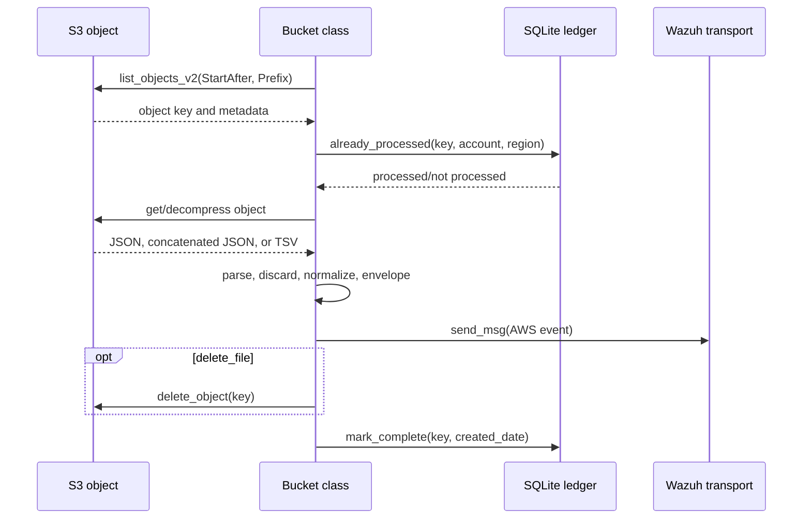
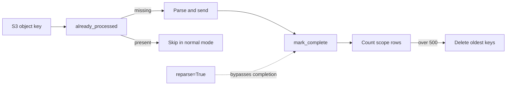

# AWS S3 bucket core

The `aws_buckets_s3_core` module provides the shared ingestion framework for AWS log files stored in Amazon S3. It discovers objects, prevents duplicate processing, downloads and decompresses log files, converts service-specific payloads into Wazuh events, forwards those events, and maintains a bounded SQLite processing ledger.

The implementation is centered on `AWSBucket`, with two concrete specializations in [`wodles/aws/buckets_s3/aws_bucket.py`](src/wodles/aws/buckets_s3/aws_bucket.py):

- `AWSLogsBucket` handles AWS service log layouts rooted below `AWSLogs/...`, such as CloudTrail and AWS Config.
- `AWSCustomBucket` handles custom or delivery-stream layouts, including concatenated JSON and VPC flow-log TSV data.

The module is part of the AWS integration runtime described in [`aws_core.md`](aws_core.md). Service-specific bucket classes should supply only their path conventions, service name, payload field, and any specialized parsing rules; the common lifecycle remains here.

## Role in the system

The S3 bucket classes are workers created by the AWS Wodle entry point. They use the AWS integration database and message transport inherited from `WazuhAWSDatabase`, while `boto3`/`botocore` clients perform S3 and STS operations. Parsed records are wrapped in the standard AWS event envelope before being sent to Wazuh.



## Components and responsibilities

### `AWSBucket`

`AWSBucket` is the abstract orchestration layer. Its constructor establishes:

- AWS connection settings and the inherited `WazuhAWSDatabase` service configuration.
- A shared database name, `s3_cloudtrail`, and a subclass-provided table name.
- The bucket path, prefix/suffix filters, account organization identifier, date parsing, and retention limit.
- SQL statements for creating the ledger, checking processed objects, finding the last marker, recording completion, counting records, and pruning old records.

The class intentionally leaves layout- and format-dependent operations abstract: `get_base_prefix`, `get_service_prefix`, `get_full_prefix`, `get_creation_date`, and `load_information_from_file`.

### `AWSLogsBucket`

`AWSLogsBucket` models the conventional AWS service-log hierarchy:

```text
<prefix><suffix>AWSLogs/[<organization-id>/]<account-id>/<service>/<region>/...
```

It derives the base, service, and region prefixes, extracts object creation dates from service-log filenames, adds `aws_account_id` to the event envelope, and loads an array from the configured JSON field (`field_to_load`). Each record receives a normalized `source` equal to the service name.

Service implementations such as CloudTrail, Config, and GuardDuty extend this class and provide the service-specific values and configuration. See [`aws_buckets_s3_service_logs.md`](aws_buckets_s3_service_logs.md) for those service layouts when available.

### `AWSCustomBucket`

`AWSCustomBucket` is for a single bucket/prefix rather than an account-and-region hierarchy. It obtains the AWS account ID through STS, uses a simplified ledger key, and processes the bucket directly without enumerating accounts or regions.

Its parser supports:

- Concatenated JSON objects, extracting each object’s `detail` and deriving the event source from the object’s `source`.
- VPC-style space-delimited/TSV records mapped to a fixed set of flow-log field names.
- A Macie-specific repair for zero-padded latitude/longitude values that are not valid JSON numbers.

It also applies Macie normalization: removing obsolete `trigger` data, converting scalar `unusual` values to objects, and flattening selected nested summary fields into dot-delimited values.

Network/access and security-specific subclasses are documented separately in [`aws_buckets_s3_network_and_access_logs.md`](aws_buckets_s3_network_and_access_logs.md) and [`aws_buckets_s3_security_and_dns_logs.md`](aws_buckets_s3_security_and_dns_logs.md).

## Architecture



## Object discovery and filtering

For service buckets, `iter_regions_and_accounts` enumerates account IDs and regions when they were not supplied by configuration. Account discovery reads common prefixes below `get_base_prefix`; only 12-digit account IDs are accepted. Region discovery reads common prefixes below the account/service prefix.

For custom buckets, the account and region loops are bypassed and the configured prefix is scanned once. `check_prefix` is enabled so objects whose embedded date does not begin immediately after the expected custom prefix are ignored.

`build_s3_filter_args` creates the `list_objects_v2` request. The `StartAfter` marker is selected from one of three sources:

1. The configured `only_logs_after` date.
2. The default date when the ledger has no row for the account/region.
3. The last processed object key from the ledger.

Reparse mode deliberately ignores the normal processed-key progression and starts at the configured/default date. The Config layout uses a shortened year-level marker because its object hierarchy differs from the other services. Large responses are continued using `NextContinuationToken`.



## Data flow and event normalization

The common parser boundary returns a list of event dictionaries. `iter_events` applies the inherited discard-field/regular-expression policy before creating an AWS alert message. `get_alert_msg` deep-copies the envelope template, adds account alias, source object key, and bucket name, removes nested `None` values, then merges the parsed event under `aws`.

`reformat_msg` performs compatibility normalization shared by all bucket types:

- Single-element lists are reduced to scalar/dictionary values recursively.
- An IPv4 `sourceIPAddress` is duplicated as `source_ip_address` for index mappings.
- Non-object `tags` values become `{ "value": ... }`.

The custom implementation adds the Macie and nested-summary transformations described above. After normalization, `send_event` delegates to the inherited message sender.



## Processing ledger and retention

The ledger is the idempotency boundary. A service-log row is keyed by bucket path, AWS account ID, AWS region, and object key. A custom-bucket row omits region because a custom scan is not partitioned by region. In normal mode, an object is marked complete only after parsing and event iteration return; in reparse mode, completion is not written.

The ledger is capped at `MAX_RECORD_RETENTION` (500 records per account/region or custom account scope). `db_maintenance` deletes older keys after each scope has been processed. The database is committed, optimized, and closed at the end of `iter_bucket`.



## Error handling and operational behavior

Errors are intentionally separated into request, parsing, and transport categories:

- S3 throttling exits with code `16` and emits guidance for retry configuration.
- Invalid credentials exit with code `3`; clock skew exits with code `19`.
- Endpoint connectivity errors exit with code `15`.
- Object decompression errors, parse errors, and unknown object errors use distinct codes when `skip_on_error` is disabled.
- With `skip_on_error` enabled, the failed object is logged and an AWS error event is sent when possible; processing continues.
- Empty prefixes and exhausted scopes produce diagnostic “no logs” messages rather than synthetic events.

Pagination is handled for both discovery and object processing. `check_bucket` uses an S3 paginator and validates credentials and endpoint connectivity before normal iteration begins.

## Extension points

When adding a service bucket:

1. Choose `AWSLogsBucket` for an `AWSLogs/account/service/region/date` hierarchy or `AWSCustomBucket` for a single configured prefix.
2. Implement the abstract path and date methods required by the selected base class.
3. For `AWSLogsBucket`, define the service identifier and JSON field to load.
4. For nonstandard payloads, override `load_information_from_file` and, only when necessary, `reformat_msg`.
5. Use a distinct ledger table when the service requires different retention or key semantics.

Do not duplicate account/region enumeration, continuation-token handling, event filtering, alert-envelope construction, or idempotency logic in service classes. Existing service implementations are grouped in [`aws_buckets_s3_service_logs.md`](aws_buckets_s3_service_logs.md), [`aws_buckets_s3_network_and_access_logs.md`](aws_buckets_s3_network_and_access_logs.md), and [`aws_buckets_s3_security_and_dns_logs.md`](aws_buckets_s3_security_and_dns_logs.md).

## Related documentation

- [`aws_core.md`](aws_core.md) — AWS Wodle entry point, shared AWS utilities, and integration database.
- [`aws_buckets_s3_service_logs.md`](aws_buckets_s3_service_logs.md) — CloudTrail, Config, and GuardDuty bucket specializations.
- [`aws_buckets_s3_network_and_access_logs.md`](aws_buckets_s3_network_and_access_logs.md) — load balancer, server access, and VPC flow-log specializations.
- [`aws_buckets_s3_security_and_dns_logs.md`](aws_buckets_s3_security_and_dns_logs.md) — WAF and Cisco Umbrella specializations.
- [`aws_subscribers.md`](aws_subscribers.md) — event-driven S3/SQS ingestion, which is separate from polling S3 buckets.
