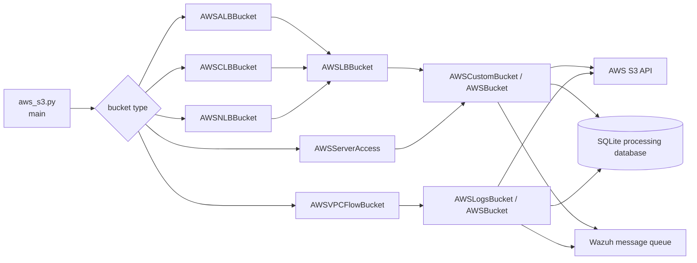
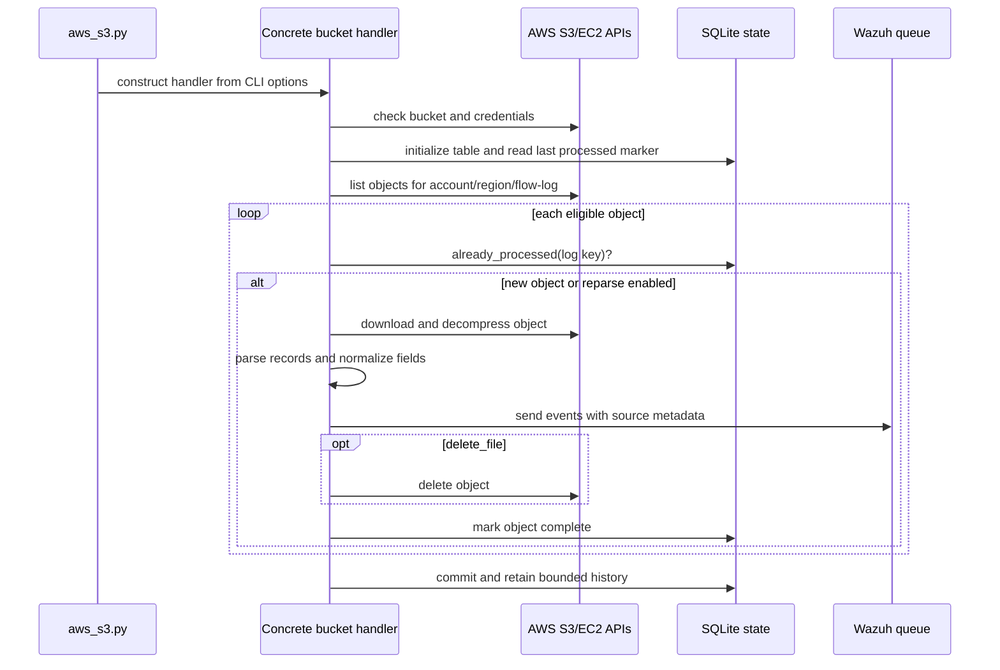
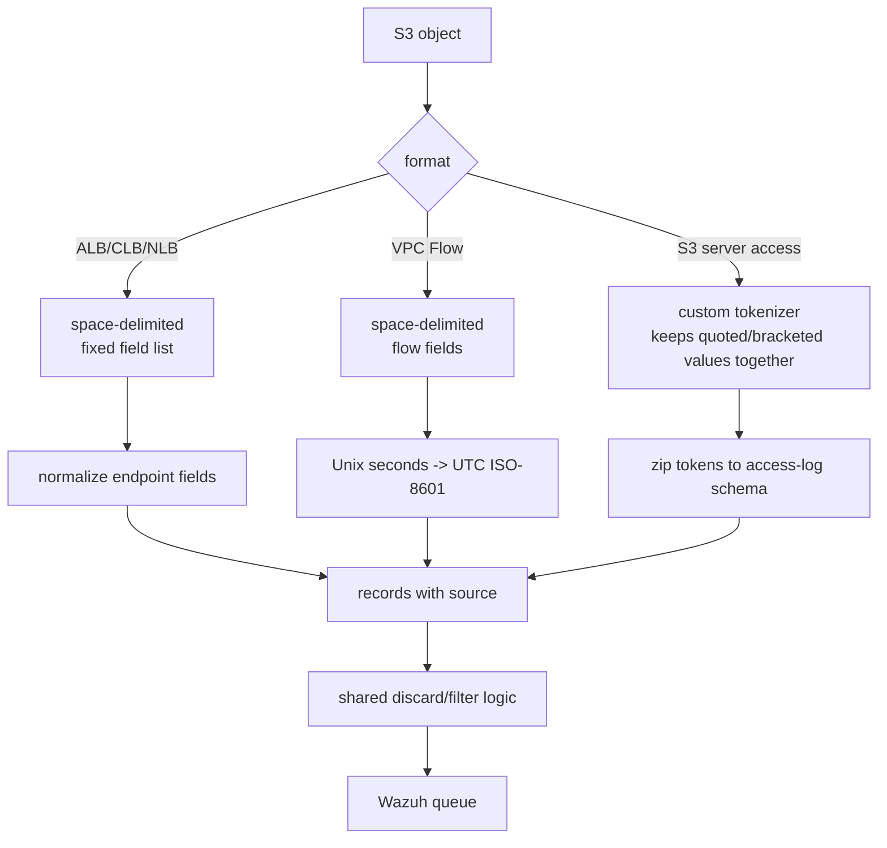

# AWS S3 Network and Access Logs

This module contains the Wazuh AWS S3 log readers for load balancer access logs, Amazon S3 server-access logs, and VPC Flow Logs. It is part of the `wodles/aws` cloud-integration path and is selected by `wodles/aws/aws_s3.py` from the command-line `--type` value (`alb`, `clb`, `nlb`, `server_access`, or `vpcflow`).

The concrete readers specialize a shared bucket-processing framework. The framework authenticates to AWS, lists objects by account and region, applies date and resume markers, downloads and decompresses objects, parses records, forwards normalized events to Wazuh, records completed objects in SQLite, and optionally removes processed objects from S3.

## Architecture overview

`AWSLBBucket` provides the common Elastic Load Balancing key layout and service identifier. `AWSServerAccess` uses the custom-bucket path because S3 server-access keys are date-stamped with hyphens rather than the account/region layout used by AWS service logs. `AWSVPCFlowBucket` extends the AWS service-log path but adds EC2 API discovery of flow-log IDs and a flow-log-specific processing database key.

## Components and responsibilities

| Component | Responsibility | Detailed documentation |
| --- | --- | --- |
| `AWSALBBucket` | Parses Application Load Balancer access logs, splitting endpoint `ip:port` fields and exposing normalized client/target IP fields. | [load_balancers.md](load_balancers.md) |
| `AWSCLBBucket` | Parses Classic Load Balancer access logs using the CLB field layout. | [load_balancers.md](load_balancers.md) |
| `AWSNLBBucket` | Parses Network Load Balancer access logs and separates client and destination endpoint addresses from ports. | [load_balancers.md](load_balancers.md) |
| `AWSServerAccess` | Enumerates, filters, parses, deduplicates, and optionally deletes S3 server-access log objects. | [server_access.md](server_access.md) |
| `AWSVPCFlowBucket` | Discovers flow-log IDs through EC2, filters S3 keys per flow log, converts Unix timestamps, and maintains bounded per-flow-log history. | [vpc_flow.md](vpc_flow.md) |

The shared base classes are documented by the neighboring AWS S3 bucket modules. In particular, see the [AWS S3 core bucket documentation](aws_buckets_s3_core.md) for constructor options, AWS credentials/role handling, object download, event filtering, message formatting, and common SQLite behavior.

## Processing and data flow

### Common lifecycle

The command entry point validates regions, maps the requested type to a handler, constructs it with credentials and filtering options, calls `check_bucket()`, and starts bucket iteration. The inherited framework supports explicit account and region lists; when they are absent, service-log handlers discover account and region prefixes in S3.

For normal processing, the last completed key is used as an S3 `StartAfter` marker. `only_logs_after` supplies the lower bound when no prior state exists, while `reparse` deliberately starts from a date marker and permits previously recorded keys to be read again. Every reader tags parsed records with a source value (`alb`, `clb`, `nlb`, `s3_server_access`, or `vpc`) before the shared event path wraps and forwards them.

### Parsing boundaries

Load balancer and VPC files are parsed as whitespace-delimited records with service-specific fixed schemas. ALB and NLB have endpoint fields that contain `address:port`; ALB also handles lists of target endpoints. S3 server-access logs cannot be parsed by a simple CSV reader because request URIs, user agents, and bracketed timestamps can contain spaces, so `AWSServerAccess` merges quoted and bracketed tokens before zipping them to field names.

## State, errors, and operational behavior

- Each handler uses a distinct SQLite table: `alb`, `clb`, `nlb`, `s3_server_access`, or `vpcflow`.
- Normal handlers key completion by bucket path, account, region, and log key. VPC Flow Logs additionally key state by `flow_log_id`.
- VPC state is periodically pruned to the configured retention count for each account/region/flow-log combination.
- AWS throttling, invalid credentials, invalid request time, malformed filenames, invalid regions, decompression failures, and unexpected S3/EC2 errors are reported through `aws_tools`; behavior may either stop the process or skip an item depending on `skip_on_error`.
- The optional `delete_file` setting removes an object only after its events have been read; completion state is still recorded separately in SQLite.

## Extension points

To add another reader in this family, select the appropriate base (`AWSLogsBucket` for AWS service-layout logs or `AWSCustomBucket` for a custom key layout), define a unique database table, implement `load_information_from_file()`, and override account/region or object filtering only when the key layout requires it. Preserve the inherited completion and event-forwarding contract so resume markers, deduplication, filtering, and Wazuh delivery remain consistent.
