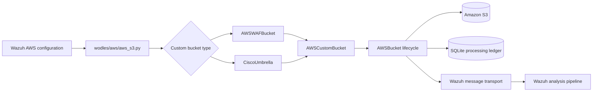
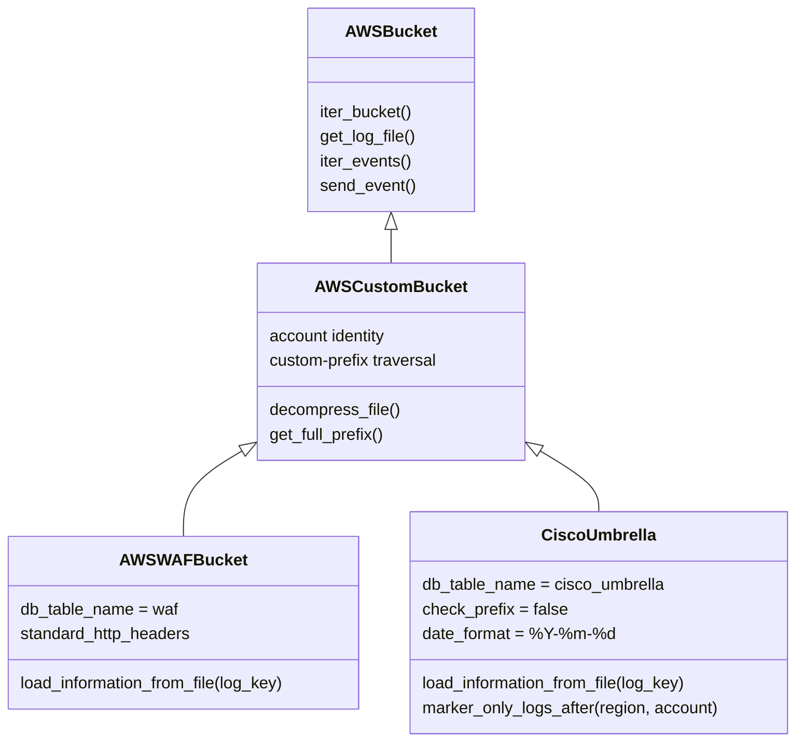
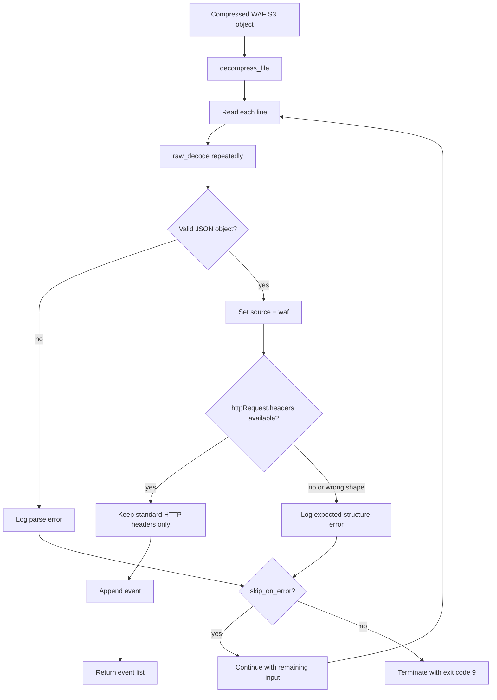
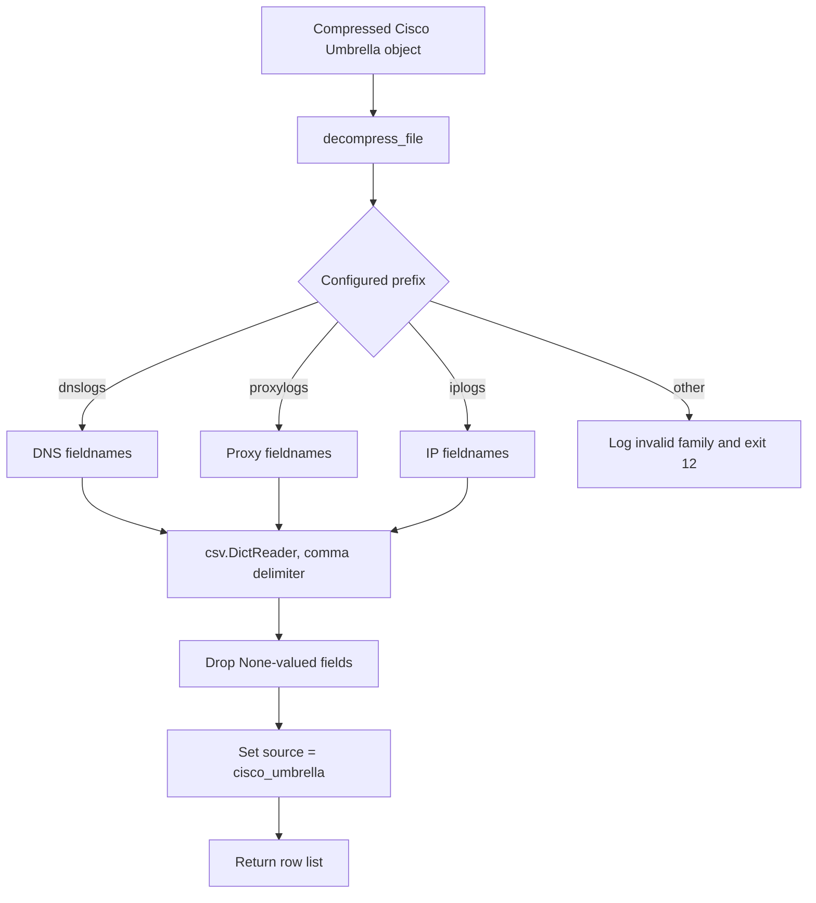
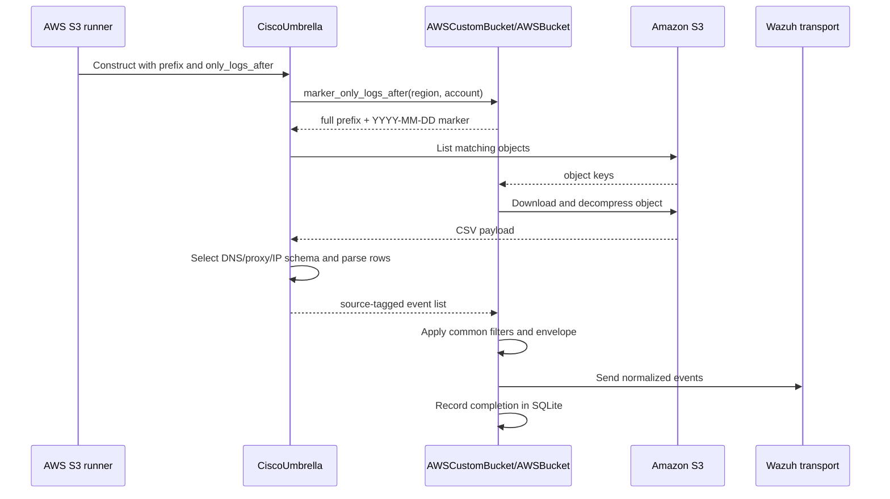

# AWS S3 security and DNS log adapters

The `aws_buckets_s3_security_and_dns_logs` module contains the S3 parsers for two security-oriented AWS integrations:

- `AWSWAFBucket`, which reads AWS WAF logs encoded as one or more JSON objects per line and keeps only standard HTTP request headers.
- `CiscoUmbrella`, which reads Cisco Umbrella DNS, proxy, or IP logs as comma-separated records and maps each row to a named event schema.

Both classes extend `AWSCustomBucket`. S3 object discovery, decompression, processed-object tracking, event envelopes, filtering, retries, deletion, and Wazuh delivery are provided by the shared [AWS S3 bucket core](aws_buckets_s3_core.md). The classes documented here are format adapters selected by the AWS S3 runner described in [aws_core](aws_core.md).

## Position in the system

`AWSCustomBucket` treats each configured bucket/prefix as a direct scan. Unlike `AWSLogsBucket` service adapters, these classes do not depend on the conventional `AWSLogs/<account>/<service>/<region>` hierarchy. The common implementation still obtains the account identity, builds S3 markers, paginates objects, and applies the configured resume policy.

## Components

| Component | Base class | Ledger table | Input format | Event source |
|---|---|---|---|---|
| `AWSWAFBucket` | `AWSCustomBucket` | `waf` | JSON objects, including concatenated objects on one line | `waf` |
| `CiscoUmbrella` | `AWSCustomBucket` | `cisco_umbrella` | CSV rows | `cisco_umbrella` |

The classes deliberately override only parsing and small format-specific configuration points:

## AWS WAF adapter

### Configuration and inheritance

`AWSWAFBucket.__init__` sets `db_table_name` to `waf` and delegates the remaining configuration to `AWSCustomBucket`. It therefore inherits the common custom-bucket behavior for the configured bucket, prefix, decompression, `skip_on_error`, object filtering, and Wazuh event construction.

The class also defines `standard_http_headers`, a case-insensitive allowlist of conventional HTTP request headers. This list includes request metadata such as `accept`, `authorization`, `content-type`, `cookie`, `host`, `origin`, `referer`, `user-agent`, and the common `x-forwarded-*` headers.

### WAF file parsing

`load_information_from_file(log_key)` opens the object through the inherited `decompress_file` context manager. Each physical line is stripped and passed to a local generator using `json.JSONDecoder.raw_decode`. The generator repeatedly decodes from the beginning of the remaining string, allowing a line to contain concatenated JSON objects rather than requiring one complete JSON document per line.

For every decoded object, the adapter:

1. Sets `event['source']` to `waf`.
2. Reads `event['httpRequest']['headers']` when present.
3. Retains only headers whose lower-cased name appears in `standard_http_headers`.
4. Replaces the original header list with a dictionary keyed by the original header names.
5. Appends the normalized event to the returned content list.

The final `json.loads(json.dumps(content))` round trip ensures that the return value is ordinary JSON-compatible data rather than decoder-specific objects.

### Header normalization

The input WAF schema represents headers as a list of objects such as `{ "name": "User-Agent", "value": "..." }`. The output replaces that list with a dictionary. Matching is case-insensitive, but the dictionary key preserves the provider-supplied spelling. Nonstandard headers are intentionally dropped to reduce dynamic fields and keep the resulting event compatible with stable mappings.

If the `httpRequest` or header entries have an unexpected shape, the adapter calls `aws_tools.error`. With `skip_on_error=False`, it exits with status `9`; with `skip_on_error=True`, it retains the event and continues. A malformed JSON line follows the same error policy, but the error message identifies the affected file.

## Cisco Umbrella adapter

### Configuration and prefix behavior

`CiscoUmbrella.__init__` selects the `cisco_umbrella` ledger table, disables inherited prefix checking, and sets the date format to `%Y-%m-%d`. Disabling prefix checking is important because Umbrella log families use a prefix followed by a date marker whose layout is selected by the configured prefix rather than by a single fixed custom-bucket convention.

The adapter supports three prefix families:

| Prefix contains | Log family | Schema |
|---|---|---|
| `dnslogs` | DNS activity | identity, IPs, action, query/response, domain, and categories |
| `proxylogs` | Web proxy activity | URL, verdict, content, response sizes, malware/AMP fields, and categories |
| `iplogs` | IP activity | source/destination IPs and ports, identity, and categories |

Any other prefix is rejected with an error and process exit status `12`.

### CSV parsing

`load_information_from_file(log_key)` decompresses the object and creates a `csv.DictReader` with an explicit field-name tuple and comma delimiter. Cisco Umbrella files do not provide a header row in this adapter contract, so the first row is interpreted as data using the selected schema.

Each row is converted to a dictionary with `None` values removed, then receives `source='cisco_umbrella'`. The result is returned as a list of records. No type coercion, timestamp conversion, or field renaming is performed in this class; values remain the strings produced by `csv.DictReader`.

### Supported field contracts

DNS records use the fields `timestamp`, `most_granular_identity`, `identities`, `internal_ip`, `external_ip`, `action`, `query_type`, `response_code`, `domain`, `categories`, `most_granular_identity_type`, `identity_types`, and `blocked_categories`.

Proxy records use `timestamp`, `identities`, `internal_ip`, `external_ip`, `destination_ip`, `content_type`, `verdict`, `url`, `referer`, `user_agent`, `status_code`, `requested_size`, `response_size`, `response_body_size`, `sha`, `categories`, `av_detections`, `puas`, `amp_disposition`, `amp_malware_name`, `amp_score`, `identity_type`, and `blocked_categories`.

IP records use `timestamp`, `identity`, `source_ip`, `source_port`, `destination_ip`, `destination_port`, and `categories`.

### Date marker generation

`marker_only_logs_after(aws_region, aws_account_id)` delegates the account/region prefix construction to `get_full_prefix` and appends `only_logs_after` formatted as `%Y-%m-%d`. The resulting marker is used by the inherited S3 traversal to avoid requesting objects older than the configured lower bound.

## Shared processing boundary

The format adapters return lists of dictionaries; they do not send messages or write the processed-object ledger directly. The inherited core then applies the common event lifecycle:

1. List eligible objects and skip folders or already-processed keys.
2. Download and decompress the selected object.
3. Call the subclass parser.
4. Apply configured event filtering and build the AWS event envelope.
5. Send each event to Wazuh.
6. Mark the object complete and maintain bounded ledger retention.

This separation means parser changes should remain local to the two classes. Changes to pagination, resume semantics, event filtering, retention, or transport belong in [aws_buckets_s3_core.md](aws_buckets_s3_core.md), while AWS configuration and bucket-type dispatch belong in [aws_core.md](aws_core.md).

## Error and operational behavior

- WAF malformed JSON and unexpected HTTP header structures are reported through `aws_tools.error`.
- WAF parsing/structure failures terminate with exit code `9` unless `skip_on_error` is enabled.
- Cisco Umbrella rejects unsupported prefixes with exit code `12` before parsing.
- S3 connectivity, authentication, pagination, decompression, duplicate prevention, and message-delivery behavior are inherited and documented in [aws_buckets_s3_core.md](aws_buckets_s3_core.md).
- The adapters do not define scheduling; the AWS Wodle controls when a bucket scan runs.

## Related documentation

- [aws_buckets_s3.md](aws_buckets_s3.md) — S3 ingestion overview and adapter grouping.
- [aws_buckets_s3_core.md](aws_buckets_s3_core.md) — shared bucket lifecycle, event envelope, ledger, and error handling.
- [aws_core.md](aws_core.md) — AWS Wodle configuration, runner, credentials, and transport.
- [aws_buckets_s3_service_logs.md](aws_buckets_s3_service_logs.md) — CloudTrail, Config, and GuardDuty adapters.
- [aws_buckets_s3_network_and_access_logs.md](aws_buckets_s3_network_and_access_logs.md) — load balancer, VPC Flow, and S3 server-access adapters.
