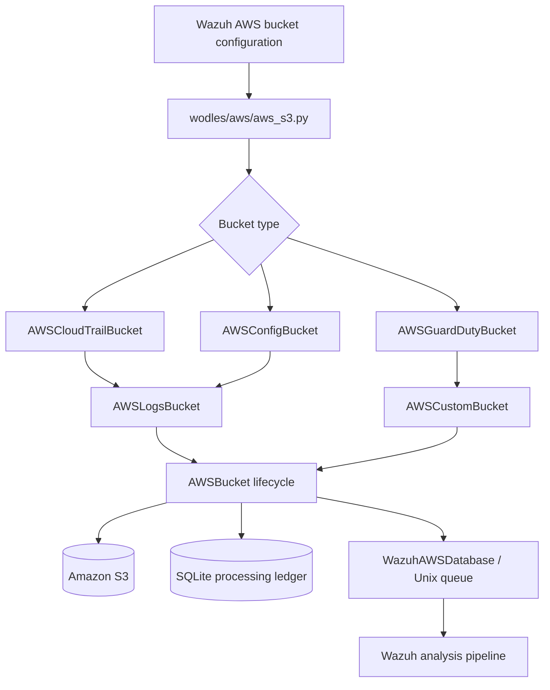
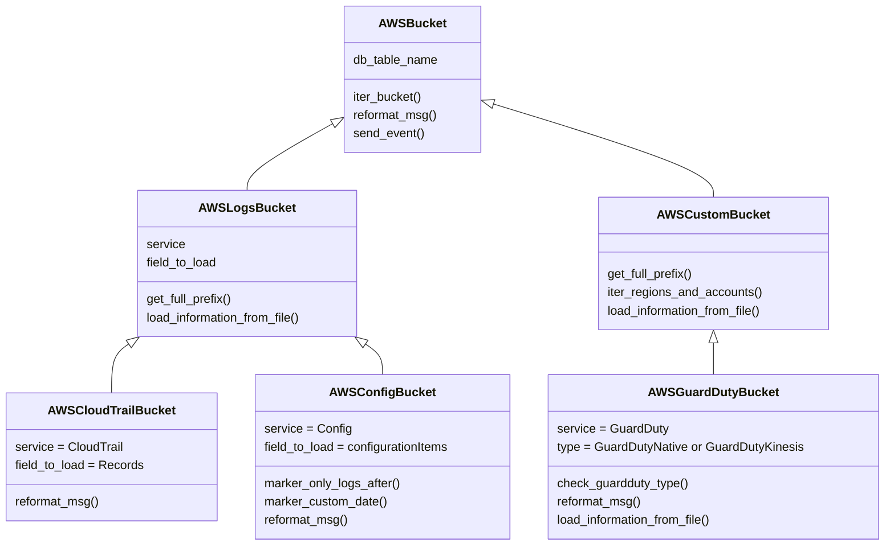
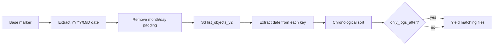
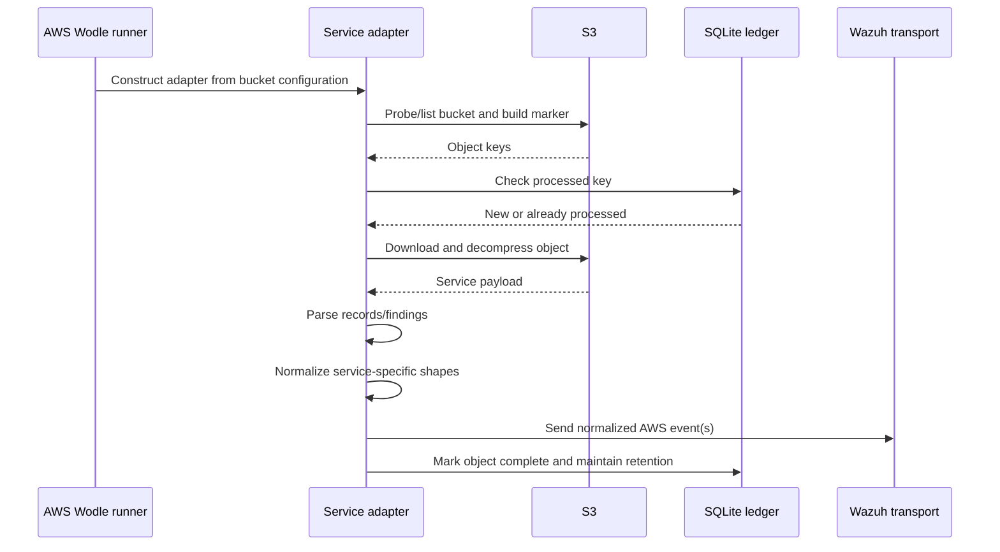

# AWS S3 service-log bucket adapters

The `aws_buckets_s3_service_logs` module contains the S3 adapters for AWS CloudTrail, AWS Config, and Amazon GuardDuty logs. Each adapter specializes the common bucket lifecycle—object discovery, progress tracking, download/decompression, event filtering, and Wazuh delivery—implemented by [`aws_buckets_s3_core.md`](aws_buckets_s3_core.md).

The module is selected by the AWS Wodle entry point in [`aws_core.md`](aws_core.md) when bucket mode is configured with `cloudtrail`, `config`, or `guardduty`.

## Position in the AWS ingestion architecture



`AWSCloudTrailBucket` and `AWSConfigBucket` use the conventional `AWSLogs/<account>/<service>/<region>/...` hierarchy. GuardDuty is deliberately an `AWSCustomBucket`: it detects whether the bucket contains the native S3 layout and otherwise retains compatibility with the deprecated Kinesis-style layout.

## Components

| Component | Base class | Role | Ledger table |
| --- | --- | --- | --- |
| `AWSCloudTrailBucket` | `AWSLogsBucket` | Reads CloudTrail record arrays and stabilizes dynamic fields for indexing. | `cloudtrail` |
| `AWSConfigBucket` | `AWSLogsBucket` | Reads AWS Config configuration-item arrays, normalizes dates and variable-shaped fields. | `config` |
| `AWSGuardDutyBucket` | `AWSCustomBucket` | Supports native GuardDuty S3 findings and legacy Kinesis-style objects. | `guardduty` |

The shared classes provide the constructor contract, S3 prefix iteration, continuation-token handling, duplicate prevention, decompression, event envelopes, filtering, and retention. See [`aws_buckets_s3_core.md`](aws_buckets_s3_core.md) for those responsibilities and extension points.

## Class relationships and dependencies



Direct dependencies are intentionally small:

- `aws_bucket` supplies all common S3 and event behavior.
- `aws_tools` supplies error/debug reporting and is used directly by Config and GuardDuty.
- `boto3` behavior is accessed through the client owned by the base classes.
- `json`, `re`, and `datetime` support service-specific parsing and normalization.

## CloudTrail processing

`AWSCloudTrailBucket.__init__` selects the `cloudtrail` ledger table, sets `service` to `CloudTrail`, and instructs `AWSLogsBucket` to load the `Records` field from each object.

CloudTrail’s `reformat_msg` first invokes the common AWS envelope normalization, then handles fields whose provider shape varies between events:

1. `additionalEventData`, `responseElements`, and `requestParameters` are forced to dictionaries when they arrive as strings or lists. The original value is retained under a `string` key.
2. `requestParameters.disableApiTermination` is wrapped as `{ "value": <bool> }` when it is boolean. Existing dictionaries are preserved.
3. Unexpected shapes produce a warning while allowing the event to continue through the common pipeline.

This protects downstream index mappings from a field changing between object, list, and scalar representations.

## AWS Config processing

`AWSConfigBucket` selects the `config` ledger table, the `Config` service name, and the `configurationItems` payload field.

### Object discovery and markers

AWS Config uses non-padded month/day directory components in some S3 keys. The adapter therefore overrides marker generation:

- `marker_only_logs_after` and `marker_custom_date` call the base marker builder and remove padding from the date portion only.
- `_remove_padding_zeros_from_marker` extracts a `YYYY/M/D` date and avoids modifying account IDs that may begin with zero. Failure to find a date is reported through `aws_tools.error` and terminates with exit code `16`.
- `_filter_bucket_files` sorts candidate objects chronologically after normalizing one- or two-digit month/day components, then applies `only_logs_after`.
- `_format_created_date` converts an S3 date in the configured date format to the database date format.



### Configuration event normalization

After common normalization, the adapter changes provider fields into stable mappings:

- `configuration.*.Content` is reduced to a list of content keys to avoid storing large payloads.
- `securityGroups` becomes `groupId`/`groupName` arrays regardless of whether the source is a string, list, or dictionary.
- `availabilityZones` becomes `subnetId`/`zoneName` arrays using the same scalar/list/dictionary handling.
- A scalar `state` becomes `{ "name": state }`.
- Numeric `createdTime` values become floats; ISO timestamps in `%Y-%m-%dT%H:%M:%S.%fZ` format become epoch seconds.
- A scalar `iamInstanceProfile` becomes `{ "name": value }`.

Unsupported shapes generate warnings rather than silently being discarded.

## GuardDuty processing

GuardDuty differs from the other service adapters because two historical ingestion formats are supported.

```mermaid
flowchart TD
    Init[AWSGuardDutyBucket initialization] --> Probe[list_objects_v2(prefix + AWSLogs)]
    Probe --> Native{CommonPrefixes present?}
    Native -->|yes| NativeMode[GuardDutyNative]
    Native -->|no| LegacyMode[GuardDutyKinesis]
    NativeMode --> NativePath[AWSLogs account/region traversal]
    LegacyMode --> Warning[Emit deprecation warning]
    Warning --> CustomPath[Configured custom prefix traversal]
    NativePath --> Load[Load and normalize findings]
    CustomPath --> Load
    Load --> Send[Send Wazuh events]
```

The constructor stores the `guardduty` ledger table and sets `service` to `GuardDuty`. `check_guardduty_type` probes S3 for an `AWSLogs` common prefix. Errors are logged and terminate with exit code `7`.

In native mode, GuardDuty delegates prefix construction to `AWSLogsBucket`. In legacy mode it uses the configured custom prefix, enables prefix checking, and prints a deprecation message directing operators to the native S3 configuration. The compatibility path is retained for older deployments but is not the preferred ingestion method.

GuardDuty also overrides two data-path operations:

- `load_information_from_file` parses `.jsonl.gz` objects line by line, adds each finding’s `service.serviceName` as its source, and returns the resulting list. Other extensions use `AWSCustomBucket` loading.
- `reformat_msg` splits a finding with multiple `portProbeDetails` entries into one event per detail. Other findings use the common AWS normalization and produce one event.

## End-to-end processing flow



The adapter-specific phase occurs between base-class parsing and Wazuh delivery. Idempotency, pagination, deletion behavior, error policy, and database maintenance remain in the shared core and should not be reimplemented here.

## Operational considerations

- CloudTrail and Config require the conventional AWS Logs hierarchy and inherit account/region discovery.
- Config key dates may contain single-digit month/day components; marker and sorting overrides are mandatory for correct chronological processing.
- GuardDuty native S3 storage is preferred. Legacy Kinesis-shaped processing emits a deprecation warning and follows custom-prefix semantics.
- Service-specific warnings generally do not abort the event; infrastructure failures are handled by the shared S3 core.
- Changes to event field shapes should preserve stable dictionary mappings because downstream index mappings depend on them.

## Related documentation

- [`aws_buckets_s3_core.md`](aws_buckets_s3_core.md) — shared S3 lifecycle, parsing, event envelope, idempotency, and error handling.
- [`aws_core.md`](aws_core.md) — AWS Wodle dispatch, authentication, configuration, and transport.
- [`aws_buckets_s3_network_and_access_logs.md`](aws_buckets_s3_network_and_access_logs.md) — load balancer, server access, and VPC flow-log adapters.
- [`aws_buckets_s3_security_and_dns_logs.md`](aws_buckets_s3_security_and_dns_logs.md) — WAF and Cisco Umbrella adapters.
