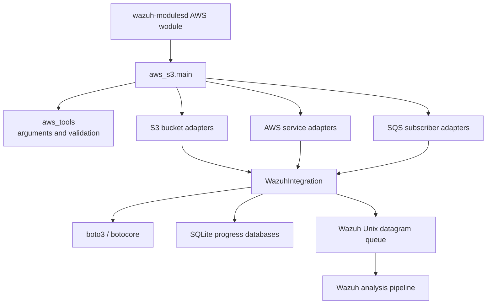
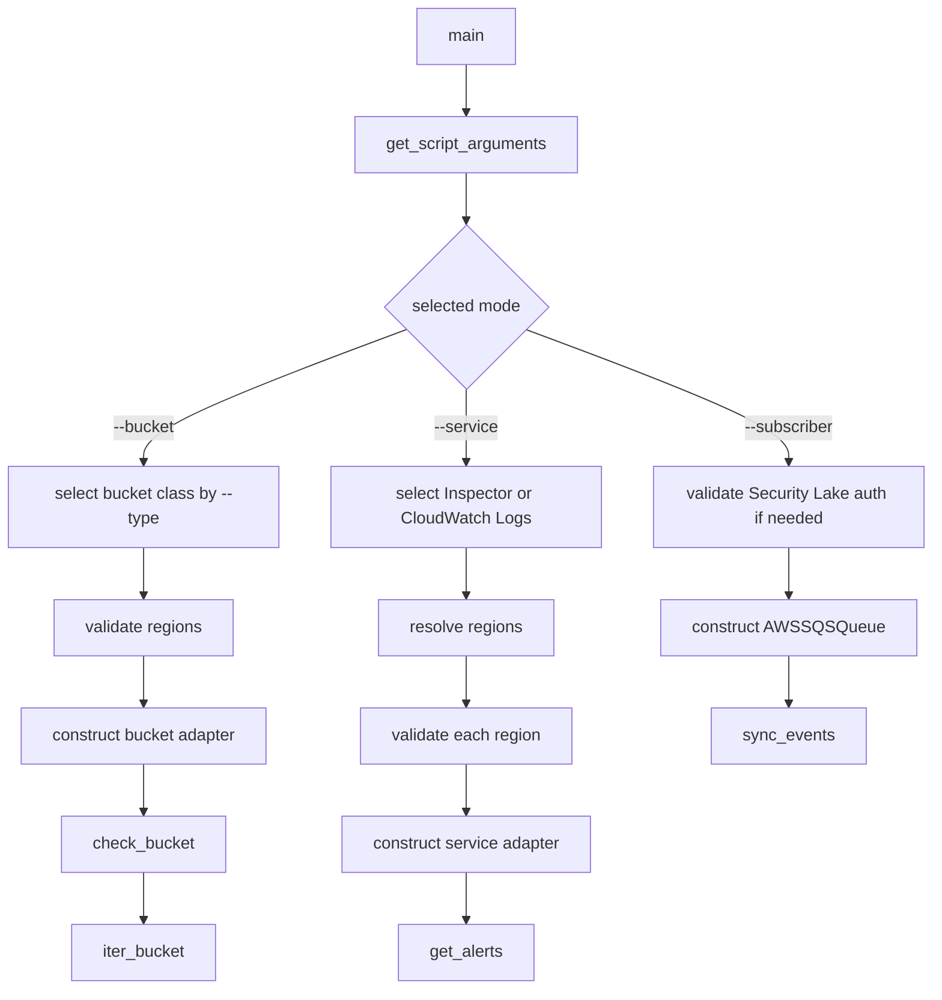
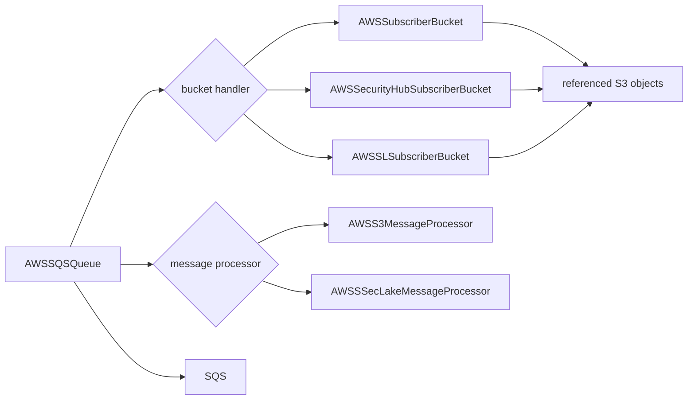
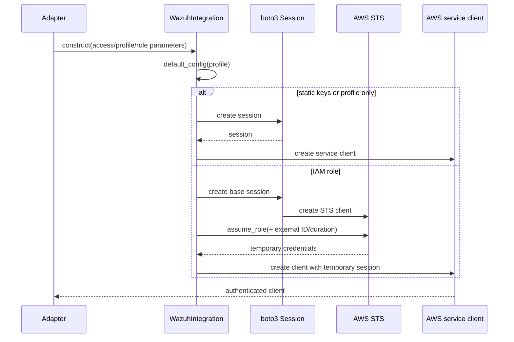
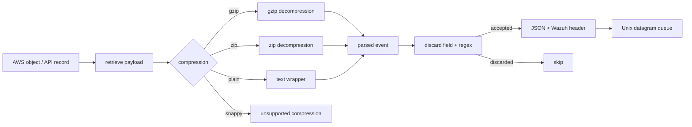
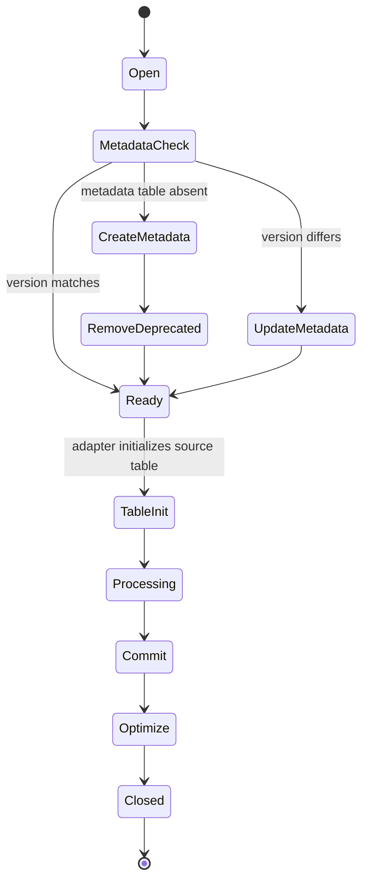

# AWS core Python integration

The `aws_core` module is the orchestration and shared-runtime layer for Wazuh’s Python AWS wodle. It selects an ingestion mode, validates command-line inputs, creates AWS clients, applies common retry and authentication configuration, optionally persists collection metadata in SQLite, and forwards normalized events to Wazuh through its Unix datagram queue.

It does not interpret every AWS log format itself. Format-specific behavior belongs to the bucket, service, and subscriber modules described in the [AWS integration overview](aws.md).

## Scope and position

The module consists of three core files:

| File | Main responsibility |
| --- | --- |
| `wodles/aws/aws_s3.py` | Command-line entry point and dispatch between S3 buckets, AWS services, and SQS subscribers. |
| `wodles/aws/aws_tools.py` | Argument parsing, validation, AWS profile loading, logging helpers, and SIGINT handling. |
| `wodles/aws/wazuh_integration.py` | Shared AWS/Wazuh integration base class and `WazuhAWSDatabase` SQLite extension. |

The native `wazuh-modulesd` AWS wodule schedules execution; this Python layer performs the actual provider interaction. See the native lifecycle and scheduling details in [aws.md](aws.md).

## Entry point and dispatch

`aws_s3.main(argv)` obtains parsed options from `aws_tools.get_script_arguments()`, enables the requested debug level, and selects exactly one execution branch. The `argv` parameter is retained for the public entry-point shape, while argument parsing reads the process command line through `argparse`.

### S3 bucket mode

The `--bucket` branch maps `--type` to an adapter class:

| Type | Adapter |
| --- | --- |
| `cloudtrail` | `AWSCloudTrailBucket` |
| `vpcflow` | `AWSVPCFlowBucket` |
| `config` | `AWSConfigBucket` |
| `custom` | `AWSCustomBucket` |
| `guardduty` | `AWSGuardDutyBucket` |
| `cisco_umbrella` | `CiscoUmbrella` |
| `waf` | `AWSWAFBucket` |
| `alb`, `clb`, `nlb` | Load-balancer bucket adapters |
| `server_access` | `AWSServerAccess` |

The entry point validates every explicitly supplied region against `aws_tools.ALL_REGIONS`, constructs the adapter with credentials, profile, assumed-role, filtering, prefix/suffix, endpoint, and deletion options, then calls `check_bucket()` before iterating objects. Parsing and source-specific object handling are intentionally delegated to the [AWS bucket adapters](aws.md).

### Service mode

The `--service` branch supports `inspector` and `cloudwatchlogs`. If no region is supplied, it first checks the selected AWS profile’s `region` setting. Inspector falls back to its supported-region lists; other services fall back to all known regions. Each region is validated by the selected adapter before `get_alerts()` is called.

### Subscriber mode

The `--subscriber` branch supports `buckets`, `security_hub`, and `security_lake`. It pairs an SQS queue with a bucket handler and message processor:

Security Lake requires an IAM role ARN, queue name, and external ID. Missing values terminate with the subscriber authentication error path before queue synchronization begins.

## Argument validation and configuration

`aws_tools.get_script_arguments()` enforces a mutually exclusive required source: bucket, service, or subscriber. Important validators are:

| Validator | Contract |
| --- | --- |
| `arg_valid_accountid` | Comma-separated 12-digit account IDs. |
| `arg_valid_bucket_name` | S3 bucket naming pattern and reserved suffix/prefix exclusions. |
| `arg_valid_date` | Parses `YYYY-MMM-DD` and returns `YYYYMMDD`. |
| `arg_valid_regions` | Parses, deduplicates, sorts, and shape-validates region names. |
| `args_valid_iam_role_arn` | Validates the general AWS ARN structure. |
| `args_valid_sqs_name` | Allows 1–80 alphanumeric, hyphen, and underscore characters. |
| `arg_valid_iam_role_duration` | Accepts numeric session durations from 900 through 3600 seconds. |
| `arg_valid_key` / `aws_logs_groups_valid_key` | Rejects unsafe S3/XML characters; optionally appends `/`. |

The implementation’s accepted IAM role duration is 15 minutes to 1 hour (`900..3600` seconds), despite the nearby docstring describing a 12-hour upper bound. The code is the authoritative behavior.

The AWS config file is read from `~/.aws/config`. `set_profile_dict_config()` maps profile settings into a botocore `Config`, including S3 transfer settings, proxies, proxy TLS settings, signature version, and retry behavior. If no retry settings are present, the integration defaults to ten attempts in standard retry mode.

## AWS client and authentication flow

`WazuhIntegration.get_client()` supports deprecated static access-key arguments, named profiles, and IAM role assumption. When a role is used, it creates an STS client, calls `assume_role()`, creates a temporary-session boto3 session, and finally creates the requested service client.

Authentication failures (`ClientError` or `NoCredentialsError`) use exit code `3`. Profile/configuration problems can use exit codes `17` or `23`, while invalid CLI values are reported by `argparse`.

## Common event processing

The shared integration class provides behavior used by bucket, service, and subscriber adapters:

- `event_should_be_skipped()` evaluates a dotted field path recursively through dictionaries and lists, then applies the configured discard regular expression.
- `send_msg()` serializes an event, prefixes it with `1:Wazuh-AWS:`, and sends it to the Wazuh Unix datagram queue.
- `decompress_file()` retrieves an S3 object and supports plain text, gzip, and zip payloads. Snappy is explicitly unsupported.
- `skip_on_error` determines whether decompression and related processing errors terminate execution or allow processing to continue.

`send_msg()` warns when the encoded event exceeds `utils.MAX_EVENT_SIZE`. A refused Wazuh socket indicates that Wazuh is not running (exit `11`); other send failures use exit `13`. An oversized datagram is logged and skipped rather than retried.

## SQLite integration and progress metadata

`WazuhAWSDatabase` extends `WazuhIntegration` for adapters that need durable progress or deduplication state. It stores a database named `<db_name>.db` under the Wazuh AWS wodle directory and initializes a `metadata` table containing the current Wazuh version.

The class:

- discovers tables through `sqlite_master`;
- creates source tables on demand with `init_db()`;
- records and updates the Wazuh version in `metadata`;
- removes deprecated `log_progress` and `trail_progress` tables when metadata is first created;
- commits, runs `PRAGMA optimize`, and closes through `close_db()`.

SQLite failures are categorized as database-access or database-creation errors and exit with codes `5` or `6`. Source adapters define the actual SQL schema and progress semantics; this module owns the common lifecycle only.

## Error and shutdown model

`aws_tools.handler()` handles SIGINT by printing an error and exiting with code `2`. The script-level wrapper converts unexpected top-level failures to code `1`, while `main()` logs ordinary operational failures and exits with the source-specific code selected by the failing operation. Debug mode re-raises exceptions to preserve tracebacks for maintainers.

Representative codes declared by `aws_s3.py` include invalid credentials (`3`), missing boto3 (`4`), decompression (`8`), parsing (`9`), invalid bucket type (`12`), empty bucket (`14`), throttling (`16`), invalid prefix (`18`), invalid region (`22`), and missing profile (`23`). Some codes are emitted by delegated adapters rather than by the three core files directly.

## Maintenance guidance

When adding a new ingestion source:

1. Add or reuse an adapter in the source-specific bucket, service, or subscriber package.
2. Add its selector mapping in `aws_s3.main()`.
3. Add argument validation only in `aws_tools.py` when the option has a reusable contract.
4. Reuse `WazuhIntegration` for client creation, filtering, decompression, and event delivery.
5. Use `WazuhAWSDatabase` only when durable source state is required.
6. Preserve exit-code behavior and test invalid configuration, authentication failure, queue failure, and SIGINT paths.

Avoid placing format-specific parsing, AWS service schemas, or queue-consumer details in this core layer. Those belong in the related modules summarized by [aws.md](aws.md).

## Core references

- [AWS integration overview](aws.md)
- `wodles/aws/aws_s3.py`
- `wodles/aws/aws_tools.py`
- `wodles/aws/wazuh_integration.py`
