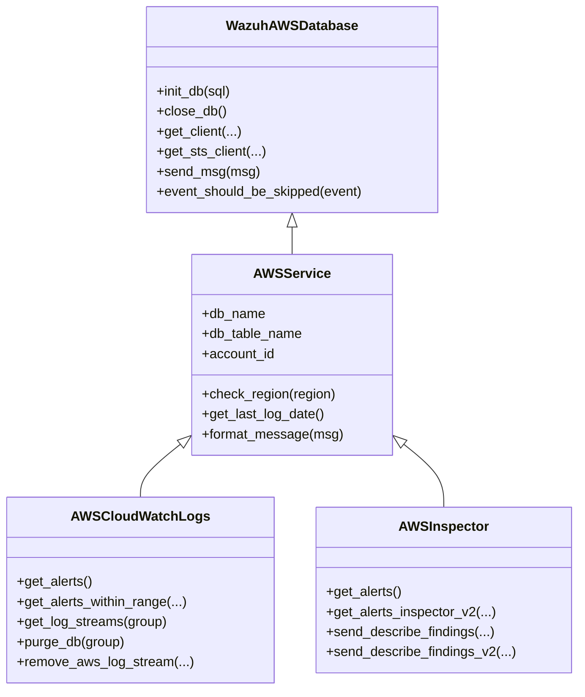
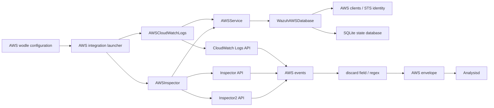
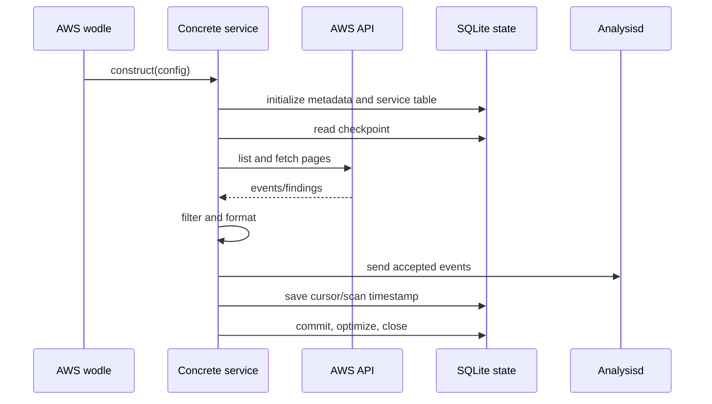

# AWS Services

## Purpose

The `aws_services` module implements Wazuh’s AWS service-oriented event collectors. It provides a shared service abstraction and two concrete integrations:

- [Base AWS service](base_service.md) — shared credentials, STS account discovery, event normalization, region validation, and persistent scan state.
- [CloudWatch Logs](cloudwatch_logs.md) — reads log streams, resumes from SQLite cursors, filters events, and forwards messages to Analysisd.
- [Inspector](inspector.md) — collects AWS Inspector findings from both Inspector classic and Inspector v2, then forwards normalized findings to Analysisd.

The module is consumed by the AWS wodle entry point and complements the S3 bucket collectors and SQS subscribers documented elsewhere in the module tree.

## Architecture overview

The service classes follow a template-method style: `AWSService` owns common integration state and message formatting, while each concrete collector implements AWS-specific discovery, pagination, checkpointing, and cleanup.

## Component relationships

## Shared execution model

1. A service is constructed with AWS authentication material, region, time boundary, and optional filtering/endpoints.
2. The base integration initializes or upgrades a SQLite database under the Wazuh wodle data directory.
3. The service creates its state table if needed and reads its last checkpoint.
4. AWS APIs are paginated until the selected time range is exhausted.
5. Events are optionally discarded, normalized into an `{"integration": "aws", "aws": ...}` envelope, and sent to Analysisd.
6. Updated cursors or scan timestamps are committed, optimized, and retained for the next run.

## Persistence and recovery

The shared database layer records Wazuh metadata and service-specific progress. CloudWatch stores one row per region, log group, and stream, including the next token and observed time range. Inspector stores scan timestamps keyed by service, AWS account, and region, retaining a bounded number of recent records.

This persistence prevents duplicate delivery across runs and allows the collectors to recover after interruptions. `reparse` deliberately bypasses normal incremental behavior to replay data from the configured starting boundary.

## Error and filtering behavior

Authentication, endpoint, pagination, and SQLite operations are handled through the shared integration utilities. Client errors that make a request unusable are logged and may terminate the collector with the module’s defined exit status; transient endpoint failures can be retried by service-specific loops. Optional discard configuration is applied before sending events, so filtered data does not reach Analysisd.

## Related modules

- AWS S3 bucket parsers: see the generated AWS bucket documentation in the same wiki.
- AWS SQS subscribers: see the generated AWS subscriber documentation in the same wiki.
- AWS wodle orchestration: `wodles/aws/aws_s3.py` and `wodles/aws/aws_tools.py`.
- Shared AWS persistence and authentication: [Base AWS service](base_service.md).
