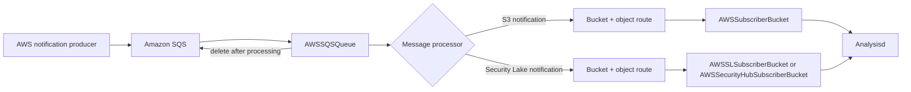
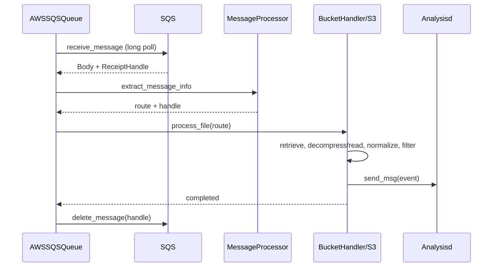

# AWS subscribers

The `aws_subscribers` module consumes AWS notifications from Amazon SQS, locates the referenced objects in Amazon S3, converts their contents into normalized events, and forwards those events to Wazuh Analysisd. It supports ordinary S3 log notifications, AWS Security Hub exports, and AWS Security Lake parquet events.

## Architecture overview

The module is an adapter pipeline. `AWSSQSQueue` controls polling and acknowledgement, a message processor translates provider-specific notification schemas into a common route, and a bucket handler retrieves and transforms the referenced object.

## Sub-modules

- [Queue orchestration](aws_subscribers_queue.md) — `AWSSQSQueue`, AWS client setup, long polling, routing delegation, and post-processing deletion.
- [Message processors](aws_subscribers_message_processor.md) — `AWSQueueMessageProcessor`, `AWSS3MessageProcessor`, and `AWSSSecLakeMessageProcessor`.
- [S3 handlers](aws_subscribers_s3_handlers.md) — `AWSS3LogHandler`, `AWSSubscriberBucket`, `AWSSLSubscriberBucket`, and `AWSSecurityHubSubscriberBucket`.

## End-to-end data flow

## System fit

The module sits below the AWS Wodle entry points and above the shared AWS integration layer. The upstream AWS service configuration selects a queue, processor, and handler combination. The shared `wazuh_integration.WazuhIntegration` provides credentials/role handling, AWS clients, object decompression, discard rules, and Analysisd delivery; those responsibilities are referenced rather than duplicated in the sub-module documents.

The principal invariant is acknowledgement ordering: a queue receipt is deleted only after the selected handler returns from processing. Unsupported or malformed notification payloads are logged by the queue layer and are not interpreted as S3 routes.

## Supported combinations

| Notification | Processor | Handler | Object representation |
|---|---|---|---|
| Standard S3 event | `AWSS3MessageProcessor` | `AWSSubscriberBucket` | JSONL, JSON, CSV, or text |
| Security Hub S3 event | `AWSS3MessageProcessor` | `AWSSecurityHubSubscriberBucket` | JSON event records |
| Security Lake event | `AWSSSecLakeMessageProcessor` | `AWSSLSubscriberBucket` | Parquet |

## Maintenance notes

New notification schemas should normally add a message processor; new object formats should add or extend a bucket handler. Keep the queue's strategy interfaces stable, preserve receipt handles through parsing, and retain the process-then-delete ordering to avoid acknowledging objects before their events have been handed to Analysisd.
