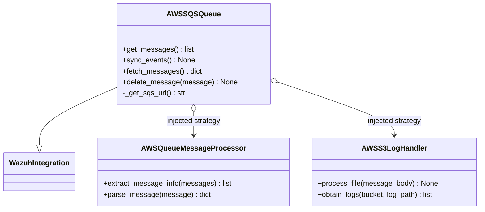

# AWS subscriber queue

This document describes `wodles/aws/subscribers/sqs_queue.py`, which implements the queue-facing half of the AWS subscriber pipeline.

## Responsibility

`AWSSQSQueue` owns the lifecycle of an SQS notification batch:

1. Establish AWS credentials and clients through `wazuh_integration.WazuhIntegration`.
2. Resolve the configured queue name to a queue URL.
3. Long-poll up to ten messages at a time.
4. Delegate notification-specific parsing to an injected message processor.
5. Delegate S3 retrieval and event forwarding to an injected bucket handler.
6. Delete a message only after its routed file has been processed.

The class is deliberately composed with strategy objects. The queue does not know whether a message describes a normal S3 notification or an AWS Security Lake notification, and it does not parse file formats itself.

## Construction and dependencies

The constructor receives `message_processor` and `bucket_handler` classes. It creates instances after resolving the caller account and queue URL. AWS authentication parameters such as role ARN, external ID, profile, role duration, endpoints, and `skip_on_error` are propagated to both the SQS integration and the bucket handler.



## Processing flow

`sync_events()` repeatedly drains the queue. Empty receives terminate the loop. A malformed message lacking a `route` is logged and omitted; the current implementation continues without deleting that message. Handler and AWS failures generally terminate with status `21`, while a missing queue terminates with status `20`.

```mermaid
flowchart TD
    A[sync_events] --> B[get_messages]
    B --> C[ReceiveMessage long poll]
    C --> D[Extract body and receipt handle]
    D --> E[Parse notification]
    E --> F{Messages returned?}
    F -- no --> G[Return]
    F -- yes --> H[For each routed message]
    H --> I[bucket_handler.process_file(route)]
    I --> J{Expected route?}
    J -- no --> K[Log and omit]
    J -- yes --> L[Delete by receipt handle]
    K --> M[Fetch next batch]
    L --> M
    M --> B
```

## Operational details

- `receive_message` uses `WaitTimeSeconds=20`, requests all message and message-attribute fields, and caps a batch at ten messages.
- `_get_sqs_url` supplies the caller account ID to support queues owned by that account.
- `delete_message` uses the receipt handle retained by the processor; deletion is the acknowledgement boundary.
- `get_messages` normalizes an absent `Messages` field to an empty list.

See [aws_subscribers_message_processor.md](aws_subscribers_message_processor.md) for notification parsing and [aws_subscribers_s3_handlers.md](aws_subscribers_s3_handlers.md) for file processing.
