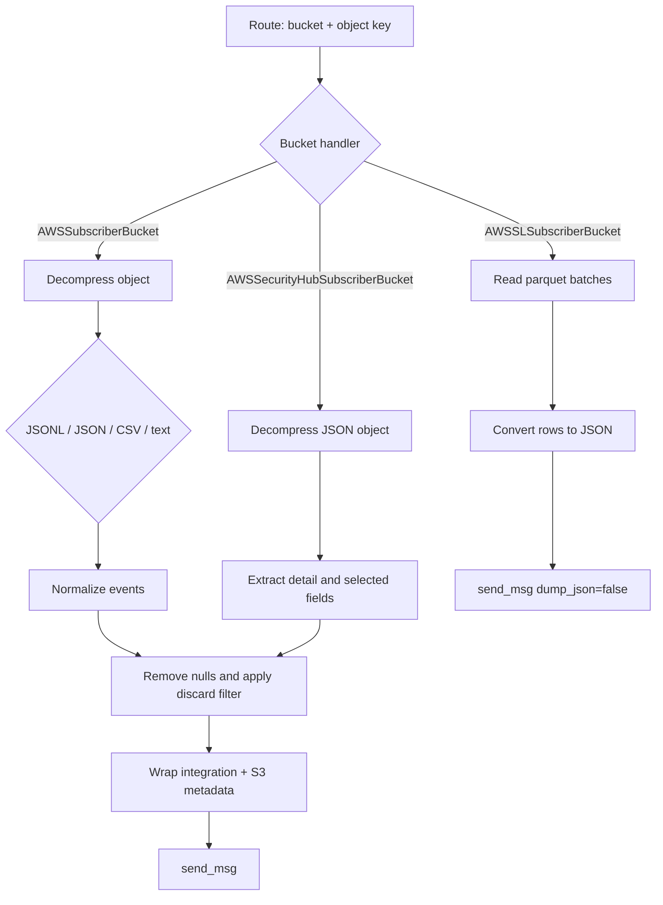

# AWS S3 subscriber handlers

This document describes `wodles/aws/subscribers/s3_log_handler.py`, the file-format and forwarding layer used by `AWSSQSQueue`.

## Shared contract

`AWSS3LogHandler` defines two operations:

- `obtain_logs(bucket, log_path)`: retrieve and convert one object into events.
- `process_file(message_body)`: turn the routed object into Wazuh messages.

`AWSSubscriberBucket` and `AWSSLSubscriberBucket` both initialize the shared `WazuhIntegration` with the S3 service name. The inherited integration supplies AWS access, decompression, discard filtering, and `send_msg` integration with Analysisd.

## `AWSSubscriberBucket`

This is the general S3 log handler. It retrieves objects through `decompress_file` and attempts formats in this order:

1. Files ending in `.jsonl.gz`: one JSON object per line.
2. Other content: consecutive JSON values decoded with `JSONDecoder.raw_decode`.
3. CSV: detected from the first line and parsed with `csv.Sniffer` and `DictReader`.
4. Plain text: one event per line under `full_log`.

JSON events use `detail` when present and otherwise the event itself; non-JSON formats are marked `source="custom"`. `None` values are recursively removed before forwarding. Events are filtered using the inherited discard regex, either against `full_log` or the configured discard field, then wrapped with AWS integration metadata containing the source object and bucket.

## `AWSSLSubscriberBucket`

Despite the historical class name, this handler processes AWS Security Lake parquet objects. It reads the object directly with the S3 client into memory, iterates `pyarrow.parquet.ParquetFile.iter_batches()`, converts rows to JSON strings, and sends each event to Analysisd with `dump_json=False`. Retrieval or parquet failures exit with status `21`.

## `AWSSecurityHubSubscriberBucket`

This subclass handles Security Hub JSON events stored in S3. It extracts each event's `detail` and creates a normalized event with `source="securityhub"` and the EventBridge `detail-type`. Selected Security Hub fields are copied, while `findings` is reduced to its first finding under `finding`. The normalized event is filtered, wrapped with the same AWS/S3 metadata, and sent to Analysisd.

## Error and filtering behavior

- Missing `pyarrow` prevents module startup with exit status `10`.
- JSON, CSV, and text fallbacks are intentionally tolerant for regular S3 logs.
- A CSV `MemoryError` or invalid plain-text read exits with status `9`.
- Security Hub content that is not JSON exits with status `9`.
- Discarded events are skipped and do not reach Analysisd, but the enclosing SQS message is still eligible for deletion once `process_file` returns.
- Event lists and parquet batches are accumulated in memory; object size and batch size therefore affect memory usage.

See [aws_subscribers_queue.md](aws_subscribers_queue.md) for the caller and [aws_subscribers_message_processor.md](aws_subscribers_message_processor.md) for route creation. Related AWS service and bucket abstractions are documented in `aws_services.md` and `aws_buckets_s3.md` when those module documents are present.
