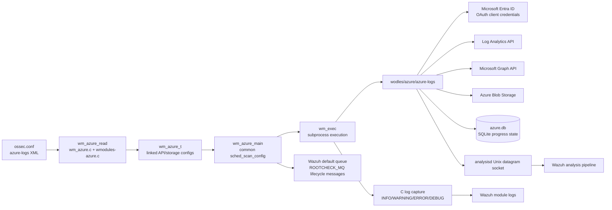
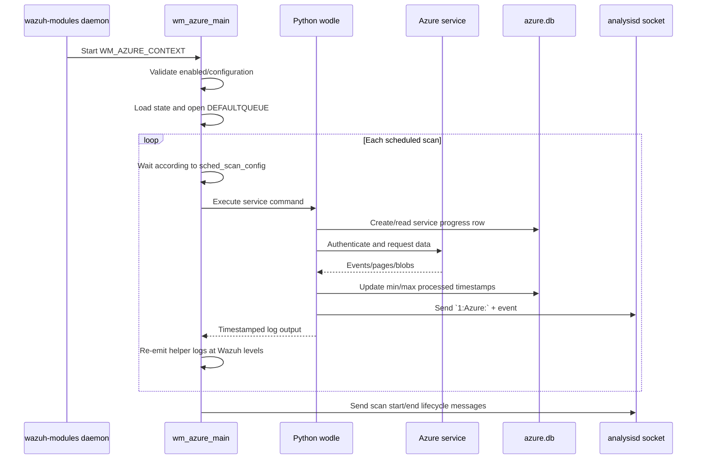
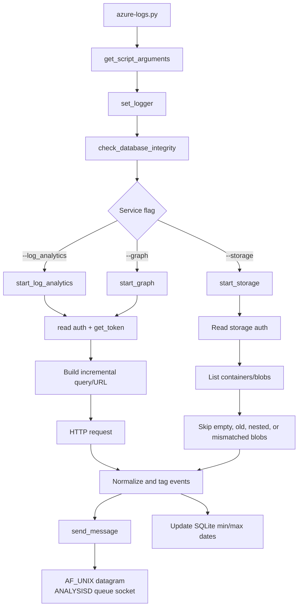

# Azure module

The Azure module (`azure-logs`) is Wazuh’s scheduled cloud-integration module for collecting Microsoft Azure activity data and forwarding it into Wazuh analysis. It supports Microsoft Log Analytics, Microsoft Graph, and Azure Blob Storage. A native C daemon module parses XML configuration, schedules scans, launches the Python `wodles/azure/azure-logs` helper, and forwards helper output and lifecycle messages through Wazuh queues.

The module is part of the native Wazuh modules daemon and follows the common module lifecycle and scheduling conventions described in [Agent & Manager Native Daemons](Agent_&_Manager_Native_Daemons_(C).md). Its generated configuration representation is consumed through the same module-dump mechanisms used by the wider daemon framework.

## Architecture



### Component responsibilities

| Component | Responsibility |
| --- | --- |
| `src/config/wmodules-azure.c` | Allocates module state, parses `<azure-logs>` XML, validates authentication, requests, containers, offsets, timeouts, and scheduling tags. |
| `src/wazuh_modules/wm_azure.h` | Defines `wm_azure_t`, API/request/storage/container structures, constants, and `WM_AZURE_CONTEXT`. |
| `src/wazuh_modules/wm_azure.c` | Implements lifecycle, scheduling, command construction, subprocess execution, output capture, queue connection, JSON dump, and cleanup. |
| `wodles/azure/azure-logs.py` | Dispatches one requested service after argument parsing, logging setup, and database-integrity checks. |
| `wodles/azure/azure_utils.py` | Validates arguments, reads credential files, obtains OAuth tokens, converts offsets, and sends events to analysisd. |
| `wodles/azure/azure_services/analytics.py` | Queries Log Analytics, adds time filters, handles results, and persists progress. |
| `wodles/azure/azure_services/graph.py` | Queries Microsoft Graph, handles pagination, adds time filters, and persists progress. |
| `wodles/azure/azure_services/storage.py` | Lists and downloads blobs, filters already processed blobs, supports text/inline JSON/JSON-file content, and persists progress. |
| `wodles/azure/db/orm.py` | Maintains per-service processed-date state in SQLite and migrates the legacy `last_dates.json` format. |

## Runtime flow



At startup, `wm_azure_setup` validates that the module is enabled and that at least one API or storage block exists. It restores `wm_azure_state_t` using the module state store, opens `DEFAULTQUEUE` for writing, and installs cleanup handlers. The main loop then calculates the next execution time through the shared scheduler. The `run_on_start` flag controls whether the first scan can execute immediately.

Each configured API block and storage block is represented as a linked list. A Log Analytics or Graph block may contain multiple `<request>` nodes; a storage block may contain multiple `<container>` nodes. The native module executes each request/container independently and applies the request/container timeout, falling back to the module timeout and ultimately the native default of 3600 seconds when configured by the surrounding module framework.

## Configuration model

The parser accepts the following top-level tags:

- `disabled`: `yes` or `no`; defaults to enabled.
- `run_on_start`: `yes` or `no`; defaults to enabled.
- `interval`, `time`, `day`, and `wday`: common scheduling tags handled by `sched_scan_read`.
- `timeout`: positive native execution timeout.
- `log_analytics`, `graph`, and `storage`: one or more collection blocks.

```xml
<wodle name="azure-logs">
  <disabled>no</disabled>
  <interval>5m</interval>
  <run_on_start>no</run_on_start>

  <log_analytics>
    <auth_path>/var/ossec/wodles/azure/credentials.txt</auth_path>
    <tenantdomain>example.onmicrosoft.com</tenantdomain>
    <request>
      <tag>azure-activity</tag>
      <query>AzureActivity | where SubscriptionId == "..."</query>
      <workspace>...</workspace>
      <time_offset>36h</time_offset>
      <timeout>3600</timeout>
    </request>
  </log_analytics>

  <graph>
    <auth_path>/var/ossec/wodles/azure/graph-credentials.txt</auth_path>
    <tenantdomain>example.onmicrosoft.com</tenantdomain>
    <request>
      <tag>azure-signins</tag>
      <query>auditLogs/signIns</query>
      <time_offset>1d</time_offset>
    </request>
  </graph>

  <storage>
    <auth_path>/var/ossec/wodles/azure/storage-credentials.txt</auth_path>
    <tag>azure-storage</tag>
    <container name="logs">
      <blobs>*.json</blobs>
      <content_type>json_file</content_type>
      <time_offset>1d</time_offset>
      <path>activity</path>
    </container>
  </storage>
</wodle>
```

### Authentication

The preferred authentication form is `auth_path`. The helper reads a two-field `field = value` file:

- Log Analytics and Graph: `application_id`, `application_key`.
- Storage: `account_name`, `account_key`.

Inline credentials (`application_id`/`application_key` for APIs and `account_name`/`account_key` for Storage) are still parsed but marked deprecated in the source and helper. API blocks require a tenant domain and at least one request. Log Analytics requests additionally require a workspace. Storage blocks require at least one named container; if the storage tag is omitted, a generated tag is assigned.

Offsets accept positive numeric values with `m`, `h`, or `d` suffixes in native configuration. The Python helper converts them to UTC datetimes. The helper’s service-specific query builders use the saved minimum and maximum processed timestamps to avoid replaying data unless `--reparse` is requested.

### Scheduling behavior

Scheduling is delegated to the common scheduler. The Azure tests demonstrate these supported forms:

| Configuration | Stored behavior |
| --- | --- |
| `<interval>3h</interval>` | `interval = 10,800` seconds. |
| `<time>00:10</time>` | Daily time-based scheduling using the module default interval. |
| `<day>4</day>` with a time | Monthly scheduling; interval is normalized to `1M` when needed. |
| `<wday>Friday</wday>` with a time | Weekly scheduling; interval is normalized to `1w` when needed and Friday is stored as weekday `5`. |

Invalid or unknown tags fail parsing. The `test_fake_tag` test verifies that the parser rejects an unsupported `<fake_tag>` and emits a “No such tag” error.

## Service data flow



### Log Analytics

`start_log_analytics` authenticates against Microsoft Entra ID using the Log Analytics scope, builds a workspace query, and requests events from `https://api.loganalytics.io`. The query is extended with ascending `TimeGenerated` ordering and an incremental time predicate. Results are serialized with Azure tags and sent to analysisd.

### Microsoft Graph

`start_graph` obtains a Graph token, chooses `createdDateTime` for sign-in queries and `activityDateTime` for other activity queries, then builds a filtered URL under `https://graph.microsoft.com/v1.0/`. `get_graph_events` follows `@odata.nextLink` pagination and emits each result with `azure_tag = azure-ad-graph` plus the configured request tag when present.

### Azure Blob Storage

`start_storage` creates a `BlobServiceClient`, validates the requested container or enumerates all containers for `*`, and scans blobs by optional prefix and extension. Empty, nested, unmatched, or previously processed blobs are skipped. Content can be interpreted as:

- `json_file`: parses a `records` array and sends each record as JSON.
- `json_inline`: adds Azure fields to an existing JSON object.
- `text`: prefixes each non-empty line with Azure storage tags.

## State and delivery

The Python service stores progress in `wodles/azure/db/azure.db`. `Graph`, `LogAnalytics`, and `Storage` tables share the `AzureTable` fields `md5`, `query`, `min_processed_date`, and `max_processed_date`. The MD5 key is derived from the query for API services and the storage account name for Storage. On first use, a row is created using the configured offset; after successful processing, the row’s date range is updated. `check_database_integrity` creates the database and migrates an older `last_dates.json` file when present.

Events are sent through an AF_UNIX datagram to the analysisd queue path derived from the Wazuh installation. Every payload receives the `1:Azure:` header. Oversized payloads produce a warning; connection failures distinguish a stopped Wazuh instance from a message that exceeds the socket limit.

The native module also writes scan lifecycle messages to the default module queue:

```text
Starting Azure-logs scan.
Ending Azure-logs scan.
```

The C wrapper captures timestamped Python log lines matching the Azure log format and maps `DEBUG`, `INFO`, `WARNING`, and `ERROR` to the corresponding Wazuh logging functions. Lines that do not match the expression are ignored by the native log bridge, although they may still be part of the helper’s captured subprocess output.

## Failure and cleanup behavior

- Disabled modules exit during setup.
- A module with neither API nor Storage configuration exits with a warning.
- Invalid authentication, missing tenant/request/workspace, invalid offsets, invalid content types, and invalid XML tags reject the relevant configuration block.
- A request timeout is logged and processing continues to the next request/container.
- Other subprocess failures terminate the worker thread through `pthread_exit`.
- Failure to open the Wazuh queue terminates module startup.
- `wm_azure_destroy` frees linked API, request, storage, and container structures and releases the compiled PCRE2 expression.
- `wm_azure_cleanup` closes the queue and logs module completion.

## Testing

`src/unit_tests/wazuh_modules/azure/test_wm_azure.c` uses CMocka and separates tests into two groups:

1. Startup/execution tests initialize a complete Log Analytics configuration and exercise the scheduled execution loop, subprocess output parsing, queue writes, and repeated scans.
2. Configuration tests validate unknown-tag rejection, interval scheduling, daily scheduling, month-day scheduling, and weekday scheduling.

The tests mock subprocess execution, queue writes, logging, time-loop behavior, and PCRE2 matching. They therefore validate orchestration and configuration semantics without contacting Azure. Service-specific Python behavior is covered under `wodles/azure/tests`, including utility, ORM, analytics, Graph, and Storage tests.

## Related modules

- [Agent & Manager Native Daemons](Agent_&_Manager_Native_Daemons_(C).md) — common native module lifecycle and daemon integration.
- [Queue](Queue.md) — queue concepts used by native lifecycle messages and module communication.
- [Remote Config](Remote_Config.md) — related XML configuration parsing conventions.
- [Wazuh modules core](wazuh_modules_core.md) — shared module registration, lifecycle, and execution context.
