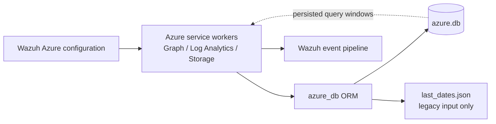
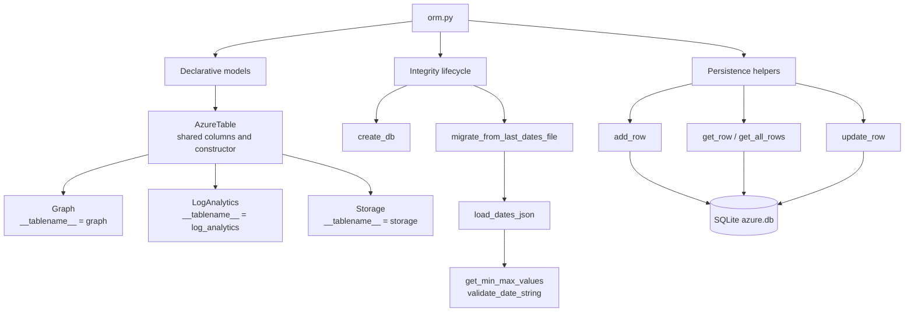
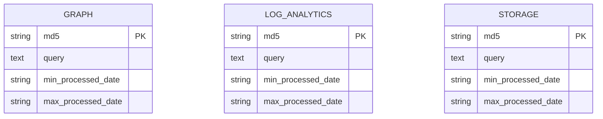
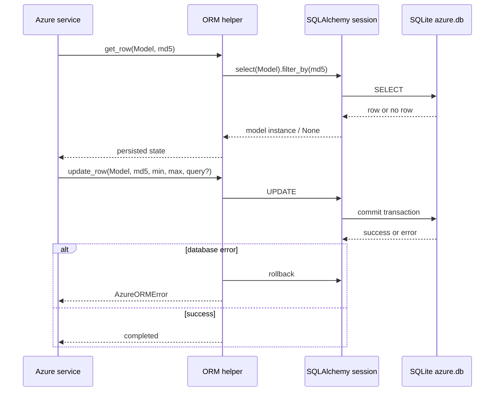
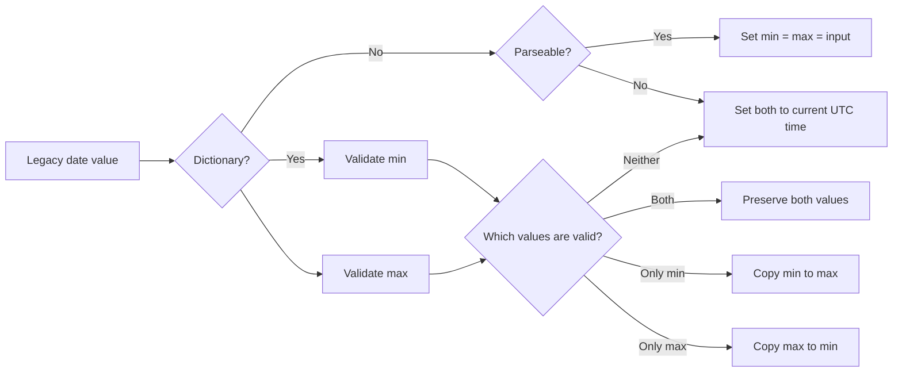

# Azure database module

The `azure_db` module provides the local persistence layer for Wazuh's Azure cloud integrations. It stores the query identity and processing window for Log Analytics, Microsoft Graph, and Azure Storage collectors in a SQLite database, and migrates state from the legacy `last_dates.json` format when required.

Provider authentication, API requests, scheduling, and event forwarding are outside this module. See [Azure integration](azure.md), [Azure services](azure_services.md), and [Azure utilities](azure_utils.md) for those layers.

## Position in the system

The module is used by the Python Azure wodles to remember which query/configuration has been processed and the minimum and maximum timestamps already consumed. The native Azure module and service entry points remain responsible for daemon lifecycle and execution scheduling; this module is the durable state store used during those executions.



## Architecture

`wodles/azure/db/orm.py` combines three concerns in one small module:

1. SQLAlchemy model declarations for the three Azure service tables.
2. CRUD helpers backed by a module-global SQLite engine and session.
3. Startup integrity checks, legacy migration, and timestamp normalization.



## Database layout

The database file is fixed at `wodles/azure/db/azure.db`, derived from the directory containing `orm.py`. The engine is created with `sqlite:///...`, and `Base.metadata.create_all(engine)` creates missing tables without dropping existing data.

Each service table has the same schema:

| Column | SQLAlchemy type | Constraints | Meaning |
| --- | --- | --- | --- |
| `md5` | `Text` | Primary key; unique constraint | Stable identity of the service query/configuration. |
| `query` | `Text` | Not nullable | Query text or serialized query definition. Migration fills this with an empty string because the old file did not retain it. |
| `min_processed_date` | `String(28)` | Not nullable | Lower bound of the processed time window. |
| `max_processed_date` | `String(28)` | Not nullable | Upper bound of the processed time window. |

`AzureTable` is a shared mapped-column mixin-like base. It is not assigned a `__tablename__`; the concrete mapped classes are `Graph`, `LogAnalytics`, and `Storage`. Each concrete table repeats the `md5` uniqueness rule through `md5_restriction`.



The tables are intentionally separate even though their columns are identical. A caller selects the service model explicitly, which prevents state for one Azure API from being mixed with another.

## Components and API

### Model components

`AzureTable` defines the common columns and initializes a row from `md5`, `query`, `min_processed_date`, and `max_processed_date`.

- `Graph`: rows for Microsoft Graph collection.
- `LogAnalytics`: rows for Azure Log Analytics collection.
- `Storage`: rows for Azure Storage collection.

The models are consumed by the service modules rather than by the native daemon directly. See [Azure services](azure_services.md) for service execution flow.

### Persistence helpers

`add_row(row)` inserts and commits a model instance. On `IntegrityError` or `OperationalError`, it rolls back the global session and raises `AzureORMError`.

`get_row(table, md5)` selects the first row matching the `md5` key. A missing row returns `None`; database and attribute failures become `AzureORMError`.

`get_all_rows(table)` returns every row for a model. It is primarily intended for testing and inspection, not for the normal incremental collection path.

`update_row(table, md5, min_date, max_date, query=None)` updates the processing window. The query is updated only when a truthy `query` is supplied, so an omitted or empty query preserves the stored query. Failed writes roll back and raise `AzureORMError`.



`AzureORMError` is the module-specific abstraction for database-operation failures. Callers can handle one exception type instead of depending on SQLAlchemy's exception hierarchy.

## Integrity and migration lifecycle

`check_database_integrity()` is the startup entry point. It:

1. Logs the beginning of the check.
2. Calls `create_db()` to create any missing tables.
3. Detects a non-empty `last_dates.json`.
4. Loads and normalizes the legacy data.
5. Inserts migrated rows into the matching service table.
6. Attempts to remove the legacy file.
7. Returns `True` when the check and migration complete, or `False` if migration fails.

Failure to remove the old file is only a warning after a successful migration. A later startup can therefore retry cleanup without making the integrity check fail.

```mermaid
flowchart TD
    Start[check_database_integrity] --> Create[create_db]
    Create --> Legacy{last_dates.json exists\nand non-empty?}
    Legacy -- No --> Success[Log completion\nreturn True]
    Legacy -- Yes --> Load[load_dates_json]
    Load --> Valid[Normalize each service/md5 entry]
    Valid --> Insert[Create Graph / LogAnalytics / Storage rows]
    Insert --> Remove[Attempt remove(last_dates_path)]
    Remove --> Warn{Removal failed?}
    Warn -- Yes --> Warning[Log warning]
    Warn -- No --> Success
    Warning --> Success
    Load -. exception .-> Failure[Log error\nreturn False]
    Insert -. database exception .-> Failure
```

### Legacy file format

The legacy file is `wodles/azure/db/last_dates.json`. If it does not exist, `load_dates_json()` returns:

```json
{
  "log_analytics": {},
  "graph": {},
  "storage": {}
}
```

For each service and `md5`, the current expected value is an object containing `min` and `max` fields. Older releases may contain one date string instead. `get_min_max_values()` converts that form into matching `min` and `max` values.

During migration, `migrate_from_last_dates_file()` creates a row for each recognized service and supplies `query=''`, because the legacy state did not preserve the query. Unknown top-level services are ignored by the migration loop.

## Date validation and repair

`validate_date_string(value, fuzzy=True)` uses `dateutil.parser.parse` and returns the original value when parsing succeeds; otherwise it returns `None`. Fuzzy parsing is enabled by default, allowing date strings containing additional parseable text.

`get_min_max_values(content)` supports two input shapes:

| Input | Result |
| --- | --- |
| A parseable string | Both `min` and `max` receive that string. |
| An invalid string | Both fields receive the current UTC timestamp. |
| A dictionary with valid `min` and `max` | The original dictionary is retained. |
| Valid `min`, invalid `max` | Both fields become the valid `min`. |
| Invalid `min`, valid `max` | Both fields become the valid `max`. |
| Both fields invalid | Both fields receive the current UTC timestamp. |

`get_default_min_max_values()` generates a UTC timestamp in `%Y-%m-%dT%H:%M:%S.%fZ` format. It is used as a safe replacement when no usable boundary exists.



## Operational characteristics and maintenance notes

- The database and legacy paths are module-relative, so execution from another working directory does not change where state is stored.
- A module-global SQLAlchemy session is shared by all callers in the process. The current implementation assumes the single-process usage pattern of the Azure wodle and does not expose session creation or pooling controls.
- Writes explicitly commit and roll back on supported SQLAlchemy failures. Callers should treat `AzureORMError` as a persistence failure and avoid assuming that a failed update was partially applied.
- `create_db()` is additive: it creates missing schema objects but does not perform schema-version migrations beyond the legacy JSON migration.
- Date strings are stored as strings rather than database-native datetime values. Ordering semantics therefore depend on the timestamp formats supplied by callers; the module validates parseability but does not canonicalize every accepted date string.
- `get_all_rows()` is intentionally available for tests and diagnostics and should not replace keyed reads in a high-volume collection loop.

## Related modules

- [Azure integration](azure.md): top-level Azure wodle and provider integration context.
- [Azure services](azure_services.md): Graph, Log Analytics, and Storage execution entry points that use persisted state.
- [Azure utilities](azure_utils.md): command-line argument validation and shared Azure utility behavior.
- [Wazuh modules Azure integration](wazuh_modules_core_cloud_integrations_azure.md): native daemon-side Azure module boundary.

