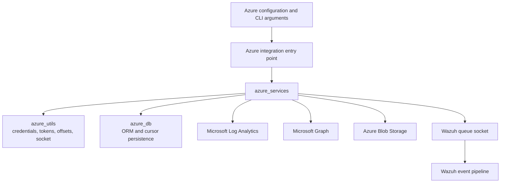
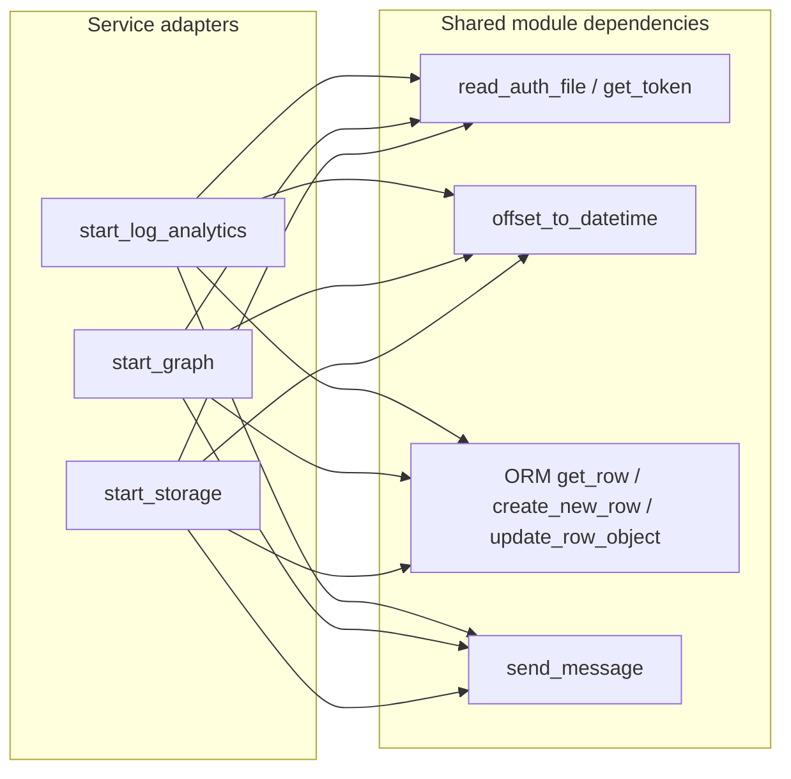
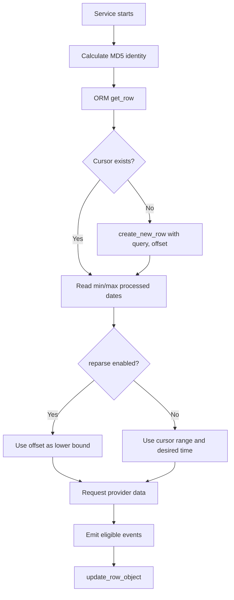
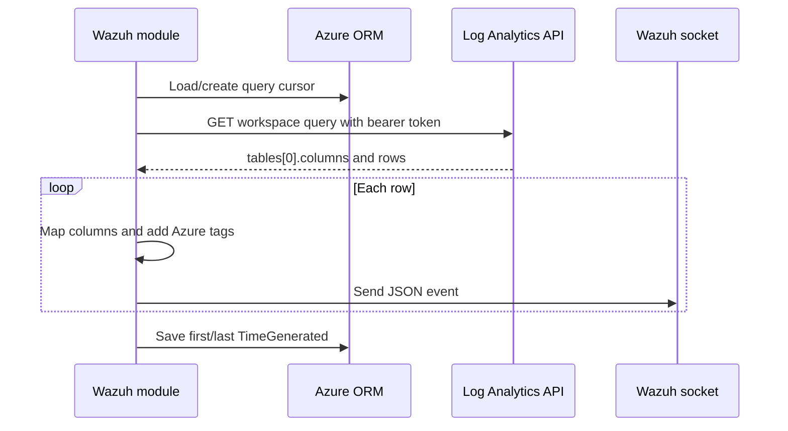
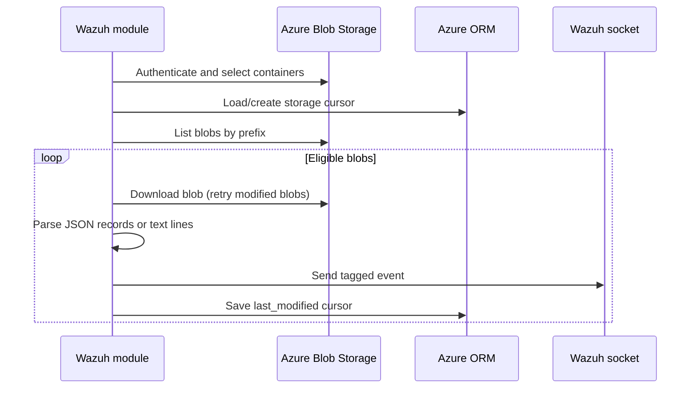
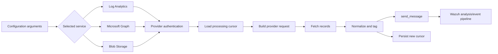

# Azure services

The `azure_services` module contains the three Wazuh Azure cloud-ingestion adapters: Microsoft Log Analytics, Microsoft Graph, and Azure Blob Storage. Each adapter authenticates against its provider, retrieves only records newer than the locally stored processing position (unless reparsing is requested), decorates the records with an Azure-specific tag, and forwards them to Wazuh through the shared message socket.

The module is invoked by the Azure integration entry point and depends on the shared argument, authentication, socket, and offset helpers documented in [azure_utils.md](azure_utils.md), and on the persistence layer documented in [azure_db.md](azure_db.md).

## Module position



`azure_services` is an integration boundary rather than a general Azure SDK abstraction. Provider-specific request construction and response normalization live in the service files; cross-service concerns are delegated to `azure_utils` and `db`.

## Architecture



### Components

| File | Entry point | Provider | Main responsibility |
|---|---|---|---|
| `wodles/azure/azure_services/analytics.py` | `start_log_analytics` | Log Analytics REST API | Build a Kusto query with a time-window filter, read tabular results, and emit one event per row. |
| `wodles/azure/azure_services/graph.py` | `start_graph` | Microsoft Graph REST API | Build an OData-filtered endpoint URL, process `value` records, and follow `@odata.nextLink` pagination. |
| `wodles/azure/azure_services/storage.py` | `start_storage` | Azure Blob Storage | Enumerate containers and blobs, download eligible blobs, parse supported content formats, and emit events. |

The service implementations intentionally share a lifecycle: authenticate → load cursor → calculate starting time → query provider → normalize and send events → advance cursor.

## Shared authentication and state model

### Authentication

Log Analytics and Microsoft Graph use an application ID/key pair and request a bearer token using `get_token`, with scopes derived from the provider URL. Credentials are preferred from an authentication file. The legacy ID/key command-line options remain supported but generate a deprecation warning. Tenant domain is required for these two services.

Storage uses an account name/key pair to construct `BlobServiceClient`. Credentials are likewise preferred from an authentication file, while legacy inline options are accepted with a deprecation warning.

Missing credentials are treated as configuration errors and terminate the process with exit status `1`. Provider authentication failures are logged and also terminate startup for Storage; REST errors are logged and generally propagated through `raise_for_status()`.

### Persistent processing cursors

Each query or account is assigned an MD5-based identity and persisted through the Azure ORM. A new row is initialized when no cursor exists. The row supplies `min_processed_date` and `max_processed_date`, which prevent already handled records from being emitted again.



The REST adapters persist provider event timestamps. Storage persists the blob `last_modified` timestamp. ORM failures are fatal because continuing without a reliable cursor could create duplicate or missed ingestion.

## Log Analytics adapter

### `start_log_analytics(args)`

The entry point authenticates the application, hashes `args.la_query`, and creates a request to:

```text
https://api.loganalytics.io/v1/workspaces/{workspace}/query
```

The request is sent as an HTTP GET with the generated query in `params` and a bearer token in the `Authorization` header. The configured query is extended with `order by TimeGenerated asc` and a time filter.

### Query-window construction

`build_log_analytics_query` compares the requested time with the persisted minimum and maximum event times:

- `reparse=True`: request `TimeGenerated >= desired time` regardless of the cursor.
- Desired time before the persisted minimum: request the earlier interval and records newer than the persisted maximum.
- Desired time after the persisted maximum: request records from the desired time onward.
- Otherwise: request records newer than the persisted maximum.

The result is returned as `{'query': query}` for the REST call.

### Response processing

`get_log_analytics_events` expects the first result table to contain `columns` and `rows`. The `TimeGenerated` column is located by `get_time_position`; without it, events are not emitted and the cursor is not advanced. `iter_log_analytics_events` maps each row positionally to the column names, adds `azure_tag=azure-log-analytics`, optionally adds `log_analytics_tag`, serializes the event as JSON, and calls `send_message`.

When rows are present, the cursor is updated from the first and last row's `TimeGenerated` values. Empty results are informational and leave the cursor unchanged.



## Microsoft Graph adapter

### `start_graph(args)`

The entry point authenticates with the Graph scope and builds an endpoint under:

```text
https://graph.microsoft.com/v1.0/{query}
```

`build_graph_url` chooses the timestamp field based on the query: `createdDateTime` for sign-in queries and `activityDateTime` for other queries. It appends an encoded OData `$filter` using the same cursor and reparse policy as Log Analytics.

### Event handling and pagination

`get_graph_events` expects a JSON response with a `value` array. Each value is timestamped and persisted through `update_row_object`, then tagged with `azure_tag=azure-ad-graph`, optionally tagged with `azure_aad_tag`, serialized, and sent to the Wazuh socket. In the current implementation, the cursor update occurs before `send_message`; changes to delivery reliability should consider moving that update after successful emission.

Before serialization, malformed or non-object nested values under `initiatedBy.app`, `initiatedBy.user`, and `status` are removed when they are `None` or strings. This keeps those fields from producing incompatible event structures.

If the response contains `@odata.nextLink`, the function recursively requests the next page with the same headers, cursor identity, query, and tag. A `400` response is logged as an invalid URL or unavailable datetime/data condition; other non-success responses are raised after logging.

```mermaid
flowchart TD
    Build[build_graph_url] --> Request[GET Graph URL]
    Request --> Status{HTTP status}
    Status -- 200 --> Values[Read value array]
    Values --> Normalize[Clean nested fields and add tags]
    Normalize --> Emit[JSON event to Wazuh socket]
    Emit --> Cursor[Update Graph cursor]
    Values --> Next{@odata.nextLink?}
    Next -- Yes --> Request
    Next -- No --> Done[Complete]
    Status -- 400 --> Bad[Log bad request]
    Status -- Other --> Error[Raise HTTP error]
```

## Azure Blob Storage adapter

### `start_storage(args)`

The entry point creates a `BlobServiceClient` for the configured account. It supports either one named container or all containers when `container == '*'`. A named container is checked with `exists()`; when all containers are requested, names are collected with `list_containers()`.

For each selected container, the adapter loads a Storage cursor, computes the desired datetime from the configured offset, and invokes `get_blobs` with the configured prefix, extension, parsing mode, tag, and reparse flag.

### Blob selection

`get_blobs` lists blobs using `name_starts_with=prefix` and skips:

- empty blobs;
- nested names when a prefix is set and the blob path has more than two components;
- names that do not contain the configured extension;
- blobs considered already processed, unless `reparse=True`.

Eligible blobs are downloaded by `download_blob`, which retries `ResourceModifiedError` up to three attempts. Other Azure download errors are surfaced to the caller and logged by `get_blobs`.

### Content modes

The adapter supports three output interpretations:

| Mode | Behavior |
|---|---|
| JSON file | Reads the blob as JSON, extracts `records`, adds `azure_tag=azure-storage` and optional `azure_storage_tag`, and emits each record as JSON. |
| Inline JSON | Treats each non-empty line as an existing JSON object fragment and prepends the Azure tag fields. |
| Plain text | Emits each non-empty line with `azure_tag: azure-storage.` and optional storage tag text. |

After successful processing, the Storage cursor is advanced to the blob's `last_modified` timestamp. The cursor identity is derived from the account name, while the update query identifies the current container; maintainers should preserve this behavior when changing cursor semantics.



## End-to-end processing flow



## Error and operational behavior

- Authentication configuration errors call `sys.exit(1)`.
- ORM failures call `sys.exit(1)` to avoid untracked ingestion.
- REST requests use a ten-second timeout.
- Log Analytics and Graph catch `HTTPError` at their entry points, log it, and finish the service execution.
- Storage handles container authentication/listing failures during startup and logs per-blob parsing/download failures while continuing with other blobs where possible.
- Every emitted event is written through `send_message`; the service module does not directly implement queue management or downstream analysis.
- Logging is used extensively for startup, request construction, skips, pagination, event emission, cursor movement, and failures. Sensitive authentication headers may appear in debug logging; deployment logging policy should be considered when enabling debug output.

## Maintenance guidance

When adding another Azure service, reuse the established adapter lifecycle and place shared changes in [azure_utils.md](azure_utils.md) or [azure_db.md](azure_db.md) rather than duplicating token, socket, or cursor logic. Provider-specific timestamp selection, pagination, response shape handling, and content normalization should remain local to the new service adapter.

The most important invariants are:

1. Events must receive a stable Azure tag before being sent.
2. Cursor updates should represent successfully processed provider data. The Storage and Log Analytics paths update after content processing; the current Graph path updates per record before socket delivery, which is an important reliability consideration.
3. `reparse` must bypass the normal already-processed boundary without corrupting the persisted cursor.
4. Provider pagination must retain the original cursor identity, query, and tag parameters.

## Source references

- [analytics.py](wodles/azure/azure_services/analytics.py) — Log Analytics adapter.
- [graph.py](wodles/azure/azure_services/graph.py) — Microsoft Graph adapter.
- [storage.py](wodles/azure/azure_services/storage.py) — Blob Storage adapter.
- [azure_utils.md](azure_utils.md) — shared Azure authentication, arguments, offsets, and socket messaging.
- [azure_db.md](azure_db.md) — Azure ORM and processing-cursor persistence.
