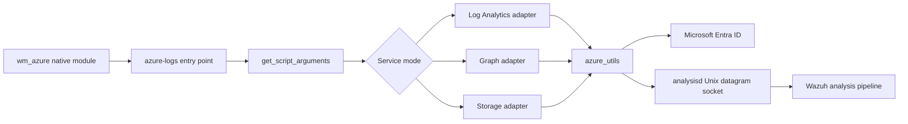
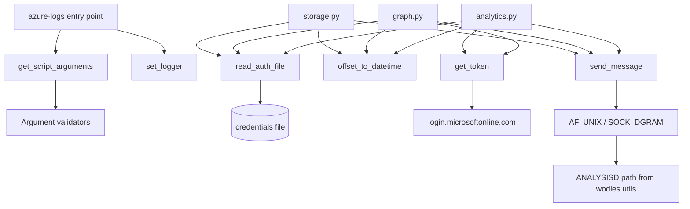
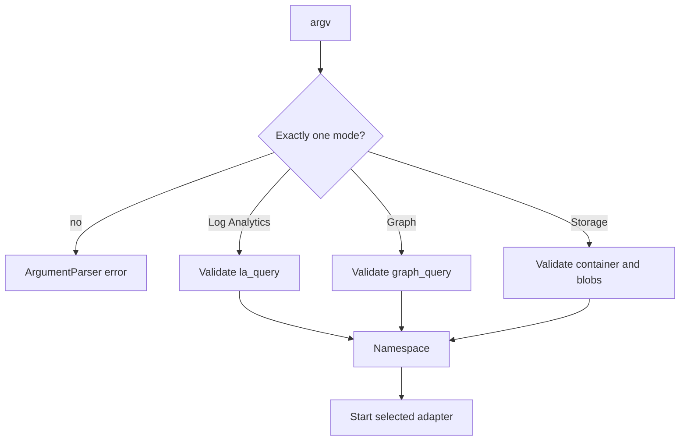
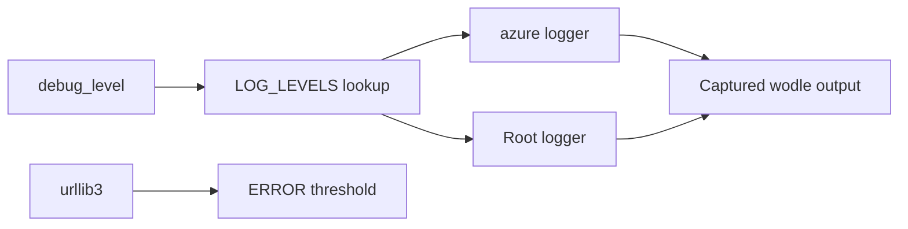
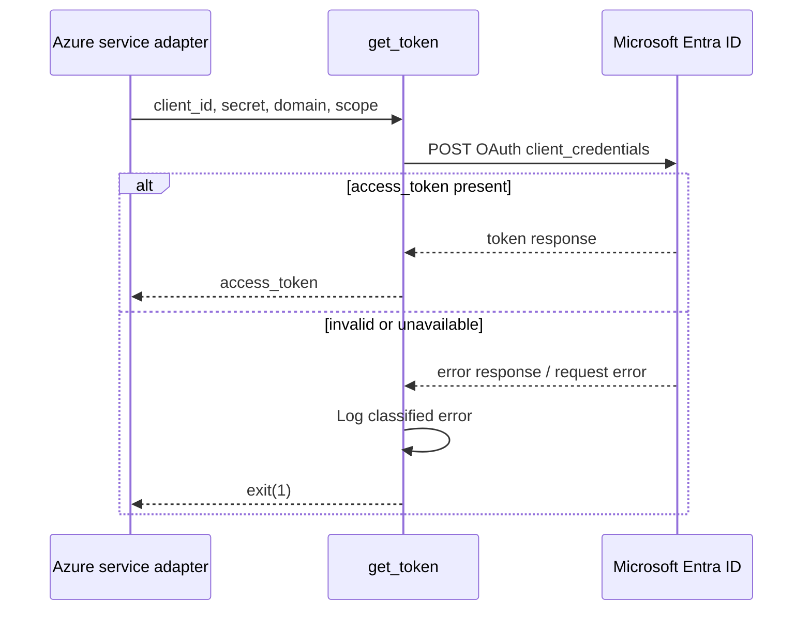
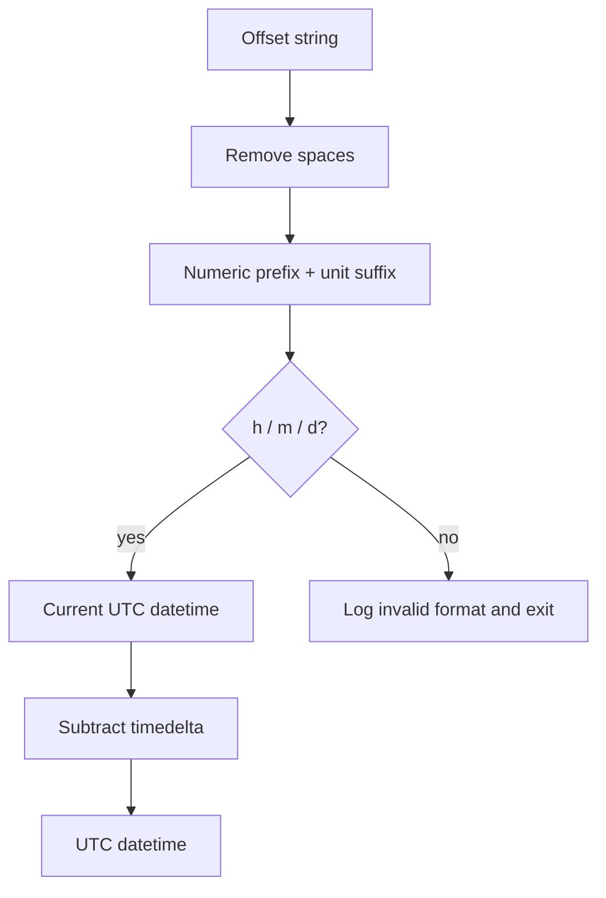
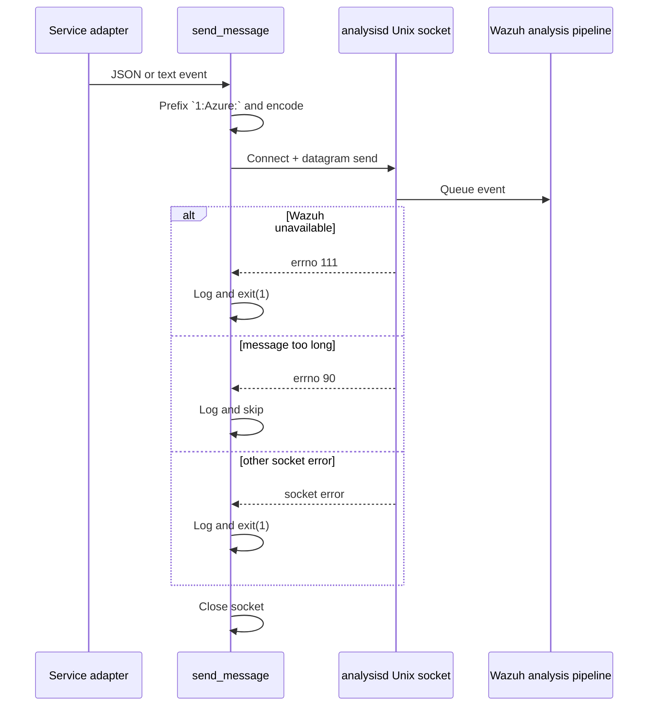

# Azure utility module

`wodles/azure/azure_utils.py` is the shared runtime utility layer for Wazuh’s Python Azure wodle. It normalizes command-line input, configures logging, loads legacy or file-based credentials, obtains Microsoft Entra ID tokens, converts relative time offsets, and delivers normalized events to Wazuh’s `analysisd` Unix datagram socket.

The module is not an Azure service adapter. Log Analytics, Microsoft Graph, and Blob Storage request/response processing is implemented in [Azure services](azure_services.md). The native scheduling, subprocess lifecycle, and XML configuration boundary are documented in [Azure module](azure.md).

## Position in the system



The helper is used in one-shot subprocess executions. Native code selects exactly one service mode per invocation; the Python entry point parses the options and delegates to the corresponding adapter. Shared functions then provide authentication, time-window, logging, and event-delivery behavior.

## Components

| Component | Responsibility | Main consumers |
| --- | --- | --- |
| `set_logger` | Configure root, Azure SDK, and `urllib3` logging levels. | Azure entry point and service adapters |
| `get_script_arguments` | Define and parse service selectors plus Log Analytics, Graph, Storage, and general options. | Azure entry point |
| `arg_valid_container_name` | Remove surrounding double quotes from a container argument. | Argument parser |
| `arg_valid_blob_extension` | Remove double quotes and wildcard characters from a blob extension argument. | Argument parser |
| `arg_valid_graph_query` | Remove shell-style single-quote wrapping and unescape `\$`. | Graph argument parser |
| `arg_valid_la_query` | Unescape `\!` in a Log Analytics query. | Log Analytics argument parser |
| `read_auth_file` | Read the two expected `field = value` credentials from disk. | API and Storage adapters |
| `get_token` | Request a client-credentials OAuth token and classify common failures. | Log Analytics and Graph adapters |
| `offset_to_datetime` | Convert `Nh`, `Nm`, or `Nd` into a UTC lower-bound datetime. | Azure service adapters |
| `send_message` | Prefix an event with `1:Azure:` and send it to `analysisd`. | All service adapters |

## Architecture and dependencies



Direct imports establish the low-level boundary: `requests.post` is used for token acquisition, `socket.socket` is used for event delivery, and `ANALYSISD`/`MAX_EVENT_SIZE` come from the shared wodle utilities. The module deliberately does not own persistence; cursor management is provided by [Azure database ORM](azure_db.md).

## Command-line contract

### Service selection

`get_script_arguments` requires exactly one mutually exclusive selector:

| Selector | Adapter | Service-specific option families |
| --- | --- | --- |
| `--log_analytics` | Log Analytics | `--la_*`, `--workspace`, `--la_tag`, `--la_time_offset` |
| `--graph` | Microsoft Graph | `--graph_*`, `--graph_tag`, `--graph_time_offset` |
| `--storage` | Blob Storage | `--account_*`, `--storage_auth_path`, `--container`, `--blobs`, `--json_file`, `--json_inline`, `--prefix`, `--storage_*` |

General options are `--reparse` and `-d/--debug`. Authentication ID/key options remain accepted for compatibility, but their help text marks them as deprecated since release 4.4 and points to the [Azure credentials prerequisites](https://documentation.wazuh.com/current/azure/activity-services/prerequisites/credentials.html).



### Input normalization

The validator functions are intentionally small and parser-oriented; they do not validate that a resource exists or that a query is semantically valid.

| Function | Transformation | Example |
| --- | --- | --- |
| `arg_valid_container_name` | Removes all `"` characters. | `"logs"` → `logs` |
| `arg_valid_blob_extension` | Removes all `"` and `*` characters. | `"*.json"` → `.json` |
| `arg_valid_graph_query` | Removes one leading/trailing `'`, then replaces `\$` with `$`. | `'auditLogs/\$count'` → `auditLogs/$count` |
| `arg_valid_la_query` | Replaces `\!` with `!`. | `A\!B` → `A!B` |

Empty values are preserved as `None` or empty strings where argparse supplies them. Required-resource validation belongs to the service adapters and native configuration parser; see [Azure services](azure_services.md) and [Azure module](azure.md).

## Logging

`set_logger(debug_level)` configures Python logging with:

```text
%(asctime)s azure: %(levelname)s: %(message)s
date format: %Y/%m/%d %H:%M:%S
```

The numeric mapping is warning (`0`), info (`1`), and debug (`2`). Unknown values use `INFO` for the root logger. The `azure` logger uses the requested level, defaulting to warning for unknown values, while `urllib3` is forced to error to suppress request-library noise.



The native module consumes the formatted subprocess output and maps recognized Azure log levels into Wazuh logging; that bridge is described in [Azure module](azure.md).

## Authentication helpers

### `read_auth_file(auth_path, fields)`

The file is expected to contain two `field = value` records. Whitespace and line endings are removed around the parsed key/value text. Both requested field names must be present. Invalid line structure, missing fields, and filesystem errors are logged and terminate the subprocess with exit status `1`.

Typical field pairs are:

- API services: application ID and application key.
- Storage: account name and account key.

The helper returns the values in the same order as the supplied `fields` tuple. It does not persist credentials or expose them in normal log messages.

### `get_token(client_id, secret, domain, scope)`

The function sends a ten-second-timeout POST to:

```text
https://login.microsoftonline.com/{domain}/oauth2/v2.0/token
```

with `client_credentials`, the client ID/secret, and the requested scope. On success it returns `access_token`. Common OAuth errors are translated into actionable messages for invalid application ID, invalid key, and missing tenant domain. Malformed responses, request failures, and unknown authentication errors are logged before exiting with status `1`.



## Time offsets

`offset_to_datetime(offset)` removes spaces, interprets the final character as a unit, and subtracts the numeric prefix from the current UTC time. Supported units are hours (`h`), minutes (`m`), and days (`d`). The returned datetime is timezone-aware and uses UTC.



Non-numeric prefixes raise a conversion error before the explicit unit check. Unsupported units log `Invalid offset format. Use "h", "m" or "d" time unit.` and terminate. Service-specific cursor semantics and query-window construction are documented in [Azure services](azure_services.md).

## Event delivery

`send_message(message)` creates an `AF_UNIX`, `SOCK_DGRAM` socket and sends:

```text
1:Azure:<message>
```

The destination path is `ANALYSISD`, imported from `wodles/utils.py`. The encoded payload uses replacement error handling. Payloads larger than `MAX_EVENT_SIZE` generate a warning before sending; the operating-system message-size error is handled separately and the event is skipped.



The service adapters decide how records are serialized and tagged; this helper only supplies the transport header and socket delivery. See the detailed data flows in [Azure services](azure_services.md).

## Lifecycle and failure behavior

1. The native daemon launches the Python helper for one service mode.
2. The entry point parses arguments and configures logging.
3. The selected adapter reads credentials, obtains a token or creates a Storage client, loads progress state, and queries Azure.
4. The adapter normalizes records and invokes `send_message` for each event.
5. The subprocess exits after the selected scan; the native daemon captures logs and schedules the next scan.

Fatal helper errors generally call `sys.exit(1)`: malformed credentials, missing authentication fields, OAuth failures, unavailable Wazuh socket, and unexpected socket failures. Oversized event payloads are warned about, while the specific “message too long” socket error is logged and skipped. Socket cleanup is guaranteed by `send_message`’s `finally` block.

## Maintenance guidance

- Keep CLI option names synchronized with the native command construction and the three adapters.
- Preserve `SOCKET_HEADER`; downstream analysis expects the `1:Azure:` protocol prefix.
- Treat credential-file parsing as a compatibility contract: both expected fields must be present and the file must use `field = value` syntax.
- If adding time units, update this helper, native configuration validation, service query construction, and tests together.
- Avoid moving cursor updates or event normalization into this module; those responsibilities belong to [Azure services](azure_services.md) and [Azure database ORM](azure_db.md).
- Keep Azure SDK and `urllib3` log suppression behavior stable so native log capture remains readable.

## Source map

- Shared utilities: `wodles/azure/azure_utils.py`.
- Service adapters: `wodles/azure/azure_services/analytics.py`, `graph.py`, and `storage.py`.
- Persistence: `wodles/azure/db/orm.py`.
- Native orchestration: `src/wazuh_modules/wm_azure.c` and `src/config/wmodules-azure.c`.
- Shared constants: `wodles/utils.py` (`ANALYSISD`, `MAX_EVENT_SIZE`).
