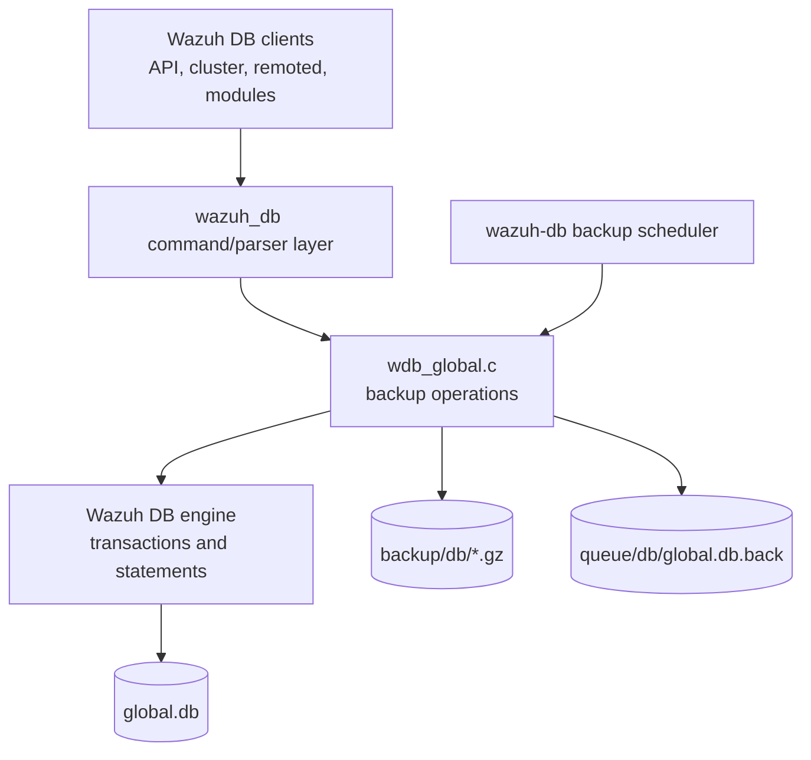
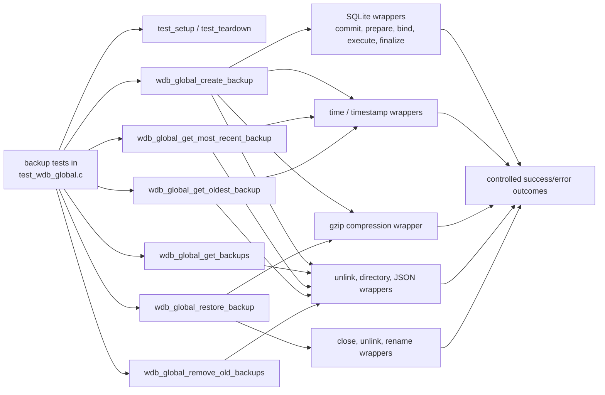
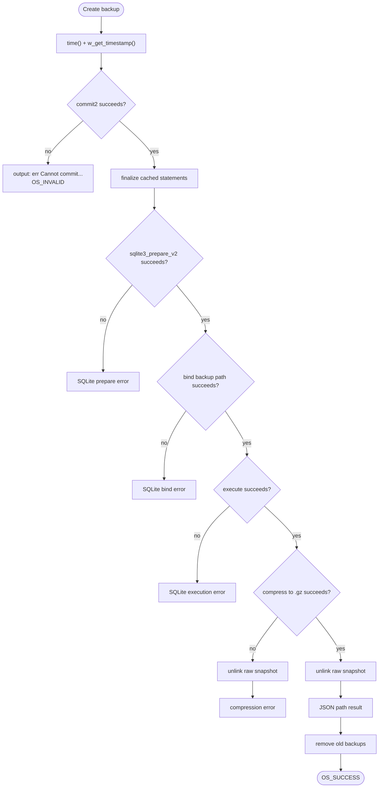
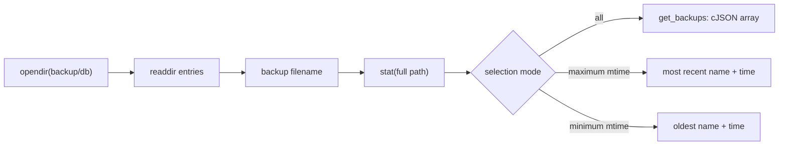
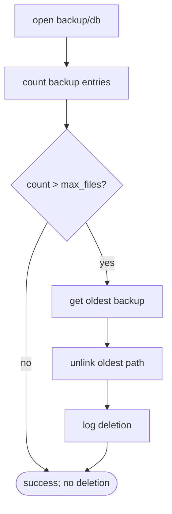
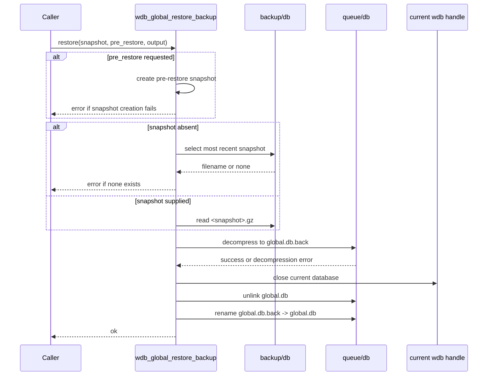

# `backup_management_tests`

## Introduction

`backup_management_tests` documents the backup-management slice of the Wazuh global-database CMocka tests. The
tests exercise creation, discovery, retention, and restoration of compressed `global.db` snapshots through mocked
SQLite, filesystem, time, compression, and logging APIs.

The tests are implemented in `src/unit_tests/wazuh_db/test_wdb_global.c` alongside many other global-database tests.
This page isolates the backup-specific behavior represented by:

- `test_wdb_global_create_backup_success`
- `test_wdb_global_get_backups_success`
- `test_wdb_global_get_most_recent_backup_success`
- `test_wdb_global_get_oldest_backup_success`
- `test_wdb_global_remove_old_backups_success`
- `test_wdb_global_remove_old_backups_success_without_removing`
- `test_wdb_global_restore_backup_no_snapshot`
- `test_wdb_global_restore_backup_success`

For the complete test translation unit, including agent, group, synchronization, and connection-management coverage,
see [`test_wdb_global.md`](test_wdb_global.md).

## Role in the Wazuh DB subsystem

The production backup functions belong to the global database layer. They operate on a live `global.db`, write
compressed snapshots under `backup/db`, and restore through a temporary database file under `queue/db`.
The daemon-level scheduling and lifecycle context is described in [`wazuh_db.md`](wazuh_db.md); this module verifies
the backup behavior without starting the daemon or touching real storage.

## Test architecture and dependencies

The fixture creates a minimal `wdb_t` object with the database identifier `global`, an allocated database handle,
and an output buffer. `wdb_init_conf()` and `wdb_free_conf()` initialize and release global configuration, including
backup retention settings. No real SQLite connection or directory is required.

The wrappers are linker substitutes configured by the unit-test build. They allow each test to assert exact paths,
arguments, return codes, and log messages. The shared wrapper infrastructure is documented in
[`wazuh_db_wrappers.md`](wazuh_db_wrappers.md), while the general test harness conventions are covered by
[`test_infrastructure.md`](test_infrastructure.md).

## Backup lifecycle

### Create

`wdb_global_create_backup()` follows this sequence:

1. Obtain the current time and format it with `w_get_timestamp()`.
2. Commit the current transaction and finalize cached statements so the snapshot is consistent.
3. Prepare and execute the SQLite backup statement, binding a path such as
   `backup/db/global.db-backup-2015-11-23-12:00:00-tag`.
4. Compress the raw snapshot to the `.gz` path and remove the uncompressed intermediate file.
5. Return a JSON array of created paths in the output buffer.
6. Invoke old-backup removal according to the configured retention limit.

The success test verifies the generated timestamped path, gzip source and destination, cleanup of the raw file,
success logging, JSON output, and the follow-up retention scan. Error cases in the same translation unit additionally
cover commit, prepare, bind, execution, and compression failures.

### List and select snapshots

`wdb_global_get_backups()` scans `backup/db` and returns matching backup entry names as a cJSON array. The test
deliberately returns the same directory entry twice, confirming that the function reflects directory enumeration and
does not deduplicate results in this layer.

`wdb_global_get_most_recent_backup()` and `wdb_global_get_oldest_backup()` scan entries, call `stat()` for each
candidate, and compare modification times. They return the selected timestamp and allocate the selected filename for
the caller. The tests verify both the selected `st_mtime` and filename, plus the directory-open failure path.

### Retention pruning

`wdb_global_remove_old_backups()` first counts backup entries and compares the count with
`wconfig.wdb_backup_settings[WDB_GLOBAL_BACKUP]->max_files`. With no entries, or with no excess over the configured
limit, it returns success without unlinking anything. When the limit is exceeded, it obtains the oldest backup and
removes it. The test configures `max_files = 3`, supplies four entries, and verifies deletion and the informational log.

### Restore

`wdb_global_restore_backup()` supports an optional pre-restore snapshot. When requested, it calls the create-backup
path first and stops if that snapshot cannot be created. Without an explicit filename it asks for the most recent
backup; if none is available, it reports `err Unable to found a snapshot to restore`.

For a selected compressed snapshot, the restore path is:

1. Decompress `backup/db/<snapshot>.gz` into `queue/db/global.db.back`.
2. Close the current database handle.
3. Remove the active `queue/db/global.db`.
4. Rename the temporary database to `queue/db/global.db`.
5. Return `ok`.

The success test asserts all path arguments and filesystem operations. The no-snapshot test verifies that restore does
not proceed when directory discovery fails. The decompression failure test verifies that the temporary replacement is
not attempted after decompression fails.

## Behavioral contract captured by the tests

| Area | Expected success behavior | Important failure behavior |
|---|---|---|
| Backup naming | Timestamp and optional tag form the raw and compressed paths | Timestamp/SQLite/compression errors become an `err ...` response |
| Snapshot output | Created compressed path is returned in a JSON array | Raw intermediate is cleaned after compression failure |
| Directory scan | Backup names are returned or selected by `st_mtime` | `opendir()` failure returns null/invalid selection |
| Retention | No deletion at or below `max_files`; delete oldest when over limit | Directory failure returns `OS_INVALID` |
| Restore selection | Explicit snapshot is used; absent snapshot falls back to most recent | No available snapshot stops restore |
| Restore replacement | Decompress, close, unlink active DB, rename temporary DB | Decompression failure leaves replacement sequence unperformed |

The tests also assert exact diagnostic messages, making logging part of the observable error contract. Return values use
Wazuh conventions such as `OS_SUCCESS`, `OS_INVALID`, `WDBC_OK`, `WDBC_ERROR`, and `WDBC_DUE` where the surrounding
global-database API requires them.

## Test isolation and maintenance notes

- Tests use CMocka `will_return`, `expect_value`, `expect_string`, and `expect_function_call` assertions to control
  wrappers and validate interactions.
- `test_mode` is enabled for directory/stat scenarios so wrapper behavior can represent backup entries deterministically.
- Backup retention tests mutate `wconfig.wdb_backup_settings[WDB_GLOBAL_BACKUP]->max_files`; the fixture teardown must
  continue to release configuration with `wdb_free_conf()`.
- Paths are relative to the Wazuh manager working directory. Changes to backup directory constants, filename prefixes,
  timestamp formatting, or temporary restore paths should update both production code and these path assertions.
- These are unit tests, not durability tests: they do not validate real SQLite backup contents, gzip integrity, crash
  recovery, permissions, concurrent backup jobs, or atomicity on an actual filesystem.

## Related documentation and source references

- [`test_wdb_global.md`](test_wdb_global.md) — complete global-database test module and neighboring coverage.
- [`wazuh_db.md`](wazuh_db.md) — daemon architecture, storage locations, and scheduled backup context.
- [`wazuh_db_engine.md`](wazuh_db_engine.md) — SQLite handles, statement lifecycle, transactions, and database engine behavior.
- [`wazuh_db_command_parser.md`](wazuh_db_command_parser.md) — command dispatch into Wazuh DB operations.
- [`wazuh_db_wrappers.md`](wazuh_db_wrappers.md) — wrapper and mock boundaries used by the test suite.
- [`src/wazuh_db/wdb_global.c`](../../wazuh_db/wdb_global.c) — production global-database implementation.
- [`src/wazuh_db/wdb.h`](../../wazuh_db/wdb.h) — public declarations, result types, and configuration structures.
- [`src/unit_tests/wazuh_db/test_wdb_global.c`](../../unit_tests/wazuh_db/test_wdb_global.c) — source test translation unit containing the documented cases.
