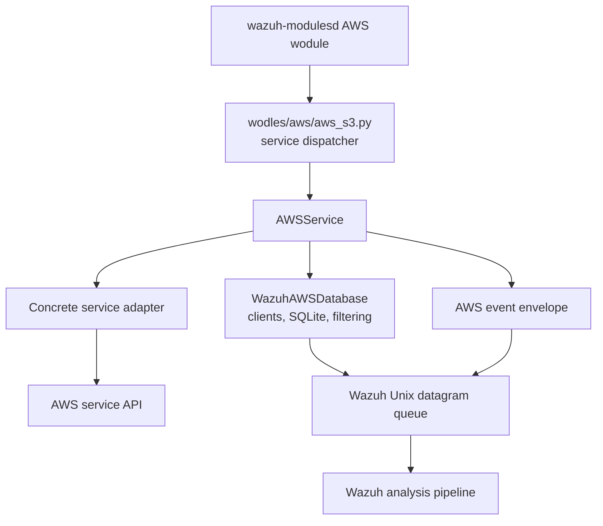
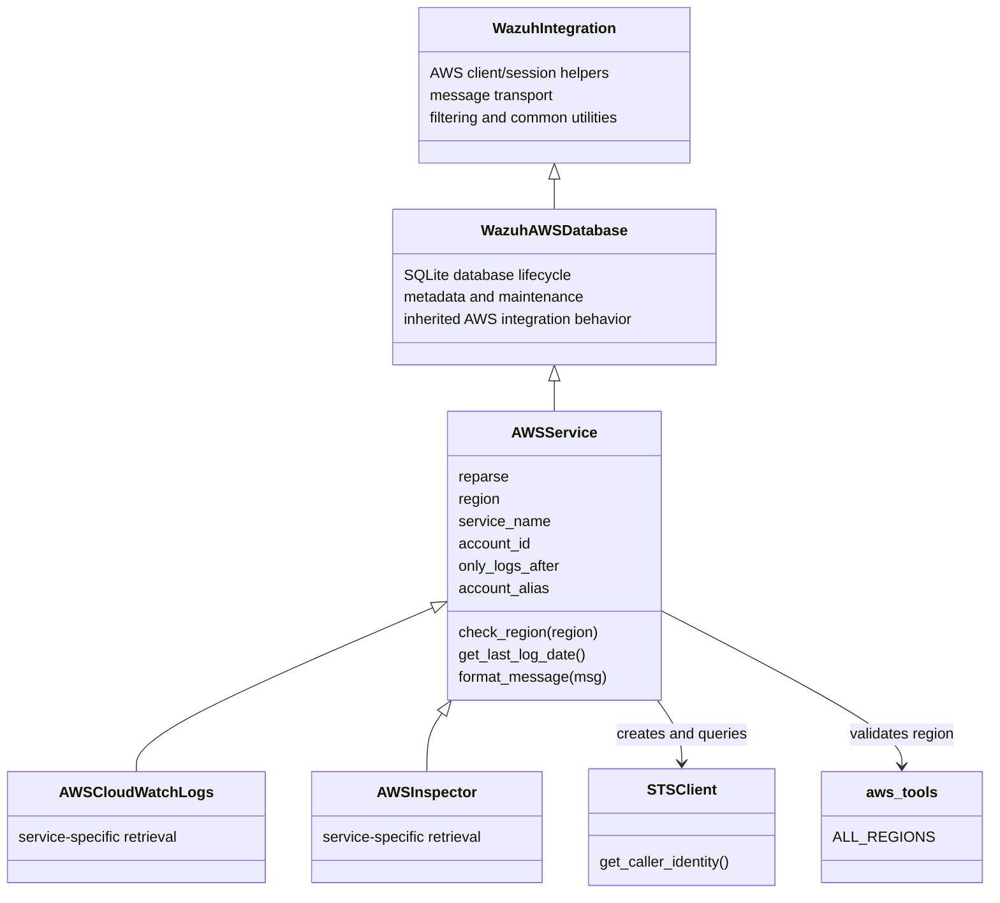
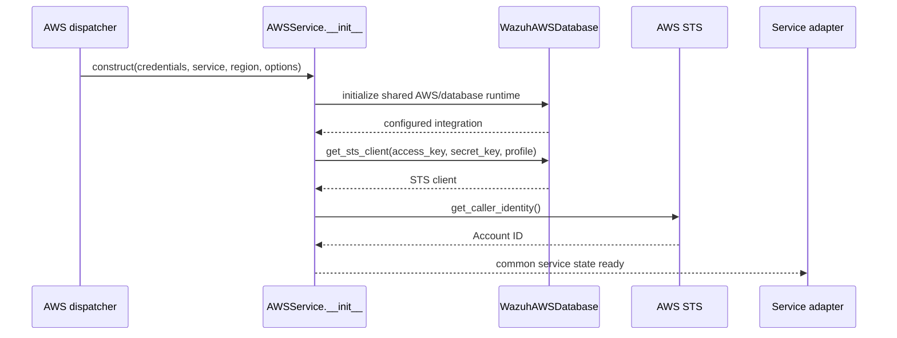
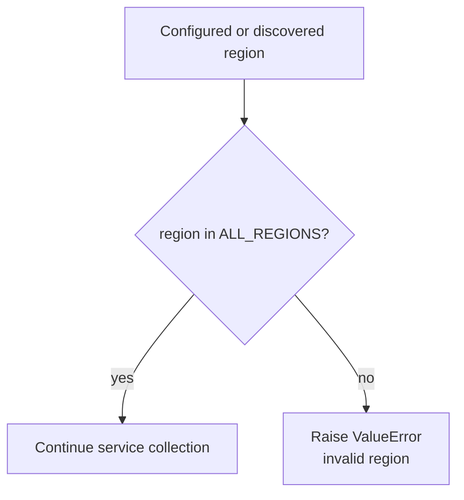
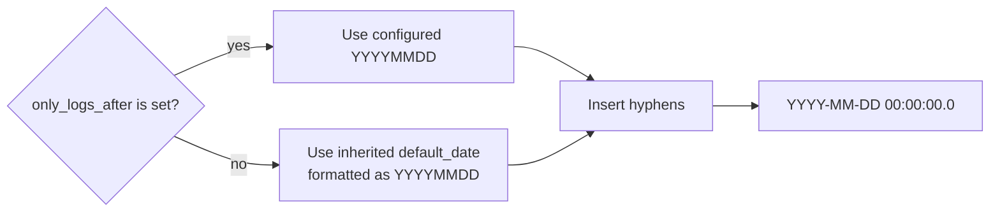
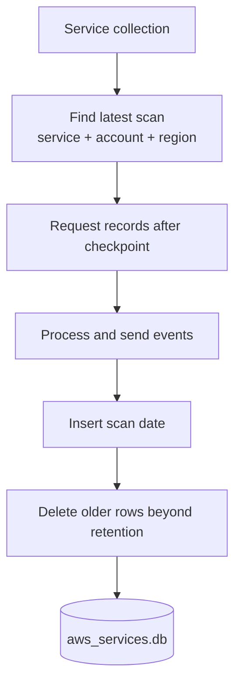
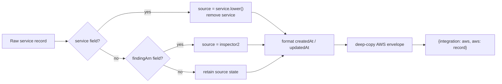
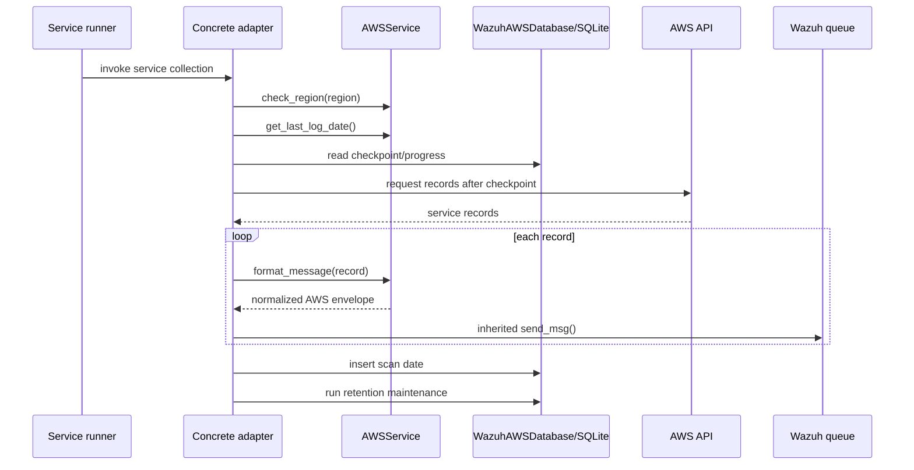

# AWS service base

The `base_service` module defines `AWSService`, the abstract Python base class for AWS services that provide events to the Wazuh AWS wodle. It combines the shared AWS/Wazuh integration runtime with service identity, region validation, incremental-scan metadata, and a common event envelope.

Concrete implementations such as CloudWatch Logs and Inspector inherit this class and supply service-specific retrieval and parsing. The shared client, credentials, filtering, SQLite lifecycle, compression, and Unix-queue delivery behavior is documented in [AWS core](aws_core.md). The broader scheduler and source dispatch are documented in [AWS integration](aws.md).

## Role in the system

`AWSService` sits between the AWS wodle dispatcher and service-specific adapters. The dispatcher constructs an adapter with credentials and collection options, then invokes the adapter’s service-specific collection method. The base class prepares the common state needed by that adapter and normalizes records before they are sent to Wazuh.



## Architecture and dependencies

The class uses inheritance for shared integration behavior and composition for the AWS STS client used to identify the account. `aws_tools.ALL_REGIONS` is the authoritative region allow-list used by `check_region`.



### Source files

| File | Responsibility |
| --- | --- |
| `wodles/aws/services/aws_service.py` | Defines `AWSService`, the common service adapter contract. |
| `wodles/aws/wazuh_integration.py` | Provides `WazuhAWSDatabase`, AWS sessions, SQLite support, filtering, and message transport. See [AWS core](aws_core.md). |
| `wodles/aws/aws_tools.py` | Defines `ALL_REGIONS` and shared argument/configuration helpers. |
| `wodles/aws/services/cloudwatchlogs.py` | Concrete CloudWatch Logs service adapter. |
| `wodles/aws/services/inspector.py` | Concrete Inspector service adapter. |
| `wodles/aws/aws_s3.py` | Selects and invokes service adapters. See [AWS integration](aws.md). |

## Construction and initialization

`AWSService.__init__` accepts common service settings and forwards AWS authentication and filtering settings to `WazuhAWSDatabase`.

Important parameters are:

| Parameter | Purpose |
| --- | --- |
| `reparse` | Controls whether an adapter rereads previously processed data. The base stores it for subclasses. |
| `access_key`, `secret_key`, `profile`, `iam_role_arn` | AWS authentication inputs forwarded to the parent integration. |
| `service_name` | Logical AWS service identity used by the database key and subclasses. |
| `only_logs_after` | Initial collection boundary, stored as `YYYYMMDD`-style text. |
| `account_alias` | Optional display/account label retained for service adapters. |
| `region` | AWS region associated with the adapter. |
| `db_table_name` | Source-specific table name; defaults to `aws_services`. |
| `discard_field`, `discard_regex` | Common event filtering options forwarded to the parent. |
| `sts_endpoint`, `service_endpoint` | Optional endpoint overrides. |
| `iam_role_duration` | Requested assumed-role session duration. |

The constructor performs these operations:

1. Sets the database name to `aws_services` and stores the selected table name.
2. Initializes `WazuhAWSDatabase` with service identity, credentials, region, filtering, and endpoint options.
3. Stores `reparse`, `region`, `service_name`, `only_logs_after`, and `account_alias`.
4. Creates an STS client through the inherited `get_sts_client()` helper.
5. Calls `get_caller_identity()` and stores the returned AWS account ID.
6. Defines SQL statements used by the service adapter for scan checkpoints and retention.



The account lookup occurs during construction. Therefore, missing credentials, invalid authentication, or an unavailable STS endpoint can prevent a concrete service adapter from being created. Authentication and exit-code behavior belong to [AWS core](aws_core.md).

## Region validation

`check_region(region)` is a static validation boundary. It checks exact membership in `aws_tools.ALL_REGIONS` and raises `ValueError` for anything else:

```python
AWSService.check_region("us-east-1")  # accepted when present in ALL_REGIONS
AWSService.check_region("not-a-region")  # ValueError
```

The method does not normalize case, resolve aliases, contact AWS, or infer a default region. Region selection and fallback behavior are handled by the dispatcher and concrete service adapters; see [AWS core](aws_core.md).



## Scan-date checkpointing

`get_last_log_date()` converts the service’s initial collection date into the timestamp format expected by service APIs:

```text
YYYYMMDD  ->  YYYY-MM-DD 00:00:00.0
```

If `only_logs_after` is set, that value is used. Otherwise the inherited `default_date` is formatted as `YYYYMMDD` and used as the fallback. The method does not read SQLite itself; concrete adapters use the SQL statements and inherited database helpers to decide whether this is an initial scan or a continuation.



## SQLite service state

The base class defines a shared database name and a configurable source table. The default table is `aws_services`; subclasses may supply a more specific `db_table_name` when their checkpoint model requires it.

The SQL statements describe four responsibilities:

| Statement | Behavior |
| --- | --- |
| `sql_create_table` | Creates a table keyed by service, account, region, and scan date. |
| `sql_insert_value` | Records a completed scan date. |
| `sql_find_last_scan` | Retrieves the newest scan date for one service/account/region tuple. |
| `sql_db_maintenance` | Retains only the newest `:retain_db_records` rows for that tuple. |

The logical key is:

```text
(service_name, aws_account_id, aws_region, scan_date)
```

The database lifecycle, metadata versioning, commits, optimization, and closing behavior are inherited from `WazuhAWSDatabase`; this class only supplies the service-specific schema and query templates. See [AWS core](aws_core.md#sqlite-integration-and-progress-metadata).



## Event formatting

`format_message(msg)` creates the standard AWS service envelope. It normalizes `msg` in place before placing it in a deep-copied envelope, so callers should pass a disposable record or account for the input mutation.

Its transformation rules are:

1. If `service` exists, move its lowercase value to `source` and remove `service`.
2. If `findingArn` exists instead, set `source` to `inspector2`.
3. Convert `createdAt` and `updatedAt` datetime values to strings formatted as `%Y-%m-%dT%H:%M:%SZ`.
4. Deep-copy `AWS_SERVICE_MSG_TEMPLATE` (`{'integration': 'aws', 'aws': ''}`).
5. Store the transformed event under the envelope’s `aws` field.

The envelope template is deep-copied for each call, preventing returned events from sharing the template’s nested state. The input record itself is not copied before normalization.



Example transformation:

```python
record = {
    "service": "GuardDuty",
    "createdAt": datetime(2024, 1, 2, 3, 4, 5),
}

# Result shape:
{
    "integration": "aws",
    "aws": {
        "source": "guardduty",
        "createdAt": "2024-01-02T03:04:05Z",
    },
}
```

Concrete adapters remain responsible for retrieving records, interpreting service-specific fields, invoking `format_message`, applying any service-specific normalization, and sending the result through inherited transport methods.

## Service processing flow

The exact public collection method is defined by each concrete adapter, but the common interaction is:



## Extension contract

When implementing a new API-backed AWS service:

- Inherit from `AWSService`.
- Keep AWS authentication and transport setup in the parent; do not recreate sessions or queue handling.
- Validate every selected region with `check_region` before making service calls.
- Use `get_last_log_date()` for the initial date boundary unless the API requires a deliberately different representation.
- Choose a stable `db_table_name` if the service needs a checkpoint table distinct from `aws_services`.
- Call `format_message()` for records that follow the standard service envelope.
- Implement retrieval, pagination, throttling, API response parsing, and service-specific field mapping in the child module.
- Preserve the parent’s filtering and error semantics described in [AWS core](aws_core.md).

The current concrete service children are `AWSCloudWatchLogs` and `AWSInspector`, implemented in `wodles/aws/services/cloudwatchlogs.py` and `wodles/aws/services/inspector.py`. Their selection is performed by the service branch of [AWS integration](aws.md).

## Operational considerations

- STS account discovery is eager and happens during object construction.
- Region validation is local and deterministic; it does not prove that credentials can access the region.
- `format_message` mutates the input record while applying its local transformations; the returned envelope is deep-copied from the template.
- Database retention is parameterized by `:retain_db_records`; the child controls when the maintenance query is executed through the shared database workflow.
- Parent-level failures such as missing credentials, SQLite errors, oversized messages, and queue failures follow the exit and logging model in [AWS core](aws_core.md).

## References

- [AWS integration overview](aws.md)
- [AWS core runtime](aws_core.md)
- [AWS S3 bucket core](aws_buckets_s3_core.md)
- [AWS service dispatch and native lifecycle](wazuh_modules_core_cloud_integrations_aws.md)
- `wodles/aws/services/aws_service.py`
- `wodles/aws/wazuh_integration.py`
