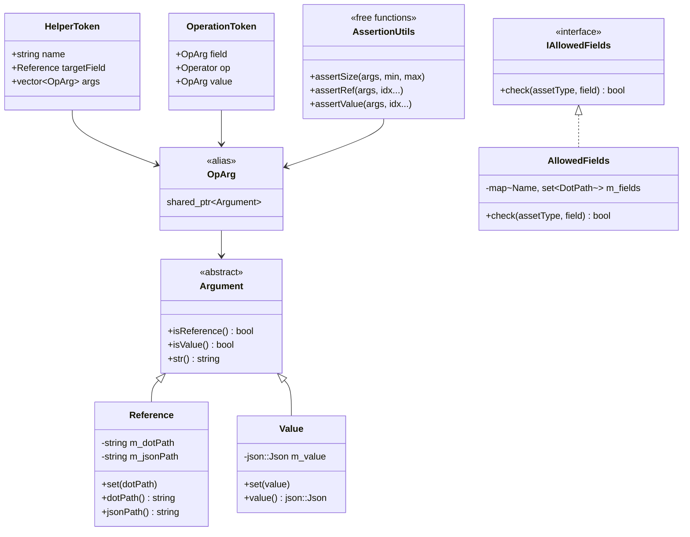
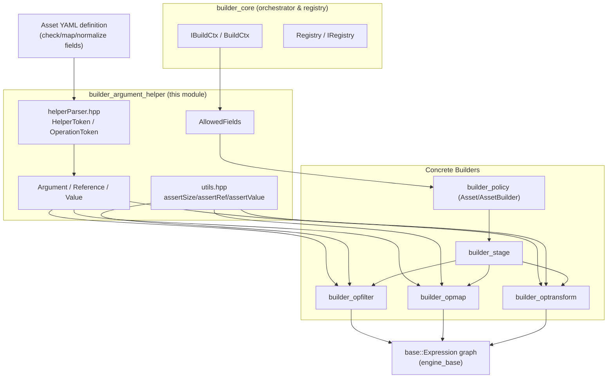
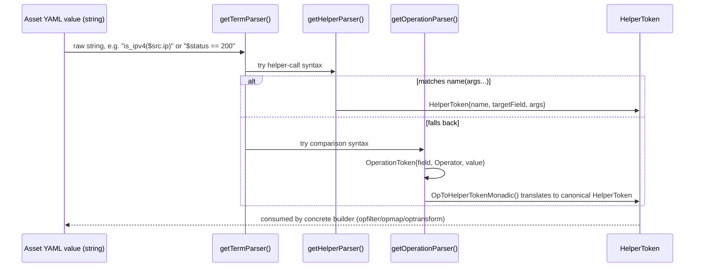
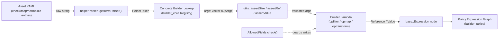

# Builder Argument Helper

## 1. Introduction & Purpose

The **Builder Argument Helper** module is a small, foundational C++ library inside the [Wazuh Engine's](Wazuh_Engine_Core_(C++).md) policy/decoder **Builder** subsystem. It provides the low-level primitives that every operator, filter, mapper and transform builder in the engine relies on to:

1. **Represent arguments** passed to helper functions and stage definitions — either a **reference** to a field in the event (`$field.path`) or a literal **JSON value** (`Value`).
2. **Parse** the textual DSL used inside asset definitions (`.yml` decoders/rules/outputs) that expresses helper function calls (e.g. `is_ipv4($src.ip)`) and short-hand comparison expressions (e.g. `$status == 200`) into a structured, in-memory representation (`HelperToken` / `OperationToken`).
3. **Validate** the shape of the parsed arguments (count, type: reference vs. value) before a concrete builder (filter/map/transform) attempts to use them — failing fast with clear error messages at build time rather than at runtime.
4. **Enforce field-level write permissions** through the `AllowedFields` policy object, which determines whether a given asset type is permitted to write to a specific event field.

This module contains **no business logic of its own** (no filters, no transformations); it is a *shared utility layer* consumed by the sibling sub-modules of the builder: [builder_opfilter](builder_opfilter.md), [builder_opmap](builder_opmap.md), and [builder_optransform](builder_optransform.md), as well as the [builder_core](builder_core.md) context and registry machinery.

## 2. Architecture Overview

The module is composed of four tightly-coupled header files, each with a single, well-defined responsibility:

| File | Responsibility |
|---|---|
| `builders/argument.hpp` | Defines the `Argument` base class and its two concrete forms: `Reference` and `Value`. |
| `builders/helperParser.hpp` | Implements a parser-combinator based lexer/parser (built on top of [engine_parsec](engine_parsec.md)) that converts DSL strings into `HelperToken` / `OperationToken` structures. |
| `builders/utils.hpp` | Small assertion helpers (`assertSize`, `assertRef`, `assertValue`) and the `RETURN_SUCCESS`/`RETURN_FAILURE` macros used pervasively by concrete builders to validate arguments and produce consistent `base::result::Result` outputs. |
| `builder/allowedFields.hpp` | `AllowedFields`, a concrete implementation of the `IAllowedFields` interface, used to check whether an asset is allowed to write a given field. |

### 2.1 Component Diagram



### 2.2 Where This Module Fits in the Engine



## 3. Core Components

### 3.1 `Argument`, `Reference`, `Value` (`builders/argument.hpp`)

`Argument` is the abstract base for anything a helper function or operator can receive as an argument:

- **`Reference`** — wraps a *dot-path* (`a.b.c`) pointing into the event JSON. It pre-computes the equivalent *json-pointer* path (`m_jsonPath`) via `json::Json::formatJsonPath` for fast repeated lookups at runtime. Its textual representation (`str()`) re-adds the `$` reference anchor (`syntax::field::REF_ANCHOR`).
- **`Value`** — wraps an immutable `json::Json` literal (string, number, boolean, object, array) supplied directly in the asset definition.

Both are always handled through the type alias:
```cpp
using OpArg = std::shared_ptr<Argument>;
```
so builders operate uniformly on `std::vector<OpArg>` regardless of whether each individual argument is a reference or a literal value.

### 3.2 Helper & Expression Parser (`builders/helperParser.hpp`)

This is the most complex file in the module. It builds, using the [engine_parsec](engine_parsec.md) combinator library, a family of parsers that read the small DSL embedded in asset YAML fields:

- **Argument-level parsers**:
  - `getHelperQuotedArgParser` — parses single-quoted string literals (with escape handling).
  - `getHelperRefArgParser` — parses `$field.path` references.
  - `getHelperJsonArgParser` — parses arbitrary JSON literals (objects, arrays, numbers, booleans) using RapidJSON's streaming reader.
  - `getHelperRawArgParser` — fallback parser that treats un-quoted, un-referenced text as a raw string value.
  - `getHelperArgParser` — composes the four above (tried in order) into a single argument parser, optionally chained with a separator parser.

- **Helper function parser**: `getHelperNameParser` + `getHelperParser` combine to recognize the full `name(arg1, arg2, ...)` syntax and produce a `HelperToken { name, targetField, args }`.

- **Comparison-expression parser**: `getOperatorParser` recognizes `==`, `!=`, `<`, `<=`, `>`, `>=`; `getOperationParser` combines a reference, an operator and a value into an `OperationToken`. `OpToHelperTokenMonadic` then *translates* that shorthand comparison into the equivalent canonical helper call (e.g. `$a > 5` → helper `number_greater`), unifying both DSL forms into a single `HelperToken` representation.

- **`getTermParser()`** — the single public entry point most builders call: it tries to parse a full helper-call term first, and falls back to the comparison-operator shorthand, always asserting (via `assertTargetMonadic`) that the first token is a valid target-field reference.

- **`operatorToString(Operator)`** — utility to render an `Operator` enum back to its string form (`==`, `!=`, etc.), useful for building trace/debug messages.

- **`isDefaultHelper(std::string_view)`** — quick lookahead check used by stage builders to disambiguate whether a raw string in an asset definition should be treated as a helper-function call or as a plain literal.

#### Parsing Flow



### 3.3 Argument Assertion Utilities (`builders/utils.hpp`)

A tiny but heavily-reused set of helpers that concrete builders call at **build time** (not runtime) to validate the arguments extracted from a `HelperToken`:

- **`assertSize(args, minSize, maxSize = 0)`** — throws `std::runtime_error` if the argument count is not exactly `minSize` (when `maxSize == 0`) or not within `[minSize, maxSize]`.
- **`assertRef(args, idx...)`** — throws if any of the specified argument indices (or, with no indices given, *all* arguments) is not a `Reference`.
- **`assertValue(args, idx...)`** — symmetric check ensuring the specified arguments are `Value` literals.

These are typically the first lines inside every helper-builder lambda (see [builder_opfilter](builder_opfilter.md) and [builder_opmap](builder_opmap.md)), for example:
```cpp
utils::assertSize(args, 1, 2);
utils::assertRef(args, 0);
```

The file also defines the **`RETURN_SUCCESS` / `RETURN_FAILURE`** macros, which standardize how every filter/map/transform lambda produces a `base::result::Result<Event>`, automatically attaching a trace message only when the current `RunState` has tracing enabled — avoiding the cost of string formatting in production hot paths.

### 3.4 `AllowedFields` (`builder/allowedFields.hpp`)

`AllowedFields` implements the `IAllowedFields` interface (declared in `builder/iallowedFields.hpp`, part of [builder_core](builder_core.md)) and answers a single question:

> *"Is asset type X permitted to write field Y?"*

Internally it holds `std::unordered_map<base::Name, std::unordered_set<DotPath>>`, built once from a JSON schema/definition document at engine startup, and exposes:

```cpp
bool check(const base::Name& assetType, const DotPath& field) const override;
```

This is consulted by the [builder_stage](builder_stage.md) map/transform stage builders (e.g. `getParseBuilder`, `getIndexerOutputBuilder`) and ultimately by [builder_policy](builder_policy.md)'s asset construction, to reject decoders/rules that attempt to write to fields they are not permitted to touch — a security/consistency guard enforced entirely at build time via the shared `IBuildCtx::allowedFields()` accessor.

## 4. Interaction With the Rest of the Builder



- **Consumed by:** [builder_opfilter](builder_opfilter.md) (comparison/existence/regex filters), [builder_opmap](builder_opmap.md) (KVDB/GeoIP/string transform mappers), [builder_optransform](builder_optransform.md) (array/HLP/Windows helpers), and [builder_stage](builder_stage.md) (stage-level `parse`/`indexer_output` builders).
- **Depends on:** [engine_parsec](engine_parsec.md) for the combinator primitives (`Result`, `fmap`, `many`, `positiveLook`, monadic `>>=`), [engine_base](engine_base.md) for `base::Name`, `base::Json` and `base::error`/`base::result` types, and [builder_core](builder_core.md) for the `IBuildCtx`/`IAllowedFields` interfaces it implements/uses.
- **Related sibling module:** [builder_core](builder_core.md) defines the `IBuildCtx` interface consumed here (`allowedFields()`, `allowedFieldsPtr()`), and the `Registry`/`IRegistry` that maps a parsed `HelperToken.name` to the actual builder function that will use these argument utilities.

## 5. Summary

| Aspect | Detail |
|---|---|
| **Language** | C++ (header-only) |
| **Scope** | Argument modeling, DSL parsing, argument validation, field-write authorization |
| **State** | Mostly stateless / pure functions; `AllowedFields` holds an immutable lookup table built once |
| **Failure Mode** | Throws `std::runtime_error` (build-time) for malformed arguments; returns `parsec::Result` errors for malformed DSL syntax |
| **Primary Consumers** | All op-builders (filter/map/transform) and stage/policy builders in the Wazuh Engine |

For the broader engine architecture, see [Wazuh_Engine_Core_(C++)](Wazuh_Engine_Core_(C++).md). For the parser-combinator foundation used by `helperParser.hpp`, see [engine_parsec](engine_parsec.md). For the build-context and registry that orchestrate all builders (including this one), see [builder_core](builder_core.md).
