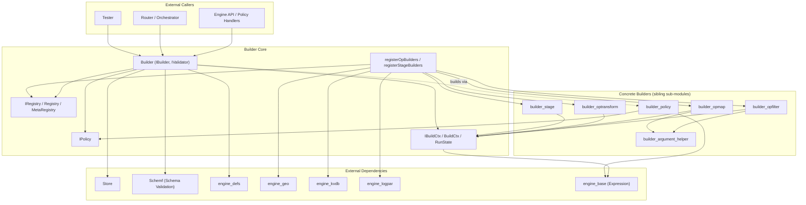
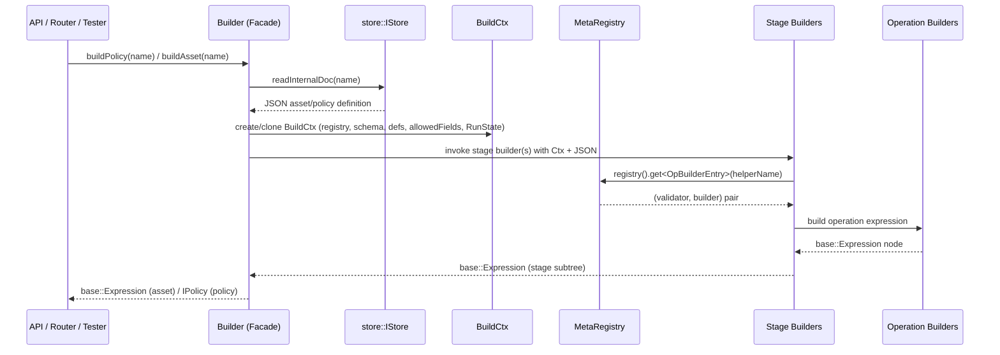

# Builder Core

## Introduction

The **Builder Core** module is the central orchestration layer of the Wazuh Engine's `builder` component. It is
responsible for taking declarative asset/policy definitions (stored as JSON documents) and turning them into
executable runtime [`base::Expression`](engine_base.md) trees that the engine's backend (`bk`) and router can
evaluate against incoming events.

It plays the role of a **facade + registry + context** system:

- The **`Builder`** class (facade) is the public entry point used by the rest of the engine (API handlers, router,
  tester) to compile assets and policies, and to validate them without building.
- The **Build Context** (`IBuildCtx` / `BuildCtx`) carries all the shared state and dependencies (schema validator,
  definitions, allowed fields, registry, run-time flags) that every individual field/stage builder needs while
  constructing an expression.
- The **Registry** system (`IRegistry`, `Registry`, `MetaRegistry`, `registerOpBuilders`, `registerStageBuilders`)
  holds the catalog of all available operation ("helper") builders and stage builders, keyed by name, and is
  populated once at startup.

Builder Core does not implement the actual parsing/mapping/filtering logic itself — that logic lives in the sibling
sub-modules of `engine_builder` (see [`builder_opfilter.md`](builder_opfilter.md),
[`builder_opmap.md`](builder_opmap.md), [`builder_optransform.md`](builder_optransform.md),
[`builder_stage.md`](builder_stage.md), [`builder_argument_helper.md`](builder_argument_helper.md) and
[`builder_policy.md`](builder_policy.md)). Instead, Builder Core defines the **contracts** (interfaces) and
**wiring** (registration, context propagation) that make those builders composable and lets the `Builder` facade
assemble them into policies and standalone assets.

## Architecture Overview

### Key relationships

- **`Builder`** owns a `Registry` (an alias of `builder::builders::RegistryType`, a `MetaRegistry` instance) that is
  populated once via `registerOpBuilders` / `registerStageBuilders`, and uses a `store::IStore`,
  `schemf::IValidator`, `defs::IDefinitionsBuilder` and `IAllowedFields` to resolve and validate asset/policy
  documents fetched from the [Store](Store.md).
- For every asset it builds, `Builder` produces a fresh **`BuildCtx`** (via cloning) that snapshots the current
  registry, definitions, schema validator, allowed fields and run flags (`trace`, `sandbox`, `check`). This context
  is threaded through every operation/stage builder call so that helper builders (in `builder_opfilter`,
  `builder_opmap`, `builder_optransform`, `builder_stage`) can validate field types and build the correct
  `base::Expression` node.
- The **Registry** classes are generic containers: `IRegistry<Builder>` / `Registry<Builder>` store builders of one
  type, while `MetaRegistry<Builders...>` composes several typed registries (e.g. one for operation/helper builders,
  one for stage builders) behind a single object referenced by `IBuildCtx::registry()`.
- **`IPolicy`** is the read-only interface exposed by the concrete `Policy` implementation (built in
  [`builder_policy.md`](builder_policy.md)) that `Builder::buildPolicy` returns to callers — giving access to the
  policy's name, hash, asset set, compiled expression tree and Graphviz representation.

## Sub-modules

Builder Core is split into three closely related sub-modules, each documented separately:

| Sub-module | Responsibility | Documentation |
|---|---|---|
| **Orchestrator (Facade)** | Public `Builder` API: builds policies/assets from the store, validates integrations/assets/policies, exposes `BuilderDeps` (external service dependencies) and the `IPolicy` contract for built policies. | [`builder_core_orchestrator.md`](builder_core_orchestrator.md) |
| **Build Context** | `IBuildCtx` interface and its `BuildCtx` implementation, plus the `RunState` control-flag struct (`trace`, `sandbox`, `check`), used to propagate shared state to every field/stage builder invocation. | [`builder_core_context.md`](builder_core_context.md) |
| **Registry System** | Generic `IRegistry`/`Registry`/`MetaRegistry` containers for builder catalogs, plus the `registerOpBuilders`/`registerStageBuilders` bootstrap functions that populate the registry with every available operation and stage builder. | [`builder_core_registry.md`](builder_core_registry.md) |

## How a Build Request Flows

1. A caller (API handler, router, or tester) asks `Builder` to build or validate an asset or policy by name.
2. `Builder` reads the corresponding JSON document from the [Store](Store.md).
3. `Builder` creates a `BuildCtx` carrying the `MetaRegistry`, `schemf::IValidator`, definitions and `RunState`
   flags.
4. Stage builders (registered under keys such as `check`, `map`, `normalize`, `parse`, `outputs` — see
   [`builder_stage.md`](builder_stage.md)) consume the context to resolve field-level operation/helper builders from
   the registry (see [`builder_opfilter.md`](builder_opfilter.md), [`builder_opmap.md`](builder_opmap.md),
   [`builder_optransform.md`](builder_optransform.md)).
5. The result is composed into a `base::Expression` tree (for assets) or wrapped into an `IPolicy` implementation
   (for policies, built with the help of [`builder_policy.md`](builder_policy.md)).

## Relationship to the Rest of the Engine

- **Parent module:** [`engine_builder`](engine_builder.md) — Builder Core is the `builder_core` child of
  `engine_builder`; sibling children (`builder_argument_helper`, `builder_opfilter`, `builder_opmap`,
  `builder_optransform`, `builder_stage`, `builder_policy`) provide the concrete builder implementations that plug
  into the registry defined here.
- **Consumers:** `engine_api` (policy/catalog handlers), `Router` (environment/policy loading), and the
  `engine_test` CLI/tools use `Builder`/`IPolicy` to compile and validate content.
- **Dependencies:** [`Store`](Store.md) (asset/policy documents), [`Schemf_(Schema_Validation)`](Schemf_(Schema_Validation).md)
  (field type validation), `engine_defs` (definitions expansion), `engine_geo` and `engine_kvdb` (helper builder
  dependencies wired through `BuilderDeps`), `engine_logpar` (log parsing helper dependency), and
  [`engine_base`](engine_base.md) (the `base::Expression`/`base::Name` primitives produced by every builder).

## Diagrams Index

- [Architecture Overview](#architecture-overview) — component/dependency map.
- [Build Request Flow](#how-a-build-request-flows) — sequence diagram of a typical `buildPolicy`/`buildAsset` call.
- See each sub-module document for detailed class diagrams of its components.
