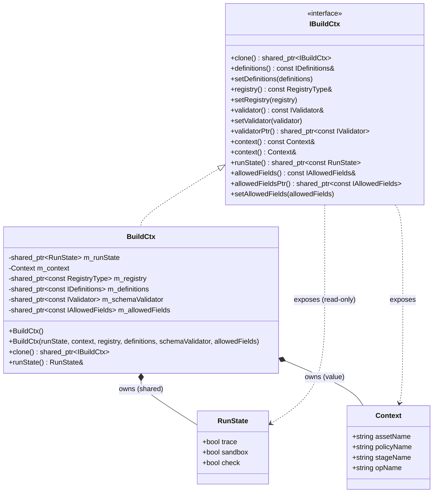
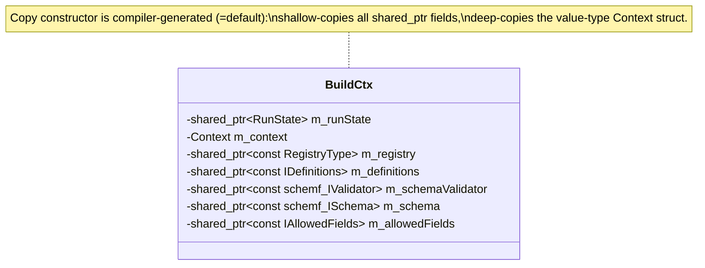
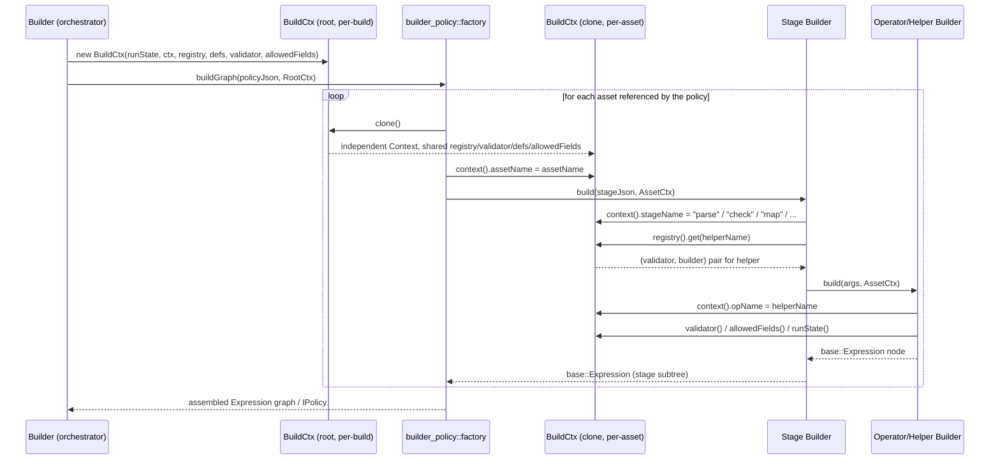
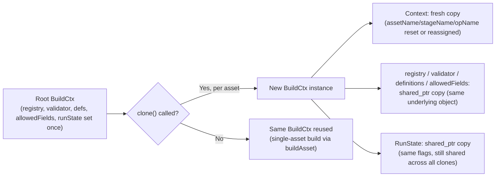
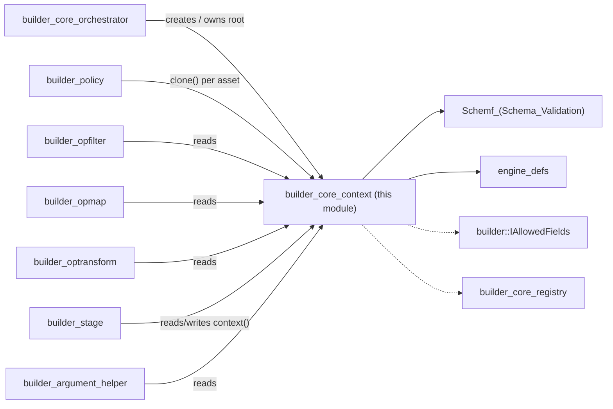

# Builder Core Context

## Introduction

The **Builder Core Context** module defines the *shared, per-build state* that flows through every single builder
invocation while the Wazuh Engine compiles an asset or a policy. It is a small but structurally critical piece of
the [`builder_core`](builder_core.md) subsystem: rather than passing a long, ever-growing list of parameters
(schema validator, definitions, registry, allowed-fields policy, run-time flags, asset/policy/stage/operation
names…) into every helper/stage builder function, the engine bundles all of that state into a single object — the
**Build Context** — and threads that one object through the entire build call tree.

This module contains exactly two components:

- **`IBuildCtx`** — the abstract interface that all builder functions program against. It exposes read accessors
  for the registry, schema validator, definitions, allowed fields and run state, plus a mutable `Context` (asset /
  policy / stage / operation names) used for error reporting and tracing, and a `clone()` method that lets the
  orchestrator create an independent copy of the context for each asset being built.
- **`BuildCtx`** — the concrete, `shared_ptr`-based implementation of `IBuildCtx` used throughout the real engine
  (as opposed to test doubles/mocks that might implement `IBuildCtx` directly for unit testing individual
  builders).

This context is the *glue* that makes the builder ecosystem composable: because every builder function
(`opBuilderHelperEqual`, `getParseBuilder`, `mapBuilder`, etc., living in `builder_opfilter`, `builder_opmap`,
`builder_optransform` and `builder_stage`) receives the same `std::shared_ptr<const IBuildCtx>` shape, they can all
resolve the same registry, obey the same schema/allowed-fields rules, and report errors using the same
asset/stage/operation naming convention — without any of them needing to know how the context was constructed or
who owns it.

## Purpose and Core Functionality

| Responsibility | Description |
|---|---|
| **State aggregation** | Bundles the builder `Registry`, `defs::IDefinitions`, `schemf::IValidator`, `builder::IAllowedFields` and `RunState` flags into a single object. |
| **Context propagation** | Provides a cheap `clone()` operation so the [`builder_core_orchestrator`](builder_core_orchestrator.md) (and the policy-assembly logic in `builder_policy`) can hand each asset builder its own, independently-mutable `Context` (name bookkeeping) while sharing the same underlying registry/schema/definitions/allowed-fields pointers. |
| **Run-time flags** | Exposes `RunState` (`trace`, `sandbox`, `check`) so builders can conditionally emit tracing instrumentation, relax validation for sandboxed/test execution, or enforce strict type checking. |
| **Diagnostics/naming** | Exposes a mutable `Context` struct (`assetName`, `policyName`, `stageName`, `opName`) that builder functions update as they descend into an asset's stages/operations, enabling precise, contextualized error messages (`"asset X, stage Y, operation Z: ..."`). |
| **Dependency handoff** | Acts as the single channel through which cross-cutting dependencies (schema validation, field-allow-listing, definitions expansion, and the builder registry itself) reach every leaf-level builder function, without those functions taking each dependency as a separate constructor/function parameter. |

### Relationship to sibling `builder_core` components

`builder_core_context` sits between the [`builder_core_orchestrator`](builder_core_orchestrator.md) (which creates
and owns the top-level context for a build) and the sibling `builder_core_registry` sub-module (whose `Registry`
type is *referenced from*, but not defined in, this module):

- The **orchestrator** (`Builder::buildPolicy` / `Builder::buildAsset`) constructs an initial `BuildCtx`, injecting
  the shared `Registry`, `schemf::IValidator`, `defs::IDefinitions` and `IAllowedFields` instances that were wired
  in at engine startup (`BuilderDeps`).
- **`builder_policy`**'s asset assembly logic (`AssetBuilder`, `factory.cpp`) calls `IBuildCtx::clone()` once per
  asset so that each asset gets its own `Context` (name bookkeeping) without needing to duplicate the (immutable,
  shared) registry/schema/definitions/allowed-fields state.
- **Concrete builder functions** in `builder_opfilter`, `builder_opmap`, `builder_optransform`, `builder_stage` and
  `builder_argument_helper` all accept a `std::shared_ptr<const IBuildCtx>` (or a reference to it) as part of their
  `BuildToken`/`Builder` signature (see [`builder_core`](builder_core.md) for the full `Builder` type alias used by
  the registry), and call `ctx->context()`, `ctx->validator()`, `ctx->registry()`, `ctx->allowedFields()` and
  `ctx->runState()` to do their job.

## Architecture

### Component Diagram

### Position within `builder_core` and the Engine

```mermaid
graph TB
    subgraph Orchestrator["builder_core_orchestrator"]
        BuilderCls["Builder (facade)"]
    end

    subgraph ThisModule["builder_core_context (this module)"]
        IBuildCtxIf["IBuildCtx"]
        BuildCtxImpl["BuildCtx"]
        RunStateStruct["RunState"]
        ContextStruct["Context"]
    end

    subgraph RegistryMod["builder_core_registry"]
        RegistryType["RegistryType / MetaRegistry"]
    end

    subgraph PolicyLogic["builder_policy"]
        AssetBuilderCls["AssetBuilder"]
        FactoryFns["factory.cpp"]
    end

    subgraph Builders["builder_opfilter / builder_opmap / builder_optransform / builder_stage / builder_argument_helper"]
        ConcreteBuilders["Concrete builder functions"]
    end

    subgraph ExternalDeps["External dependencies"]
        Schemf["Schemf_(Schema_Validation) (IValidator)"]
        Defs["engine_defs (IDefinitions)"]
        AllowedFieldsIf["IAllowedFields"]
    end

    BuilderCls -- "constructs / clones" --> BuildCtxImpl
    BuildCtxImpl -- implements --> IBuildCtxIf
    BuildCtxImpl -- "owns pointer to" --> RegistryType
    BuildCtxImpl -- "owns pointer to" --> Schemf
    BuildCtxImpl -- "owns pointer to" --> Defs
    BuildCtxImpl -- "owns pointer to" --> AllowedFieldsIf
    BuildCtxImpl -- "owns" --> RunStateStruct
    BuildCtxImpl -- "owns" --> ContextStruct

    FactoryFns -- "clone() per asset" --> IBuildCtxIf
    AssetBuilderCls -- "reads/writes context()" --> IBuildCtxIf
    ConcreteBuilders -- "reads registry()/validator()/allowedFields()/runState()" --> IBuildCtxIf

    style ThisModule fill:#57abff,color:#fff
```

## Core Components

### `RunState` (`ibuildCtx.hpp`)

A tiny, plain-data struct of three boolean control flags that alter builder behavior at compile time:

| Field | Meaning |
|---|---|
| `trace` | When `true`, builders attach tracing instrumentation to the produced `base::Expression` nodes (see [`engine_base`](engine_base.md) expression graph and [`engine_bk`](engine_bk.md) tracer support), enabling per-asset execution tracing in the [`Router`](Router.md)'s tester (`RuntimeEntry`, `Tester`). |
| `sandbox` | When `true`, the build runs in *test/sandbox mode* — used by the `engine_test` CLI tooling (see [Engine_Administration_CLI_Tools_(Python)](Engine_Administration_CLI_Tools_(Python).md)) to relax certain runtime behaviors that would be unsafe/undesirable outside of a real deployment. |
| `check` | When `true`, enables *hard type enforcement* — builders performing field-type inference query the schema validator ([`Schemf_(Schema_Validation)`](Schemf_(Schema_Validation).md)) strictly and fail the build on mismatches, rather than deferring the check to runtime. |

`RunState` is stored behind a `shared_ptr<RunState>` inside `BuildCtx`, but exposed to the outside world only as
`shared_ptr<const RunState>` via `IBuildCtx::runState()`, so most consumers can only *read* the flags. `BuildCtx`
itself exposes a non-virtual, mutable `RunState& runState()` accessor for the small set of privileged callers
(typically the orchestrator, at the very start of a build) that need to actually set these flags before the
context is cloned and handed off to the rest of the build pipeline.

### `Context` (`ibuildCtx.hpp`)

A plain, per-asset/operation naming struct used purely for diagnostics and error message construction:

| Field | Set by | Used for |
|---|---|---|
| `assetName` | `builder_policy`'s `AssetBuilder` / `Builder::buildAsset` | Identifying which asset is being compiled in error messages. |
| `policyName` | `Builder::buildPolicy` | Identifying which policy is being compiled (when building via a policy, as opposed to a standalone asset). |
| `stageName` | `builder_stage` builders (e.g. `check`, `map`, `normalize`, `parse`, `outputs`) | Identifying which stage inside the asset is currently being processed. |
| `opName` | `builder_opfilter` / `builder_opmap` / `builder_optransform` helper builders | Identifying which specific operator/helper function (e.g. `is_ipv4`, `array_append`) is currently being built. |

Unlike `RunState`, `Context` is stored *by value* inside `BuildCtx` and exposed through both a `const Context&` and
a mutable `Context&` accessor (`IBuildCtx::context()` is overloaded on const-ness) — this lets deeply-nested
builder code update `stageName`/`opName` as it descends the asset's stage tree, so that any error thrown along the
way carries fully-qualified context without every function needing to pass those names down explicitly as
arguments.

### `IBuildCtx` (`ibuildCtx.hpp`)

The abstract interface implemented by `BuildCtx` (and potentially by test doubles used in the unit tests of
`builder_opfilter`, `builder_opmap`, etc.). Its contract is intentionally narrow — a small set of *getters* for
immutable dependencies (`definitions()`, `registry()`, `validator()`, `allowedFields()`, `runState()`), a handful
of matching *setters* used by the orchestrator to (re)configure a context before use, mutable/immutable access to
the `Context` naming struct, and the all-important `clone()` factory method.

| Method | Purpose |
|---|---|
| `clone() -> shared_ptr<IBuildCtx>` | Produces an independent copy of the context (deep-copies the value-type `Context`, shares the same `shared_ptr`s for registry/schema/definitions/allowed-fields/run-state). Used once per asset when a policy references multiple assets, so each asset build has isolated `assetName`/`stageName`/`opName` bookkeeping without duplicating heavyweight shared state. |
| `definitions()` / `setDefinitions(...)` | Access to the [`engine_defs`](engine_defs.md) `IDefinitions` object used to expand `$definition` references inside asset YAML/JSON before building. |
| `registry()` / `setRegistry(...)` | Access to the `RegistryType` (defined by `builder_core_registry`, aliased in `builder.hpp`) used to resolve stage/operator builder functions by name. |
| `validator()` / `setValidator(...)` / `validatorPtr()` | Access to the [`Schemf_(Schema_Validation)`](Schemf_(Schema_Validation).md) `IValidator`, used by field-reference and type-checking builders (see `builder_opfilter`'s `opBuilderHelperIsString`, `opBuilderHelperIsNumber`, etc., and `builder_optransform`'s HLP parse builders). |
| `context()` (const / non-const) | Access to the `Context` naming struct described above. |
| `runState()` | Read-only access to the `RunState` flags described above. |
| `allowedFields()` / `allowedFieldsPtr()` / `setAllowedFields(...)` | Access to `builder::IAllowedFields`, the policy that determines which top-level event fields a given asset is permitted to write to — enforced by field-mutating builders in `builder_opmap`/`builder_optransform` (e.g. `opBuilderHelperRenameField`, `opBuilderHelperDeleteField`). |

### `BuildCtx` (`buildCtx.hpp`)

The concrete, production implementation of `IBuildCtx`. Internally it is a thin aggregate of six member fields —
one `shared_ptr<RunState>`, one `Context` value, and four `shared_ptr<const T>` fields for the registry,
definitions, schema validator and allowed-fields policy (plus an unused/reserved `m_schema` pointer for a future
`schemf::ISchema` reference) — with a copy constructor generated by the compiler (`= default`) that is intentionally
*shallow* with respect to the shared-state pointers: copying/cloning a `BuildCtx` is O(1) regardless of how large
the underlying registry or schema is, because only the `shared_ptr` reference counts are incremented.

Two constructors are provided:

1. A **default constructor** that allocates a fresh `RunState`, a default-constructed `Context`, and leaves all
   dependency pointers `nullptr` — used when a `BuildCtx` needs to be built up incrementally via the `set*` methods
   (e.g. in unit tests, or by bootstrap code that wires dependencies one at a time).
2. A **fully-parameterized constructor** taking all six pieces of state at once — this is the constructor the
   orchestrator (`Builder`) typically uses at the top of a build, and the one implicitly re-invoked (with the same
   shared pointers but a copied `Context`) every time `clone()` is called.

## Data Flow: Context Lifecycle During a Build

1. The [`builder_core_orchestrator`](builder_core_orchestrator.md)'s `Builder` constructs (or reuses) a **root**
   `BuildCtx`, injecting the shared `Registry`, `IDefinitions`, `IValidator` and `IAllowedFields` instances wired at
   engine startup, and setting the initial `RunState` flags (`trace`/`sandbox`/`check`) requested by the caller
   (e.g. `buildPolicy(name, trace, sandbox)`).
2. When compiling a **policy** with multiple assets, `builder_policy`'s factory logic calls `clone()` once per
   asset, obtaining an independent `Context` (so `assetName` bookkeeping doesn't leak between assets) while still
   sharing the same registry/validator/definitions/allowed-fields via the copied `shared_ptr`s.
3. Stage builders (`builder_stage`) mutate `context().stageName` as they process each stage block (`check`, `map`,
   `normalize`, `parse`, `outputs`, ...), then call into operator/helper builders (`builder_opfilter`,
   `builder_opmap`, `builder_optransform`), passing the same context object down.
4. Leaf operator/helper builders set `context().opName` for precise error attribution, consult `validator()` for
   field-type checks, `allowedFields()` for field-mutation permissions, and `registry()` recursively for any
   composite/nested helpers, before returning a `base::Expression` node up the call stack.
5. The fully-built `base::Expression` (see [`engine_base`](engine_base.md)) is handed back up to the orchestrator,
   which — for policies — assembles all per-asset expressions into a single graph and wraps it as an `IPolicy`.

## Process Flow: `clone()` Semantics

- **Cheap isolation, not deep isolation**: `clone()` isolates only the *naming* state (`Context`), not the
  dependency graph. This is by design — the registry, schema and allowed-fields policy are immutable for the
  duration of a build, so there's no need (and no safety benefit) to duplicate them per asset; only the
  human-readable "where am I in the build" bookkeeping needs to be per-asset.
- **`RunState` is shared, not cloned into a new value**: all clones derived from the same root context observe the
  same `trace`/`sandbox`/`check` flags, because these flags are build-wide policy decisions (e.g. "build this whole
  policy in sandbox mode"), not per-asset ones.

## Dependency Relationships

`builder_core_context` is a low-level, dependency-light module: it depends on interfaces defined elsewhere but is
depended upon by almost every other part of the builder subsystem.

| Dependency | Interface Used | Direction | Documentation |
|---|---|---|---|
| `Schemf_(Schema_Validation)` | `schemf::IValidator` | builder_core_context → schemf | [Schemf_(Schema_Validation)](Schemf_(Schema_Validation).md) |
| `engine_defs` | `defs::IDefinitions` | builder_core_context → defs | [engine_defs](engine_defs.md) |
| `builder::IAllowedFields` | `builder::IAllowedFields` | builder_core_context → allowedFields | (declared alongside `builder_core`, see [builder_core](builder_core.md)) |
| `builder_core_registry` | `RegistryType` (`builder.hpp` alias) | builder_core_context → registry | see [builder_core](builder_core.md) |
| `builder_core_orchestrator` | constructs/owns the root `BuildCtx` | orchestrator → builder_core_context | [builder_core_orchestrator](builder_core_orchestrator.md) |
| `builder_policy` | clones per-asset `BuildCtx`, reads/writes `context()` | builder_policy → builder_core_context | see [builder_core](builder_core.md) |
| `builder_opfilter` / `builder_opmap` / `builder_optransform` / `builder_stage` | consume `IBuildCtx` in every builder function signature | builders → builder_core_context | see [builder_core](builder_core.md) |
| `engine_base` | produces the `base::Expression` nodes that builders return, using data resolved via the context | (indirect, via builder functions) | [engine_base](engine_base.md) |

### Dependency Graph

## Usage in the Wider System

1. **Engine startup**: [`engine_main`](engine_main.md) constructs the shared `Registry` (populated by
   `registerOpBuilders`/`registerStageBuilders` in `builder_core_registry`), the `schemf::IValidator`, the
   `defs::IDefinitionsBuilder`, and the `IAllowedFields` policy, then passes them into the
   [`builder_core_orchestrator`](builder_core_orchestrator.md)'s `Builder` constructor.
2. **Per-build context creation**: every time `Builder::buildPolicy` or `Builder::buildAsset` is invoked (e.g. by
   the [Router](Router.md)'s `EnvironmentBuilder` when (re)loading a route, by `engine_api_policy` handlers
   validating a policy, or by the `engine_test` CLI tooling running a sandboxed test), a `BuildCtx` is created (or
   reused) with the run-time flags appropriate for that call (`trace=true` for the tester, `sandbox=true` for
   `engine_test`, `check=true` for strict validation paths).
3. **Per-asset cloning**: for multi-asset policies, `builder_policy`'s asset assembly logic clones the root context
   once per asset so that build-time diagnostics correctly attribute errors to the right asset/stage/operation.
4. **Leaf builder consumption**: every concrete stage/operator builder function (registered in the `Registry` and
   implemented in `builder_opfilter`, `builder_opmap`, `builder_optransform`, `builder_stage`, and supported by
   `builder_argument_helper`) receives the context and uses it to resolve nested helpers, validate field types and
   permissions, and build correctly-shaped `base::Expression` nodes.

## Summary

`builder_core_context` is a small, dependency-light module that defines the **shared, cloneable state container**
(`IBuildCtx`/`BuildCtx`) threading schema validation, definitions, the builder registry, allowed-fields policy and
run-time flags (`RunState`) through every step of the Wazuh Engine's asset/policy compilation pipeline, alongside a
lightweight `Context` struct used purely for build-time diagnostics. It has no logic of its own beyond simple
accessors and a cheap `clone()` operation, but it is the structural backbone that lets the
[`builder_core_orchestrator`](builder_core_orchestrator.md), the sibling `builder_core_registry`, `builder_policy`,
and the concrete stage/operator builder sub-modules (`builder_opfilter`, `builder_opmap`, `builder_optransform`,
`builder_stage`, `builder_argument_helper`) interoperate without tightly coupling to one another. See
[`builder_core`](builder_core.md) for how this module fits alongside its siblings, and
[`engine_builder`](engine_builder.md) for the broader `engine_builder` component this all belongs to.
