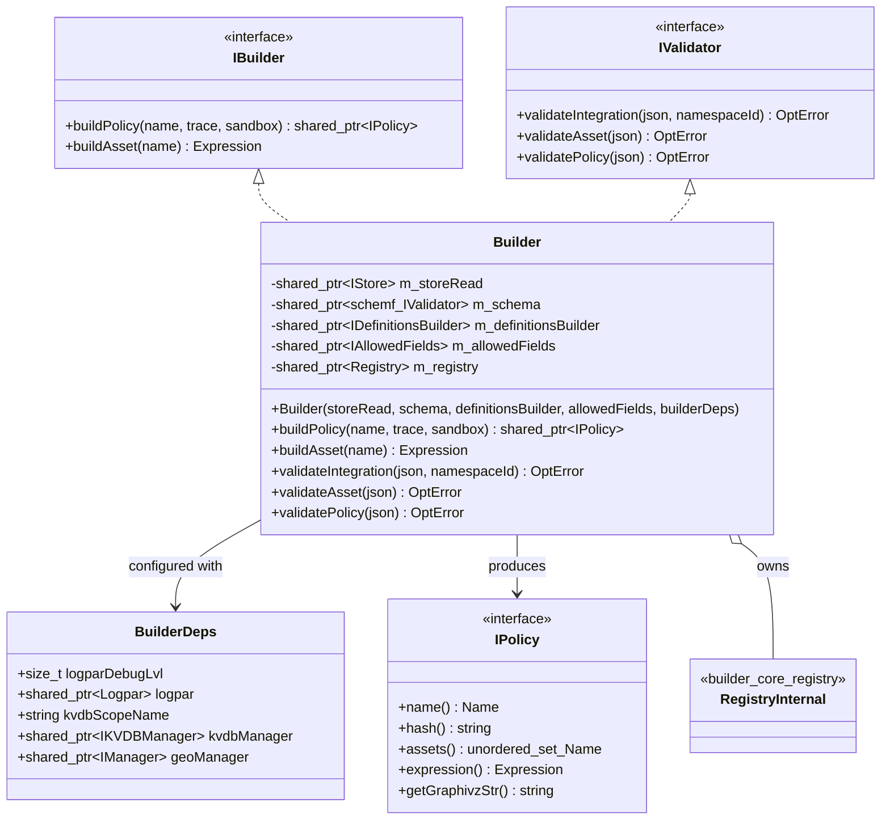
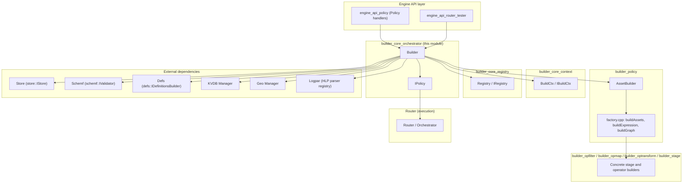
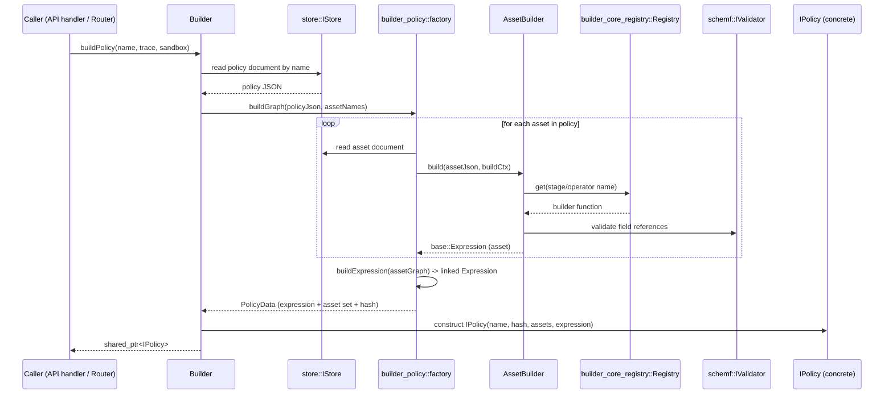
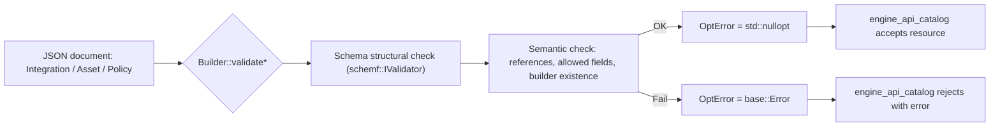
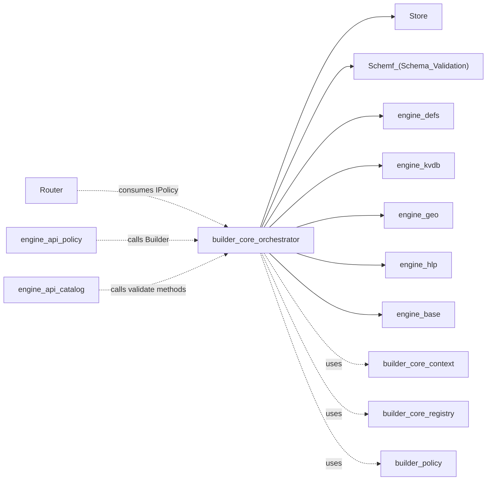

# Builder Core Orchestrator

## Introduction

The **Builder Core Orchestrator** is the central coordination layer of the Wazuh Engine's asset/policy compilation pipeline. It exposes the two primary public interfaces — `IBuilder` and `IValidator` — through a single concrete implementation, the `Builder` class, which acts as a **facade** over the engine's Store, Schema, Definitions, KVDB, Geo, and Builder Registry subsystems.

This module answers one core question for the rest of the Wazuh Engine: *"Given the name of an asset or policy stored in the Store, how do I turn it into an executable `base::Expression` (or a validated `IPolicy` object) that the runtime Router can execute?"*

It does **not** implement the low-level parsing/building logic for individual stages, operators, or helper functions — that responsibility belongs to sibling modules (`builder_core_registry`, `builder_opfilter`, `builder_opmap`, `builder_optransform`, `builder_stage`, `builder_policy`). Instead, the orchestrator wires all of those pieces together, owns the shared dependencies, and produces the final compiled artifacts (`IPolicy`, `base::Expression`) consumed by the [Router](Router.md) module.

---

## Purpose and Core Functionality

| Responsibility | Description |
|---|---|
| **Policy Building** | Reads a policy definition (by `base::Name`) from the Store and compiles it into an executable `IPolicy` object, including the full expression graph of all its assets. |
| **Asset Building** | Compiles a single asset (decoder, rule, output, filter) into a `base::Expression`, ignoring its parent/child relationships — used mainly for isolated testing. |
| **Validation** | Validates raw JSON definitions of Integrations, Assets, and Policies *without* fully building them, returning a `base::OptError` on failure. |
| **Dependency Aggregation** | Bundles together cross-cutting engine dependencies (KVDB manager, Geo manager, Logpar parser, Definitions builder, Schema validator, Allowed-Fields policy) needed by lower-level builders. |
| **Builder Registration Access** | Exposes the internal `Registry` of stage/operator builders (populated by `builder_core_registry`) to the build context so that asset builders can resolve helper functions by name. |

### What lives in `builder_core_orchestrator` vs. children

This module is the **parent-level orchestration** node in the `builder_core` hierarchy. It intentionally keeps only the two components that define the *public contract* of the builder subsystem:

- `Builder` / `BuilderDeps` — the concrete facade class and its dependency-injection struct.
- `IPolicy` — the interface for a compiled, executable policy artifact.

Everything else needed to actually perform a build (build context, registry, individual builders) is delegated to sibling/child modules:

- **`builder_core_context`** — `IBuildCtx` / `BuildCtx`: the per-build mutable state (definitions, registry pointer, validator, allowed fields, run state) threaded through every builder call.
- **`builder_core_registry`** — `Registry` / `IRegistry` / `registerOpBuilders` / `registerStageBuilders`: the name→builder-function lookup table.
- **`builder_policy`** — `Asset`, `AssetBuilder`, `factory.cpp` (`buildAssets`, `buildExpression`, `buildGraph`): the actual policy graph assembly logic invoked internally by `Builder::buildPolicy`.
- **`builder_opfilter`, `builder_opmap`, `builder_optransform`, `builder_stage`** — the concrete builder functions registered into the `Registry`.
- **`builder_argument_helper`** — argument parsing/validation utilities (`Reference`, `Value`, `assertRef`, etc.) used across builder functions.

See the parent overview in [builder_core](builder_core.md) for how these sibling modules relate to each other.

---

## Architecture

### Component Diagram

### Layered Position in the Engine

---

## Core Components

### `Builder` (builder.hpp)

The concrete implementation of both `IBuilder` and `IValidator`. It is constructed once at engine startup (see [engine_main](engine_main.md)) with all its dependencies injected, and then used repeatedly (thread-safely, as a read-mostly facade) to compile policies on demand — e.g., when the [Router](Router.md) needs to (re)load an environment, or when the [engine_api_policy](engine_api_policy.md) handlers need to validate a policy before persisting it to the Store.

Key responsibilities of each method:

| Method | Behavior |
|---|---|
| `buildPolicy(name, trace, sandbox)` | Reads the policy JSON from `m_storeRead`, resolves all referenced assets (and their parent/child graph) via `builder_policy`'s `factory.cpp` logic, links them into a single `base::Expression` graph, and wraps the result in a concrete `IPolicy` implementation. The `trace` flag enables per-asset tracing hooks; `sandbox` toggles test-mode behavior (e.g., relaxed validation for the `engine_test`/tester tooling). |
| `buildAsset(name)` | Builds a **single** asset in isolation (no parent chain), primarily used by asset-level unit testing tools (`engine_catalog validate`, `engine_test`). |
| `validateIntegration/Asset/Policy(json, ...)` | Performs schema + semantic validation of a raw JSON document without materializing a full `IPolicy`/`Expression` — used by the catalog API ([engine_api_catalog](engine_api_catalog.md)) before accepting a new/updated resource. |

### `BuilderDeps` (builder.hpp)

A plain dependency-injection struct passed to the `Builder` constructor. It decouples the `Builder` from having to know *how* to construct its collaborators — that responsibility lies with the engine bootstrap code (`engine_main`). Fields:

- `logparDebugLvl` / `logpar` — the shared HLP log-parsing registry (see [engine_hlp](engine_hlp.md) and `engine_logpar`), used by builders that need to parse structured log fields (e.g., the `parse` stage builder).
- `kvdbScopeName` / `kvdbManager` — access to the [engine_kvdb](engine_kvdb.md) subsystem for `kvdb_get`/`kvdb_match` style helper operators.
- `geoManager` — access to the [engine_geo](engine_geo.md) subsystem for GeoIP enrichment helpers.

### `IPolicy` (ipolicy.hpp)

The read-only, immutable output artifact of `Builder::buildPolicy`. Downstream consumers (primarily the [Router](Router.md) module's `EnvironmentBuilder`) only depend on this interface, never on `Builder` internals — this keeps the runtime execution path decoupled from the compilation path.

| Member | Purpose |
|---|---|
| `name()` | The policy's `base::Name` (namespace + identifier), used for routing and logging. |
| `hash()` | Content hash of the compiled policy, used by the Router/API to detect changes and avoid redundant reloads (see `getHash`/`version` in `engine_api_policy`'s `policyRep.hpp`). |
| `assets()` | The flattened set of all asset names that participate in this policy — used for dependency tracking and cache invalidation when an underlying asset changes in the Store. |
| `expression()` | The fully-linked `base::Expression` graph (see [engine_base](engine_base.md)) that the `bk` backend ([engine_bk](engine_bk.md)) executes against each incoming event. |
| `getGraphivzStr()` | Produces a Graphviz DOT representation of the expression graph — used by diagnostic/debug tooling (`engine_router` CLI graph inspection, `engine_integration generate_graph`). |

---

## Data Flow: Building a Policy

## Process Flow: Validation-Only Path

---

## Dependency Relationships

The orchestrator sits at a convergence point of several independently-documented subsystems. It **consumes** interfaces from these modules rather than reimplementing them:

| Dependency | Interface Used | Documentation |
|---|---|---|
| Store | `store::IStore` (read-only) | [Store](Store.md) |
| Schema Validation | `schemf::IValidator` | [Schemf_(Schema_Validation)](Schemf_(Schema_Validation).md) |
| Definitions | `defs::IDefinitionsBuilder` | [engine_defs](engine_defs.md) |
| KVDB | `kvdbManager::IKVDBManager` | [engine_kvdb](engine_kvdb.md) |
| Geo | `geo::IManager` | [engine_geo](engine_geo.md) |
| Log Parsing | `hlp::logpar::Logpar` | [engine_hlp](engine_hlp.md) |
| Expression graph primitives | `base::Expression`, `base::Name` | [engine_base](engine_base.md) |
| Build context (sibling) | `IBuildCtx` | `builder_core_context` (see [builder_core](builder_core.md)) |
| Builder registry (sibling) | `Registry<Builder>` | `builder_core_registry` (see [builder_core](builder_core.md)) |
| Policy assembly logic (cousin) | `AssetBuilder`, `factory.cpp` | `builder_policy` |
| Runtime consumer | `IPolicy` → linked into `Environment` | [Router](Router.md) |
| HTTP exposure | Policy/Catalog handlers call `Builder` | [engine_api_policy](engine_api_policy.md), [engine_api_catalog](engine_api_catalog.md) |

### Dependency Graph

---

## Usage in the Wider System

1. **Startup (`engine_main`)**: The engine's entry point constructs the `Store`, `Schemf` validator, `Definitions` builder, `KVDB` manager, `Geo` manager, and `Logpar` registry, populates a `BuilderDeps` struct, and instantiates a single `Builder`. This `Builder` (as `IBuilder`/`IValidator`) is then injected into the HTTP API layer and the `Router`.
2. **API-driven compilation ([engine_api_policy](engine_api_policy.md), [engine_api_catalog](engine_api_catalog.md))**: When a user creates/updates a policy or asset via the CLI tools (`engine_policy`, `engine_catalog` — see [Engine_Administration_CLI_Tools_(Python)](Engine_Administration_CLI_Tools_(Python).md)), the corresponding HTTP handler invokes `Builder::validatePolicy`/`validateAsset`/`validateIntegration` before persisting to the Store, and later `Builder::buildPolicy` when the policy needs to be activated on a route.
3. **Runtime activation ([Router](Router.md))**: The `EnvironmentBuilder` in the Router module calls `Builder::buildPolicy(name, trace, sandbox)` to obtain an `IPolicy`, then wraps its `expression()` into an `Environment` that the backend controller ([engine_bk](engine_bk.md)) executes per-event.
4. **Testing (`engine_test` tooling)**: The Python-based `engine_test`/`engine-suite` tools (see [Engine_Administration_CLI_Tools_(Python)](Engine_Administration_CLI_Tools_(Python).md)) drive the sandboxed build path (`sandbox=true`) to run individual assets/policies against sample events without affecting production routes.

---

## Summary

The `builder_core_orchestrator` module is intentionally minimal in surface area — two interfaces (`IBuilder`, `IValidator`) implemented by a single `Builder` facade class, plus the `IPolicy` output contract. Its value lies in **coordination**: it is the single entry point that ties together the Store, Schema, Definitions, KVDB, Geo, Logpar (HLP), build-context, and registry subsystems to produce validated, executable policy artifacts for the rest of the Wazuh Engine. Any change to how policies are compiled, validated, or linked should start by understanding this orchestrator and then drilling into the relevant sibling module (`builder_core_context`, `builder_core_registry`, or `builder_policy`) for implementation details.
