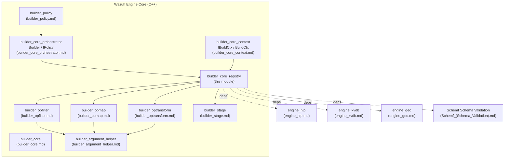
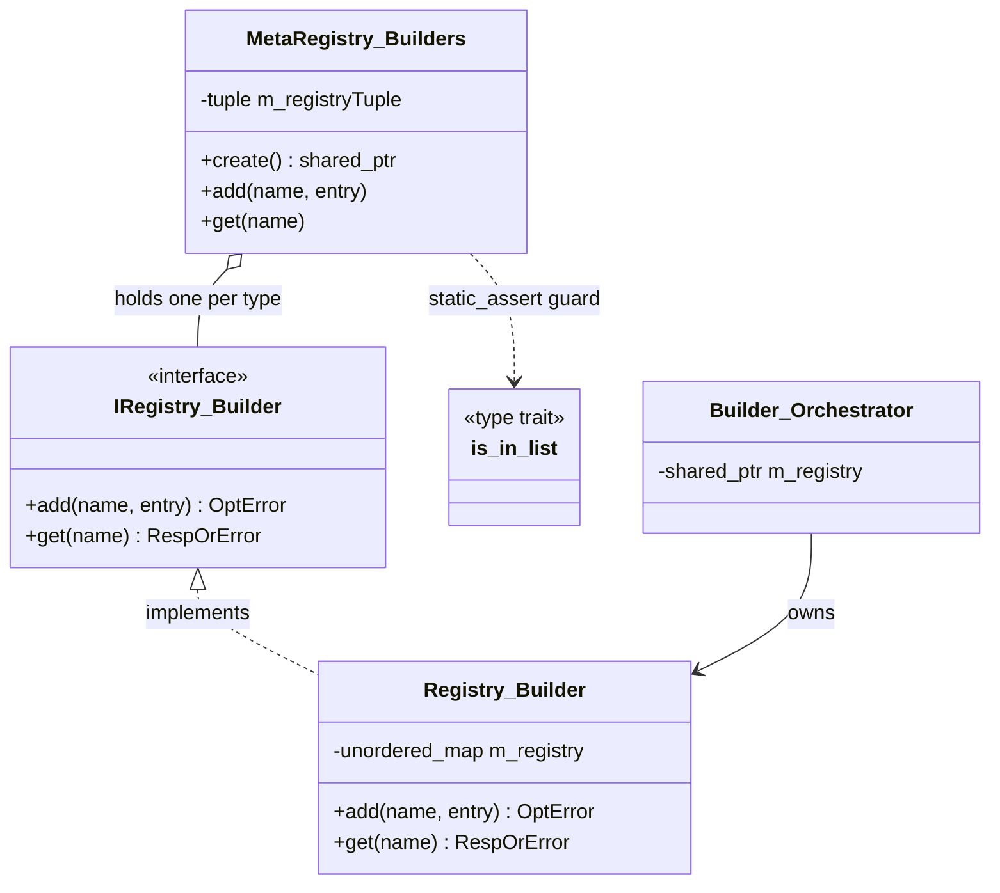
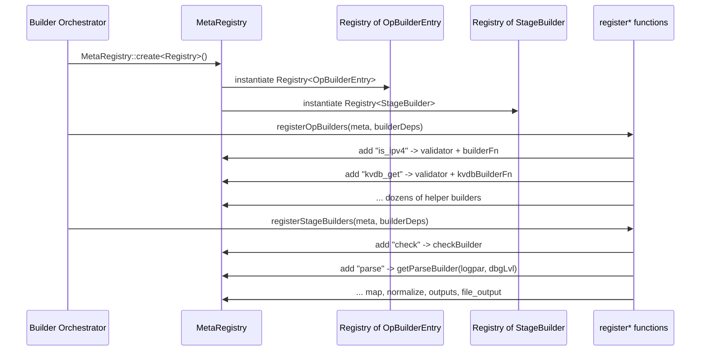
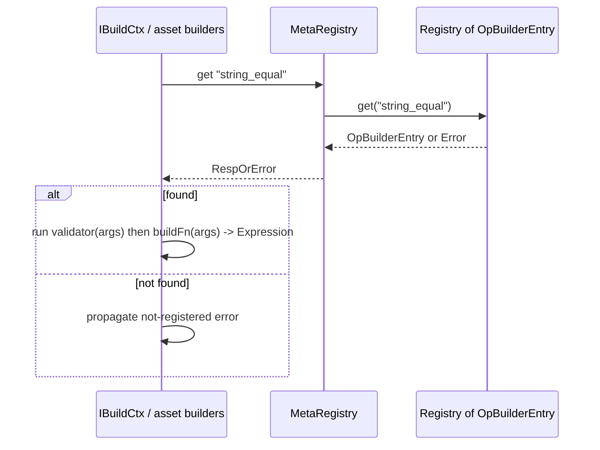

# Builder Core Registry

## 1. Purpose

The **Builder Core Registry** is the central lookup mechanism used by the Wazuh Engine's Builder subsystem (`builder_core.md`) to resolve the *name of an operation or stage* (as it appears in a decoder/rule/output asset definition) to the concrete C++ function ("builder") that knows how to translate that operation into a runtime `base::Expression` (`engine_base_expression.md`).

Every time the engine compiles an asset — e.g. a decoder containing `check:`, `map:`, or a helper function such as `+is_ipv4` — the `Builder` orchestrator (`builder_core_orchestrator.md`) asks the registry: *"give me the builder registered under this name"*. The registry itself does not know **how** to build anything; it is a pure name → builder association store. The actual construction logic lives in the many builder families documented separately (`builder_opfilter.md`, `builder_opmap.md`, `builder_optransform.md`, `builder_stage.md`, `builder_argument_helper.md`, `builder_policy.md`).

This module provides:

1. A generic, type-safe **registry interface** (`IRegistry<Builder>` and the variadic `MetaRegistry<Builders...>` helper) that can hold registries for multiple, unrelated builder types simultaneously (e.g. one registry for *operation builders*, another for *stage builders*) while enforcing at compile time that only known builder types can be registered/queried.
2. A concrete, in-memory **hash-map based implementation** (`Registry<Builder>`) of that interface.
3. **Bulk population functions** (`registerOpBuilders`, `registerStageBuilders`) that, given an empty registry and the shared `BuilderDeps` (KVDB manager, Geo manager, HLP/Logpar parser, etc.), register every built-in operator (`+is_ipv4`, `+concat`, `+kvdb_get`, ...) and every stage keyword (`check`, `map`, `normalize`, `parse`, `outputs`, ...) supported by the engine.

## 2. Where it fits in the system

The registry is instantiated once when the `Builder` object (`builder_core_orchestrator.md`) is constructed, populated via `registerOpBuilders`/`registerStageBuilders`, and then queried repeatedly (read-only) for the lifetime of the engine process whenever an asset, policy, or test session needs to be compiled.

## 3. Architecture

### 3.1 Class overview

Key design points:

* **`IRegistry<Builder>`** (`iregistry.hpp`) is a small, pure-virtual interface parametrized on the *Builder* type it stores (e.g. `builders::OpBuilderEntry`, `builders::StageBuilder`). It only exposes `add()` and `get()`, both returning `base::OptError` / `base::RespOrError` so lookup/registration failures are handled with the engine's standard error-result pattern instead of exceptions.
* **`detail::is_in_list<T, List...>`** is a compile-time type-list membership trait used to guarantee, via `static_assert`, that `MetaRegistry::add<Builder>()` / `get<Builder>()` are only ever called with a `Builder` type that the `MetaRegistry` was instantiated with. This turns a possible runtime bug (querying the wrong registry) into a compile error.
* **`MetaRegistry<Builders...>`** is a variadic helper that owns one `shared_ptr<IRegistry<Builder>>` per `Builder` type in its template parameter pack, stored in a `std::tuple`. It is created through the static factory `MetaRegistry::create<Registry>()`, which instantiates one concrete `Registry<Builder>` object per type. This allows the engine to keep a *single* meta-object that can dispatch, in a type-safe way, to independent registries for operation builders and stage builders.
* **`Registry<Builder>`** (`registry.hpp`) is the concrete, straightforward implementation of `IRegistry<Builder>` backed by an `std::unordered_map<std::string, Builder>`. Registration fails (returns an error, no exception) if the name is already taken; lookup fails if the name is not found. Both error paths embed the offending name in the message for easier diagnostics.
* **`registerOpBuilders` / `registerStageBuilders`** (`register.hpp`) are free template functions that take any registry-like object exposing `template add<T>(name, entry)` and populate it with the engine's complete catalog of built-in operator helpers and stage keywords, wiring in the runtime dependencies (`BuilderDeps`: KVDB manager/scope, Geo manager, Logpar/HLP parser) required by some builders (e.g. `kvdb_get`, `geoip`, `parse_*`).

### 3.2 Registration flow (build time)

### 3.3 Lookup flow (asset compilation time)

## 4. Core Components

| Component | File | Responsibility |
|---|---|---|
| `IRegistry<Builder>` | `src/engine/source/builder/src/iregistry.hpp` | Abstract contract for adding/getting builders of a given type. |
| `detail::is_in_list<T, List...>` | `src/engine/source/builder/src/iregistry.hpp` | Compile-time trait ensuring type-safety in `MetaRegistry`. |
| `MetaRegistry<Builders...>` | `src/engine/source/builder/src/iregistry.hpp` | Aggregates one `IRegistry` per builder type; single entry point used by the rest of the builder subsystem. |
| `Registry<Builder>` | `src/engine/source/builder/src/registry.hpp` | Concrete `unordered_map`-backed implementation of `IRegistry<Builder>`. |
| `builder::Builder::Registry` (forward declaration) | `src/engine/source/builder/include/builder/builder.hpp` | Private nested type used by the top-level `Builder` orchestrator to hold its registries (implemented via the classes above). See `builder_core_orchestrator.md`. |
| `registerOpBuilders` | `src/engine/source/builder/src/register.hpp` | Registers every operation/helper builder (`filter`, `exists`, `is_*`, `string_*`, `int_*`, `array_*`, `kvdb_*`, `parse_*`, `geoip`, `as`, `merge*`, `rename`, `concat*`, `replace`, `trim`, `to_int`, `get_date`, ...). |
| `registerStageBuilders` | `src/engine/source/builder/src/register.hpp` | Registers every stage keyword builder (`check`, `map`, `normalize`, `rule_normalize`, `parse`, `outputs`, `file_output`; `indexer_output` is currently disabled pending indexer-connector unification). |

## 5. Interaction with dependent builder families

The `register*` functions are the single place in the codebase that "wires together" the registry with the concrete builder implementations that live in sibling modules:

* **`builder_opfilter.md`** — supplies filter/condition builders such as `opBuilderHelperStringEqual`, `existsBuilder`, `opBuilderHelperIPCIDR`, registered under names like `string_equal`, `exists`, `ip_cidr_match`.
* **`builder_opmap.md`** — supplies value-producing map/helper builders such as `mapBuilder`, `opBuilderHelperStringConcat`, `getOpBuilderKVDBGet`, registered under `map`, `concat`, `kvdb_get`, etc. This is also where the KVDB (`engine_kvdb.md`) and Geo (`engine_geo.md`) dependencies from `BuilderDeps` are injected into the corresponding builder factories (`getOpBuilderKVDBGet(deps.kvdbManager, deps.kvdbScopeName)`, `getMMDBGeoBuilder(deps.geoManager)`).
* **`builder_optransform.md`** — supplies transform builders (`array_append*`, HLP-parser-based `parse_*` builders) using `engine_hlp.md`'s `Logpar` instance from `BuilderDeps`.
* **`builder_stage.md`** — supplies the top-level stage builders (`checkBuilder`, `mapBuilder` (stage-level), `normalizeBuilder`, `outputsBuilder`, `fileOutputBuilder`, `getParseBuilder`).
* **`builder_argument_helper.md`** — provides shared argument parsing/validation utilities (`Reference`, `Value`, `assertSize`, `getTermParser`) consumed internally by many of the builder functions registered here.

Because `register.hpp` only depends on the *headers* of these builder families (not vice-versa), the registry module acts as a **composition root**: it is the only file that needs to change when a new operator or stage keyword is added to the engine.

## 6. Error Handling

All registry operations return `base::OptError` (for mutating operations) or `base::RespOrError<Builder>` (for lookups) rather than throwing. Typical failure modes:

* **Duplicate registration** — `add()` returns `Error{"Builder '<name>' already registered"}`. This can only happen if `registerOpBuilders`/`registerStageBuilders` is invoked twice on the same registry, or if two builders accidentally use the same name.
* **Unknown builder name** — `get()` returns `Error{"Builder '<name>' not registered"}`. This surfaces to the end user as a compile-time asset error (e.g. "Builder 'foo_bar' not registered") when an asset references a helper or stage keyword that does not exist.

## 7. Relationship to Overall Engine Build Pipeline

For the broader context of how the registry participates in policy/asset compilation (context creation, expression graph assembly, validation), see:

* `builder_core.md` — parent module overview tying together context, orchestrator, and registry.
* `builder_core_context.md` — `IBuildCtx`/`BuildCtx`, the per-build state that queries this registry while walking asset definitions.
* `builder_core_orchestrator.md` — the top-level `Builder`/`IPolicy` API that owns the registry instance and drives the overall compilation process described in this document.
* `builder_policy.md` — policy/asset graph assembly that ultimately consumes expressions produced via registry-resolved builders.
