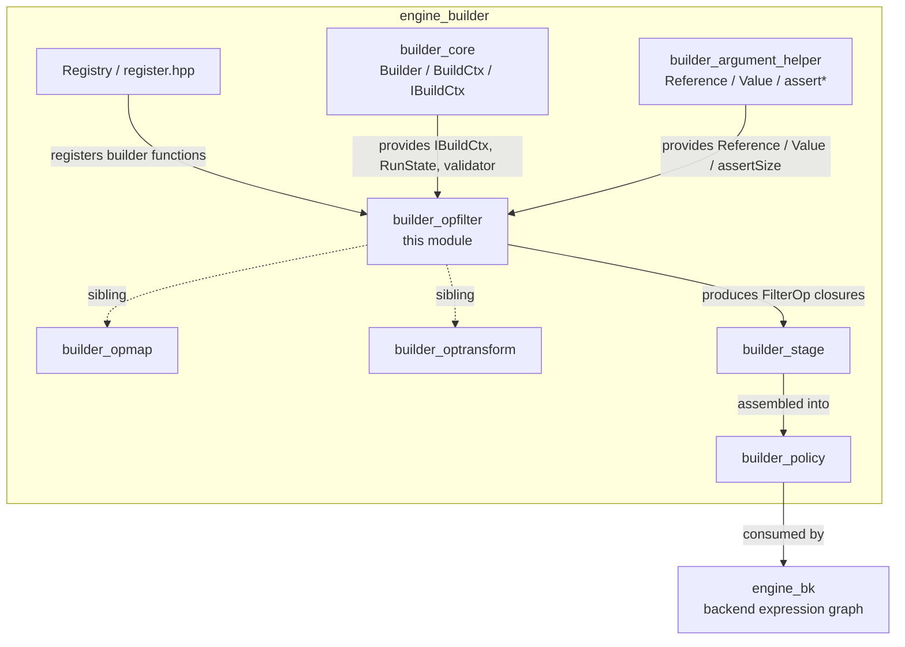
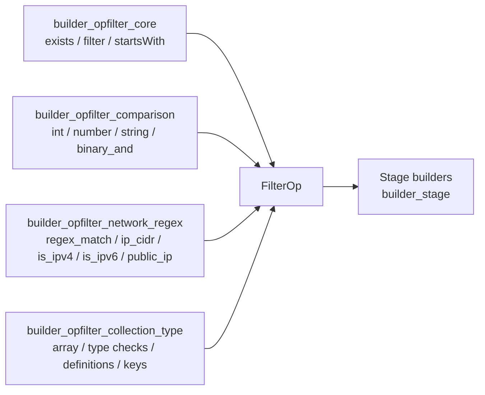
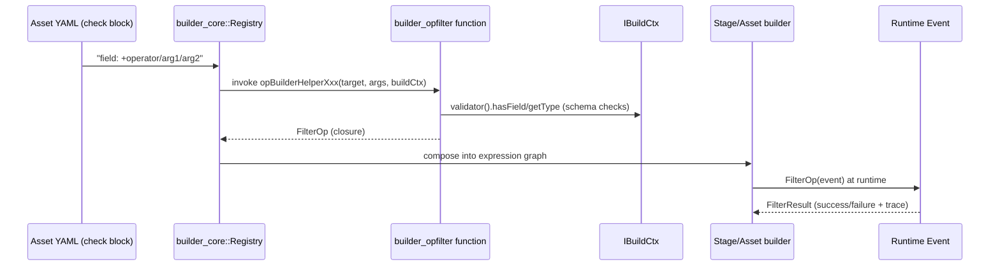

# builder_opfilter — Engine Filter Operator Builders

## 1. Purpose

`builder_opfilter` is a leaf module of the Wazuh **Engine Builder** subsystem
(part of [Wazuh_Engine_Core_(C++)](Wazuh_Engine_Core_(C++).md) →
[builder_core](builder_core.md) family, sibling of
[builder_opmap](builder_opmap.md), [builder_optransform](builder_optransform.md),
[builder_stage](builder_stage.md) and [builder_argument_helper](builder_argument_helper.md)).

Its responsibility is narrow but essential: it implements every **filter-type
operator** ("op-filter") that can appear in a decoder/rule/output asset
condition block of the Wazuh Engine's declarative language. A filter operator
evaluates a boolean condition against an incoming event and produces a
`FilterResult` (success/failure) instead of transforming the event — this is
what distinguishes it from the sibling `builder_opmap` (value-producing
operators) and `builder_optransform` (event-mutating operators).

Typical asset syntax handled by this module:

```yaml
check:
  - source.ip: +is_ipv4
  - event.code: +int_greater/100
  - user.name: +match_value/$allowed_users
  - message: +regex_match/^ERROR.*
```

Every one of these `+operator/args` expressions is resolved, at build time,
to a concrete C++ closure (`FilterOp`) by one of the builder functions in this
module. The resulting closures are composed into the runtime expression graph
by [builder_core](builder_core.md) and executed for every event that flows
through the [Wazuh Engine](Wazuh_Engine_Core_(C++).md) pipeline.

## 2. Architecture Overview



### Sub-module composition



Each source file in this module registers one or more **builder functions**.
A builder function has the signature:

```cpp
FilterOp builderFn(const Reference& targetField,
                    const std::vector<OpArg>& opArgs,
                    const std::shared_ptr<const IBuildCtx>& buildCtx);
```

It receives the target field reference (the YAML key), the parsed arguments
(the YAML value, split on `/`), and the shared build context (schema
validator, run state, tracing name). It returns a `FilterOp` — a
`std::function<FilterResult(base::ConstEvent)>` closure capturing everything
it needs to evaluate the condition at runtime with minimal overhead (no
re-parsing, pre-resolved schema types, pre-formatted trace strings).

## 3. Data / Build Flow



Key characteristics of the build flow:
- **Fail fast at build time**: type/argument errors (wrong parameter count,
  wrong value type, invalid regex, malformed CIDR/hex mask, schema type
  mismatch) throw `std::runtime_error` immediately when the asset is
  compiled, not at runtime.
- **Zero-copy tracing**: all trace strings (`successTrace`, `failureTrace*`)
  are pre-formatted with `fmt::format` once during the build phase and
  captured by value in the closure, avoiding string formatting on the hot
  path.
- **RETURN_SUCCESS / RETURN_FAILURE macros**: used throughout to produce
  `FilterResult` with consistent tracing/run-state bookkeeping (see
  [builder_core](builder_core.md) for `RunState` and result plumbing).

## 4. Sub-modules

| Sub-module | File(s) | Responsibility |
|---|---|---|
| [builder_opfilter_core](builder_opfilter_core.md) | `exists.cpp`, `filter.cpp`, `startsWith.cpp` | Fundamental filters: field existence (`exists`/`not_exists`), generic equality against value or reference (`filter`), and string prefix matching (`starts_with`). These back the plain `field: value` and `field: $ref` shorthand syntax as well as explicit operators. |
| [builder_opfilter_comparison](builder_opfilter_comparison.md) | `opBuilderHelperFilter.cpp` (comparison section) | Typed relational/equality operators for integers, doubles/numbers and strings (`+int_equal`, `+int_greater`, `+string_less_or_equal`, `+contains`, `+starts_with`, `binary_and`, etc.), each supporting both literal values and event references, with schema-aware validation. |
| [builder_opfilter_network_regex](builder_opfilter_network_regex.md) | `opBuilderHelperFilter.cpp` (regex/IP section) | Pattern and network-address filters: RE2-based `+regex_match`/`+regex_not_match`, CIDR containment (`+ip_cidr_match`), public/private IP classification (`+public_ip`), and IPv4/IPv6 syntax checks (`+is_ipv4`, `+is_ipv6`). |
| [builder_opfilter_collection_type](builder_opfilter_collection_type.md) | `opBuilderHelperFilter.cpp` (array/type/definition section) | Structural checks: array membership (`+array_contains*`), JSON type predicates (`+is_number`, `+is_array`, `+is_object`, `+is_null`, and their negations), definition-driven lookups (`+match_value`, `+exists_key_in`, `+keys_exist_in_list`), string suffix (`+end_with`) and the test-session helper (`+is_test_session`). |

## 5. Relationship to the Rest of the Engine

- **Upstream dependency**: [builder_core](builder_core.md) supplies
  `IBuildCtx`/`BuildCtx` (schema validator, run-state, naming) and the
  `Registry` that maps operator names (e.g. `int_equal`) to the builder
  functions defined here. [builder_argument_helper](builder_argument_helper.md)
  supplies the `Reference`/`Value` argument types and `utils::assertSize` /
  `utils::assertValue` helpers used pervasively for argument validation.
- **Peer modules**: [builder_opmap](builder_opmap.md) implements the mapping
  (value-producing) counterparts (e.g. `+kvdb_get`, `+string_concat`).
  [builder_optransform](builder_optransform.md) implements event-mutating
  operators (parsing helpers, array append, Windows SID lookups).
  [builder_stage](builder_stage.md) assembles `check`, `parse`, and
  `output` stages using operators from all three families.
- **Downstream consumer**: [builder_policy](builder_policy.md) and
  [engine_bk](engine_bk.md) compile the resulting `FilterOp`/`MapOp` closures
  into the executable expression graph (`base::Expression`) that the
  [Router](Router.md) dispatches events through at runtime.
- **Runtime primitives**: filters rely on [engine_base](engine_base.md) for
  `base::Expression`, `base::Result`, IP utilities, and on
  [Schemf_(Schema_Validation)](Schemf_(Schema_Validation).md) (`IValidator`)
  for field-type checks performed at build time.

## 6. Common Design Patterns Used

- **Value vs. Reference dual dispatch**: nearly every operator inspects
  `opArgs[i]->isValue()` to decide whether it is comparing against a literal
  or another event field, generating a specialized closure for each case to
  avoid runtime branching.
- **Schema-aware early validation**: when the right-hand side is a
  `Reference`, the builder consults `buildCtx->validator()` to ensure the
  referenced field's declared schema type is compatible with the operator
  (e.g. `+int_equal` requires `Type::INTEGER`), throwing a build-time error
  otherwise.
- **Negation via shared implementation**: pairs like
  `exists`/`not_exists`, `is_number`/`is_not_number`, `array_contains`/
  `array_not_contains` share a single parametrized implementation
  (`exists(...)`, `typeMatcher(...)`, `opBuilderHelperArrayPresence(...)`)
  toggled by a boolean flag, minimizing duplication.
