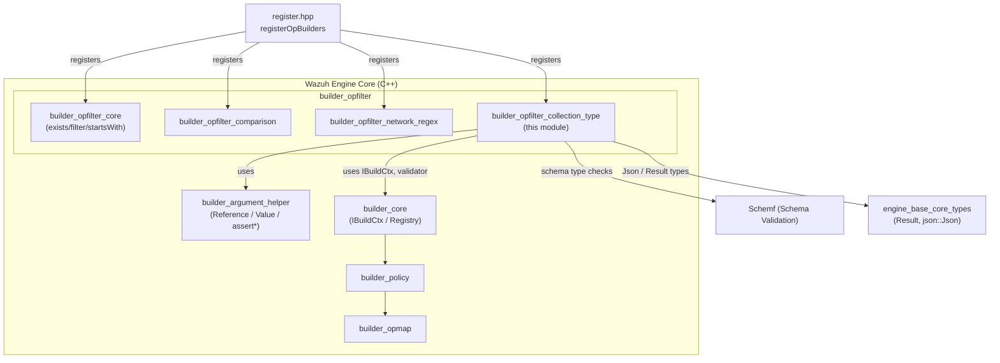
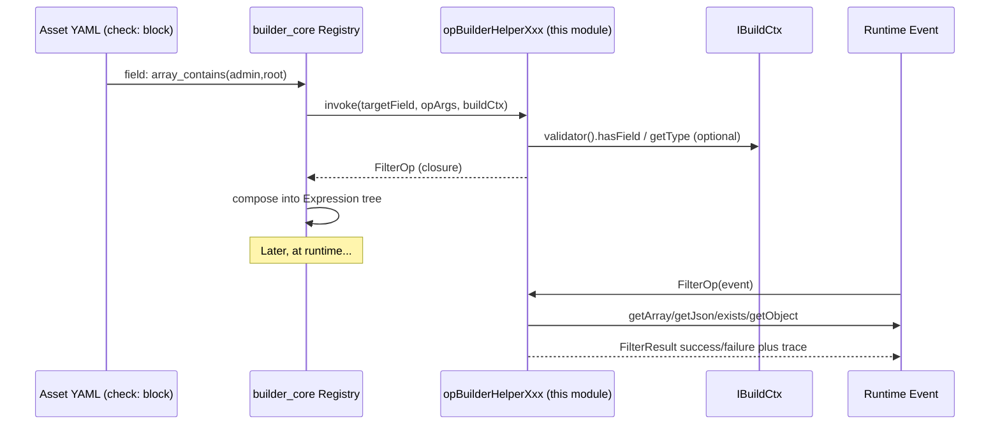
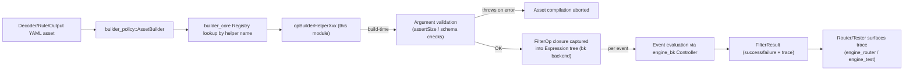
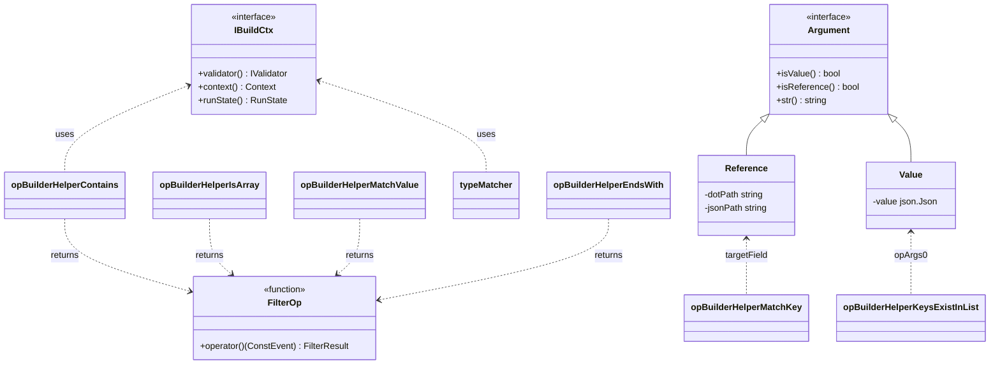

# Builder OpFilter Collection & Type Helpers

## Introduction

`builder_opfilter_collection_type` is a leaf sub-module of the [Wazuh Engine](Wazuh_Engine_Core_(C++).md) **Builder** component. It implements the concrete C++ logic for the family of *filter operator helpers* (`opBuilderHelper*`) that a decoder/rule/output asset can invoke to make **collection** (array/object) assertions and **JSON-type** assertions about a field of an event during policy evaluation.

These helpers are the run-time building blocks behind YAML expressions such as:

```yaml
check:
  - field: array_contains(admin, root)
  - field: is_array
  - field: is_not_null
  - field: exists_key_in($allowed_keys)
  - field: ends_with(.log)
```

All functions in this module share the same contract: given a target field reference and a list of operator arguments (`OpArg`), they return a `FilterOp` — a closure that, when invoked with an event, evaluates to a `FilterResult` (success/failure + trace message). This is the same `FilterOp`/`FilterResult` contract used by the sibling modules [builder_opfilter_comparison](builder_opfilter_comparison.md) and [builder_opfilter_network_regex](builder_opfilter_network_regex.md), all three of which are implemented in the single source file `opBuilderHelperFilter.cpp`.

This module is entirely implemented in one file:

- `src/engine/source/builder/src/builders/opfilter/opBuilderHelperFilter.cpp`

It has no headers/classes of its own; instead it contributes 20 free functions to the **opfilter builder registry** (see [builder_opfilter](builder_opfilter.md) and [builder_core](builder_core.md)).

## Scope of this Module

| Category | Helpers |
|---|---|
| Array membership | `opBuilderHelperContains`, `opBuilderHelperContainsAny`, `opBuilderHelperNotContains`, `opBuilderHelperNotContainsAny` |
| JSON type assertions | `opBuilderHelperIsArray` / `opBuilderHelperIsNotArray`, `opBuilderHelperIsObject` / `opBuilderHelperIsNotObject`, `opBuilderHelperIsNumber` / `opBuilderHelperIsNotNumber`, `opBuilderHelperIsString` / `opBuilderHelperIsNotString`, `opBuilderHelperIsBool` / `opBuilderHelperIsNotBool`, `opBuilderHelperIsNull` / `opBuilderHelperIsNotNull` |
| Definition-driven matching | `opBuilderHelperMatchValue`, `opBuilderHelperMatchKey`, `opBuilderHelperKeysExistInList` |
| String suffix | `opBuilderHelperEndsWith` |
| Test/session context | `opBuilderHelperIsTestSession` |

Everything else in `opBuilderHelperFilter.cpp` (numeric/string comparisons, IP/CIDR/regex checks) belongs to the neighboring modules [builder_opfilter_comparison](builder_opfilter_comparison.md) and [builder_opfilter_network_regex](builder_opfilter_network_regex.md) and is **not** documented here, though it is mentioned for context since it lives in the same translation unit and shares private helpers (e.g., `opBuilderComparison`, `getStringCmpFunction`).

## Architecture Context



The module fits into the broader Wazuh source tree as follows (see the full repository breakdown in the parent [Wazuh_Engine_Core_(C++)](Wazuh_Engine_Core_(C++).md) documentation):

- Parent: `builder_opfilter` → `engine_builder` → `Wazuh_Engine_Core_(C++)`
- Siblings: `builder_opfilter_core`, `builder_opfilter_comparison`, `builder_opfilter_network_regex`
- Cousins used at build time: `builder_argument_helper` (argument parsing: `Reference`, `Value`, `assertSize`/`assertValue`), `builder_core` (`IBuildCtx`, `Registry`, `RunState`)
- Downstream consumer: `builder_policy` and `builder_core_orchestrator`, which assemble assets into an `Expression` tree that the [engine_bk](Wazuh_Engine_Core_(C++).md) backend executes.

## Core Concepts

### The `FilterOp` / `FilterResult` Contract

Every helper function has the signature:

```cpp
FilterOp opBuilderHelperXxx(const Reference& targetField,
                            const std::vector<OpArg>& opArgs,
                            const std::shared_ptr<const IBuildCtx>& buildCtx);
```

- `targetField` — a [`Reference`](builder_argument_helper.md) wrapping the dot-path/json-path of the field being tested (the YAML map key).
- `opArgs` — a vector of `OpArg` (`std::shared_ptr<Argument>`), each either a `Value` (literal JSON) or a `Reference` (pointer to another event field). Defined in `builder_argument_helper`.
- `buildCtx` — the [`IBuildCtx`](builder_core.md) build-time context, exposing the schema `validator()`, `context().opName` (used for trace messages), and `runState()` (used at runtime for tracing/sandbox flags).

The function does two things:
1. **Build-time validation** — argument count/type checks (`utils::assertSize`, `utils::assertValue`), and, where applicable, schema-based type checks against `buildCtx->validator()` (see [Schemf_(Schema_Validation)](Wazuh_Engine_Core_(C++).md)). Invalid configurations throw `std::runtime_error`, which aborts asset compilation.
2. **Runtime closure** — returns a lambda (`FilterOp`) capturing all pre-computed data (target path, resolved literal values, trace strings) so that per-event evaluation is as cheap as possible. Runtime failures never throw; they return a `FilterResult` carrying a `bool` and a human-readable trace string used by `engine-test`/tracing tools ([engine_test](Engine_Administration_CLI_Tools_(Python).md)).



### Common Internal Helper: `opBuilderHelperArrayPresence`

`opBuilderHelperContains`, `opBuilderHelperContainsAny`, `opBuilderHelperNotContains`, and `opBuilderHelperNotContainsAny` are all thin wrappers around a shared private function `opBuilderHelperArrayPresence(targetField, opArgs, atleastOne, presenceCheck, buildCtx)`:

| Public helper | `atleastOne` | `presenceCheck` | Semantics |
|---|---|---|---|
| `opBuilderHelperContains` | `false` | `true` | All listed values must be present in the target array (AND) |
| `opBuilderHelperContainsAny` | `true` | `true` | At least one listed value must be present (OR) |
| `opBuilderHelperNotContains` | `true` | `false` | Succeeds if **any** listed value is absent |
| `opBuilderHelperNotContainsAny` | `false` | `false` | Succeeds only if **none** of the listed values are present |

Each argument in `opArgs` may itself be a `Value` (literal JSON) or a `Reference` (resolved from the event at runtime), allowing dynamic comparisons like `array_contains($some.other.field)`.

### Common Internal Helper: `typeMatcher`

All twelve `is_*`/`is_not_*` type helpers delegate to a private `typeMatcher(targetField, opArgs, buildCtx, json::Json::Type type, bool negated)` function that:
1. Asserts zero extra parameters (`utils::assertSize(opArgs, 0)`).
2. Checks `event->exists(targetField)` — if absent, the filter fails ("Target field not found").
3. Compares `event->type(targetField) == type`, XOR-ed with `negated`, to decide success/failure.

This single implementation guarantees consistent trace-message wording and eliminates code duplication across the 12 type-check helpers.

## Function Reference

### Array / Collection Membership

- **`opBuilderHelperContains(targetField, opArgs, buildCtx)`** — YAML: `+array_contains/v1/v2/...`. Succeeds only if the array at `targetField` contains **every** value/reference listed.
- **`opBuilderHelperContainsAny(targetField, opArgs, buildCtx)`** — YAML: `+array_contains_any/v1/v2/...`. Succeeds if the array contains **at least one** of the listed values.
- **`opBuilderHelperNotContains(targetField, opArgs, buildCtx)`** — YAML: `+array_not_contains/v1/v2/...`. Succeeds if the array is missing **at least one** of the listed values.
- **`opBuilderHelperNotContainsAny(targetField, opArgs, buildCtx)`** — YAML: `+array_not_contains_any/v1/v2/...`. Succeeds only if the array contains **none** of the listed values.

All four require `targetField` to exist and resolve to a JSON array; otherwise the filter fails with a descriptive trace ("not found" / "is not an array").

### JSON Type Assertions

- `opBuilderHelperIsArray` / `opBuilderHelperIsNotArray`
- `opBuilderHelperIsObject` / `opBuilderHelperIsNotObject`
- `opBuilderHelperIsNumber` / `opBuilderHelperIsNotNumber`
- `opBuilderHelperIsString` / `opBuilderHelperIsNotString`
- `opBuilderHelperIsBool` / `opBuilderHelperIsNotBool`
- `opBuilderHelperIsNull` / `opBuilderHelperIsNotNull`

All take no parameters and simply check the JSON type of `targetField` against `json::Json::Type::{Array,Object,Number,String,Boolean,Null}` via `typeMatcher`. If the field does not exist at all, the check fails regardless of negation ("Target field not found").

### Definition-Driven Matching

- **`opBuilderHelperMatchValue(targetField, opArgs, buildCtx)`** — YAML: `+match_value/$definition_array` or `+match_value/$ref`. The single argument must resolve to a JSON array (either a literal `Value` array or a `Reference` to an array field). Succeeds if the value at `targetField` is found (via `==`) inside that array. Performs build-time schema validation when the argument is a reference (`validator().isArray(...)`).

- **`opBuilderHelperMatchKey(targetField, opArgs, buildCtx)`** — YAML: `+exists_key_in/$definition_object` or `+exists_key_in/$ref`. `targetField` must be a **string** holding a JSON pointer path; the helper checks whether that path exists inside the object supplied as the parameter (either a literal object `Value` or an object `Reference`). Used for allow-list/deny-list lookups where the key name itself is dynamic.

- **`opBuilderHelperKeysExistInList(targetField, opArgs, buildCtx)`** — YAML: `+keys_exist_in_list/$list_value` or `+keys_exist_in_list/$list_reference`. `targetField` must resolve to a JSON **object**; the helper builds a set of "expected keys" from a literal string array or a referenced array of strings, then verifies **every key** present in the target object also exists in the expected-keys set (essentially an allow-list validation for object keys). Fails fast if the target has more keys than the expected set, or if any key is not found in it.

### String Suffix Check

- **`opBuilderHelperEndsWith(targetField, opArgs, buildCtx)`** — YAML: `+end_with/value` or `+end_with/$ref`. Validates (at build time, when possible) that a referenced parameter is of schema type `KEYWORD` or `TEXT`. At runtime, both `targetField` and the parameter must resolve to strings; success occurs when `targetField` ends with the parameter string (`base::utils::string::endsWith`).

### Test/Session Context

- **`opBuilderHelperIsTestSession(targetField, opArgs, buildCtx)`** — YAML: `+is_test_session`. Takes no parameters and ignores `targetField`/the event entirely; it inspects `buildCtx->runState()->sandbox` (a build-time captured flag) to determine whether the currently executing pipeline is a **test/sandbox session** (as opposed to production). Useful for conditionally enabling debug-only enrichment or alerts only during `engine-test` sessions (see [engine_test](Engine_Administration_CLI_Tools_(Python).md) and `IBuildCtx::runState()`).

## Data Flow: From YAML to Filter Result



1. An asset (decoder, rule, or output) defines a `check`/`parse` stage referencing one of these helper names (e.g. `is_array`, `array_contains`).
2. The [builder_core](builder_core.md) `Registry` (populated by `register.hpp::registerOpBuilders`) resolves the helper name to the corresponding `opBuilderHelperXxx` function in this module.
3. The function performs **build-time** checks (argument count, argument types, optional schema type compatibility via [Schemf_(Schema_Validation)](Wazuh_Engine_Core_(C++).md)) and returns a `FilterOp` closure.
4. The closure is embedded into the asset's `Expression` graph, compiled by [engine_bk](Wazuh_Engine_Core_(C++).md) (`rx` or `taskf` backend) as part of the overall [builder_policy](Wazuh_Engine_Core_(C++).md) pipeline.
5. At event-processing time, the `Router`/`Orchestrator` (see [Router](Wazuh_Engine_Core_(C++).md)) invokes the compiled expression per incoming event; each `FilterOp` reads `event->exists/getArray/getObject/type/...` and returns a `FilterResult` used to short-circuit AND/OR expression evaluation.
6. Trace strings produced here surface through `engine-test`/`engine_router` tester tooling for debugging asset behavior ([Engine_Administration_CLI_Tools_(Python)](Engine_Administration_CLI_Tools_(Python).md)).

## Component Relationships



## Error Handling & Validation Strategy

| Stage | Failure mode | Behavior |
|---|---|---|
| Build-time | Wrong argument count | `utils::assertSize` throws `std::runtime_error`, asset fails to compile |
| Build-time | Reference points to a schema field of incompatible type (e.g., `array_contains` target expected array, schema says string) | Helper throws `std::runtime_error` with descriptive message including expected vs actual type |
| Build-time | Literal parameter has wrong JSON type (e.g., `match_value` expects array literal) | Throws `std::runtime_error` |
| Runtime | Target field missing from event | `FilterResult` failure with trace `"Target field '<path>' not found"` |
| Runtime | Target field wrong runtime type (e.g., not actually an array despite passing schema check) | `FilterResult` failure with a specific trace message |
| Runtime | Referenced comparison value missing | `FilterResult` failure with trace `"Reference not found"` |

This two-phase validation (throw at build vs. return-failure at runtime) mirrors the pattern used throughout [builder_opfilter](Wazuh_Engine_Core_(C++).md) and [builder_opmap](Wazuh_Engine_Core_(C++).md): configuration mistakes are caught early (during `engine-catalog`/`engine-policy` validation), while data-shape mismatches at runtime are treated as ordinary filter failures rather than crashes.

## Related Modules

- [builder_opfilter_core](Wazuh_Engine_Core_(C++).md) — `exists`, `not_exists`, generic `filter`/`startsWith` builders (siblings in the same `opfilter` group).
- [builder_opfilter_comparison](Wazuh_Engine_Core_(C++).md) — numeric/string relational operators (`==`, `!=`, `<`, `>`, `starts_with`, `contains` for strings, `binary_and`), implemented in the *same source file* as this module.
- [builder_opfilter_network_regex](Wazuh_Engine_Core_(C++).md) — regex match/not-match and IP/CIDR/public-IP checks, also co-located in `opBuilderHelperFilter.cpp`.
- [builder_argument_helper](Wazuh_Engine_Core_(C++).md) — defines `Reference`, `Value`, `Argument`, and shared assertion utilities (`assertSize`, `assertValue`) used by every helper in this module.
- [builder_core](Wazuh_Engine_Core_(C++).md) — `IBuildCtx`, `Registry`, `RunState`; the framework that discovers and invokes these helper-builder functions.
- [builder_opmap](Wazuh_Engine_Core_(C++).md) — the analogous *map* (transform) operator helpers, as opposed to *filter* (boolean) operators documented here.
- [builder_policy](Wazuh_Engine_Core_(C++).md) — assembles assets (which reference these helpers) into policy graphs.
- [Wazuh_Engine_Core_(C++)](Wazuh_Engine_Core_(C++).md) — top-level module containing the full Engine architecture, including `engine_base` (`json::Json`, `Result`), `engine_bk` (expression backend), and `Schemf_(Schema_Validation)` (schema-aware type validation used at build time).
- [Engine_Administration_CLI_Tools_(Python)](Engine_Administration_CLI_Tools_(Python).md) — `engine-test`/`engine-policy` tools used to exercise and debug assets that invoke these filter helpers.
