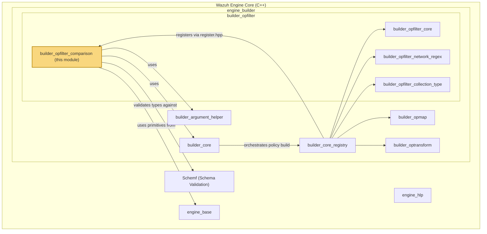
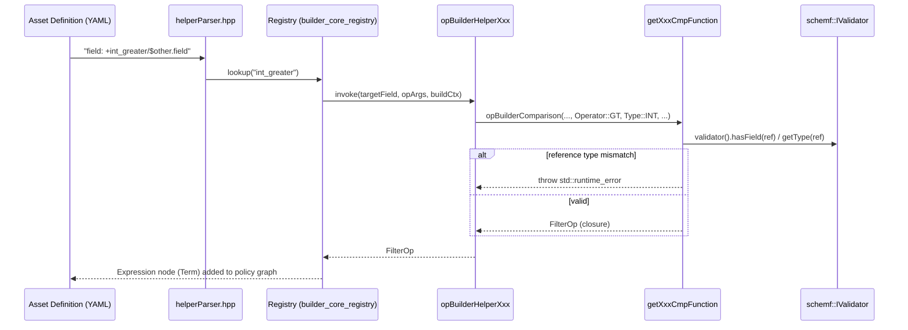
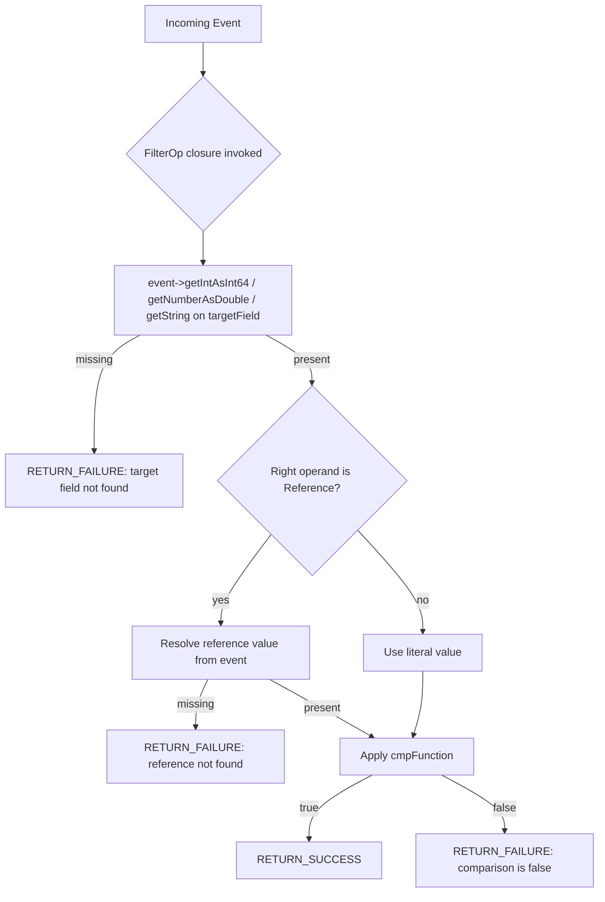

# builder_opfilter_comparison

## Introduction

`builder_opfilter_comparison` is a leaf module of the Wazuh **Engine** (see [Wazuh_Engine_Core_(C++).md](Wazuh_Engine_Core_(C++).md)) that implements the family of **comparison and simple filter helper functions** used by the Engine's decoder/rule DSL. These helper functions are the primitives that let an asset definition express conditions such as *"field X equals value Y"*, *"field X is greater than field Y"*, or *"field X starts with a literal string"*.

All the components documented here live in a single translation unit, `opBuilderHelperFilter.cpp`, and are registered into the Engine's operation registry so that they can be referenced from YAML/JSON asset definitions using the `+helper_name` syntax (e.g. `field: +int_equal/5`). At runtime, each helper compiles down to a `FilterOp` — a `std::function` that evaluates a boolean condition against an incoming event and returns a `FilterResult` (success/failure plus a trace message used for debugging/testing).

This module is a sibling of [builder_opfilter_core.md](builder_opfilter_core.md) (existence/generic filter builders), [builder_opfilter_network_regex.md](builder_opfilter_network_regex.md) (regex and network/IP-oriented filters, which are defined in the *same source file* but documented separately), and [builder_opfilter_collection_type.md](builder_opfilter_collection_type.md) (array/type/collection filters, also in the same file). Together with [builder_opmap.md](builder_opmap.md) and [builder_optransform.md](builder_optransform.md), these modules make up the full set of operation builders consumed by [builder_core.md](builder_core.md) via the `Registry`.

---

## 1. Purpose and Scope

The `opBuilderHelperFilter.cpp` file implements many helper builder functions, but this module (`builder_opfilter_comparison`) specifically documents the **comparison-family filters**:

| Category | Helpers |
|---|---|
| Integer comparison | `opBuilderHelperIntEqual`, `opBuilderHelperIntNotEqual`, `opBuilderHelperIntGreaterThan`, `opBuilderHelperIntGreaterThanEqual`, `opBuilderHelperIntLessThan`, `opBuilderHelperIntLessThanEqual` |
| Number (double) comparison | `opBuilderHelperNumberEqual`, `opBuilderHelperNumberNotEqual`, `opBuilderHelperNumberGreaterThan`, `opBuilderHelperNumberGreaterThanEqual`, `opBuilderHelperNumberLessThan`, `opBuilderHelperNumberLessThanEqual` |
| String comparison | `opBuilderHelperStringEqual`, `opBuilderHelperStringNotEqual`, `opBuilderHelperStringGreaterThan`, `opBuilderHelperStringGreaterThanEqual`, `opBuilderHelperStringLessThan`, `opBuilderHelperStringLessThanEqual`, `opBuilderHelperStringStarts`, `opBuilderHelperStringContains` |
| Bitwise | `opBuilderHelperBinaryAnd` |

All of these helpers share the same internal building blocks: an `Operator` enum, a `Type` enum, and three factory functions (`getIntCmpFunction`, `getNumberCmpFunction`, `getStringCmpFunction`) that are orchestrated by the common dispatcher `opBuilderComparison`.

Related, but **out of scope** for this module (covered by sibling modules from the same source file):
- Regex matching, IP/CIDR, and public-IP checks → [builder_opfilter_network_regex.md](builder_opfilter_network_regex.md)
- Array containment, type checks (`is_string`, `is_array`, etc.), key/value membership in definitions, `ends_with`, `keys_exist_in_list`, test-session detection → [builder_opfilter_collection_type.md](builder_opfilter_collection_type.md)
- The `exists` / `not_exists` and generic `filter` / `startsWith` stage builders → [builder_opfilter_core.md](builder_opfilter_core.md)

---

## 2. Architectural Context



The comparison helpers do not run standalone; they are wired into the Engine pipeline through the following chain:

1. **`register.hpp`** (`registerOpBuilders`) registers each `opBuilderHelperXxx` function pointer into the `Registry` (see [builder_core.md](builder_core.md)) under a helper name string (e.g. `"int_equal"`).
2. When the **`builder_policy`** module (see [builder_policy_module](Wazuh_Engine_Core_(C++).md)) parses an asset's `check`/`normalize` stage, it looks up helper tokens (parsed by `helperParser.hpp`) and invokes the matching builder function, passing:
   - The **target field** (`Reference`) — the field the condition is anchored to (from the YAML key).
   - The **arguments** (`std::vector<OpArg>`) — parsed literal values or `$ref` references (from the YAML value).
   - The **build context** (`std::shared_ptr<const IBuildCtx>`) — carrying the schema validator, run state, and tracing context.
3. Each builder returns a `FilterOp`, a closure that is later composed into a boolean `Expression` tree (`And`/`Or`/`Chain`, see [engine_base_expression](Wazuh_Engine_Core_(C++).md)) and executed by the **backend** (`engine_bk`) for every incoming event.

---

## 3. Core Concepts

### 3.1 `Operator` and `Type` enums

Internal (file-local) enums used to parameterize the generic comparison logic:

- `Operator`: `EQ`, `NE`, `GT`, `GE`, `LT`, `LE`, `ST` (starts-with), `CN` (contains)
- `Type`: `STRING`, `NUMBER`, `INT`

### 3.2 `FilterOp` and `FilterResult`

- `FilterOp` — alias for `std::function<FilterResult(base::ConstEvent)>`, the compiled runtime predicate.
- `FilterResult` — success/failure wrapper carrying a trace string, produced via the `RETURN_SUCCESS`/`RETURN_FAILURE` macros which also honor the build's `RunState` (e.g., sandbox/test mode tracing verbosity).

### 3.3 `OpArg`, `Reference`, `Value`

Arguments to a helper are either:
- **`Value`** — a literal parsed from the asset definition (e.g. `5`, `"foo"`).
- **`Reference`** (see `argument.hpp`, part of [builder_argument_helper](Wazuh_Engine_Core_(C++).md)) — a `$field.path` pointing to another field in the event, resolved at runtime via `event->get...(jsonPath)`.

`Reference` exposes both a **dot path** (human readable, `a.b.c`) and a **JSON pointer path** (`/a/b/c`) used for actual event lookups:

```cpp
class Reference : public Argument
{
    std::string m_dotPath;
    std::string m_jsonPath;
public:
    const std::string& dotPath() const;
    const std::string& jsonPath() const;
};
```

### 3.4 `IBuildCtx` / `BuildCtx`

The build context (part of [builder_core_context](Wazuh_Engine_Core_(C++).md)) is passed to every builder function and provides:
- `context().opName` — the helper's formatted name, used to build trace messages.
- `validator()` — the `schemf::IValidator` used to type-check references against the declared schema **at build time** (fail fast if a reference is declared as the wrong type).
- `runState()` — shared runtime tracing/sandbox state consulted at each evaluation.

---

## 4. Component Reference

### 4.1 Dispatcher & Factory Functions (internal)

| Component | Role |
|---|---|
| `getIntCmpFunction` | Builds a `FilterOp` comparing an integer target field against a literal `int64_t` or another integer reference. Validates (if schema is known) that a reference operand is of type `INTEGER`. |
| `getNumberCmpFunction` | Same as above but for double/number semantics; validates reference is JSON `Number`. |
| `getStringCmpFunction` | Same as above but for string semantics (`==`, `!=`, `<`, `<=`, `>`, `>=`, starts-with, contains); validates reference is JSON `String`. |
| `opBuilderComparison` | Common entry point: asserts exactly 1 argument (`utils::assertSize`), dispatches to one of the three factories above based on `Type`. |

### 4.2 Public Builder Functions

Each of the following has the signature:
```cpp
FilterOp opBuilderHelperXxx(const Reference& targetField,
                            const std::vector<OpArg>& opArgs,
                            const std::shared_ptr<const IBuildCtx>& buildCtx);
```

**Integer helpers** (asset syntax: `field: +int_equal/int|$ref`)
- `opBuilderHelperIntEqual` — `Operator::EQ`, `Type::INT`
- `opBuilderHelperIntNotEqual` — `Operator::NE`, `Type::INT`
- `opBuilderHelperIntGreaterThan` — `Operator::GT`, `Type::INT`
- `opBuilderHelperIntGreaterThanEqual` — `Operator::GE`, `Type::INT`
- `opBuilderHelperIntLessThan` — `Operator::LT`, `Type::INT`
- `opBuilderHelperIntLessThanEqual` — `Operator::LE`, `Type::INT`

**Number (double) helpers** (asset syntax: `field: +double_equal/number|$ref`)
- `opBuilderHelperNumberEqual` — `Operator::EQ`, `Type::NUMBER`
- `opBuilderHelperNumberNotEqual` — `Operator::NE`, `Type::NUMBER`
- `opBuilderHelperNumberGreaterThan` — `Operator::GT`, `Type::NUMBER`
- `opBuilderHelperNumberGreaterThanEqual` — `Operator::GE`, `Type::NUMBER`
- `opBuilderHelperNumberLessThan` — `Operator::LT`, `Type::NUMBER`
- `opBuilderHelperNumberLessThanEqual` — `Operator::LE`, `Type::NUMBER`

**String helpers** (asset syntax: `field: +string_equal/value|$ref`)
- `opBuilderHelperStringEqual` — `Operator::EQ`, `Type::STRING`
- `opBuilderHelperStringNotEqual` — `Operator::NE`, `Type::STRING`
- `opBuilderHelperStringGreaterThan` — `Operator::GT`, `Type::STRING`
- `opBuilderHelperStringGreaterThanEqual` — `Operator::GE`, `Type::STRING`
- `opBuilderHelperStringLessThan` — `Operator::LT`, `Type::STRING`
- `opBuilderHelperStringLessThanEqual` — `Operator::LE`, `Type::STRING`
- `opBuilderHelperStringStarts` — `Operator::ST` (prefix match via `substr`)
- `opBuilderHelperStringContains` — `Operator::CN` (substring search via `find`)

**Bitwise helper**
- `opBuilderHelperBinaryAnd(targetField, opArgs, buildCtx)` — Standalone implementation (does **not** go through `opBuilderComparison`). Takes a single literal **hexadecimal mask** argument (e.g. `"0x04"`), parses it with `std::stoull`, and at runtime parses the target field (must be a hex-string like `"0x0F"`) and checks `value & mask != 0`.

---

## 5. Data Flow

### 5.1 Build-time flow



### 5.2 Runtime evaluation flow



Every comparison helper follows this exact template regardless of type (`INT`/`NUMBER`/`STRING`), differing only in the extraction function used (`getIntAsInt64`, `getNumberAsDouble`, `getString`) and the comparator implementation.

---

## 6. Component Interaction Diagram

```mermaid
classDiagram
    class opBuilderComparison {
        +FilterOp(targetField, parameters, op, type, buildCtx)
    }
    class getIntCmpFunction
    class getNumberCmpFunction
    class getStringCmpFunction
    class opBuilderHelperIntEqual
    class opBuilderHelperIntNotEqual
    class opBuilderHelperIntGreaterThan
    class opBuilderHelperNumberEqual
    class opBuilderHelperStringEqual
    class opBuilderHelperStringStarts
    class opBuilderHelperStringContains
    class opBuilderHelperBinaryAnd
    class Reference {
        +dotPath() string
        +jsonPath() string
    }
    class IBuildCtx {
        <<interface>>
        +validator() IValidator
        +context() Context
        +runState() RunState
    }

    opBuilderHelperIntEqual --> opBuilderComparison
    opBuilderHelperIntNotEqual --> opBuilderComparison
    opBuilderHelperIntGreaterThan --> opBuilderComparison
    opBuilderHelperNumberEqual --> opBuilderComparison
    opBuilderHelperStringEqual --> opBuilderComparison
    opBuilderHelperStringStarts --> opBuilderComparison
    opBuilderHelperStringContains --> opBuilderComparison

    opBuilderComparison --> getIntCmpFunction : Type::INT
    opBuilderComparison --> getNumberCmpFunction : Type::NUMBER
    opBuilderComparison --> getStringCmpFunction : Type::STRING

    getIntCmpFunction --> IBuildCtx : validator()
    getNumberCmpFunction --> IBuildCtx : validator()
    getStringCmpFunction --> IBuildCtx : validator()

    opBuilderHelperBinaryAnd --> IBuildCtx : context(), runState()
    opBuilderHelperIntEqual --> Reference : targetField
    opBuilderHelperBinaryAnd --> Reference : targetField
```

---

## 7. Dependencies

| Dependency | Relationship | Documentation |
|---|---|---|
| `argument.hpp` (`Reference`, `Value`) | Represents target field and operand parsing | [builder_argument_helper](Wazuh_Engine_Core_(C++).md) |
| `ibuildCtx.hpp` / `buildCtx.hpp` (`IBuildCtx`, `BuildCtx`) | Supplies schema validator, run state, tracing context | [builder_core_context](Wazuh_Engine_Core_(C++).md) |
| `utils.hpp` (`assertSize`, `assertValue`) | Argument-count/type assertions at build time | [builder_argument_helper](Wazuh_Engine_Core_(C++).md) |
| `schemf::IValidator` | Static type-checking of referenced fields against the schema | [Schemf_(Schema_Validation)](Wazuh_Engine_Core_(C++).md) |
| `base/utils/ipUtils.hpp`, RE2 | Used by sibling helpers in the same file (not by comparison helpers directly) | [builder_opfilter_network_regex.md](builder_opfilter_network_regex.md) |
| `register.hpp` / `Registry` | Registration point that exposes these builders to the policy compiler | [builder_core_registry](Wazuh_Engine_Core_(C++).md) |
| `base::ConstEvent`, `json::Json` | Event/JSON abstraction used to read field values at runtime | [engine_base_core_types](Wazuh_Engine_Core_(C++).md) |

This module has **no outbound dependency** on other opfilter sub-modules ([builder_opfilter_core.md](builder_opfilter_core.md), [builder_opfilter_network_regex.md](builder_opfilter_network_regex.md), [builder_opfilter_collection_type.md](builder_opfilter_collection_type.md)) beyond sharing the same source file and helper infrastructure — they are independent builder functions that are all registered together by [builder_core_registry](Wazuh_Engine_Core_(C++).md).

---

## 8. Design Notes & Behavior Details

- **Fail-fast type validation**: When a schema is available and a comparison operand is a `Reference`, the build-time factories (`getIntCmpFunction`, `getNumberCmpFunction`, `getStringCmpFunction`) proactively check the referenced field's declared type via `IBuildCtx::validator()`. A mismatch throws `std::runtime_error` **during policy build**, not at runtime, surfacing configuration errors early (visible via the `engine-suite` CLI tools, see [Engine_Administration_CLI_Tools_(Python).md](Engine_Administration_CLI_Tools_(Python).md)).
- **Runtime-missing tolerance**: If the referenced field is *absent* at runtime (not a schema violation, just missing in a particular event), the filter fails gracefully (`RETURN_FAILURE`) rather than throwing — this is a normal, expected outcome during rule evaluation.
- **Traceability**: Every path (`success`, `target field not found`, `reference not found`, `comparison is false`) produces a distinct, pre-formatted trace string embedding `context().opName`, supporting the Engine's tester/tracing tools (`engine_test`, `engine_api_router_tester` — see [Engine_Administration_CLI_Tools_(Python).md](Engine_Administration_CLI_Tools_(Python).md) and [Wazuh_Engine_Core_(C++).md](Wazuh_Engine_Core_(C++).md)).
- **`opBuilderHelperBinaryAnd`** is unique among these helpers: its single argument is *always* a literal (asserted via `utils::assertValue`), and it operates on hexadecimal-encoded string fields rather than native integers, since events represent bitmask fields as hex strings (e.g. `"0x1F"`).
- **String comparisons** are implemented via native `std::string` operators (`==`, `<`, etc.), so ordering (`GT`/`LT`) is lexicographic byte comparison, not locale-aware.

---

## 9. Usage Example (Asset YAML)

```yaml
check:
  - source.port: +int_greater/1024
  - event.severity: +double_greater_or_equal/$threshold.value
  - user.name: +string_equal/root
  - process.path: +starts_with/"/usr/bin/"
  - message: +contains/"failed password"
  - flags: +binary_and/0x04
```

Each line above is compiled by one of the builder functions documented in Section 4, producing a `FilterOp` that is combined (typically via logical AND across the `check` block) into the asset's overall filter `Expression`.
