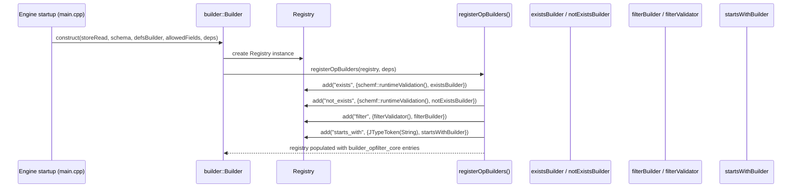
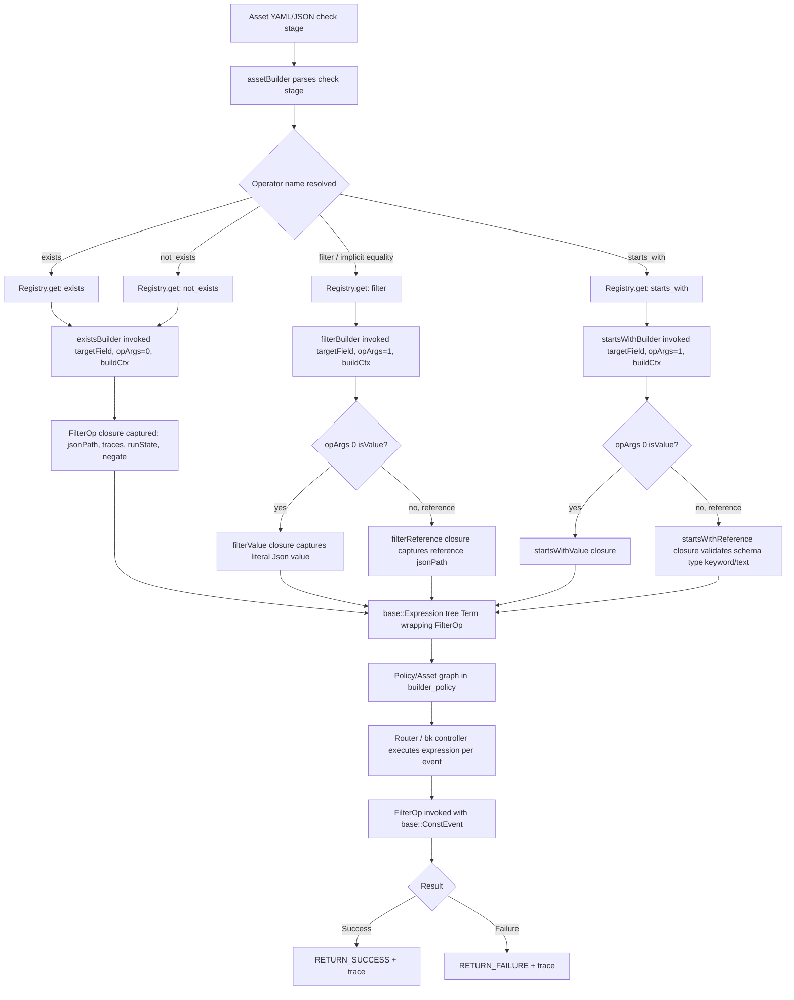
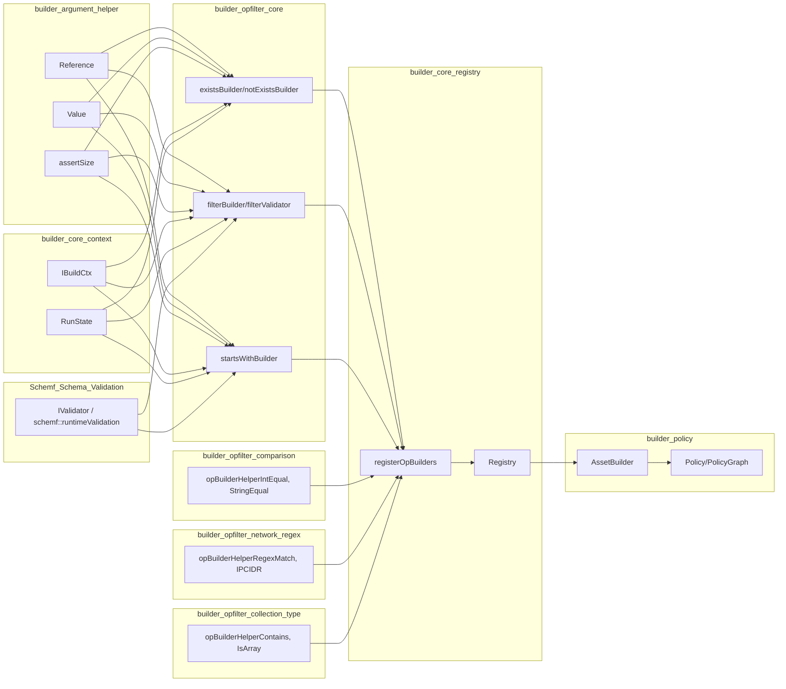
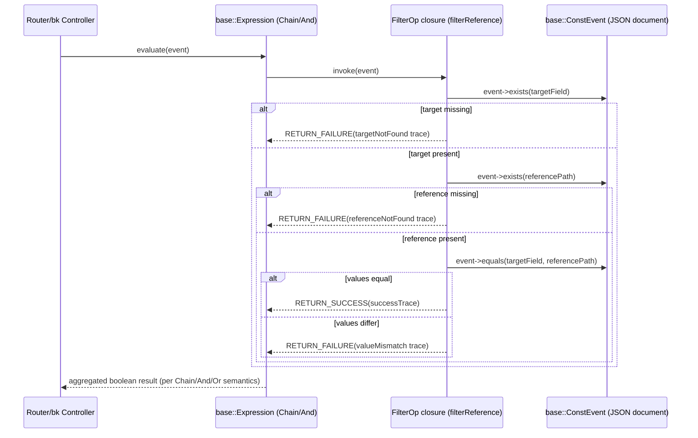

# builder_opfilter_core

## Introduction

`builder_opfilter_core` is a leaf module inside the Wazuh Engine's **Decoder/Rule Builder** subsystem (`engine_builder` → `builder_opfilter`). It implements the three most fundamental **filter operators** used when compiling declarative asset definitions (decoders, rules, filters) into executable runtime expressions:

- **`exists` / `not_exists`** — Field presence checking.
- **`filter` (equality "check")** — Generic value/reference equality comparison used by the `check:` stage of assets.
- **`starts_with`** — String prefix comparison.

These operators are the base building blocks that the Wazuh Engine uses to decide whether an event matches the conditions of a decoder or rule. They are registered into the global operator `Registry` at engine startup and invoked millions of times per second during event processing, so they are designed to be allocation-light closures created once at build time and executed repeatedly at runtime.

This document describes the internal architecture of the module, how it fits into the broader `builder_opfilter` and `engine_builder` modules, and the data/control flow of a filter operation from asset compilation to runtime evaluation.

---

## 1. Purpose and Scope

Every asset (decoder, rule, filter) in the Wazuh Engine can declare a `check:` (or `parents check`) stage composed of field-level conditions such as:

```yaml
check:
  - event.type: exists
  - event.type: not_exists
  - source.ip: "192.168.1.1"          # implicit "filter" (equality) operator
  - source.ip: $other.field           # equality against another field (reference)
  - user.name: starts_with(admin)
```

`builder_opfilter_core` supplies the **builder functions** that translate these YAML/JSON declarations into `FilterOp` closures — `std::function`-like objects that receive a runtime event and return a `FilterResult` (success/failure + trace message).

It does **not** implement comparison/regex/network/collection-type helper operators (`int_equal`, `regex_match`, `contains`, etc.) — those live in sibling modules `builder_opfilter_comparison`, `builder_opfilter_network_regex`, and `builder_opfilter_collection_type`, all of which share the same underlying types (`FilterOp`, `IBuildCtx`, `Reference`, `Value`) defined by the parent `builder_opfilter` and `builder_argument_helper` modules.

---

## 2. Module Location in the System

```
Wazuh_Engine_Core_(C++)
 └─ engine_builder
     └─ builder_opfilter               (parent: opBuilderHelperFilter.cpp - all helper filter ops)
         └─ builder_opfilter_core      <-- this module
             ├─ exists.cpp   (existsBuilder, notExistsBuilder)
             ├─ filter.cpp   (filterBuilder, filterValidator)
             └─ startsWith.cpp (startsWithBuilder)
```

Sibling modules under `builder_opfilter`:
- `builder_opfilter_comparison` — numeric/string ordering & equality helpers.
- `builder_opfilter_network_regex` — regex, CIDR, IP-version helpers.
- `builder_opfilter_collection_type` — array/object/type-checking helpers.

Related parent/ancestor modules (see their own documentation):
- [engine_builder.md](engine_builder.md) — top level builder module.
- [builder_core.md](builder_core.md) — `Builder`, `Registry`, `IBuildCtx` infrastructure that this module depends on.
- [builder_argument_helper.md](builder_argument_helper.md) — `Reference`/`Value`/`assertSize` argument parsing utilities consumed here.
- [builder_opmap.md](builder_opmap.md) and [builder_optransform.md](builder_optransform.md) — sibling operator families (map/transform) that share the same `Builder`/`Registry` pattern.
- [Schemf_(Schema_Validation).md](Schemf_(Schema_Validation).md) — schema validator (`schemf::IValidator`) used to type-check references at build time.
- [engine_base.md](engine_base.md) — `base::Expression`, `Result` types that the produced closures ultimately compose into.

---

## 3. Core Components

| Component | File | Responsibility |
|---|---|---|
| `existsBuilder` | `exists.cpp` | Builds a `FilterOp` that succeeds when a target field is present in the event. |
| `notExistsBuilder` | `exists.cpp` | Builds a `FilterOp` that succeeds when a target field is **absent**. Implemented via the same internal `exists()` helper with `negate=true`. |
| `filterBuilder` | `filter.cpp` | Builds a `FilterOp` for the generic equality "check" operator; dispatches to `filterValue` (literal) or `filterReference` (field-to-field) internal helpers based on argument type. |
| `filterValidator` | `filter.cpp` | Produces a `DynamicValToken` used by the schema validation subsystem (`schemf`) to statically infer/validate the expected type of the target field based on the literal value or referenced field's type. |
| `startsWithBuilder` | `startsWith.cpp` | Builds a `FilterOp` for string-prefix matching; dispatches to `startsWithValue` or `startsWithReference` internal helpers. Performs schema-based type validation (must be `keyword`/`text`) when comparing against a reference. |

All builder functions share the identical signature pattern used across the entire `builder_opfilter`/`builder_opmap`/`builder_optransform` families:

```cpp
FilterOp xBuilder(const Reference& targetField,
                  const std::vector<OpArg>& opArgs,
                  const std::shared_ptr<const IBuildCtx>& buildCtx);
```

---

## 4. Architecture

### 4.1 Class / Component Diagram

```mermaid
classDiagram
    class IBuildCtx {
        <<interface>>
        +context() Context
        +runState() RunState
        +validator() IValidator
        +registry() RegistryType
    }
    class RunState {
        +bool trace
        +bool sandbox
        +bool check
    }
    class Argument {
        <<abstract>>
        +isValue() bool
        +isReference() bool
        +str() string
    }
    class Reference {
        -dotPath string
        -jsonPath string
        +dotPath() string
        +jsonPath() string
    }
    class Value {
        -m_value Json
        +value() Json
    }
    class FilterOp {
        <<std::function>>
        (ConstEvent) FilterResult
    }
    class Registry {
        +add(name, Builder) OptError
        +get(name) Builder
    }

    Argument <|-- Reference
    Argument <|-- Value

    class existsBuilder
    class notExistsBuilder
    class filterBuilder
    class filterValidator
    class startsWithBuilder

    existsBuilder ..> FilterOp : creates
    notExistsBuilder ..> FilterOp : creates
    filterBuilder ..> FilterOp : creates
    startsWithBuilder ..> FilterOp : creates

    existsBuilder --> IBuildCtx : reads runState/context
    filterBuilder --> IBuildCtx : reads runState/context
    startsWithBuilder --> IBuildCtx : reads runState/context/validator

    filterBuilder --> Reference : targetField, opArgs[0]
    filterBuilder --> Value : opArgs[0]
    startsWithBuilder --> Reference
    startsWithBuilder --> Value

    Registry --> filterBuilder : registered as "filter"
    Registry --> existsBuilder : registered as "exists"
    Registry --> notExistsBuilder : registered as "not_exists"
    Registry --> startsWithBuilder : registered as "starts_with"
```

### 4.2 Registration Flow (Build-Time)

The three builders are wired into the global `Registry` via `registerOpBuilders()` (part of `builder_core_registry`, see `register.hpp`), which is invoked once when the `Builder` (engine's asset compiler) is constructed:



### 4.3 Asset Compilation to Runtime Evaluation Data Flow



---

## 5. Detailed Operator Behavior

### 5.1 `exists` / `not_exists`

Implemented via a single anonymous-namespace helper `exists(targetField, opArgs, buildCtx, negate)`:

1. Asserts zero extra arguments (`utils::assertSize(opArgs, 0)`).
2. Pre-computes success/failure trace strings once at build time (avoids runtime string formatting).
3. Returns a lambda capturing the field's **jsonPath** (pre-resolved from dotPath for fast JSON pointer lookups), the `RunState` (controls whether traces are recorded), and the `negate` flag.
4. At runtime: `event->exists(targetField) == negate` → failure; otherwise success.

`notExistsBuilder` is a thin wrapper calling the same helper with `negate = true`, avoiding code duplication.

### 5.2 `filter` (equality check)

This is the operator invoked for the common `field: value` and `field: $reference` check syntax.

- **`filterValue`**: Compares the event field against a captured literal `json::Json` value using `event->equals(targetField, jValue)`. Fails if the target field doesn't exist or values mismatch.
- **`filterReference`**: Compares two event fields (`targetField` vs. `reference`) using `event->equals(targetField, referencePath)`. Fails if either field is missing or values differ.
- **`filterValidator`**: A separate **compile-time validation token generator** consumed by the `schemf` schema-validation subsystem. It resolves either a `ValueToken` (for literals) or a `tokenFromReference` (for field references) so that the schema validator can statically ensure type compatibility of the `check:` stage before the asset is ever executed.

### 5.3 `starts_with`

More complex than `exists`/`filter` because it performs additional **type safety** at build time:

- **`startsWithValue`**: Requires the literal argument to be a JSON string (throws `std::runtime_error` otherwise at build time). At runtime, verifies the target field exists and is a string, then applies `base::utils::string::startsWith`.
- **`startsWithReference`**: Additionally queries the `buildCtx->validator()` (schema validator) to ensure the referenced field's schema type is `KEYWORD` or `TEXT` — if not, a build-time exception aborts asset compilation. At runtime, verifies both target and reference fields exist and are strings before comparing.

This operator demonstrates the module's dual responsibility: **compile-time schema validation** (fail fast during `engine-integration validate` / asset loading) and **runtime evaluation** (fast, allocation-light closures).

---

## 6. Key Types and Dependencies

| Type | Defined in | Role |
|---|---|---|
| `IBuildCtx` | `builder_core_context` (`ibuildCtx.hpp`) | Supplies `context()` (asset/op name for tracing), `runState()` (trace/sandbox/check flags), `validator()` (schema validator), and `registry()` to every builder function. |
| `RunState` | `builder_core_context` | Simple flag struct (`trace`, `sandbox`, `check`) captured by reference/value in every closure to decide whether tracing macros (`RETURN_SUCCESS`/`RETURN_FAILURE`) record messages. |
| `Reference` / `Value` | `builder_argument_helper` (`argument.hpp`) | Polymorphic `Argument` subclasses representing either a JSON literal or a `$field` reference parsed from the asset's op argument list (`opArgs`). |
| `Registry` | `builder_core_registry` (`registry.hpp`) | Simple name → `Builder` map (`OpBuilderEntry` = `{ValidationToken, BuilderFn}` pair) populated once via `registerOpBuilders()`. |
| `assertSize` | `builder_argument_helper` (`utils.hpp`) | Argument-count validation helper used by all three builders in this module (`exists`: 0 args, `filter`/`starts_with`: exactly 1 arg). |
| `FilterOp` / `FilterResult` | `builder_opfilter` (parent) | Type aliases for the closure signature (`std::function<FilterResult(base::ConstEvent)>`) and its return type, shared across all filter-family operators. |
| `IPolicy` | `builder_policy` | Consumes the compiled expression tree (which embeds these `FilterOp`s as `Term` leaves) to build the final executable policy graph. |

---

## 7. Interaction with Sibling & Parent Modules



---

## 8. Runtime Sequence Example: Evaluating a `check:` Stage



---

## 9. Design Notes & Rationale

- **Closure pre-computation**: All trace strings (`successTrace`, `failureTrace`, `targetNotFound`, etc.) are formatted **once** at build time via `fmt::format`, then captured by value into the returned lambda. This avoids per-event string formatting overhead, which is critical given the Engine processes very high event throughput.
- **Negation via parameterization**: `notExistsBuilder` reuses `existsBuilder`'s internal logic through a shared private `exists()` function with a boolean `negate` parameter, rather than duplicating the lambda — a common pattern across this module to minimize code duplication for operator pairs (`is_X` / `is_not_X` follow the same pattern in `builder_opfilter_collection_type`).
- **Build-time vs runtime validation separation**: `filterValidator()` and the schema type check inside `startsWithReference` both execute **during asset compilation**, allowing the engine to reject invalid/incompatible asset definitions early (`engine-integration validate`, `engine_catalog` validate commands) rather than failing silently at runtime.
- **Value vs Reference dispatch pattern**: Both `filterBuilder` and `startsWithBuilder` follow the identical dispatch idiom — inspect `opArgs[0]->isValue()` to choose between a literal-comparison closure and a field-to-field comparison closure. This pattern is repeated throughout `builder_opmap` and `builder_optransform` for consistency.

---

## 10. Related Documentation

- [engine_builder.md](engine_builder.md) — Parent module: overall asset/policy builder architecture.
- [builder_core.md](builder_core.md) — `Builder`, `Registry`, `IBuildCtx`, `RunState` core infrastructure.
- [builder_argument_helper.md](builder_argument_helper.md) — `Reference`, `Value`, `HelperToken`, `assertSize`/`assertValue` argument utilities.
- [builder_opfilter_comparison.md](builder_opfilter_comparison.md) — Numeric/string ordering & equality filter helpers.
- [builder_opfilter_network_regex.md](builder_opfilter_network_regex.md) — Regex/IP/CIDR filter helpers.
- [builder_opfilter_collection_type.md](builder_opfilter_collection_type.md) — Array/object/type-check filter helpers.
- [builder_opmap.md](builder_opmap.md) — Map-family operators (transform a field's value).
- [builder_optransform.md](builder_optransform.md) — Transform-family operators (HLP parsers, array append, etc.).
- [builder_policy.md](builder_policy.md) — Consumes compiled `FilterOp`s to build the executable policy graph.
- [Schemf_(Schema_Validation).md](Schemf_(Schema_Validation).md) — Schema type validation (`IValidator`) used by `filterValidator` and `startsWithReference`.
- [engine_base.md](engine_base.md) — `base::Expression`, `Result`, core primitives used across the engine.
