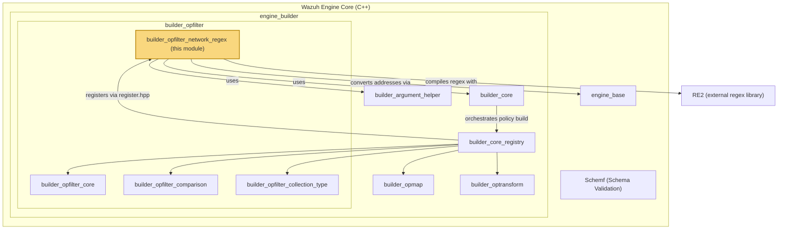
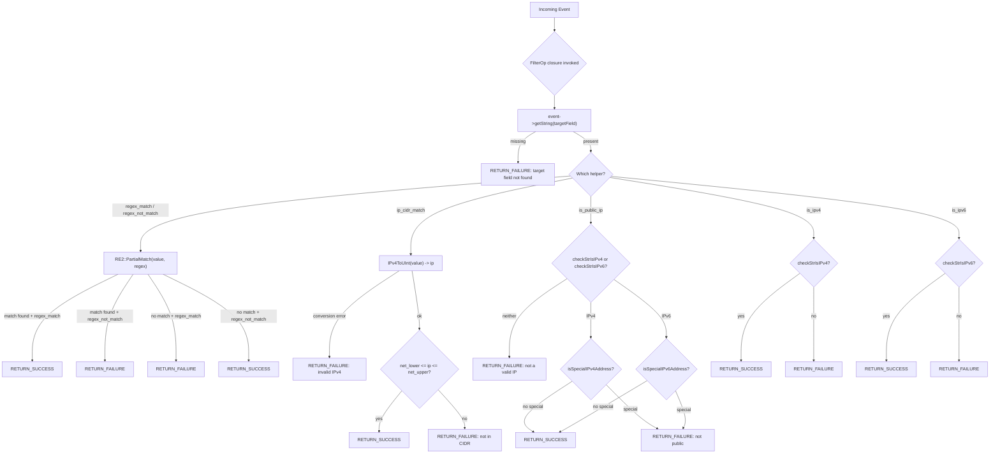
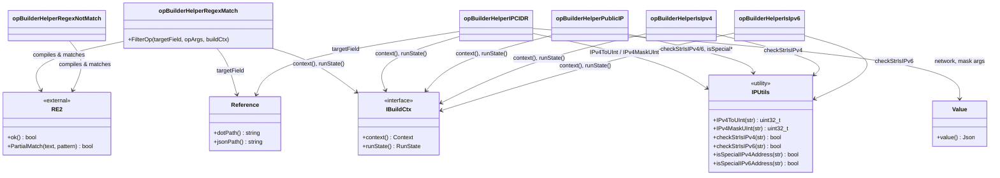
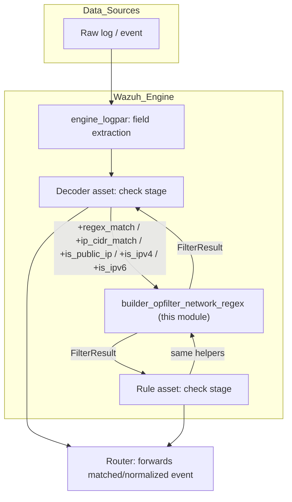

# builder_opfilter_network_regex

## Introduction

`builder_opfilter_network_regex` is a leaf module of the Wazuh **Engine** (see [Wazuh_Engine_Core_(C++).md](Wazuh_Engine_Core_(C++).md)) that implements the family of **regular-expression and network/IP-oriented filter helper functions** used by the Engine's decoder/rule DSL. These helpers let an asset's `check:` stage express conditions such as *"field X matches this regex"*, *"field X's IP falls inside this CIDR block"*, *"field X is a public IP address"*, or *"field X is a syntactically valid IPv4/IPv6 address"*.

All the components documented here live in the same translation unit as their siblings, `opBuilderHelperFilter.cpp`, and are registered into the Engine's operation registry so they can be referenced from YAML/JSON asset definitions using the `+helper_name` syntax (e.g. `field: +regex_match/^ERROR/`, `field: +ip_cidr_match/192.168.0.0/16`). At runtime, each helper compiles down to a `FilterOp` — a `std::function<FilterResult(base::ConstEvent)>` — that evaluates a boolean condition against an incoming event and returns a `FilterResult` (success/failure plus a trace message used for debugging/testing).

This module is a sibling of [builder_opfilter_core.md](builder_opfilter_core.md) (existence/generic `filter`/`starts_with` builders), [builder_opfilter_comparison.md](builder_opfilter_comparison.md) (numeric/string ordering and equality helpers, defined in the *same source file*), and [builder_opfilter_collection_type.md](builder_opfilter_collection_type.md) (array/type/collection filters, also in the same file). Together with [builder_opmap.md](builder_opmap.md) and [builder_optransform.md](builder_optransform.md), these modules make up the full set of operation builders consumed by [builder_core.md](builder_core.md) via the `Registry`.

---

## 1. Purpose and Scope

The `opBuilderHelperFilter.cpp` file implements many helper builder functions, but this module (`builder_opfilter_network_regex`) specifically documents the **regex and network/IP-family filters**:

| Category | Helpers | Asset syntax example |
|---|---|---|
| Regex matching | `opBuilderHelperRegexMatch`, `opBuilderHelperRegexNotMatch` | `field: +regex_match/^ERR/` |
| IP / CIDR membership | `opBuilderHelperIPCIDR` | `field: +ip_cidr_match/192.168.0.0/16` |
| Public IP detection | `opBuilderHelperPublicIP` | `field: +is_public_ip` |
| IP version validation | `opBuilderHelperIsIpv4`, `opBuilderHelperIsIpv6` | `field: +is_ipv4`, `field: +is_ipv6` |

All of these helpers are self-contained (unlike the comparison family, they do **not** funnel through a shared `opBuilderComparison` dispatcher); each builder directly parses its own arguments, performs build-time validation/compilation (e.g. compiling the `RE2` regex object or converting CIDR strings to `uint32_t` masks), and returns a closure specialized for its own runtime logic.

Related, but **out of scope** for this module (covered by sibling modules from the same source file):
- Integer/number/string ordering and equality, and bitwise AND → [builder_opfilter_comparison.md](builder_opfilter_comparison.md)
- Array containment, type checks (`is_string`, `is_array`, etc.), key/value membership in definitions, `ends_with`, `keys_exist_in_list`, test-session detection → [builder_opfilter_collection_type.md](builder_opfilter_collection_type.md)
- The `exists` / `not_exists` and generic `filter` / `starts_with` stage builders → [builder_opfilter_core.md](builder_opfilter_core.md)

---

## 2. Architectural Context



The network/regex helpers are wired into the Engine pipeline the same way every other operation builder is:

1. **`register.hpp`** (`registerOpBuilders`) registers each `opBuilderHelperXxx` function pointer into the `Registry` (see [builder_core.md](builder_core.md)) under a helper name string (e.g. `"regex_match"`, `"ip_cidr_match"`, `"is_public_ip"`, `"is_ipv4"`, `"is_ipv6"`).
2. When the **`builder_policy`** module parses an asset's `check`/`normalize` stage, it looks up helper tokens (parsed by `helperParser.hpp`) and invokes the matching builder function, passing:
   - The **target field** (`Reference`) — the field the condition is anchored to (from the YAML key).
   - The **arguments** (`std::vector<OpArg>`) — parsed literal values (regex pattern, network/mask strings) from the YAML value. All helpers in this module require **literal `Value` arguments only** (no `$ref` operands) except the target field itself.
   - The **build context** (`std::shared_ptr<const IBuildCtx>`) — carrying the run state and tracing context.
3. Each builder returns a `FilterOp`, a closure later composed into a boolean `Expression` tree (`And`/`Or`/`Chain`, see [engine_base_expression](Wazuh_Engine_Core_(C++).md)) and executed by the backend (`engine_bk`) for every incoming event.

---

## 3. Core Concepts

### 3.1 Build-time vs. runtime work

Unlike the comparison family (which resolves comparators generically through `opBuilderComparison`), every helper in this module does **expensive, one-time work at build time**:

- `opBuilderHelperRegexMatch` / `opBuilderHelperRegexNotMatch` compile an `RE2` object once (`std::make_shared<RE2>(pattern, RE2::Quiet)`), failing fast (`std::runtime_error`) if the pattern is invalid.
- `opBuilderHelperIPCIDR` converts the network address and mask (either dotted-decimal mask or CIDR prefix length) into `uint32_t` once via `utils::ip::IPv4ToUInt` / `utils::ip::IPv4MaskUInt`, and pre-computes the inclusive `[net_lower, net_upper]` range.

This means the **runtime closures only perform cheap comparisons** (regex partial match, integer range check, or address-class inspection), keeping per-event overhead low even though these are among the more computationally-intensive filter operators.

### 3.2 `FilterOp` and `FilterResult`

Same shared types as the sibling modules:
- `FilterOp` — alias for `std::function<FilterResult(base::ConstEvent)>`, the compiled runtime predicate.
- `FilterResult` — success/failure wrapper carrying a trace string, produced via the `RETURN_SUCCESS`/`RETURN_FAILURE` macros which also honor the build's `RunState`.

### 3.3 IP utility layer

All IP-related helpers delegate low-level address parsing/classification logic to `base::utils::ip` (declared in `base/utils/ipUtils.hpp`, part of [engine_base_system](Wazuh_Engine_Core_(C++).md)):

| Function | Used by |
|---|---|
| `IPv4ToUInt` | `opBuilderHelperIPCIDR` (network + runtime target conversion) |
| `IPv4MaskUInt` | `opBuilderHelperIPCIDR` (mask/prefix-length conversion) |
| `checkStrIsIPv4` / `checkStrIsIPv6` | `opBuilderHelperPublicIP`, `opBuilderHelperIsIpv4`, `opBuilderHelperIsIpv6` |
| `isSpecialIPv4Address` / `isSpecialIPv6Address` | `opBuilderHelperPublicIP` (excludes private/reserved/loopback ranges) |

### 3.4 `OpArg`, `Reference`, `Value`

As with all opfilter helpers, arguments come from `builder_argument_helper` (`argument.hpp`):
- **`Value`** — a literal parsed from the asset definition (regex string, IP/mask string). All arguments consumed by this module's helpers must be `Value` (throws `std::runtime_error` at build time if a `$ref` is supplied where a literal is required, since `std::static_pointer_cast<Value>` is used directly).
- **`Reference`** — always used only for the **target field** (the field being tested), resolved at runtime via `event->getString(jsonPath)`.

---

## 4. Component Reference

### 4.1 Public Builder Functions

Each of the following has the shared signature used across `builder_opfilter`/`builder_opmap`/`builder_optransform`:

```cpp
FilterOp opBuilderHelperXxx(const Reference& targetField,
                            const std::vector<OpArg>& opArgs,
                            const std::shared_ptr<const IBuildCtx>& buildCtx);
```

| Function | Args | Build-time behavior | Runtime behavior |
|---|---|---|---|
| `opBuilderHelperRegexMatch` | 1 (`Value`, regex string) | Compiles `RE2` object; throws if invalid pattern | `RE2::PartialMatch(field, regex)` → success if it matches |
| `opBuilderHelperRegexNotMatch` | 1 (`Value`, regex string) | Same as above | Inverse: success if it does **not** match |
| `opBuilderHelperIPCIDR` | 2 (`Value` network, `Value` mask/prefix) | Converts network+mask to `uint32_t`, computes `[net_lower, net_upper]` | Converts target field to `uint32_t` and checks it lies within the precomputed range |
| `opBuilderHelperPublicIP` | 0 | None | Detects IPv4 vs IPv6 via `checkStrIsIPv4`/`checkStrIsIPv6`, then negates `isSpecialIPv4Address`/`isSpecialIPv6Address` (i.e. excludes private/loopback/link-local/reserved ranges) |
| `opBuilderHelperIsIpv4` | 0 | None | `utils::ip::checkStrIsIPv4(field)` |
| `opBuilderHelperIsIpv6` | 0 | None | `utils::ip::checkStrIsIPv6(field)` |

### 4.2 Detailed behavior notes

- **`opBuilderHelperRegexMatch` / `opBuilderHelperRegexNotMatch`** use Google's [RE2](https://github.com/google/re2) library in `RE2::Quiet` mode (suppresses stderr diagnostics on invalid pattern; the builder instead throws a descriptive `std::runtime_error`). Matching is a **partial match** (`RE2::PartialMatch`), i.e. the pattern does not need to match the entire field value — it matches if the regex is found anywhere within the string, similar to `grep`.
- **`opBuilderHelperIPCIDR`** accepts the network in two mask forms: a CIDR prefix length (e.g. `/16`) or a dotted-decimal netmask (e.g. `255.255.0.0`) — both are handled uniformly by `utils::ip::IPv4MaskUInt`. It is **IPv4-only**; IPv6 CIDR is not supported by this helper.
- **`opBuilderHelperPublicIP`** is the only helper in this module that auto-detects the IP version of the target field value (it doesn't require the caller to specify IPv4 vs IPv6). If the string is neither a valid IPv4 nor IPv6 address, the helper fails with a distinct "Not a valid IP address" trace.
- **`opBuilderHelperIsIpv4`** / **`opBuilderHelperIsIpv6`** are strict, single-purpose syntax validators — they do not check reachability, class, or specialness, only that the string parses as an address of the given version.

---

## 5. Data Flow

### 5.1 Build-time flow (Regex example)

```mermaid
sequenceDiagram
    participant Asset as Asset Definition (YAML)
    participant Parser as helperParser.hpp
    participant Registry as Registry (builder_core_registry)
    participant Builder as opBuilderHelperRegexMatch
    participant RE2Lib as RE2 (external)

    Asset->>Parser: "field: +regex_match/^ERROR.*$/"
    Parser->>Registry: lookup("regex_match")
    Registry->>Builder: invoke(targetField, opArgs=[Value(pattern)], buildCtx)
    Builder->>Builder: assertSize(opArgs, 1); assertValue(opArgs, 0)
    Builder->>RE2Lib: new RE2(pattern, RE2::Quiet)
    alt invalid regex
        RE2Lib-->>Builder: !ok()
        Builder-->>Registry: throw std::runtime_error
    else valid regex
        Builder-->>Registry: FilterOp (closure capturing shared_ptr<RE2>)
    end
    Registry-->>Asset: Expression node (Term) added to policy graph
```

### 5.2 Build-time flow (IP CIDR example)

```mermaid
sequenceDiagram
    participant Asset as Asset Definition (YAML)
    participant Builder as opBuilderHelperIPCIDR
    participant IPUtils as utils::ip

    Asset->>Builder: "field: +ip_cidr_match/192.168.0.0/16"
    Builder->>Builder: assertSize(opArgs, 2); assertValue(opArgs)
    Builder->>IPUtils: IPv4ToUInt("192.168.0.0") -> network
    Builder->>IPUtils: IPv4MaskUInt("16") -> mask
    Builder->>Builder: net_lower = network & mask; net_upper = net_lower | ~mask
    Builder-->>Asset: FilterOp closure capturing [net_lower, net_upper]
```

### 5.3 Runtime evaluation flow



---

## 6. Component Interaction Diagram



---

## 7. Dependencies

| Dependency | Relationship | Documentation |
|---|---|---|
| `argument.hpp` (`Reference`, `Value`) | Represents target field and literal operand parsing | [builder_argument_helper](Wazuh_Engine_Core_(C++).md) |
| `ibuildCtx.hpp` / `buildCtx.hpp` (`IBuildCtx`) | Supplies run state and tracing context | [builder_core_context](Wazuh_Engine_Core_(C++).md) |
| `utils.hpp` (`assertSize`, `assertValue`) | Argument-count/type assertions at build time | [builder_argument_helper](Wazuh_Engine_Core_(C++).md) |
| `base/utils/ipUtils.hpp` | IPv4/IPv6 parsing, CIDR math, special-address classification | [engine_base_system](Wazuh_Engine_Core_(C++).md) |
| RE2 (`re2/re2.h`) | Compiled-regex engine used for `regex_match`/`regex_not_match` | External library (Google RE2), vendored/linked into `engine_builder` |
| `register.hpp` / `Registry` | Registration point that exposes these builders to the policy compiler | [builder_core_registry](Wazuh_Engine_Core_(C++).md) |
| `base::ConstEvent`, `json::Json` | Event/JSON abstraction used to read field values at runtime | [engine_base_core_types](Wazuh_Engine_Core_(C++).md) |

This module has **no outbound dependency** on other opfilter sub-modules ([builder_opfilter_core.md](builder_opfilter_core.md), [builder_opfilter_comparison.md](builder_opfilter_comparison.md), [builder_opfilter_collection_type.md](builder_opfilter_collection_type.md)) beyond sharing the same source file and helper infrastructure — they are independent builder functions all registered together by [builder_core_registry](Wazuh_Engine_Core_(C++).md). It is, however, the only opfilter sub-module with a **third-party library dependency (RE2)**.

---

## 8. Design Notes & Behavior Details

- **Fail-fast regex/CIDR compilation**: Both the `RE2` pattern and the CIDR network/mask are validated and compiled exactly once, at asset-build time. A malformed pattern or malformed IP/mask string aborts the build with a descriptive `std::runtime_error`, preventing a broken asset from ever reaching production traffic (mirrors the "fail-fast" philosophy documented in [builder_opfilter_comparison.md](builder_opfilter_comparison.md) §8 and [builder_opfilter_core.md](builder_opfilter_core.md) §5.3).
- **No reference (`$ref`) support for filter parameters**: Unlike the comparison family, none of the helpers in this module accept a `Reference` as the regex pattern or the CIDR network/mask — these must always be literal `Value`s. Only the *target field itself* can be dynamic (it's always resolved from the event at runtime).
- **IPv4-only CIDR matching**: `opBuilderHelperIPCIDR` deliberately supports only IPv4; there is no IPv6-CIDR sibling helper. Consumers needing IPv6 subnet checks must currently combine `is_ipv6` with custom logic or other helpers.
- **Partial vs full regex match**: `RE2::PartialMatch` is used rather than `RE2::FullMatch`, meaning patterns are effectively unanchored substring searches unless the asset author explicitly anchors with `^`/`$`.
- **Consistent tracing convention**: Every helper pre-formats its `successTrace`/`failureTrace*` strings once at build time (capturing `buildCtx->context().opName` and `targetField.dotPath()`), then captures them by value in the returned lambda — avoiding any `fmt::format` calls in the runtime hot path except (necessarily) inside the IPv4 conversion `catch` clause of `opBuilderHelperIPCIDR`.
- **Public-IP definition**: `opBuilderHelperPublicIP` treats "public" as "not special" — i.e., it excludes RFC1918 private ranges, loopback, link-local, multicast, and other reserved ranges as classified by `isSpecialIPv4Address`/`isSpecialIPv6Address` in [engine_base_system](Wazuh_Engine_Core_(C++).md). It does not perform actual internet-routability checks.

---

## 9. Where This Fits in the Broader System



Typical real-world usages compiled by this module:
- Decoders classifying source/destination IPs as public vs. private for downstream alerting rules.
- Rules matching free-text log messages against known error/attack signature regexes.
- Filters restricting agent-group scoped policies to specific internal CIDR ranges (e.g. `+ip_cidr_match/10.0.0.0/8`).
- Schema/field validators (`+is_ipv4`, `+is_ipv6`) ensuring upstream fields conform before being indexed as `ip` type fields (see [Schemf_(Schema_Validation).md](Schemf_(Schema_Validation).md)).

---

## 10. Related Documentation

- [builder_opfilter_core.md](builder_opfilter_core.md) — `exists`/`not_exists`, `filter`, `starts_with`.
- [builder_opfilter_comparison.md](builder_opfilter_comparison.md) — numeric/string ordering, equality, bitwise AND.
- [builder_opfilter_collection_type.md](builder_opfilter_collection_type.md) — array/object/type filters.
- [builder_argument_helper.md](builder_argument_helper.md) — `Reference`, `Value`, `assertSize`, `assertValue`.
- [builder_core.md](builder_core.md) / [builder_core_registry](Wazuh_Engine_Core_(C++).md) — the `Registry` and `Builder` infrastructure that wires these helpers into the policy compiler.
- [engine_base_system](Wazuh_Engine_Core_(C++).md) — low-level IP parsing/classification utilities (`base/utils/ipUtils.hpp`).
- [Schemf_(Schema_Validation).md](Schemf_(Schema_Validation).md) — schema validator consulted by other opfilter siblings for reference type-checking (not used directly by this module, since all parameters here are literals).
