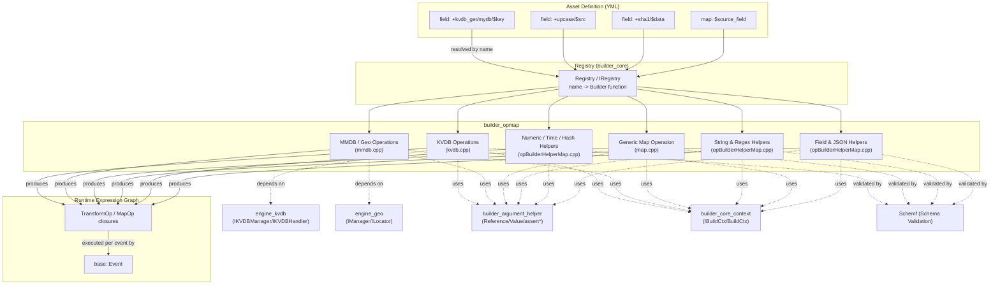
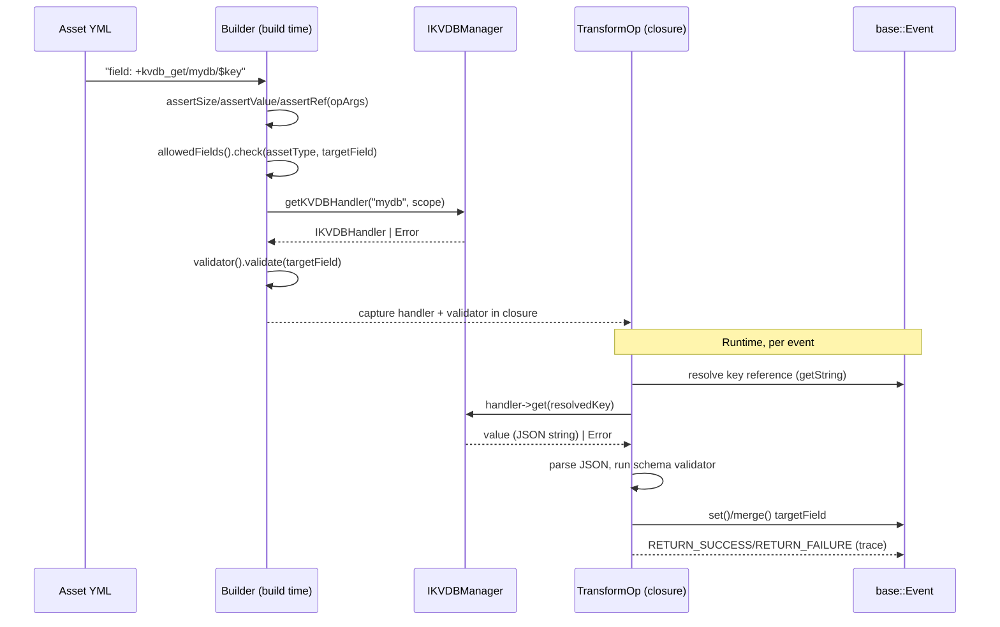

# builder_opmap — Engine Map/Transform Operation Builders

## 1. Purpose

`builder_opmap` is a sub-module of [builder_core](builder_core.md) (part of the [engine_builder](engine_builder.md) library within the [Wazuh Engine Core (C++)](Wazuh_Engine_Core_(C++).md) module family). It implements the **"opmap" family of operation builders** — the constructors that translate the `map`/`+helper` expressions found in Wazuh Engine assets (decoders, rules, outputs) into executable `TransformOp` / `MapOp` closures that are wired into the runtime [expression graph](engine_base.md).

Whereas [builder_opfilter](builder_opfilter.md) builders produce **boolean filters** (does the event match a condition?), `builder_opmap` builders produce operations that **write or transform a field's value** in the event, such as:

- Looking up a value in a Key-Value Database (KVDB) and setting/merging it into the event.
- Enriching an event with Geo/ASN data from an MMDB (GeoIP-style) database.
- Copying/mapping the value of one field/reference into another (`map:` stage).
- A large catalog of generic helper transforms: string case/trim/replace/concat/split, hex⇄string/number conversions, regex extraction, arithmetic on integers/floats, date/epoch conversions, SHA1 hashing, IP version detection, and JSON field manipulation (delete, rename, merge, merge-recursive, get-value-from-object, erase custom fields).

These builders are registered into the engine's [Registry](builder_core.md) at startup (see `registerOpBuilders` in `builder_core`) and are looked up by name (e.g. `+kvdb_get`, `+upcase`, `+sha1`, `+delete`, `map`) while parsing an asset's logic block via the [core builder context](builder_core.md) (`IBuildCtx`, `BuildCtx`).

## 2. Architecture Overview

### Build-time vs. Run-time separation

Every builder in this module follows the same two-phase pattern used across [engine_builder](engine_builder.md):

1. **Build time** (inside the builder lambda): parse and validate `opArgs` (the arguments coming from the asset definition), assert argument count/type via [builder_argument_helper](builder_argument_helper.md) utilities (`assertSize`, `assertValue`, `assertRef`), check allowed-fields policy via `IBuildCtx::allowedFields()`, resolve external dependencies (KVDB handler, Geo locator), and pre-compute schema validators from `IBuildCtx::validator()`. Any error here throws `std::runtime_error`, causing asset compilation to fail with a clear message.
2. **Run time** (inside the returned `TransformOp`/`MapOp`/`FilterOp` closure): executed once per event. It resolves references against the live `base::Event`, performs the actual transformation, and returns a `SUCCESS`/`FAILURE` result together with a trace message (via the `RETURN_SUCCESS`/`RETURN_FAILURE` macros) that feeds the engine's tracing/tester subsystem ([engine_api_router_tester](engine_api_router_tester.md)).

## 3. Sub-modules

| Sub-module | Source file(s) | Responsibility |
|---|---|---|
| [builder_opmap_kvdb](builder_opmap_kvdb.md) | `kvdb.cpp` | KVDB-backed field operations: `+kvdb_get`, `+kvdb_get_merge`, `+kvdb_get_merge_recursive`, `+kvdb_get_array`, `+kvdb_match`, `+kvdb_not_match`, and bitmask decoding (`+kvdb_decode_bitmask`). |
| [builder_opmap_mmdb_geo](builder_opmap_mmdb_geo.md) | `mmdb.cpp` | Geo/ASN enrichment helpers backed by MMDB databases, mapping locator results to ECS-like fields. |
| [builder_opmap_generic_map](builder_opmap_generic_map.md) | `map.cpp` | The generic `map:` stage builder that copies a literal value or a referenced field's value into the target field, plus its schema-validation resolver. |
| [builder_opmap_string_regex_helpers](builder_opmap_string_regex_helpers.md) | `opBuilderHelperMap.cpp` (subset) | String case conversion, trimming, replacing, concatenation, array-join, hex⇄ASCII/number conversion, and regex extraction helpers. |
| [builder_opmap_numeric_time_hash_helpers](builder_opmap_numeric_time_hash_helpers.md) | `opBuilderHelperMap.cpp` (subset) | Integer/float arithmetic (`+int_calculate`, `+float_calculate`), numeric-to-string conversion, epoch/date helpers, SHA1 hashing, and IP-version detection. |
| [builder_opmap_field_json_helpers](builder_opmap_field_json_helpers.md) | `opBuilderHelperMap.cpp` (subset) | Structural JSON/field operations: delete, rename, merge / merge-recursive, erase-custom-fields, and generic get/merge-value-from-object helpers. |

## 4. Data Flow (typical KVDB map operation)

## 5. Key Dependencies & Related Modules

- **[builder_core](builder_core.md)** — provides `IBuildCtx`/`BuildCtx` (build context, tracing, allowed fields, schema validator access), the `Registry`, and the `registerOpBuilders` entry point that wires all `builder_opmap` builders into the engine.
- **[builder_argument_helper](builder_argument_helper.md)** — provides `Reference`/`Value` argument types and the `assertSize`/`assertValue`/`assertRef` utilities used pervasively for build-time argument validation.
- **[builder_opfilter](builder_opfilter.md)** — sibling module producing boolean `FilterOp`s (e.g. comparison, regex-match, collection-type checks); `builder_opmap`'s KVDB module also exposes `+kvdb_match`/`+kvdb_not_match` filter builders that follow the same registration pattern.
- **[builder_optransform](builder_optransform.md)** and **[builder_stage](builder_stage.md)** — sibling modules for array/HLP-parsing transforms and stage-level builders (`parse`, `indexer_output`) that compose with `opmap` operations inside an asset's logic block.
- **[engine_kvdb](engine_kvdb.md)** — supplies `IKVDBManager`/`IKVDBHandler`, the actual Key-Value store backing all `builder_opmap_kvdb` operations.
- **[engine_geo](engine_geo.md)** — supplies `IManager`/`ILocator`, the MMDB database access layer backing `builder_opmap_mmdb_geo`.
- **[Schemf (Schema Validation)](Schemf_(Schema_Validation).md)** — supplies `IValidator`/`ValidationResult` used to type-check references and validate values written back into the event schema.
- **[engine_base](engine_base.md)** — supplies core types (`base::Event`, `base::Result`, `Name`, `DotPath`) used throughout every builder and closure in this module.

## 6. Common Patterns

- **Allowed-fields enforcement**: transform builders that write to a target field call `buildCtx->allowedFields().check(assetType, targetField.dotPath())` at build time, and re-check any dynamically discovered subfields (e.g. when merging an object) at run time via `allowedFieldsPtr()`.
- **Reference vs. Value arguments**: nearly every builder distinguishes between a literal `Value` argument and a `Reference` (a `$field` pointer into the event), performing different build-time schema checks and run-time resolution for each case.
- **Trace-driven error reporting**: every closure pre-formats both success and multiple failure trace strings at build time (avoiding runtime string formatting cost) and returns them via `RETURN_SUCCESS`/`RETURN_FAILURE`.
- **Schema-aware validation**: whenever the target field or a referenced value has a known schema, builders fetch a `schemf::ValueValidator` at build time and apply it to values before writing them into the event, ensuring engine-wide schema consistency.
