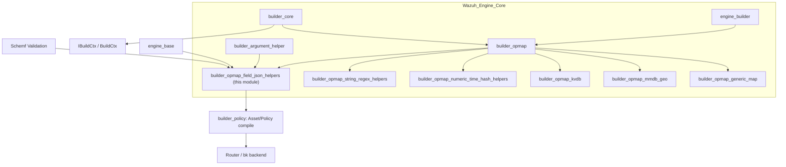
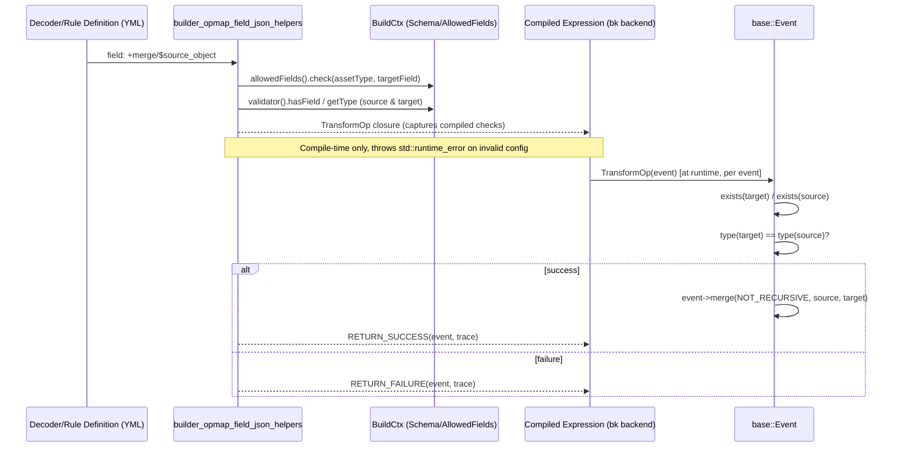
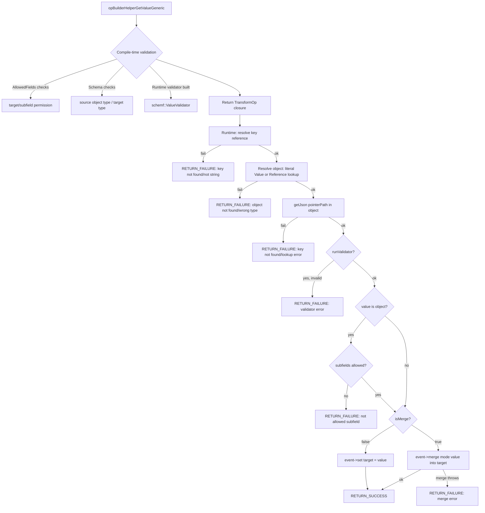
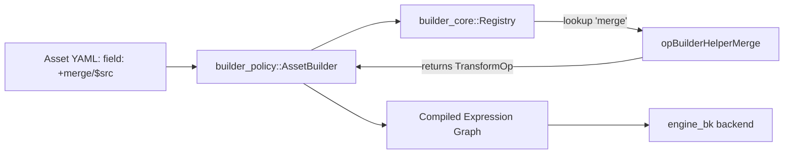

# Builder OpMap Field & JSON Helpers

## Introduction

The **`builder_opmap_field_json_helpers`** module implements a family of *map/transform* operator helpers used by the
Wazuh Engine's asset builder to manipulate JSON fields directly on the event object. These helpers are the
building blocks that decoders, rules, and outputs use in their `normalize`/`check`/`map` stages to add, remove,
rename, merge, or extract structured data (objects/arrays) from one part of an event to another.

Unlike the sibling `builder_opmap_string_regex_helpers` and `builder_opmap_numeric_time_hash_helpers` modules
(which operate on scalar string/number values), this module focuses on **structural JSON operations**: field
deletion, field renaming, object/array merging (shallow and recursive), custom-field pruning, string splitting into
arrays, and generic "get/merge value from object by key" operators used to implement dynamic field lookups
(commonly used for definitions/lookup-table style transformations).

All helpers are implemented in a single translation unit,
`src/engine/source/builder/src/builders/opmap/opBuilderHelperMap.cpp`, and are registered into the engine's
[builder_opmap](builder_opmap.md) helper registry alongside the other `opBuilderHelperMap.cpp`-based helper
groups (`builder_opmap_string_regex_helpers`, `builder_opmap_numeric_time_hash_helpers`). This document only
covers the **field/JSON manipulation** subset of that file, corresponding to the following functions:

| Helper Function | Engine DSL Operator |
|---|---|
| `opBuilderHelperDeleteField` | `+delete` |
| `opBuilderHelperRenameField` | `+rename/$sourceField` |
| `opBuilderHelperMerge` | `+merge/$field` |
| `opBuilderHelperMergeRecursively` | `+merge_recursive/$field` |
| `opBuilderHelperEraseCustomFields` | `+erase_custom_fields` |
| `opBuilderHelperAppendSplitString` | `+split/$field/<separator>` |
| `opBuilderHelperGetValue` | `+get_key_in/$object\|value/$key` |
| `opBuilderHelperMergeValue` | `+merge_key_in/$object\|value/$key` |
| `opBuilderHelperMergeRecursiveValue` | `+merge_recursive_key_in/$object\|value/$key` |

## Role in the System

This module is a leaf component in the [Wazuh_Engine_Core_(C++)](Wazuh_Engine_Core_(C++).md) hierarchy. It sits
under [engine_builder](engine_builder.md) → [builder_opmap](builder_opmap.md), a sibling of:

- [builder_opmap_kvdb](builder_opmap_kvdb.md) — KVDB lookup/decode helpers.
- [builder_opmap_mmdb_geo](builder_opmap_mmdb_geo.md) — GeoIP/ASN helpers.
- [builder_opmap_generic_map](builder_opmap_generic_map.md) — the generic `map` builder.
- [builder_opmap_string_regex_helpers](builder_opmap_string_regex_helpers.md) — string case/trim/replace/regex.
- [builder_opmap_numeric_time_hash_helpers](builder_opmap_numeric_time_hash_helpers.md) — numeric calc, dates, SHA1.

These helpers depend on core builder abstractions from [builder_core](builder_core.md)
(`IBuildCtx`, `BuildCtx`, `Registry`) and [builder_argument_helper](builder_argument_helper.md)
(`Reference`, `Value`, `assertSize`, `assertRef`, `assertValue`, `AllowedFields`). They also rely on schema
validation facilities exposed by [Schemf_(Schema_Validation)](Schemf_(Schema_Validation).md)
(`schemf::ValueValidator`, `schemf::Type`, runtime validation) and on the generic event abstraction defined in
[engine_base](engine_base.md) (`base::Event`, `json::Json`).

At runtime these operators are invoked from within the compiled expression graph produced by
[builder_policy](builder_policy.md) and executed by the [Router](Router.md)/[engine_bk](engine_bk.md) backend
when processing events.

## Design & Execution Model

Every helper in this module is a **builder function**: given the DSL parameters (`opArgs`, a mix of `Value`
literals and `Reference` pointers) and a `BuildCtx` (containing schema validator, allowed-fields checker, asset
name, and run state), it performs **compile-time validation** and returns a closure (`MapOp` or `TransformOp`)
that is executed once per event at runtime.

- **`MapOp`**: `std::function<MapResult(base::ConstEvent)>` — computes a new `json::Json` value without mutating
  the event; used by helpers assigned via `field: +helper(...)` syntax where the builder sets the result on the
  target field afterward.
- **`TransformOp`**: `std::function<TransformResult(base::Event)>` — mutates the event in place and returns it;
  used by helpers that need direct control of the target field (delete, rename, merge, split, get/merge value).

Two macros standardize the runtime outcome and tracing: `RETURN_SUCCESS(runState, event/result, trace)` and
`RETURN_FAILURE(runState, event/result, trace)`. Failures do not throw; they produce a `base::Result` carrying a
trace message consumed by the [Router Tester](Router.md) and engine tracing subsystem.

## Component Catalog

### 1. `opBuilderHelperDeleteField` — `+delete`

Removes the target field from the event.

- **Parameters**: none (`assertSize(opArgs, 0)`).
- **Compile-time checks**: target field must be present in the asset's `AllowedFields` policy.
- **Runtime behavior**: calls `event->erase(targetField)`. Any exception during erase is caught and converted to
  a failure trace; if `erase` returns `false` (field could not be erased, e.g. protected path) it also fails.

### 2. `opBuilderHelperRenameField` — `+rename/$sourceField`

Moves a field's value from `sourceField` to the target field, deleting the source.

- **Parameters**: exactly 1 `Reference` (the source field).
- **Compile-time checks**:
  - Both source and target fields must pass `AllowedFields` checks for the asset type.
  - If the target field has a declared schema type, the source reference is checked to conform via
    `schemf::tokenFromReference` + `validator().validate(...)`, producing a `schemf::ValueValidator` closure
    (`runValidator`) that is invoked at runtime against the actual value.
- **Runtime behavior**:
  1. Fail if target already exists (`failureTrace1`).
  2. Fail if source does not exist (`failureTrace2`).
  3. Run schema validation on the resolved source value if `runValidator` is set (`failureTrace4`).
  4. Erase the source field; fail if erase fails (`failureTrace3`).
  5. `event->set(targetField, refValue)`.

### 3. `opBuilderHelperMerge` — `+merge/$field` (shallow) and `opBuilderHelperMergeRecursively` — `+merge_recursive/$field`

Both share nearly identical logic and differ only in the `json::RECURSIVE` vs `json::NOT_RECURSIVE` merge mode
passed to `event->merge(...)`.

- **Parameters**: exactly 1 `Reference` (source field to merge into the target).
- **Compile-time checks**: target field allowed by `AllowedFields`.
- **Runtime behavior**:
  1. Both target and source fields must exist.
  2. Their JSON types (`event->type(...)`) must match, and be either `Array` or `Object` — any other type fails
     (`failureTrace3` / `failureTrace4`).
  3. If merging **objects**, each subfield key of the source object is individually checked against
     `AllowedFields` for the composed path `target.subfield`; if any subfield is disallowed, the whole operation
     fails (`failureTrace5`) — this prevents merges from smuggling disallowed fields into restricted namespaces
     (e.g. `@timestamp`, `agent`, etc.).
  4. Calls `event->merge(mode, fieldReference, targetField)`.

### 4. `opBuilderHelperEraseCustomFields` — `+erase_custom_fields`

Recursively removes every key under the target field subtree that is **not** part of the declared schema
(i.e. "custom"/unknown fields), typically used to sanitize an event before final output/indexing.

- **Parameters**: none.
- **Compile-time**: builds an `isCustomField` predicate using `buildCtx->validatorPtr()->hasField(path)` — a field
  is "custom" if the schema does **not** define it.
- **Runtime behavior**: `event->eraseIfKey(isCustomField, false, targetField)` walks the subtree rooted at
  `targetField` and deletes all keys for which the predicate returns true. Always succeeds
  (no failure path defined).

### 5. `opBuilderHelperAppendSplitString` — `+split/$field/<separator>`

Splits a string field on a single-character separator and appends each resulting token to the target field as an
array element.

- **Parameters**:
  1. `Reference` — source string field.
  2. `Value` (string) — separator; must be exactly one character.
- **Compile-time checks**: target field allowed by `AllowedFields`; if schema knows the source type, it must be
  `String`.
- **Runtime behavior**:
  1. Fails if the source reference does not exist or is not a string.
  2. Uses `base::utils::string::split(value, separator)` to tokenize.
  3. For each token, `event->appendString(value, targetField)` — building/extending a JSON array at
     `targetField`.

### 6. Generic key/value extraction family: `opBuilderHelperGetValueGeneric`

A shared private implementation backs three public DSL operators:

| Public function | DSL | `isMerge` | `isRecursive` |
|---|---|---|---|
| `opBuilderHelperGetValue` | `+get_key_in/$obj\|value/$key` | `false` | n/a |
| `opBuilderHelperMergeValue` | `+merge_key_in/$obj\|value/$key` | `true` | `false` |
| `opBuilderHelperMergeRecursiveValue` | `+merge_recursive_key_in/$obj\|value/$key` | `true` | `true` |

These operators look up a dynamic **key** (from a reference) inside an **object** (either an inline literal
object `Value` or an object `Reference`, e.g. a `definitions` object), and either **set** the result on the target
field or **merge** it into the target field (shallow or recursive).

- **Parameters**:
  1. Object source — either a literal JSON `Value` of type object, or a `Reference` whose schema type (if known)
     must be `OBJECT`.
  2. `Reference` — the key path (must resolve, at runtime, to a string) used with `json::Json::formatJsonPath` to
     build a JSON-pointer-like lookup path into the object.
- **Compile-time checks**:
  - Target field allowed by `AllowedFields`.
  - If `isMerge`, and the target field has a known schema type, it must be `OBJECT` or an array type.
  - Runtime schema validation closure `runValidator` is derived via
    `buildCtx->validator().validate(targetField.dotPath(), schemf::runtimeValidation())`, used to validate the
    *resolved value* before it is written/merged into the target.
- **Runtime behavior**:
  1. Resolve the key reference to a string (`failureTrace1`/`failureTrace2` on missing/non-string key).
  2. Resolve the source object — from the event if it's a reference (`failureTrace3` missing,
     `failureTrace4` wrong type) or directly from the literal `Value`.
  3. Look up `pointerPath` inside the resolved object (`resolvedObject->getJson(pointerPath)`); failures during
     lookup or a missing key both produce failures (`failureTrace5`, `failureTrace6`).
  4. If a `runValidator` exists, validate the resolved value (`failureTrace8`).
  5. If the resolved value is an object, every subfield is checked against `AllowedFields` for the composed
     target path (`failureTrace9`), mirroring the merge-field protection described above.
  6. Either `event->set(targetField, resolvedValue)` (get) or `event->merge(mode, resolvedValue, targetField)`
     (merge/merge_recursive) — merge errors are caught and reported (`failureTrace7`).

## Cross-Cutting Concerns

### AllowedFields Enforcement

Every helper that writes to a target field — `delete`, `rename`, `merge`, `merge_recursive`, `split`,
`get_key_in`, `merge_key_in`, `merge_recursive_key_in` — validates the target (and, for `rename`, the source)
against the asset's [`AllowedFields`](builder_argument_helper.md) policy at **build time**. Additionally, whenever
an entire **object** is merged or set as a whole (merge family, get/merge-value family), each of its immediate
subfields is individually re-validated against `AllowedFields` using the composed dot-path
(`DotPath::append(targetFieldDotPath, field)`). This prevents a single merge operation from indirectly writing
disallowed fields into protected namespaces.

### Schema Validation Integration

Where the target schema declares a concrete type (via
[Schemf_(Schema_Validation)](Schemf_(Schema_Validation).md)), helpers perform two kinds of checks:

1. **Structural/type compile-time checks** — e.g. merge operands must both be `Array`/`Object`; get-value's
   source object must be `OBJECT`.
2. **Runtime value validators** — for `rename` and the get/merge-value family, a `schemf::ValueValidator` closure
   is compiled once and invoked against the *actual resolved value* at runtime, rejecting events whose data does
   not conform to the schema even though the source reference's static type was acceptable.

### Error/Trace Conventions

All helpers follow the same tracing convention used across `builder_opmap` and `builder_opfilter`
(see [builder_opfilter](builder_opfilter.md) for the analogous filter-side pattern):

- `TRACE_SUCCESS = "[{}] -> Success"`.
- Specific failure trace strings are pre-formatted at build time (capturing operator name and field paths) to
  avoid runtime string formatting overhead, then instantiated via `RETURN_FAILURE` at execution time.
- No helper in this file throws exceptions at runtime; all `std::runtime_error` throws occur strictly during
  the build phase (invalid arguments, disallowed fields, type mismatches known statically) and cause the whole
  policy build to fail loudly, which is consistent with [builder_core](builder_core.md)'s fail-fast
  philosophy.

## Registration & Discovery

These `Map`/`Transform` builder functions are registered into the operator [`Registry`](builder_core.md) by
`registerOpBuilders` (declared in `src/engine/source/builder/src/register.hpp`, part of
[builder_core](builder_core.md)) under their DSL names (`delete`, `rename`, `merge`, `merge_recursive`,
`erase_custom_fields`, `split`, `get_key_in`, `merge_key_in`, `merge_recursive_key_in`). At policy-build time, the
[builder_policy](builder_policy.md) `AssetBuilder` resolves each `+helper(...)` invocation in a decoder/rule/output
YAML definition to the corresponding function in this module via that registry, then compiles it against the
current `BuildCtx`.

## Related Documentation

- [builder_opmap.md](builder_opmap.md) — parent module grouping all opmap helper families.
- [builder_opmap_string_regex_helpers.md](builder_opmap_string_regex_helpers.md) — sibling string-oriented helpers
  from the same source file.
- [builder_opmap_numeric_time_hash_helpers.md](builder_opmap_numeric_time_hash_helpers.md) — sibling numeric/time/
  hash helpers from the same source file.
- [builder_opmap_generic_map.md](builder_opmap_generic_map.md) — the generic `map`/`mapValidator` builder used for
  simple value assignment.
- [builder_opmap_kvdb.md](builder_opmap_kvdb.md) / [builder_opmap_mmdb_geo.md](builder_opmap_mmdb_geo.md) — other
  opmap helper families for external data lookups.
- [builder_core.md](builder_core.md) — `IBuildCtx`, `BuildCtx`, `Registry`, and builder registration mechanics.
- [builder_argument_helper.md](builder_argument_helper.md) — `Reference`/`Value` argument types, `AllowedFields`,
  and argument assertion utilities (`assertSize`, `assertRef`, `assertValue`) used throughout this module.
- [Schemf_(Schema_Validation).md](Schemf_(Schema_Validation).md) — schema type/validator infrastructure consumed
  for compile-time type checks and runtime value validation.
- [engine_base.md](engine_base.md) — `base::Event`, `json::Json`, and expression/result primitives underpinning
  `MapOp`/`TransformOp`.
- [builder_policy.md](builder_policy.md) — asset/policy compilation pipeline that instantiates these helpers.
- [Router.md](Router.md) — runtime execution environment where compiled expressions using these helpers run.
