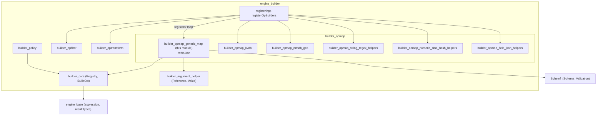
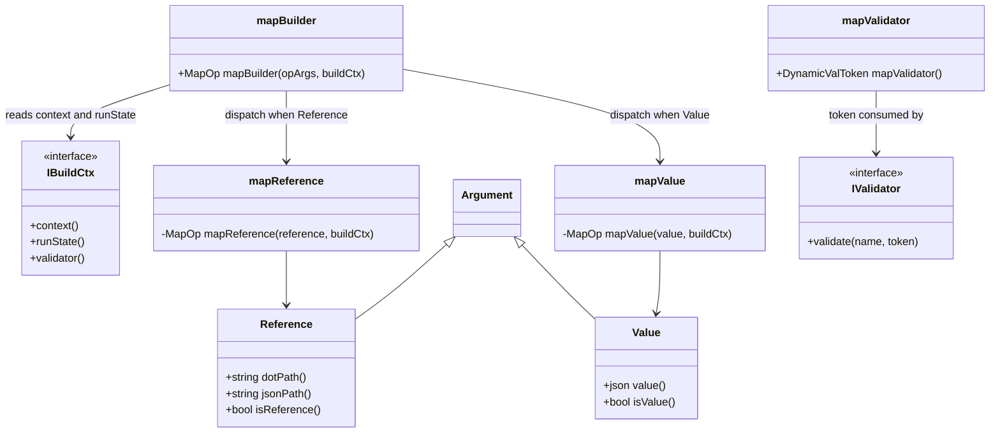
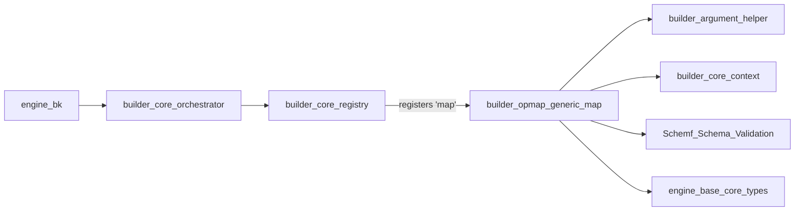
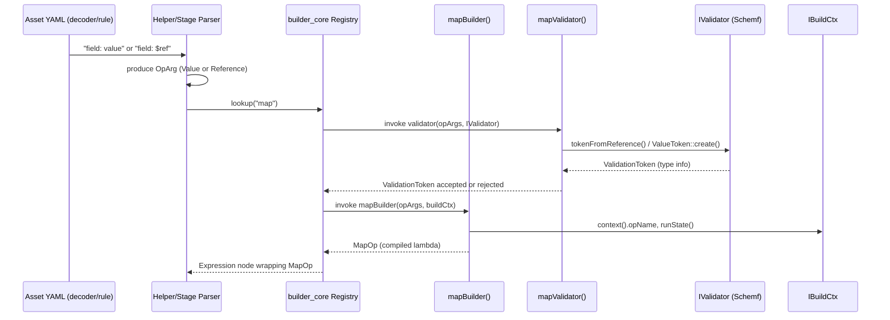
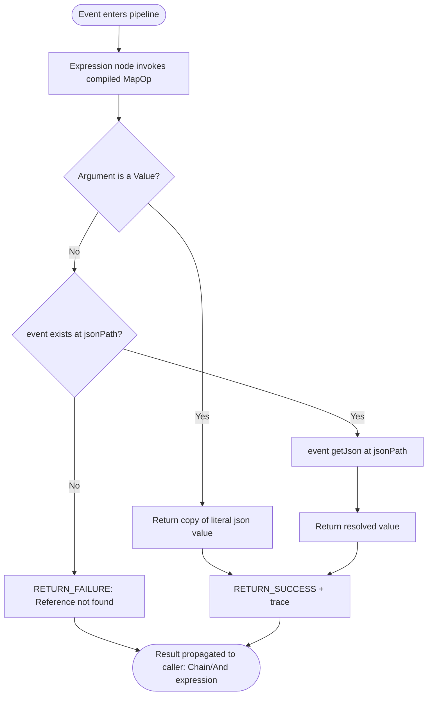
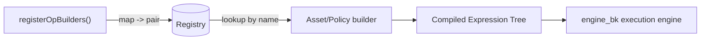

# builder_opmap_generic_map

## Introduction

The `builder_opmap_generic_map` module implements the **generic `map` operator** of the Wazuh Engine's asset-building pipeline (`builder_opmap`). The `map` operator is the simplest and most fundamental *map-type* operation available to asset writers: given a literal value or a reference to another field, it produces that value as the result to be assigned to the target field of an event. It is the operator-level equivalent of a plain assignment statement (`field: value` or `field: $other.field`) inside a Wazuh Engine decoder, rule, or filter asset.

This module is intentionally small and self-contained — a single source file (`map.cpp`) exposing two factory functions, `mapBuilder` and `mapValidator` — but it plays a central role because the `map` operator is registered under the name `"map"` in the global operator [Registry](builder_core_registry.md) and is exercised by practically every asset that performs field assignment without additional transformation logic.

This document explains the internal design, how the component integrates with the rest of the [engine_builder](engine_builder.md) and [Schemf_(Schema_Validation)](Schemf_(Schema_Validation).md) subsystems, and the runtime data flow when an event is processed.

## Purpose and Core Functionality

| Aspect | Description |
|---|---|
| **Operator name** | `map` |
| **Category** | Op-Map (value-producing) builder — sibling of [builder_opmap_kvdb](builder_opmap_kvdb.md), [builder_opmap_mmdb_geo](builder_opmap_mmdb_geo.md), `builder_opmap_string_regex_helpers`, `builder_opmap_numeric_time_hash_helpers`, and `builder_opmap_field_json_helpers` |
| **Inputs** | Exactly one argument: a `Value` (JSON literal) or a `Reference` (dot-path to another field) |
| **Output** | A `MapOp` runtime closure returning either the literal value or the resolved value of the referenced field |
| **Validation** | A `DynamicValToken` resolver used by the schema validator to infer/propagate the field's type at build time |

The module exposes two public functions:

1. **`mapBuilder(opArgs, buildCtx) -> MapOp`** — builds the runtime lambda that will be executed for every event flowing through the pipeline.
2. **`mapValidator() -> DynamicValToken`** — builds a *validation resolver* used at asset-build time by the schema validation engine (`schemf`) to check/propagate type information without needing to execute the operator.

Because `map` supports both **constant** and **field-copy** semantics through a single operator name, asset authors write:

```yaml
normalize:
  - map:
      - field.a: "some_literal_string"
      - field.b: $field.c
```

and the builder transparently dispatches to the correct internal implementation (`mapValue` or `mapReference`) based on the argument type detected during parsing.

## Architecture and Component Relationships

### Position within the Engine Builder



### Internal Structure

`map.cpp` defines an anonymous namespace with two private helper factories and exposes two public factory functions:



- **`mapValue`** — captures the literal JSON value at build time and returns a `MapOp` lambda that always succeeds, producing a copy of that constant.
- **`mapReference`** — captures the pre-computed JSON pointer path (`jsonPath()`) of the referenced field and returns a `MapOp` lambda that, at runtime, checks for the field's existence in the incoming event; if absent, it fails with a descriptive trace message, otherwise it returns the field's current value.
- **`mapBuilder`** — the single public entry point invoked by the [builder_core](builder_core.md) registry machinery. It validates argument arity (`utils::assertSize(opArgs, 1)`) then dispatches to `mapValue` or `mapReference` based on `Argument::isValue()`.
- **`mapValidator`** — returns a `DynamicValToken`, a resolver closure consumed by [Schemf_(Schema_Validation)](Schemf_(Schema_Validation).md). For literal values it creates a `ValueToken` directly from the JSON constant; for references it delegates to `schemf::tokenFromReference`, which resolves the schema type of the referenced dot-path through the injected `IValidator` interface.

## Dependencies

### Direct Dependencies

| Dependency | Module | Role |
|---|---|---|
| `Reference`, `Value`, `Argument` | [builder_argument_helper](builder_argument_helper.md) | Runtime representation of operator arguments (literal vs. field reference) parsed from the asset YAML |
| `IBuildCtx`, `RunState` | [builder_core_context](builder_core_context.md) | Build-time context providing operator name, run mode (for trace granularity), and access to the validator |
| `assertSize` | [builder_argument_helper](builder_argument_helper.md) | Argument-count assertion helper shared by all op builders |
| `IValidator`, `ValidationToken`, `ValueToken`, `tokenFromReference` | [Schemf_(Schema_Validation)](Schemf_(Schema_Validation).md) | Schema-aware type inference/validation used by `mapValidator` |
| `base::ConstEvent`, `RETURN_SUCCESS`/`RETURN_FAILURE` | [engine_base_core_types](engine_base_core_types.md) | Event abstraction and standard success/failure signaling used by every operator |
| `json::Json` | [engine_base](engine_base.md) | JSON value container and dot-path/JSON-path formatting |

### Consumers

| Consumer | Relationship |
|---|---|
| [builder_core_registry](builder_core_registry.md) (`register.hpp::registerOpBuilders`) | Registers `"map"` → `{mapValidator(), mapBuilder}` in the global `Registry` at engine startup |
| Sibling `builder_opmap` modules ([builder_opmap_kvdb](builder_opmap_kvdb.md), [builder_opmap_mmdb_geo](builder_opmap_mmdb_geo.md)) | Share the same `OpBuilderEntry`/`DynamicValToken` conventions established here as the canonical "simple map" pattern |
| [builder_core_orchestrator](builder_core_orchestrator.md) / builder policy assembly | Uses the operator during asset expression graph construction; every decoder/rule stage that performs `map:` normalization compiles down into calls into this builder |
| [engine_bk](engine_bk.md) runtime backends | Execute the compiled `MapOp` lambdas as part of the expression tree evaluated for each incoming event |

### Dependency Graph



## Data Flow

### Build-Time Flow (Asset Compilation)



### Runtime Flow (Event Processing)



The `MapResult` produced (success or failure, each carrying a trace string) is consumed by the enclosing expression node (e.g., a `Chain`/`And` node built by [engine_base_expression](engine_base_expression.md)), which determines whether the overall stage assigns the value to the target field or short-circuits with an error, depending on the surrounding stage semantics (`map`/`normalize` stage vs. `check`/`filter` stage).

## Key Implementation Details

### `mapValue` — Literal Assignment

- Captures `value.value()` (a `json::Json`) by move into the closure.
- Always returns success; the trace message is pre-formatted once at build time (`"{opName} -> Success"`) to avoid per-event string formatting overhead.
- Because the value is copied into the closure at build time, runtime execution is O(1) and allocation-light (a `json::Json` copy per event).

### `mapReference` — Field-to-Field Copy

- Pre-computes both the human-readable dot-path (`reference.dotPath()`) — used only in the (dynamic) not-found trace message — and the JSON Pointer path (`reference.jsonPath()`) used for the actual lookup, avoiding repeated path translation per event.
- Performs an existence check (`event->exists(...)`) before extraction, guarding against sparse/optional fields, and fails explicitly (rather than throwing) when absent, consistent with the operator model's `RETURN_FAILURE`/`RETURN_SUCCESS` contract described in [engine_base](engine_base.md).

### `mapBuilder` — Dispatch Logic

```cpp
utils::assertSize(opArgs, 1);
if (opArgs[0]->isValue()) { return mapValue(...); }
return mapReference(...);
```

Arity is strictly one argument; this differs from arithmetic/string helper operators in `builder_opmap_numeric_time_hash_helpers` or `builder_opmap_string_regex_helpers`, which frequently accept variable argument counts. `map` is deliberately minimal.

### `mapValidator` — Schema Token Resolution

`mapValidator()` returns a `DynamicValToken`, i.e., a resolver closure invoked lazily by the schema validation engine ([Schemf_(Schema_Validation)](Schemf_(Schema_Validation).md)) once the destination field's schema entry is known. Two branches:

- **Value argument** → `schemf::ValueToken::create(value)` — the validator can statically know the exact JSON value/type being assigned.
- **Reference argument** → `schemf::tokenFromReference(dotPath, validator)` — delegates to the injected `IValidator` to resolve the *source* field's schema type, which is then checked for compatibility against the destination field's declared type (if any), enabling early detection of type-mismatch assignments at asset compilation time rather than at runtime.

This validator pattern (`{validator, builder}` pair registered together per operator name) is the standard convention followed by every entry registered in `registerOpBuilders` (see [builder_core_registry](builder_core_registry.md)), ensuring consistent compile-time type safety across the whole `opmap`/`opfilter`/`optransform` operator families.

## Registration and Discoverability

The `map` operator is wired into the engine exclusively through:

```cpp
registry->template add<builders::OpBuilderEntry>(
    "map", {builders::opmap::mapValidator(), builders::opmap::mapBuilder});
```

found in `register.hpp` (see [builder_core_registry](builder_core_registry.md) / `registerOpBuilders`). There is no other registration path; any asset author invoking `map:` as a stage or helper name resolves directly to this module's `mapBuilder`/`mapValidator` pair.



## Related Documentation

- [builder_core.md](builder_core.md) and [builder_core_registry.md](builder_core_registry.md) — `Registry`, `IBuildCtx`, and the overall builder orchestration that instantiates this operator.
- [builder_argument_helper.md](builder_argument_helper.md) — `Reference`/`Value`/`Argument` types and helper parsing utilities (`assertSize`, `assertValue`, etc.) used by `map` and all sibling operators.
- [Schemf_(Schema_Validation).md](Schemf_(Schema_Validation).md) — `IValidator`, `ValidationToken`, `ValueToken`, and `tokenFromReference`, consumed by `mapValidator`.
- [engine_base.md](engine_base.md) and [engine_base_core_types.md](engine_base_core_types.md) — `base::ConstEvent`, success/failure macros, and the `Expression`/`Chain` types that wrap `MapOp` results into the executable graph.
- [builder_opmap_kvdb.md](builder_opmap_kvdb.md), [builder_opmap_mmdb_geo.md](builder_opmap_mmdb_geo.md) — sibling operator families within `builder_opmap` that build on the same `OpArg`/`DynamicValToken` conventions.
- [engine_bk.md](engine_bk.md) — runtime backend component that ultimately drives event evaluation through the compiled expression graphs containing `MapOp` nodes.
