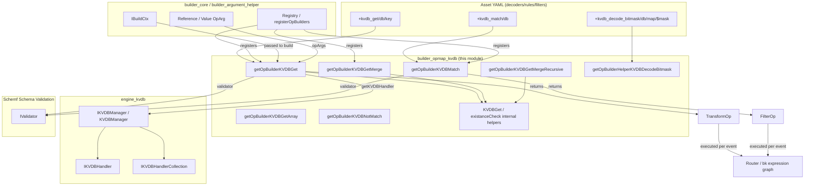
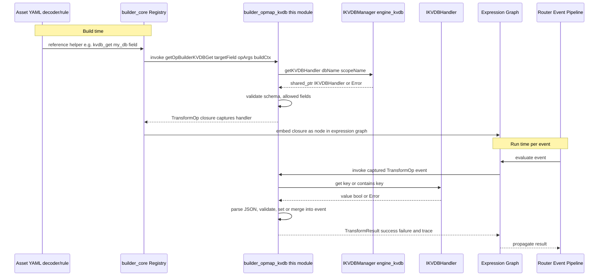

# builder_opmap_kvdb

## Introduction

The `builder_opmap_kvdb` module implements the **KVDB (Key-Value Database) operator helpers** used by the Wazuh Engine's asset-building pipeline (`builder_opmap`). It provides the concrete implementations that translate the declarative helper functions written in decoder/rule/filter assets — such as `+kvdb_get`, `+kvdb_get_merge`, `+kvdb_get_merge_recursive`, `+kvdb_match`, `+kvdb_not_match`, `+kvdb_get_array`, and `+kvdb_decode_bitmask` — into executable `TransformOp`/`FilterOp` closures that run as part of an event-processing pipeline (an `Expression` graph built by [engine_builder](engine_builder.md)).

In short, this module is the bridge between the **asset DSL (YML rules referencing KVDB helpers)** and the [engine_kvdb](engine_kvdb.md) runtime, allowing engine assets to enrich, filter, or transform events using data stored in on-disk RocksDB-backed key-value databases.

## Purpose and Core Functionality

This module exposes seven builder factory functions, each returning a `TransformBuilder` or `FilterBuilder` (function objects consumed by the [builder_core](builder_core.md) `Registry`/`Builder`). When an asset declares a helper such as:

```yaml
check:
  - myField: +kvdb_match/my_db
normalize:
  - map:
      otherField: +kvdb_get/my_db/$sourceField
```

the corresponding builder function below is invoked at **build time** to validate the helper's arguments and schema compatibility, and produce a runtime **operation closure** that is invoked once per event at **run time**.

| Helper (asset DSL) | Builder Function | Category | Behavior |
|---|---|---|---|
| `+kvdb_get/<db>/<key>` | `getOpBuilderKVDBGet` | Transform (Map) | Fetches value for `key` from `<db>` and **sets** it into the target field. |
| `+kvdb_get_merge/<db>/<key>` | `getOpBuilderKVDBGetMerge` | Transform (Map) | Fetches value and **merges** (shallow) it into an existing object/array target field. |
| `+kvdb_get_merge_recursive/<db>/<key>` | `getOpBuilderKVDBGetMergeRecursive` | Transform (Map) | Same as above but performs a **recursive** merge. |
| `+kvdb_get_array/<db>/<key_array>` | `getOpBuilderKVDBGetArray` | Transform (Map) | Looks up multiple keys (array) and appends the homogeneous results to the target array field. |
| `+kvdb_match/<db>` | `getOpBuilderKVDBMatch` | Filter | Passes the event only if the target field's value **exists as a key** in `<db>`. |
| `+kvdb_not_match/<db>` | `getOpBuilderKVDBNotMatch` | Filter | Passes the event only if the target field's value **does not exist** as a key in `<db>`. |
| `+kvdb_decode_bitmask/<db>/<key_map>/<mask_ref>` | `getOpBuilderHelperKVDBDecodeBitmask` | Transform (Map) | Decodes a bitmask field using a bit-position → label map stored in the KVDB, appending matching labels to the target array. |

All seven builders share a common implementation strategy:

1. **Argument validation** (`utils::assertSize`, `assertValue`, `assertRef`) — enforce arity and static/dynamic argument kinds.
2. **Schema/AllowedFields validation** — using [Schemf_(Schema_Validation)](Schemf_(Schema_Validation).md) (`buildCtx->validator()`) and `builder::IAllowedFields` to ensure the target field type is compatible and the field is permitted for the asset type.
3. **KVDB handler acquisition** — obtaining a `shared_ptr<IKVDBHandler>` from the injected `IKVDBManager` (see [engine_kvdb](engine_kvdb.md)) for the given `dbName` and `kvdbScopeName`, done once at build time (not per event).
4. **Closure construction** — returning a lambda that captures the handler, target field paths, validators, and pre-formatted trace messages, then performs the actual per-event KVDB lookup/merge/filter logic, returning `RETURN_SUCCESS`/`RETURN_FAILURE` (macros from [engine_base](engine_base.md) tracing utilities).

## Architecture and Component Relationships



### Component relationships summary
- **Upstream (build-time) dependency**: [builder_core](builder_core.md) supplies `IBuildCtx`, the `Registry`, and the `Reference`/`Value` argument types (`builder_argument_helper`) that this module consumes to parse `<db>`, `<key>` and target-field arguments.
- **Sibling modules**: `builder_opmap_mmdb_geo`, `builder_opmap_generic_map`, and the other `builder_opmap_*` children provide analogous helper builders for GeoIP/MMDB lookups and generic transforms; together with this module they are aggregated by `register.hpp` (`registerOpBuilders`) in [builder_core](builder_core.md).
- **Downstream (runtime) dependency**: [engine_kvdb](engine_kvdb.md) provides `IKVDBManager`/`KVDBManager` and `IKVDBHandler`, used both at build time (handler acquisition) and indirectly at run time (through the captured handler) to perform `get`/`contains` operations against RocksDB column families.
- **Validation dependency**: [Schemf_(Schema_Validation)](Schemf_(Schema_Validation).md) supplies `IValidator` used to type-check reference arguments and target fields, and to build value validators for data coming out of the KVDB.
- **Execution context**: Once built, the resulting `TransformOp`/`FilterOp` closures are embedded into the asset's `Expression` graph (see [engine_base](engine_base.md) `expression.hpp`) and executed by the [Router](Router.md) / [engine_bk](engine_bk.md) backend controllers during event processing.
- **CLI tooling**: The `engine_kvdb` Python CLI (part of [engine_kvdb](engine_kvdb.md)) is used operationally to create/populate/inspect the KVDB databases that these builders query; there is no direct code dependency, only a data dependency (the KVDB content).

## Detailed Component Design

### Common internal helpers (not exported)

- **`KVDBGet(...)`** — shared implementation behind `getOpBuilderKVDBGet`, `getOpBuilderKVDBGetMerge`, and `getOpBuilderKVDBGetMergeRecursive`. Parameterized by `doMerge` and `isRecursive` flags.
- **`existanceCheck(...)`** — shared implementation behind `getOpBuilderKVDBMatch` and `getOpBuilderKVDBNotMatch`. Parameterized by `shouldMatch`.
- **`getFnSearchMap(const json::Json&)`** — utility used exclusively by `OpBuilderHelperKVDBDecodeBitmask` to pre-compile a bit-position→value lookup table (`std::vector<std::optional<json::Json>>`) from the JSON map retrieved from the KVDB, avoiding repeated JSON parsing per event.

### `getOpBuilderKVDBGet` / `getOpBuilderKVDBGetMerge` / `getOpBuilderKVDBGetMergeRecursive`

**Build-time steps** (inside `KVDBGet`):
1. Validate exactly 2 `opArgs`: `[0]` = DB name (must be a `Value` string), `[1]` = key (`Value` string or `Reference` to a string field).
2. Check `targetField` is allowed for the asset type via `buildCtx->allowedFields()`.
3. If merging, validate that (when schema info is known) the target field type is `OBJECT` or an array.
4. Acquire the KVDB handler via `kvdbManager->getKVDBHandler(dbName, kvdbScopeName)`.
5. Build a `schemf::ValueValidator` for the target field if schema info exists.
6. Pre-format all trace/failure messages.

**Run-time closure**:
1. Resolve the key (literal or from event reference); fail if reference missing/not a string.
2. Call `kvdbHandler->get(resolvedKey)`; fail if key not found.
3. Parse the raw string value as JSON; fail on malformed JSON.
4. Run schema validation on the retrieved value if applicable; fail on mismatch, including a check that nested object fields are individually allowed (`allowedFields->check`).
5. Either `event->set(...)` (plain get) or `event->merge(...)` (merge variants, recursively or not) into the target field.

### `getOpBuilderKVDBGetArray`

Handles the array-valued lookup helper `+kvdb_get_array/<db>/<key_array>`:
1. Validates that `keyArray` argument is either a literal string array or a reference to an array-of-strings field (checked against the schema when available).
2. Validates the target field is (or can be) an array via `schemf::isArrayToken()`.
3. At run time, resolves the array of keys, fetches each corresponding value from the KVDB, enforces that all retrieved values share the **same JSON type** (homogeneity check), appends them to the target array (creating it if missing), and finally validates the resulting array against the schema before writing it back to the event.

### `getOpBuilderKVDBMatch` / `getOpBuilderKVDBNotMatch`

Implemented via `existanceCheck`:
1. Validates exactly 1 argument: the DB name.
2. Acquires the KVDB handler.
3. At run time: reads the target field as a string, calls `kvdbHandler->contains(key)`, and returns success/failure depending on whether the `shouldMatch` flag matches the `contains` result (used to implement both the positive `+kvdb_match` and negated `+kvdb_not_match` filters).

### `getOpBuilderHelperKVDBDecodeBitmask`

Implements `+kvdb_decode_bitmask/<db>/<key_map>/<mask_ref>`:
1. Validates 3 arguments: DB name (Value), key of the bitmask-definition map inside the DB (Value), and a reference to the field holding the hexadecimal mask (Reference).
2. Validates target field is (or can become) an array of strings, and the mask reference field is a string when schema-known.
3. **At build time**, eagerly fetches the JSON map object from the KVDB (keyed by `key_map`) and compiles it into a fixed-size lookup vector (`getFnSearchMap`), where each map key is expected to be a decimal string representing a bit position (0–63) and the values must be **homogeneous** in type.
4. At run time, resolves the mask value from the event (hex string, parsed via `std::stoul(..., 16)`), iterates over all 64 bit positions, and for every set bit consults the pre-built lookup table, appending any found value to the target array field. Fails if no bits produced a mapped value.

## Data Flow



## Key Design Considerations

- **Build-time handler binding**: KVDB handlers are resolved **once** during asset build, not per event, minimizing runtime overhead for high-throughput event pipelines. This mirrors the pattern used in `builder_opmap_mmdb_geo` for MaxMind DB lookups.
- **Static vs. dynamic arguments**: Every helper distinguishes between `Value` (compile-time constant) and `Reference` (runtime-resolved from the event) arguments, validating each with the appropriate strategy (`assertValue`/`assertRef` from [builder_argument_helper](builder_argument_helper.md)) and, where possible, statically validating referenced-field types against the schema.
- **Fail-fast semantics with rich tracing**: All failure paths use `RETURN_FAILURE`/`RETURN_SUCCESS` macros with pre-formatted, context-specific trace strings (asset/operation name embedded), aiding debugging via the [engine_test](engine_test.md) tooling and the [Router](Router.md) tracer.
- **Type/field-permission safety**: Both the [Schemf_(Schema_Validation)](Schemf_(Schema_Validation).md) validator and the `IAllowedFields` policy are consulted to prevent assets from writing disallowed or type-incompatible fields, which is especially relevant for `kvdb_get`/`kvdb_get_merge` where DB content is external/untrusted at build time.
- **Homogeneity enforcement**: Both `getOpBuilderKVDBGetArray` and `OpBuilderHelperKVDBDecodeBitmask` enforce that multiple values retrieved from the KVDB share a consistent JSON type, protecting downstream consumers of the target array field from mixed-type surprises.

## Related Modules

- [engine_kvdb](engine_kvdb.md) — Provides the `IKVDBManager`/`KVDBManager` and `IKVDBHandler` runtime consumed by this module, plus the `engine-suite` CLI tools for managing KVDB content operationally.
- [builder_core](builder_core.md) — Supplies the `IBuildCtx`, `Registry`, and overall `Builder`/`BuilderDeps` orchestration into which these helper builders are registered.
- [builder_argument_helper](builder_argument_helper.md) — Supplies `Reference`/`Value`/`OpArg` argument abstractions and assertion utilities (`assertSize`, `assertValue`, `assertRef`) used extensively here.
- [Schemf_(Schema_Validation)](Schemf_(Schema_Validation).md) — Supplies `IValidator`/`ValidationResult` used for target-field and value validation.
- [builder_opmap_mmdb_geo](builder_opmap_mmdb_geo.md) — Sibling opmap module implementing analogous lookup-enrichment helpers backed by MaxMind GeoIP/ASN databases instead of KVDB.
- [builder_opmap_generic_map](builder_opmap_generic_map.md) — Sibling module for the generic `map`/`mapValidator` helper builder.
- [engine_base](engine_base.md) — Provides `Expression`, tracing macros, and core result types (`base::Error`, `base::RespOrError`) used throughout this module.
- [Router](Router.md) — Executes the built `Expression` graphs (containing the `TransformOp`/`FilterOp` produced here) against live events.
