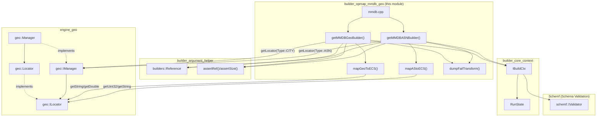
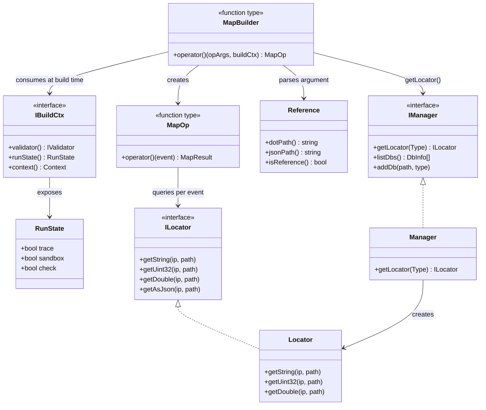
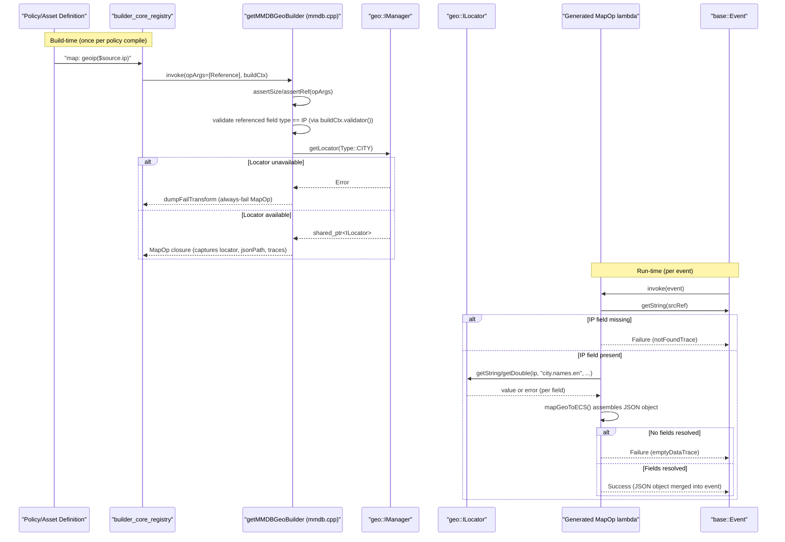
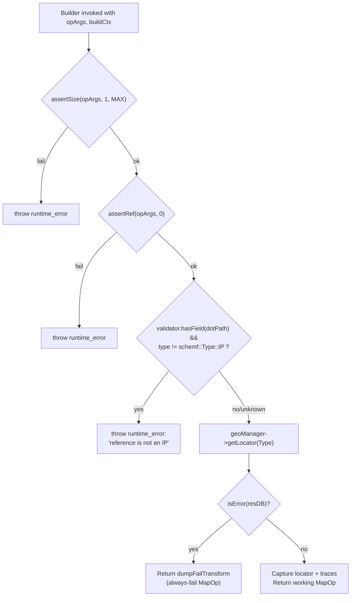
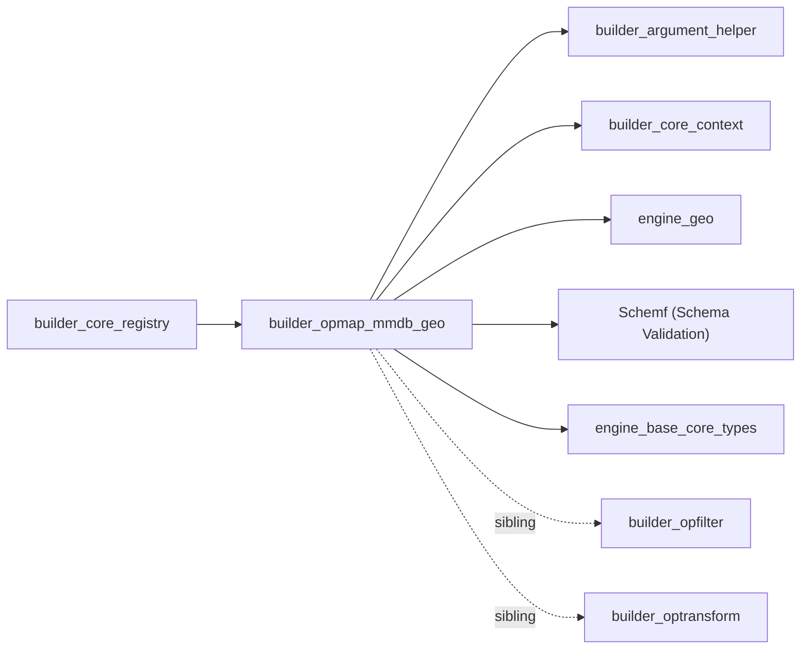
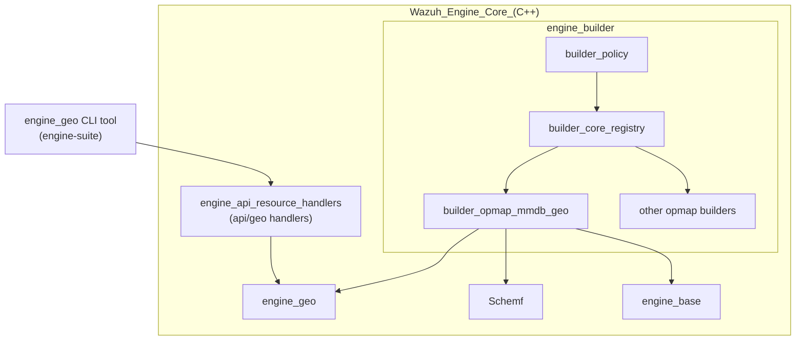

# builder_opmap_mmdb_geo

## Introduction

The **builder_opmap_mmdb_geo** module implements the map-operation builders that expose MaxMind GeoIP database (MMDB) lookups to the Wazuh Engine's decoder/rule pipeline. It provides two operation builders — `geoip` (city/country enrichment) and `as` (Autonomous System enrichment) — that translate a declarative asset definition (e.g. `map: geoip($source.ip)`) into an executable `MapOp` lambda. At runtime, this lambda resolves an IP address referenced in the event, queries the appropriate MMDB database through the `geo` module's locator abstraction, and merges the resulting ECS-compliant geolocation/ASN fields back into the event as a JSON object.

This module is a thin, focused adapter layer: it contains no MMDB parsing logic itself. Instead, it depends heavily on the [engine_geo](engine_geo.md) module (which owns the MMDB file management, download, and low-level lookup) and on the generic [builder_opmap_generic_map](builder_opmap_generic_map.md) / [builder_argument_helper](builder_argument_helper.md) machinery for argument validation and result wrapping. It is one of several sibling "opmap helper" builders — see [builder_opmap_kvdb](builder_opmap_kvdb.md), [builder_opmap_string_regex_helpers](builder_opmap_string_regex_helpers.md), [builder_opmap_numeric_time_hash_helpers](builder_opmap_numeric_time_hash_helpers.md), and [builder_opmap_field_json_helpers](builder_opmap_field_json_helpers.md) — that are all registered together by the parent [builder_opmap_generic_map](builder_opmap_generic_map.md) component and consumed by [builder_core](Wazuh_Engine_Core_(C++).md)'s registry.

## Purpose & Core Functionality

| Capability | Description |
|---|---|
| **`geoip` builder** (`getMMDBGeoBuilder`) | Resolves an IP reference against the MMDB **City** database and produces ECS-style fields: `city_name`, `continent_code`, `continent_name`, `country_iso_code`, `country_name`, `location.lat`/`lon`, `postal_code`, `timezone`, `region_iso_code`, `region_name`. |
| **`as` builder** (`getMMDBASNBuilder`) | Resolves an IP reference against the MMDB **ASN** database and produces `number` (AS number) and `organization.name` (AS organization) fields. |
| **Argument validation** | Both builders enforce exactly one argument, require it to be a **reference** (not a literal value), and — when schema information is available — validate that the referenced field's declared type is `IP`. |
| **Locator resolution at build-time** | The appropriate `geo::ILocator` (city or ASN) is fetched once from the injected `geo::IManager` when the operation is *built*, not on every event, for efficiency. If the locator/database is unavailable, the builder returns a deterministic "always fail" `MapOp`. |
| **Per-event execution** | The returned `MapOp` reads the IP string from the event, performs the MMDB lookup via the locator, and returns either a populated JSON object (success) or a `base::Error` with a descriptive trace (failure: field missing, empty DB result, etc.). |

## Architecture

## Component Relationships

## Data / Execution Flow

The following sequence shows how a `geoip` (or `as`) operation is compiled and later executed for each incoming event.

## Build-Time Argument Validation

## Core Components

### `getMMDBGeoBuilder(geoManager)`
Factory returning a `MapBuilder`. When invoked by the registry with the parsed operator arguments and the current `IBuildCtx`:
1. Validates argument count/type using [builder_argument_helper](builder_argument_helper.md) utilities (`assertSize`, `assertRef`).
2. Optionally validates, via `buildCtx->validator()` (see [Schemf (Schema Validation)](Schemf_(Schema_Validation).md)), that the referenced field is typed as `IP`.
3. Requests a `geo::ILocator` for `geo::Type::CITY` from the injected `geo::IManager` (see [engine_geo](engine_geo.md)).
4. Returns a `MapOp` closure that, per event, reads the IP, calls `mapGeoToECS`, and returns success/failure using the `RETURN_SUCCESS`/`RETURN_FAILURE` macros tied to the build's `RunState` (trace/sandbox/check flags).

### `getMMDBASNBuilder(geoManager)`
Structurally identical to `getMMDBGeoBuilder`, but requests `geo::Type::ASN` and delegates per-event enrichment to `mapAStoECS`.

### `mapGeoToECS(ip, locator)` (internal)
Performs a series of best-effort `locator->getString`/`getDouble` calls against MMDB City-database paths (`city.names.en`, `continent.code`, `country.iso_code`, `location.latitude`, etc.) and assembles them into an ECS-shaped `json::Json` object. Fields that are not present in the DB response are simply omitted rather than causing failure.

### `mapAStoECS(ip, locator)` (internal)
Performs `locator->getUint32("autonomous_system_number")` and `locator->getString("autonomous_system_organization")` lookups and assembles the ASN JSON object (`number`, `organization.name`).

### `dumpFailTransform(trace, runstate)` (internal)
Utility that produces a `MapOp` which unconditionally fails with a fixed trace message — used when the required MMDB database/locator could not be obtained at build time (e.g., database not configured/loaded).

## Dependencies

- **[engine_geo](engine_geo.md)** — Provides `geo::IManager`/`geo::ILocator` interfaces and the `Manager`/`Locator` implementations that actually open and query the MMDB files (via libmaxminddb). This module is the *only* place that performs real MMDB I/O; `builder_opmap_mmdb_geo` merely orchestrates calls to it.
- **[builder_core_context](Wazuh_Engine_Core_(C++).md)** (`IBuildCtx`, `RunState`) — Supplies build-time context: the schema validator, the run mode flags (trace/sandbox/check) that determine how success/failure results are reported, and the operator name used in trace messages.
- **[builder_argument_helper](Wazuh_Engine_Core_(C++).md)** (`Reference`, `Value`, `assertRef`, `assertSize`) — Generic argument-shape validation shared by all opmap/opfilter builders.
- **[Schemf (Schema Validation)](Schemf_(Schema_Validation).md)** — Used to check, when schema metadata exists, that the referenced field is declared as an `IP` type, preventing accidental misuse of the `geoip`/`as` operators on non-IP fields.
- **Sibling opmap builders** — [builder_opmap_kvdb](builder_opmap_kvdb.md), [builder_opmap_generic_map](builder_opmap_generic_map.md), [builder_opmap_string_regex_helpers](builder_opmap_string_regex_helpers.md), [builder_opmap_numeric_time_hash_helpers](builder_opmap_numeric_time_hash_helpers.md), [builder_opmap_field_json_helpers](builder_opmap_field_json_helpers.md) are registered alongside this module by [builder_core_registry](Wazuh_Engine_Core_(C++).md)'s `registerOpBuilders` function, all following the same `MapBuilder` factory pattern.
- **[builder_policy](Wazuh_Engine_Core_(C++).md)** — Consumes the built `MapOp` operations when assembling assets (decoders/rules) into the executable policy graph.

## Where This Fits in the System

The `geoip`/`as` operators built here are ultimately used inside decoder and rule assets processed by the [Router](Router.md) and [engine_bk](engine_bk_rx.md) execution backends when events flow through the engine's pipeline. Administrators manage the underlying MMDB databases out-of-band via the `engine_geo` CLI tool and the `api/geo` HTTP handlers (see [engine_api_resource_handlers](engine_api.md)), which both talk to the same `geo::IManager` this module depends on.

## Key Design Notes

- **Fail-fast at build time, degrade gracefully at runtime**: If a referenced field's schema type is known and is not `IP`, the builder throws at *build* time (compile-time policy error). If the underlying MMDB database is simply not loaded, the builder does not throw — it returns an operation that always fails per-event, allowing the policy to still compile (useful for optional GeoIP enrichment in an environment where the DB hasn't been provisioned yet).
- **Locator resolved once, reused per event**: The `geo::ILocator` shared pointer is captured by value in the returned lambda's closure, avoiding a manager lookup for every event processed.
- **Partial results are still successes**: `mapGeoToECS`/`mapAStoECS` do not fail if only some sub-fields are resolvable (e.g., missing postal code); the operation only fails if the resulting object is completely empty.
- **ECS alignment**: Field names mirror Elastic Common Schema conventions (`city_name`, `country_iso_code`, `location.lat/lon`, `organization.name`) to ensure indexed events are directly compatible with downstream analytics ([engine_indexerconnector](Wazuh_Engine_Core_(C++).md)).
