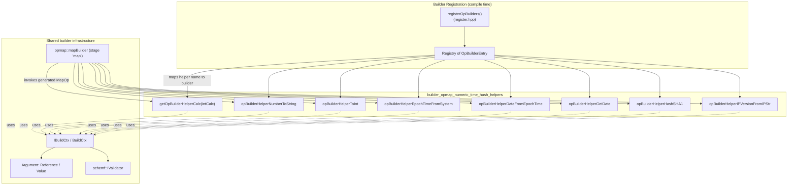
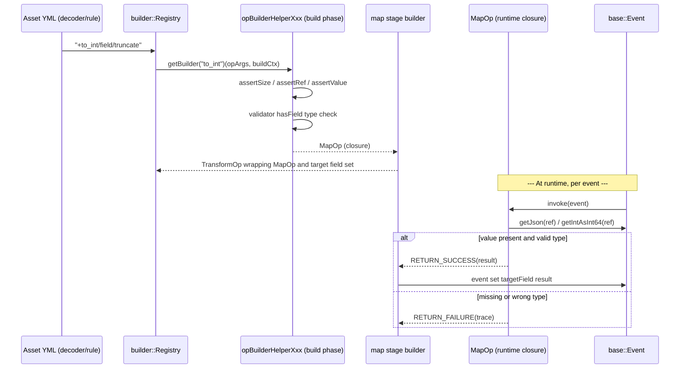
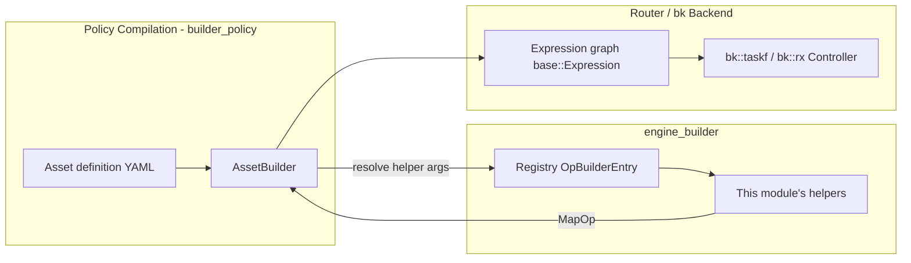

# Builder OpMap: Numeric, Time & Hash Helpers

## Introduction

This module implements a family of **map-type operator helpers** used by the Wazuh Engine's rule/decoder **builder** subsystem. These helpers are invoked from asset definitions (decoders, rules, outputs) using the `+helper_name/args...` syntax, and they compute a new value to be written into a target field of the event being processed. Specifically, this module groups together helpers that perform:

- **Numeric transformations**: arithmetic calculation (`int_calculate` / `float_calculate`), integer coercion (`to_int`), and number-to-string conversion (`to_string`).
- **Time-related transformations**: current system epoch (`system_epoch`), ISO-8601 date from epoch (`date_from_epoch`), and current wall-clock date (`get_date`).
- **Hashing and IP classification**: SHA1 hashing of a string (`sha1`), and IP version detection (`ip_version`).

All of these helpers are **pure "Map" operations** — they read from event fields and/or static values, compute a single JSON value, and return it via the standard `MapOp`/`MapResult` protocol, without directly mutating the event (the actual field assignment is performed by the generic `map` stage builder that wraps a `MapOp`).

This module is a sibling of other opmap helper groups within `builder_opmap`, such as [builder_opmap_string_regex_helpers](builder_opmap_string_regex_helpers.md) (string/regex transformations) and [builder_opmap_field_json_helpers](builder_opmap_field_json_helpers.md) (field/JSON manipulation transform helpers such as `delete`, `rename`, `merge`). All of them are implemented in the same source file (`opBuilderHelperMap.cpp`) but are split into separate documentation/architecture units by responsibility.

## Purpose and Scope

The functions documented here are **builder factory functions**: given the parsed operator arguments (`OpArg`) and a shared build context (`IBuildCtx`), they validate arguments at **build time** (schema types, arity, literal vs. reference) and return a closure (`MapOp`) that performs the actual computation at **runtime**, once per event.

| Helper (asset syntax) | Function | Category |
|---|---|---|
| `+int_calculate/<op>/<a>/<b>/...` | `getOpBuilderHelperCalc(true)` → returns `MapOp` | Numeric |
| `+float_calculate/<op>/<a>/<b>/...` | `getOpBuilderHelperCalc(false)` → returns `MapOp` | Numeric |
| `+to_string/$ref` | `opBuilderHelperNumberToString` | Numeric |
| `+to_int/$ref/[truncate\|round]` | `opBuilderHelperToInt` | Numeric |
| `+system_epoch` | `opBuilderHelperEpochTimeFromSystem` | Time |
| `+date_from_epoch/$ref` | `opBuilderHelperDateFromEpochTime` | Time |
| `+get_date` | `opBuilderHelperGetDate` | Time |
| `+sha1/$ref` | `opBuilderHelperHashSHA1` | Hash |
| `+ip_version/$ref` | `opBuilderHelperIPVersionFromIPStr` | IP classification |

Note: `getOpBuilderHelperCalc` is a **builder factory of a factory** (`MapBuilder`): it is parametrized once at registration time (`true` for integer math, `false` for floating point math) and produces the actual `MapBuilder` used by the registry.

## Architecture

### Component Relationships

### Dependencies

- **[builder_core](builder_core.md)** — provides `IBuildCtx`/`BuildCtx`, the builder `Registry`, and `IRegistry`, which is the foundation all helpers are registered into.
- **[builder_argument_helper](builder_argument_helper.md)** — provides `Reference`/`Value` argument types and `assertSize`/`assertRef`/`assertValue` utilities used extensively for argument validation in this module.
- **[builder_opmap_generic_map](builder_opmap_generic_map.md)** — the `map` stage builder (`mapBuilder`/`mapValidator`) that consumes the `MapOp` produced by these helpers and assigns the resulting value to the target field of the event.
- **[builder_opmap_string_regex_helpers](builder_opmap_string_regex_helpers.md)** — sibling helper group in the same source file, covering string case transforms, trimming, concatenation, and regex extraction.
- **[builder_opmap_field_json_helpers](builder_opmap_field_json_helpers.md)** — sibling helper group covering field deletion/rename/merge and "get value from object" (`Transform`-type) helpers, also defined in `opBuilderHelperMap.cpp`.
- **[Schemf_(Schema_Validation)](Schemf_(Schema_Validation).md)** — `schemf::IValidator` is used to check, at build time, that referenced fields have compatible types (e.g., `to_int` requires a numeric reference).
- **[engine_base](engine_base.md)** — provides `base::Json`/`base::Event` primitives (via `json::Json`) and expression/result types (`base::Result`) that underlie `MapResult`/`RETURN_SUCCESS`/`RETURN_FAILURE`.
- **[engine_builder](engine_builder.md)** (parent module) — hosts `register.hpp`/`registerOpBuilders`, which wires all opmap/opfilter/optransform helpers (including this module's helpers) into the single builder `Registry` used by the [builder_policy](builder_policy.md) asset/policy compilation pipeline.

External libraries used directly by this module:
- **OpenSSL** (`openssl/evp.h`, `openssl/sha.h`) for SHA-1 hashing.
- **HowardHinnant date library** (`date/date.h`, `date/tz.h`) for ISO-8601 date formatting.
- **RE2** — used by sibling regex helpers in the same file, not by the numeric/time/hash group specifically.
- **[framework_core_utils_query_engine](framework_core_utils_query_engine.md)**-style IP utilities: `base::utils::ip::checkStrIsIPv4/IPv6` for `ip_version`.

## Build-Time vs. Runtime Flow

Each helper follows a consistent two-phase pattern:

1. **Build phase** (executed once, when a policy/asset is compiled): validate argument count/type using `assertSize`, `assertRef`, `assertValue`; resolve literal operator strings (e.g., `"sum"`, `"truncate"`) into internal enums; if a schema validator is available, statically check that referenced fields have a compatible declared type; and pre-compute all trace/error message strings.
2. **Run phase** (executed once per event): the returned lambda (`MapOp`) reads the resolved value(s) from the event (or literal), performs the computation, and returns either `RETURN_SUCCESS(runState, resultJson, successTrace)` or `RETURN_FAILURE(runState, json::Json{}, failureTrace)`.

## Numeric Helpers

### `int_calculate` / `float_calculate` — `getOpBuilderHelperCalc(bool intCalc)`

Syntax: `field: +int_calculate/<sum|sub|mul|div>/<val1|$ref1>/.../<valN|$refN>`

- First argument is a literal operator string, mapped via `strToOp` to `NumberOperator::{SUM,SUB,MUL,DIV}`.
- Remaining 1+ arguments (min. 2 operands total) are either literal numbers or references; validated to be `INTEGER`/`SHORT`/`LONG` (int path) or any JSON `Number` (float path).
- At runtime, operands are resolved and reduced left-to-right via `std::accumulate`, with explicit overflow/NaN/Inf detection and division-by-zero guarding (zero divisor beyond the first operand throws at build time if literal, or at runtime if via reference).
- Two internal helper builders implement the actual folding logic: `opBuilderHelperIntTransformation` (int64_t) and `opBuilderHelperFloatTransformation` (double).

### `to_string` — `opBuilderHelperNumberToString`

Syntax: `field: +to_string/$ref`

Converts an integer, double, or float event field into its string representation using `std::to_string`. Fails if the reference does not exist or is not numeric.

### `to_int` — `opBuilderHelperToInt`

Syntax: `field: +to_int/$ref[/truncate|round]`

Casts a numeric field to `int64_t`. If the value is already integral, it is returned as-is; otherwise the optional second parameter (`truncate` default, or `round`) controls how the fractional part is discarded/rounded (`NumCastOperator`).

## Time Helpers

### `system_epoch` — `opBuilderHelperEpochTimeFromSystem`

Syntax: `field: +system_epoch` (no arguments)

Returns the current system time as a Unix epoch (seconds) integer, sourced from `std::chrono::system_clock::now()`. Guards against `int64_t` overflow.

### `date_from_epoch` — `opBuilderHelperDateFromEpochTime`

Syntax: `field: +date_from_epoch/$ref`

Reads a numeric epoch value from a reference field and formats it as an ISO-8601 UTC timestamp (`%Y-%m-%dT%H:%M:%SZ`) using the `date` library's `date::format`. Validates the epoch does not exceed `int64_t::max()`.

### `get_date` — `opBuilderHelperGetDate`

Syntax: `field: get_date` (no arguments)

Returns the current wall-clock time (second precision, floored) as an ISO-8601 UTC string. Complements `system_epoch`, which instead returns the raw numeric epoch.

## Hash & IP Helpers

### `sha1` — `opBuilderHelperHashSHA1`

Syntax: `field: +sha1/$ref`

Computes the SHA-1 digest (as a lowercase hex string) of a string-valued event field, using OpenSSL's `EVP_Digest*` API through the internal `hashStringSHA1` function. Fails if the reference is missing, not a string, or hashing fails internally.

### `ip_version` — `opBuilderHelperIPVersionFromIPStr`

Syntax: `field: +ip_version/$ref`

Classifies a string field as `"IPv4"` or `"IPv6"` using `base::utils::ip::checkStrIsIPv4/IPv6`. Fails if the field is missing, not a string, or not a valid IP address of either version.

## Error Handling & Tracing Conventions

All helpers in this module follow the engine-wide tracing convention:
- `TRACE_SUCCESS` = `"[{name}] -> Success"`
- Specific failure traces are pre-formatted at build time (referencing the offending field/parameter name) so that runtime failures are cheap to report and include actionable context (e.g., `"Reference '{}' not found"`, `"Reference '{}' is not a string"`, `"Epoch number is too large"`).
- Failures are surfaced through the `MapResult`/`base::Result` mechanism (see [engine_base_core_types](engine_base_core_types.md)) rather than exceptions — exceptions are reserved for **build-time** configuration errors (invalid operator name, wrong argument arity, schema type mismatch), which abort asset compilation immediately.

## How This Fits Into the Engine

Once compiled, the `MapOp` closures produced by this module become terms in the expression graph executed per-event by the engine's backend (see [engine_bk](engine_bk.md)), orchestrated at a higher level by the [Router](Router.md) module for live event dispatch.

## Related Documentation

- [builder_opmap_string_regex_helpers](builder_opmap_string_regex_helpers.md) — string case/trim/concat/regex helpers (same source file).
- [builder_opmap_field_json_helpers](builder_opmap_field_json_helpers.md) — field delete/rename/merge and definition lookup helpers (same source file).
- [builder_opmap_kvdb](builder_opmap_kvdb.md) — KVDB-backed map helpers (`kvdb_get`, `kvdb_match`, etc.), registered alongside this module in `registerOpBuilders`.
- [builder_opmap_mmdb_geo](builder_opmap_mmdb_geo.md) — GeoIP/ASN map helpers, also registered in the same registry.
- [builder_opmap_generic_map](builder_opmap_generic_map.md) — generic `map` stage that wires any `MapOp` (including this module's) into event field assignment.
- [builder_opfilter](builder_opfilter.md) — sibling filter-type helpers (predicates rather than value producers).
- [builder_optransform](builder_optransform.md) — HLP-based parsing and array transform helpers.
- [builder_core](builder_core.md) — `IBuildCtx`, `Registry`, and core builder abstractions.
- [Schemf_(Schema_Validation)](Schemf_(Schema_Validation).md) — schema validation used for build-time type checks.
- [engine_base](engine_base.md) — foundational types (`Json`, `Result`, expression primitives) used throughout.
