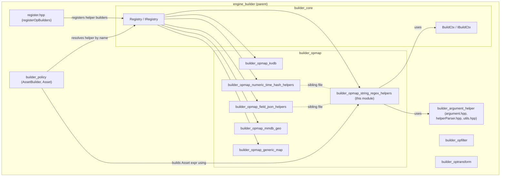
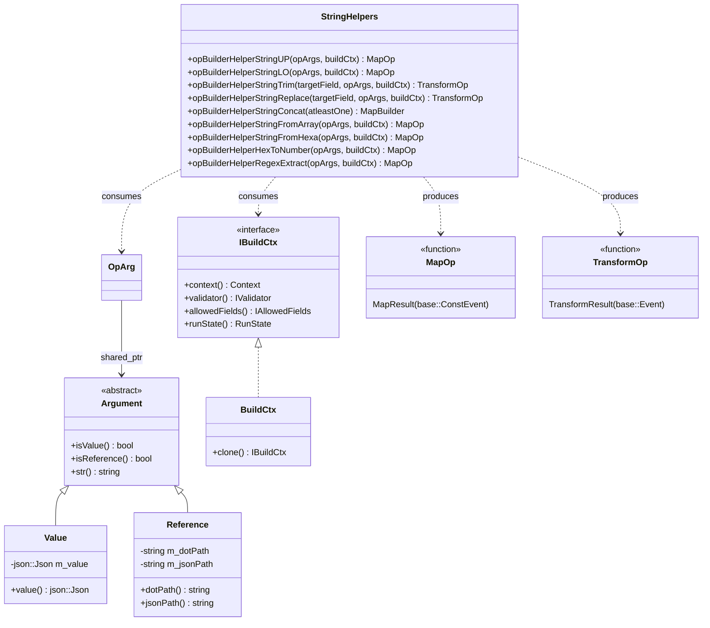
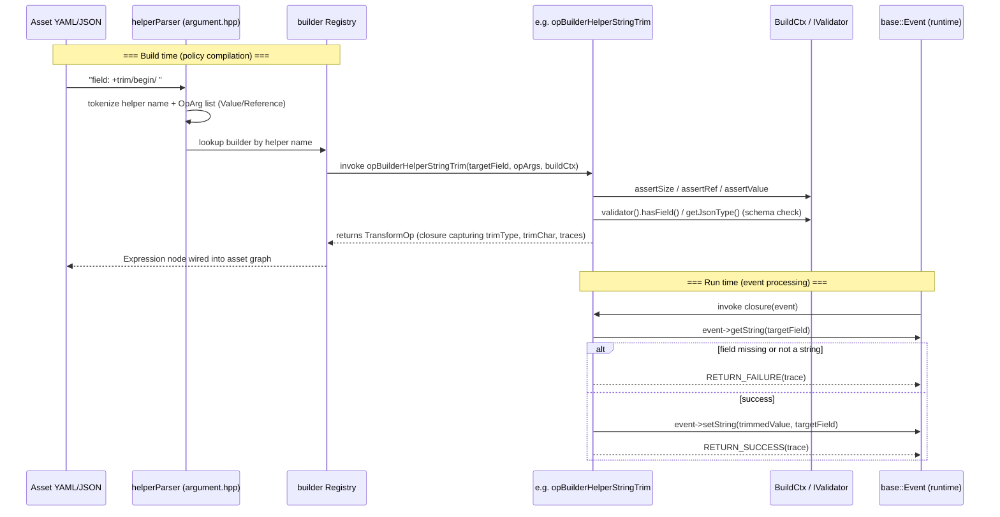
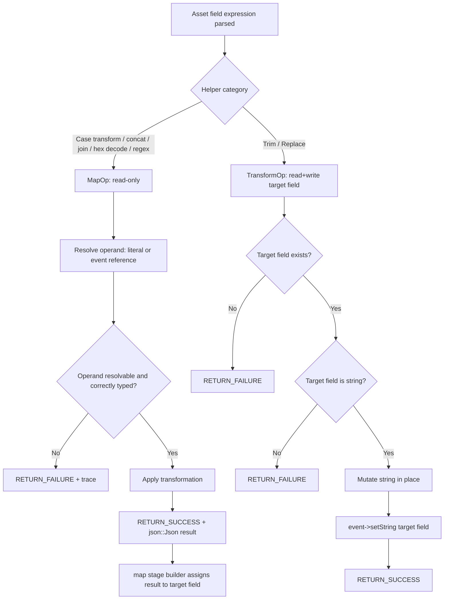
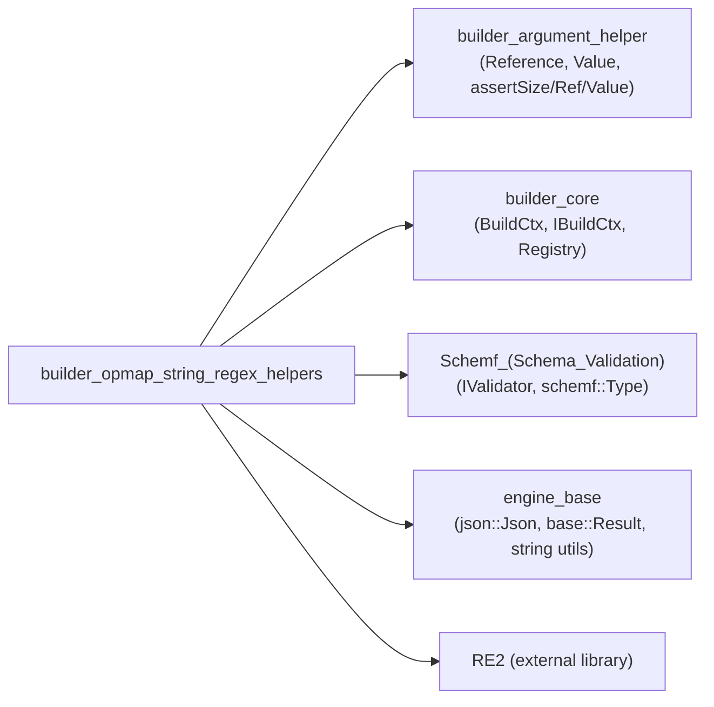

# Builder OpMap String & Regex Helpers

## Introduction

The **`builder_opmap_string_regex_helpers`** module is a leaf component of the Wazuh **Engine** build system
(`src/engine/source/builder`). It implements a family of *operator builders* — factory functions that, at
**policy-compilation time**, validate a helper's syntax/arguments against the event schema and produce a
runtime **lambda (`MapOp`/`TransformOp`)** that performs string manipulation or regular-expression extraction
on event fields when the compiled asset (decoder, rule, filter, etc.) is executed against a log event.

All components in this module live in a single translation unit,
[`opBuilderHelperMap.cpp`](src/engine/source/builder/src/builders/opmap/opBuilderHelperMap.cpp), which is also
the home of two sibling helper families documented separately:
[`builder_opmap_numeric_time_hash_helpers`](builder_opmap_numeric_time_hash_helpers.md) (numeric math, date/time,
SHA1 hashing) and [`builder_opmap_field_json_helpers`](builder_opmap_field_json_helpers.md) (field
deletion/renaming, JSON merging, key lookup). This document covers only the **string and regex** operators:

| Helper (public symbol) | DSL name (typical) | Purpose |
|---|---|---|
| `opBuilderHelperStringUP` | `+upcase` | Convert a string value/reference to upper case |
| `opBuilderHelperStringLO` | `+downcase` | Convert a string value/reference to lower case |
| `opBuilderHelperStringTrim` | `+trim` | Trim a character from the begin/end/both sides of the target field |
| `opBuilderHelperStringReplace` | `+replace` | Replace all occurrences of a substring in the target field |
| `opBuilderHelperStringConcat` (builder factory, `concat`/`concat_any`) | `+concat` / `+concat_any` | Concatenate 2..N string/number/object values or references |
| `opBuilderHelperStringFromArray` | `+join` | Join a string array reference with a separator into a single string |
| `opBuilderHelperStringFromHexa` | `+decode_base16` | Decode a hexadecimal string into ASCII text |
| `opBuilderHelperHexToNumber` | `+hex_to_number` | Parse a hexadecimal string reference into a signed 64-bit integer |
| `opBuilderHelperRegexExtract` | `+regex_extract` | Extract the first capture group of a RE2 regex applied to a reference |

These helpers are registered into the engine's builder **Registry** and are invoked while an `AssetBuilder`
compiles YAML/JSON asset definitions into an executable `base::Expression` graph (see
[`builder_policy`](builder_policy.md) and [`builder_core`](builder_core.md)).

---

## 1. Purpose and Core Functionality

Each function in this module is a **builder**, not the operator itself. Builders execute once, at compile time,
and:

1. **Validate arity** — using `utils::assertSize` (exact or min/max argument count).
2. **Validate argument kind** — using `utils::assertRef` / `utils::assertValue` to enforce whether an argument
   must be a literal `Value` or a field `Reference`.
3. **Validate argument type against the schema** (when the referenced field is present in the schema, via
   `buildCtx->validator()`), rejecting incompatible types (e.g. expecting a `string` but referencing a `number`
   field) as an early compile-time error.
4. **Capture parameters and pre-computed lookups** (e.g. compiled `RE2` regex, separator character, trim mode)
   in closures, avoiding repeated parsing at runtime.
5. **Return a runtime function** — either:
   - `MapOp = std::function<MapResult(base::ConstEvent)>` — produces a new `json::Json` value to be assigned to
     the target field by the calling `map` stage builder (read-only event), or
   - `TransformOp = std::function<TransformResult(base::Event)>` — mutates the event in place (used by helpers
     that need direct read+write access to the *target* field, such as `+trim` and `+replace`, since these
     helpers both read the current target-field value and write the transformed value back to it).

At runtime, the returned closure is invoked once per event flowing through the pipeline. It returns a
`base::Result` wrapping either a success value/mutated event (`RETURN_SUCCESS`) or a failure with a trace
message (`RETURN_FAILURE`), which integrates with the engine's [tracing/logging](engine_base.md) subsystem for
debugging (`engine-test`, tracer output).

---

## 2. Architecture and Component Relationships

### 2.1 Position in the Engine Builder subsystem

### 2.2 Class / type relationships

`Reference` and `Value` (from
[`builder_argument_helper`](builder_argument_helper.md)) are the two concrete `Argument` implementations parsed
from the asset DSL by `helperParser.hpp` before a builder function is even invoked — by the time these helpers
run, `opArgs` is already a `std::vector<OpArg>` of typed argument objects.

---

## 3. Build-Time vs Run-Time Data Flow

Every helper in this module follows the same two-phase pattern common to the whole
[`builder_opmap`](builder_opmap_generic_map.md) family.

Key points:
- **Compile-time failures throw `std::runtime_error`**, which aborts asset/policy building with a descriptive
  message (surfaced through the [`engine_api_catalog`](engine_api_catalog.md) validation endpoints and the
  `engine-suite` CLI tools such as [`engine_catalog`](Engine_Administration_CLI_Tools_(Python).md)).
- **Runtime failures never throw** — they use the `RETURN_FAILURE` / `RETURN_SUCCESS` macros (defined in
  [`engine_base`](engine_base.md) `result.hpp`) which produce a `base::Result` carrying a trace string consumed
  by the [Router/Tester](Router.md) subsystem for debugging (`engine-test`, asset tracing).

---

## 4. Component Reference

### 4.1 String case transformation — `opBuilderHelperStringUP` / `opBuilderHelperStringLO`

DSL: `field: +upcase/value|$ref`, `field: +downcase/value|$ref`

Both delegate to the shared private helper `opBuilderHelperStringTransformation(opArgs, buildCtx, op)`
(`StringOperator::UP` / `StringOperator::LO`):
- Exactly **1 argument**, either a string literal or a string-typed reference.
- Returns a `MapOp`: reads the string (from event if reference, from literal otherwise), transforms with
  `::toupper`/`::tolower` character-by-character, and returns a new `json::Json` string — the caller (the
  generic `map` stage builder, see [`builder_stage`](builder_opmap_generic_map.md)) is responsible for assigning
  it to the target field.
- Runtime failure only if the referenced field does not exist in the event (`failureTrace1`).

### 4.2 `opBuilderHelperStringTrim`

DSL: `field: +trim/<begin|end|both>/<char>`

- Requires the **target field to be schema-allowed** (`buildCtx->allowedFields().check(...)`) — unlike the
  `Map`-style helpers above, this is a `TransformOp` that reads and writes the same field.
- Exactly **2 value arguments** (no references allowed — enforced via `assertValue`):
  1. Trim mode: `"begin"` → `'s'`, `"end"` → `'e'`, `"both"` → `'b'`.
  2. A single trim character (string of length 1).
- At runtime: fails if the target field doesn't exist or isn't a string; otherwise erases leading/trailing
  characters matching `trimChar` using `std::string::erase` + `find_first_not_of` / `find_last_not_of`, and
  writes the result back with `event->setString`.

### 4.3 `opBuilderHelperStringReplace`

DSL: `field: +replace/<old_substring>/<new_substring>`

- Requires allowed target field.
- Exactly **2 value arguments**; the first (substring to find) must be a non-empty string.
- At runtime: repeatedly finds and replaces all occurrences of `oldSubstr` with `newSubstr` in the target
  field's current string value using a `while` loop over `std::string::find`/`replace`.

### 4.4 `opBuilderHelperStringConcat` (builder factory)

DSL: `field: +concat/<v1|$r1>/.../<vN|$rN>` and `field: +concat_any/<v1|$r1>/...`

- This is a **`MapBuilder`** (a builder-of-builders): calling `opBuilderHelperStringConcat(atleastOne)` returns
  the actual builder function, parameterized by whether missing references should be tolerated
  (`atleastOne == true` → `concat_any`, silently appends empty string for a missing reference instead of
  failing).
- Accepts **2..MAX_OP_ARGS** arguments, each a string, number, or object (literal or reference); object
  references are stringified via `event->str(ref)`.
- At runtime, concatenates each resolved argument's string representation (numbers converted with
  `std::to_string`, doubles/ints handled via `getDouble`/`getIntAsInt64`) into a single result string.

### 4.5 `opBuilderHelperStringFromArray`

DSL: `field: +join/$<array_reference>/<separator>`

- **2 arguments**: an array reference (arg 0) and a literal string separator (arg 1).
- If the referenced field is known to the schema, validates it is an **array of strings**
  (`validator().isArray()` + element `Json::Type::String`).
- At runtime: iterates the resolved JSON array, requires every element to be a string (fails otherwise), and
  joins them with `base::utils::string::join` (from [`engine_base`](engine_base.md)) using the given separator.

### 4.6 `opBuilderHelperStringFromHexa`

DSL: `field: +decode_base16/$<hex_reference>`

- **1 reference argument**, expected to be a schema `string` if known.
- At runtime: validates the resolved hex string has an even number of digits, then decodes byte pairs via
  `strtol(..., 16)`, rejecting any decoded byte outside the printable ASCII range `[0, 127]`
  (`failureTrace5` "Found non ascii character").

### 4.7 `opBuilderHelperHexToNumber`

DSL: `field: +hex_to_number/$ref`

- **1 reference argument** of schema type `string` (if known).
- At runtime: parses the referenced string as a hexadecimal integer via `std::stringstream >> std::hex`,
  producing an `int64_t`; fails if the string is not entirely consumed (`ss.fail() || !ss.eof()`), i.e. not a
  clean hex number.

### 4.8 `opBuilderHelperRegexExtract`

DSL: `field: +regex_extract/$<field_ref>/<regex_pattern>`

- **2 arguments**: a string reference (arg 0) and a literal regex pattern string (arg 1), compiled **once at
  build time** into a `std::shared_ptr<RE2>` (Google RE2 engine — see [`engine_hlp`](engine_hlp.md) for the
  broader parsing library that also leans on regex primitives).
- Throws at build time if the regex fails to compile (`regex_ptr->ok()`).
- At runtime uses `RE2::PartialMatch(value, *regex_ptr, &match)` to extract the **first capture group**; fails
  if the reference is missing/non-string or if the regex does not match.

---

## 5. Process Flow — Representative Helper Execution

---

## 6. Error Handling & Tracing Conventions

All helpers share a small set of standard trace-message templates defined at the top of
`opBuilderHelperMap.cpp`:

| Constant | Meaning |
|---|---|
| `TRACE_SUCCESS` | `"[{name}] -> Success"` |
| `TRACE_TARGET_NOT_FOUND` | Target field missing from the event (for `TransformOp`s) |
| `TRACE_TARGET_TYPE_NOT_STRING` | Target field exists but isn't a string |
| `TRACE_REFERENCE_NOT_FOUND` | A referenced parameter field is missing |
| `TRACE_REFERENCE_TYPE_IS_NOT` | A referenced parameter field has the wrong type |

Two distinct classes of errors exist:
1. **Compile-time (`std::runtime_error`)** — thrown from the builder function itself, for structural/semantic
   issues that can be detected once from the asset definition and the (optional) schema
   (`schemf`/[`Schemf_(Schema_Validation)`](Schemf_(Schema_Validation).md)). These bubble up through
   [`builder_policy`](builder_policy.md) → [`engine_api_catalog`](engine_api_catalog.md) as asset validation
   errors.
2. **Runtime (`base::Result` failure)** — produced per-event when data is missing/malformed; these do not abort
   the pipeline, they simply mark the map/transform stage as failed for that event, which the
   [`Router`](Router.md) orchestrator and stage's parent expression (`And`/`Chain`, see
   [`engine_base`](engine_base.md)) use to decide whether to continue evaluating the asset.

---

## 7. Dependencies

Note: the `date/date.h`, `date/tz.h`, and `openssl/sha.h` includes in `opBuilderHelperMap.cpp` are used by the
**sibling** numeric/time/hash helpers documented in
[`builder_opmap_numeric_time_hash_helpers`](builder_opmap_numeric_time_hash_helpers.md); they are listed here
only because they share the same source file, not because the string/regex helpers depend on them.

---

## 8. Related Documentation

- [`builder_core`](builder_core.md) — `Builder`, `Registry`, `BuildCtx`/`IBuildCtx` orchestration that invokes
  these helper-builder functions.
- [`builder_argument_helper`](builder_argument_helper.md) — `Argument`/`Reference`/`Value` types and the
  `helperParser` that tokenizes the DSL string into `OpArg` vectors passed to every builder in this module.
- [`builder_opmap_generic_map`](builder_opmap_generic_map.md) — the generic `map`/`mapValidator` stage builder
  that consumes the `MapOp` produced by these helpers and assigns results to target fields.
- [`builder_opmap_numeric_time_hash_helpers`](builder_opmap_numeric_time_hash_helpers.md) — numeric arithmetic,
  epoch/date conversion, and SHA1 hashing helpers from the same source file.
- [`builder_opmap_field_json_helpers`](builder_opmap_field_json_helpers.md) — field deletion/rename, JSON
  merge, and key-lookup helpers from the same source file.
- [`builder_opmap_kvdb`](builder_opmap_kvdb.md) / [`builder_opmap_mmdb_geo`](builder_opmap_mmdb_geo.md) —
  sibling opmap helper families for KVDB and GeoIP/ASN lookups.
- [`builder_opfilter`](builder_opfilter.md) — the filter-oriented counterpart (`opBuilderHelperFilter.cpp`)
  implementing comparison/regex-match *predicates* rather than value-producing transforms.
- [`builder_policy`](builder_policy.md) — `Asset`/`AssetBuilder`/`factory.cpp`, which resolves helper names from
  asset YAML into calls against the `Registry` populated by [`register.hpp`](builder_core.md).
- [`Schemf_(Schema_Validation)`](Schemf_(Schema_Validation).md) — `IValidator` used for optional compile-time
  type checking of referenced fields.
- [`engine_base`](engine_base.md) — `json::Json`, `base::Result`, string utilities (`base/utils/stringUtils.hpp`)
  and IP utilities (`base/utils/ipUtils.hpp`) used across these helpers (IP utils used by the sibling
  `opBuilderHelperIPVersionFromIPStr`, documented in the numeric/time/hash helpers module).
- [`engine_hlp`](engine_hlp.md) — the High-Level Parser library, another consumer of RE2/regex-like parsing used
  elsewhere in the engine.
