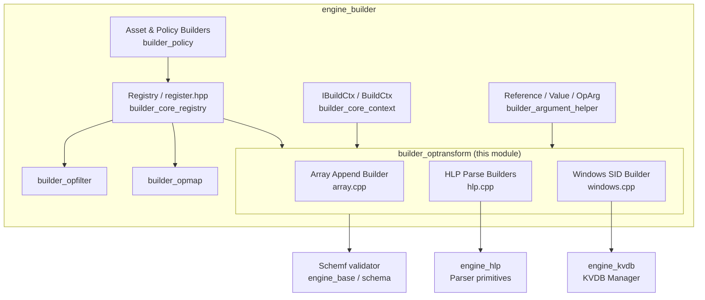
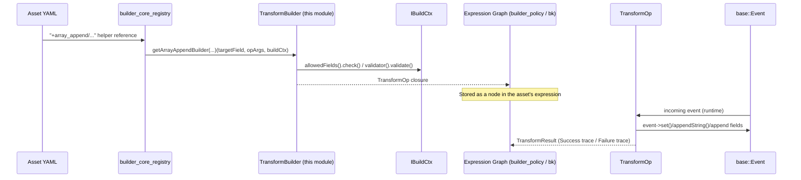

# Builder OpTransform Module

## 1. Introduction & Purpose

The **`builder_optransform`** module is a leaf component of the [Wazuh Engine Builder](engine_builder.md) subsystem
(part of the larger [Wazuh Engine Core](Wazuh_Engine_Core_(C++).md)). It provides the concrete implementations of
**"transform" operators** — helper functions that can be referenced from a decoder/rule/output asset (written in
YAML) to *mutate* an event's fields in place, as opposed to simply *filtering* events (see
[builder_opfilter](builder_opfilter.md)) or *mapping* a value into a new field (see [builder_opmap](builder_opmap.md)).

Transform operators are invoked using the `+` operator prefix in asset definitions, e.g.:

```yaml
normalize:
  - map:
      - array_field: +array_append/value1/$other_field
      - parsed_field: +parse_date/$raw_date/%Y-%m-%d
      - sid_desc: +sid_list_desc/my_kvdb/$sid_list
```

This module currently implements three families of transform builders:

| Family | Source File | Purpose |
|---|---|---|
| Array manipulation | `array.cpp` | Appends one or more values/references into a target array field, with optional uniqueness and "at least one" semantics. |
| HLP-based parsing | `hlp.cpp` | Wraps ~20 [High Level Parsers (HLP)](engine_hlp.md) (date, IP, URI, JSON, XML, CSV/DSV, key-value, etc.) as transform operators that parse a string field and populate the resulting structured fields directly into the event. |
| Windows SID resolution | `windows.cpp` | Resolves a list of Windows Security Identifiers (SIDs) contained in a string field into human-readable descriptions using a [KVDB](engine_kvdb.md)-backed lookup table. |

Because all transform builders share the same construction contract, this module depends heavily on the generic
builder infrastructure documented in [builder_core](builder_core.md) and [builder_argument_helper](builder_core.md),
and its outputs are consumed by the [builder_policy](builder_policy.md) subsystem when assembling the full
asset expression graph.

## 2. Architecture Overview

### 2.1 Position within the Builder pipeline



### 2.2 Shared construction contract

Every helper in this module follows the two-stage **builder → operation** pattern used across the whole
`engine_builder` codebase:

1. A **`TransformBuilder`** (or a `TransformOp`-returning free function, in the case of the `hlp.cpp` helpers,
   which are already fully specialized) receives:
   - `targetField` — the `Reference` (dot-path) of the field that will be mutated.
   - `opArgs` — the list of `OpArg` (each either a `Value` or a `Reference`) passed to the helper in the YAML.
   - `buildCtx` — the `IBuildCtx` (see [builder_core](builder_core.md)) giving access to:
     - `allowedFields()` — schema-driven field allow-listing per asset type.
     - `validator()` — the `schemf` schema validator (see [Wazuh_Engine_Core_(C++).md](Wazuh_Engine_Core_(C++).md)) used to check/derive field types.
     - `context()` — asset name/op name metadata used for tracing.
     - `runState()` — controls trace verbosity (used by the `RETURN_SUCCESS`/`RETURN_FAILURE` macros).
2. The builder performs **compile-time validation** (argument count/type via `utils::assertSize`/`assertRef`/`assertValue`
   from [builder_argument_helper](builder_core.md), schema/allowed-field checks) and returns a
   **`TransformOp`** — a closure of signature `TransformOp(base::Event event) -> TransformResult` that is evaluated
   once per incoming event at runtime.



## 3. Sub-modules

| Sub-module | Description | Documentation |
|---|---|---|
| Array Append Transform | Implements `getArrayAppendBuilder`, appending literal values and/or referenced fields into a target array, with optional de-duplication (`unique`) and partial-success (`atleastOne`) modes. Performs schema-aware type consistency checks across all appended elements. | [builder_optransform_array.md](builder_optransform_array.md) |
| HLP Parsing Transforms | A family of ~20 thin builder functions (`dateParseBuilder`, `ipParseBuilder`, `jsonParseBuilder`, `csvParseBuilder`, `keyValueParseBuilder`, etc.) that all funnel through a shared `detail::specificHLPBuilder` helper, which wires a source string field through the corresponding [HLP parser](engine_hlp.md) and writes the parsed sub-fields back into the event. | [builder_optransform_hlp.md](builder_optransform_hlp.md) |
| Windows SID Description Transform | Implements `getWindowsSidListDescHelperBuilder`, a factory that captures a [`KVDB` manager](engine_kvdb.md) and scope, and returns a builder that resolves a space-separated list of Windows SIDs into human-readable account/domain descriptions loaded from two well-known KVDB keys. | [builder_optransform_windows.md](builder_optransform_windows.md) |

## 4. How this module fits into the system

- **Upstream dependency**: [builder_core](builder_core.md) (registry & build context, argument parsing/validation
  utilities, `Reference`/`Value` types), [Wazuh_Engine_Core_(C++).md](Wazuh_Engine_Core_(C++).md)
  (`json::Json`, `base::Event`, `base::Error`/`base::OptError`, `schemf` validation results).
- **Sibling modules**: [builder_opfilter](builder_opfilter.md) and [builder_opmap](builder_opmap.md) provide the
  filter and map operator families respectively; together with `builder_optransform` they form the complete set of
  operator categories registered via `register.hpp` (`registerOpBuilders`/`registerStageBuilders`) documented in
  [builder_core](builder_core.md).
- **External dependencies**:
  - [engine_hlp](engine_hlp.md) supplies the actual parsing primitives (date, IP, URI, JSON, XML, DSV/CSV, key-value,
    user-agent, FQDN, file path, quoted, binary, numeric, alphanumeric parsers) that the HLP transform builders wrap.
  - [engine_kvdb](engine_kvdb.md) supplies the `IKVDBManager`/`IKVDBHandler` interfaces used by the Windows SID
    description transform to resolve SID-to-name mappings stored as JSON documents in a KVDB.
- **Downstream consumer**: [builder_policy](builder_policy.md) (specifically `AssetBuilder`/`factory.cpp`) invokes
  the registered transform builders while compiling an asset's `normalize`/`map` stage into an executable
  expression, which is ultimately run by the backend controllers documented in
  [Wazuh_Engine_Core_(C++).md](Wazuh_Engine_Core_(C++).md) as part of the Router event-processing pipeline.

## 5. Common Conventions

- **Naming**: helper names exposed to YAML assets are prefixed with `parse_` for HLP-based parsers (e.g. `+parse_date`,
  `+parse_ip`), and are otherwise descriptive verbs (`+array_append`, `+sid_list_desc`).
- **Tracing**: every `TransformOp` produces a success or failure trace string (formatted with the asset/operator name
  via `buildCtx->context().opName`) that is surfaced through the `RETURN_SUCCESS`/`RETURN_FAILURE` macros for use by
  Tester/Router tooling (see [Wazuh_Engine_Core_(C++).md](Wazuh_Engine_Core_(C++).md)) when debugging asset execution.
- **Schema-awareness**: builders consult `buildCtx->validator()` at *build time* wherever possible (e.g. to detect the
  expected array element type, or to reject non-string source fields for HLP parsers), pushing as much validation as
  possible out of the hot per-event execution path.
