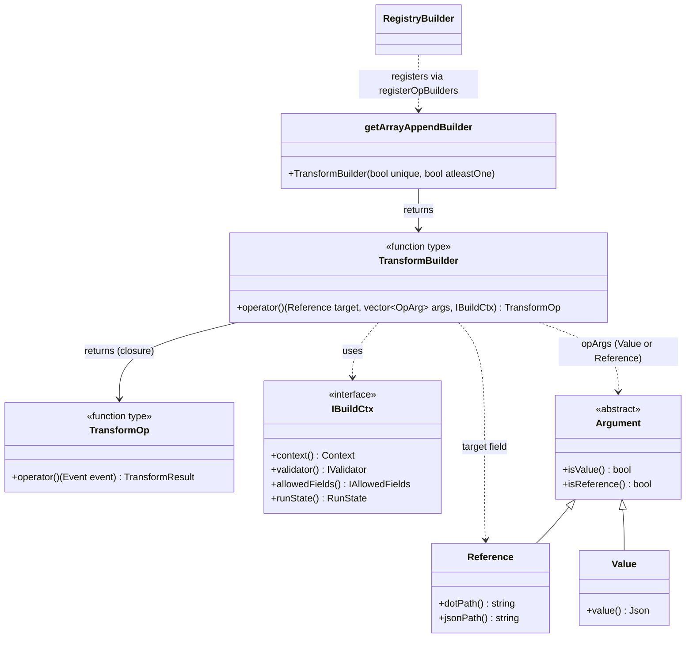
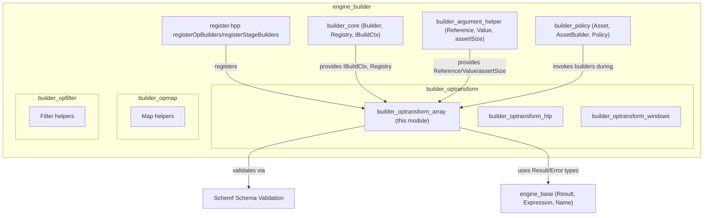
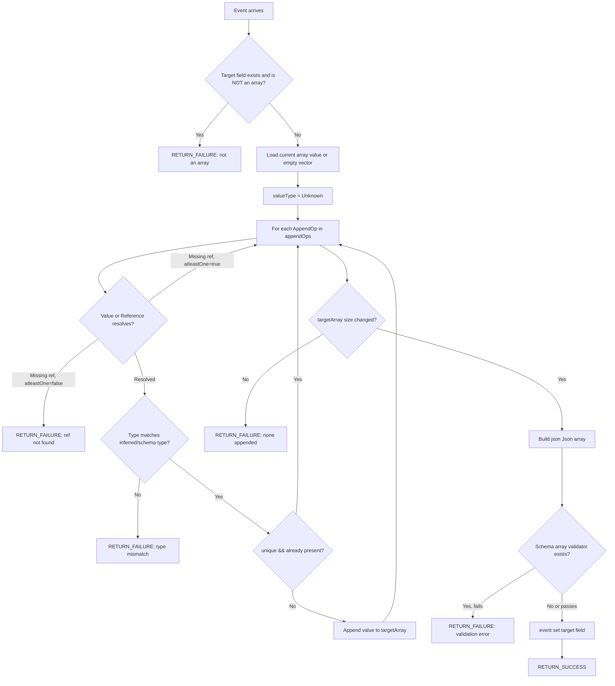
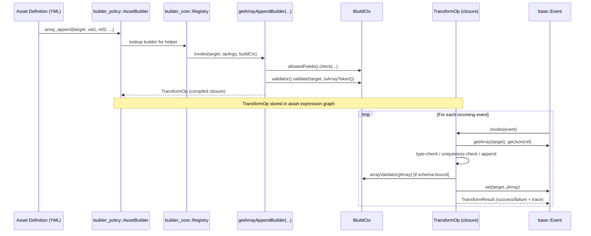

# builder_optransform_array

## Introduction

The `builder_optransform_array` module implements the **array-append transformation builder** used by the Wazuh Engine's decoder/rule building pipeline. It provides the factory function `getArrayAppendBuilder`, which produces a *transform operation builder* capable of constructing runtime operations that append one or more values (literals or field references) to a target array field of an event.

This module is a small, focused leaf component within the larger `builder_optransform` family of transform builders, which itself is part of the `engine_builder` subsystem of the Wazuh Engine Core (C++). It is exercised whenever a decoder/rule asset uses helper functions such as `array_append` or `array_append_unique` in its normalization logic.

---

## Purpose and Core Functionality

The core responsibility of this module is to build a **transform operation (`TransformOp`)** that, given a runtime event, appends values to an array field while enforcing:

1. **Field access control** — the target field must be allowed for the asset type (via `IAllowedFields`).
2. **Schema validation** — if the target field is present in the schema, its type must match `schemf::isArrayToken()`, and appended values must match the array's element type.
3. **Type consistency at runtime** — all appended values (across multiple arguments) must share the same JSON type, inferred either from the schema or from the first successfully resolved value/reference.
4. **Uniqueness control** — optionally avoids inserting duplicate values into the array (`unique` flag).
5. **Partial-failure tolerance** — optionally allows the operation to succeed even if some of the referenced fields do not exist in the event (`atleastOne` flag), as long as at least one value was appended.

The single exported function is:

```cpp
TransformBuilder getArrayAppendBuilder(bool unique, bool atleastOne);
```

This is a **builder factory**: it does not build the operation directly, but returns a `TransformBuilder` (a callable) that the Builder Registry invokes at **build time** for each occurrence of the helper function in an asset definition. The returned `TransformBuilder`, in turn, produces a `TransformOp` — the actual callable executed at **runtime** for every event.

This two-stage (build-time / run-time) closure pattern is common across all `optransform`/`opmap`/`opfilter` builders in the engine (see [`builder_opmap_field_json_helpers`](builder_opmap_field_json_helpers.md) and [`builder_opfilter_core`](builder_opfilter_core.md) for analogous designs).

---

## Architecture

### Component Relationships



### Position within the Engine Builder subsystem



---

## Detailed Behavior

### Build-Time Flow

When the builder registry encounters an `array_append(...)` (or `array_append_unique(...)`) helper call while compiling an asset, it invokes the `TransformBuilder` returned by `getArrayAppendBuilder`. The build-time logic:

1. **Argument count check** — `utils::assertSize(opArgs, 1, MAX_OP_ARGS)` ensures at least one argument was supplied.
2. **Allowed-fields check** — verifies the target field is permitted for the asset's type (decoder/rule/filter), derived from `base::Name(assetName).parts().front()`.
3. **Schema validation of the target field** — calls `buildCtx->validator().validate(targetField, schemf::isArrayToken())`. Any validation error aborts the build with a `std::runtime_error`.
4. **Element type resolution** — if the field is known in the schema (`hasField`), its declared item type is captured (`targetFieldtype`) via `typeToJType`.
5. **Per-argument append-operation construction** — for every argument (`Value` or `Reference`), a small `AppendOp` closure is created:
   - For **`Value`** arguments: if the schema defines a type, the literal's type is checked immediately (build-time failure on mismatch). Otherwise the type is inferred lazily at runtime.
   - For **`Reference`** arguments: type checking is deferred to runtime (since the referenced field's value/type is only known when the event is processed). If the reference is missing and `atleastOne` is `true`, the operation silently no-ops instead of failing.
6. **Trace message pre-computation** — success/failure trace strings are formatted once at build time for efficiency.

### Runtime Flow

The returned `TransformOp` executes, per event, the following steps:



Key runtime semantics:

- **Lazy type inference**: The first successfully resolved value/reference determines the expected type (`valueType`) for the rest of the operation, unless the schema already fixes it.
- **Uniqueness**: When `unique` is true, values already present in the (growing) target array are skipped rather than causing failure.
- **`atleastOne` semantics**: Used by helpers like `array_append` variants that tolerate some missing source fields — the transform only fails if **no** value was appended at all.
- **Final schema validation**: After building the new array, if the array as a whole has a schema-derived validator (`arrayValidator`), it is invoked once more before committing the value to the event.

---

## Data Flow Diagram



---

## Key Types and Dependencies

| Type / Function | Defined In | Role |
|---|---|---|
| `getArrayAppendBuilder` | `array.cpp` (this module) | Factory producing the `TransformBuilder` for array-append helpers |
| `TransformBuilder` / `TransformOp` | shared type aliases used across `optransform`/`opmap` builders | Build-time vs run-time callable types |
| `IBuildCtx`, `RunState` | `builder_core` (`ibuildCtx.hpp`, `buildCtx.hpp`) | Build context exposing registry, validator, allowed fields, and run mode flags |
| `Reference`, `Value`, `Argument` | `builder_argument_helper` (`argument.hpp`) | Polymorphic representation of helper function arguments (literal vs. field reference) |
| `assertSize` | `builder_argument_helper` (`utils.hpp`) | Argument-count validation helper shared by all op builders |
| `schemf::isArrayToken`, `ValidationResult` | [`Schemf_(Schema_Validation)`](Schemf_(Schema_Validation).md) | Schema-driven type/array validation used to enforce target-field constraints |
| `base::Event`, `base::Error`, `RETURN_SUCCESS`/`RETURN_FAILURE` | [`engine_base`](engine_base.md) | Event abstraction and result/trace macros used by all transform operations |
| `IAllowedFields` | `builder_core` (`allowedFields.hpp`) | Restricts which fields an asset type may write to |
| `registerOpBuilders` | `builder_core` (`register.hpp`) | Registers `getArrayAppendBuilder` instances (e.g., for `array_append` and `array_append_unique`) into the global `Registry` |

---

## Relationship to Sibling Modules

- **[`builder_optransform_hlp`](builder_optransform_hlp.md)** — sibling module providing High-Level Parser (HLP) based transform builders (date, IP, JSON, etc.) that share the same `TransformBuilder`/`TransformOp` contract.
- **[`builder_optransform_windows`](builder_optransform_windows.md)** — sibling module for Windows-SID-related transform helpers, following the same build/run pattern.
- **[`builder_opmap_field_json_helpers`](builder_opmap_field_json_helpers.md)** — related map-type helpers (e.g., `merge`, `delete_field`) that operate on single fields rather than arrays, but share the `Reference`/`Value` argument model.
- **[`builder_core`](builder_core.md)** — supplies `IBuildCtx`, `Registry`, and `IAllowedFields`, the foundational abstractions this module depends on.
- **[`builder_argument_helper`](builder_argument_helper.md)** — supplies argument parsing/validation primitives (`Reference`, `Value`, `assertSize`, `assertValue`, `assertRef`) used throughout the builder tree.
- **[`Schemf_(Schema_Validation)`](Schemf_(Schema_Validation).md)** — supplies the schema validator interface (`IValidator`, `isArrayToken`, `ValidationResult`) consulted at both build time and run time.
- **[`engine_base`](engine_base.md)** — supplies core runtime types (`Event`, `Result`, `Error`) and macros used to report operation outcomes and traces.
- **[`engine_builder`](engine_builder.md)** — the parent module tying together policy/asset compilation, of which `builder_optransform` (and this module) is one of the operator families registered via `register.hpp`.

---

## Usage Context

This builder is typically invoked indirectly through the engine's asset compilation pipeline:

1. A decoder or rule YAML/JSON asset declares a `normalize` or `map`/`check` stage that calls a helper such as:
   ```yaml
   normalize:
     - map:
         - my.array.field: array_append($source.value, "literal", $other.ref)
   ```
2. During policy building (`builder_policy`), the `AssetBuilder` resolves the helper name to the registered `TransformBuilder` (here, an instance of `getArrayAppendBuilder`), typically registered twice — once with `unique=false` for `array_append`, and once with `unique=true` for `array_append_unique` — via `registerOpBuilders`.
3. The resulting `TransformOp` becomes part of the asset's compiled `Expression` graph (see [`engine_base`](engine_base.md)), executed by the backend controllers (`engine_bk`) for every event routed through that asset.

---

## Error Handling Summary

| Condition | Stage | Result |
|---|---|---|
| Wrong number of arguments | Build-time | `std::runtime_error` (build failure) |
| Field not allowed for asset type | Build-time | `std::runtime_error` |
| Target field schema type is not array-compatible | Build-time | `std::runtime_error` |
| Literal value type mismatch with schema (for `Value` args) | Build-time | `std::runtime_error` |
| Target field exists but is not an array (runtime) | Runtime | `TransformResult` failure with trace |
| Referenced field missing, `atleastOne=false` | Runtime | `TransformResult` failure with trace |
| Referenced field missing, `atleastOne=true` | Runtime | Silently skipped (no-op for that argument) |
| Value/reference type mismatch at runtime | Runtime | `TransformResult` failure with trace |
| No values ultimately appended | Runtime | `TransformResult` failure ("references not found") |
| Final array fails schema validation | Runtime | `TransformResult` failure with trace |
| Success | Runtime | `TransformResult` success, event field updated |
