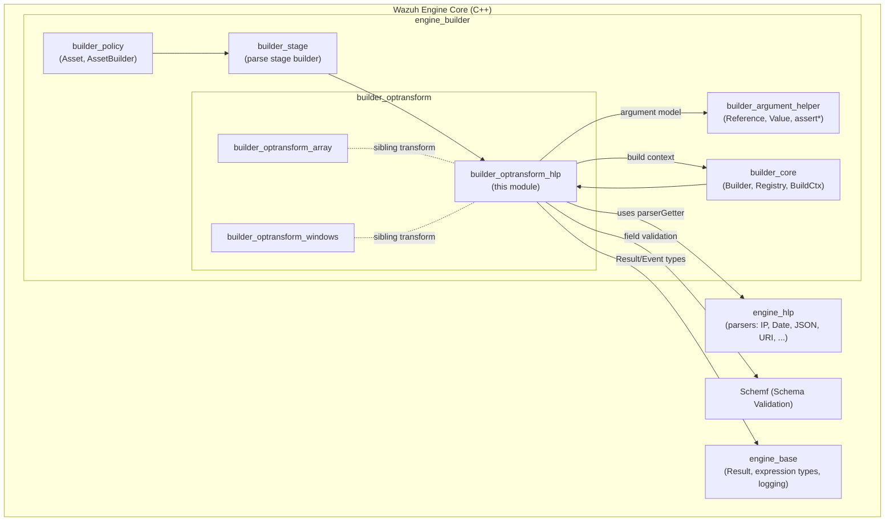
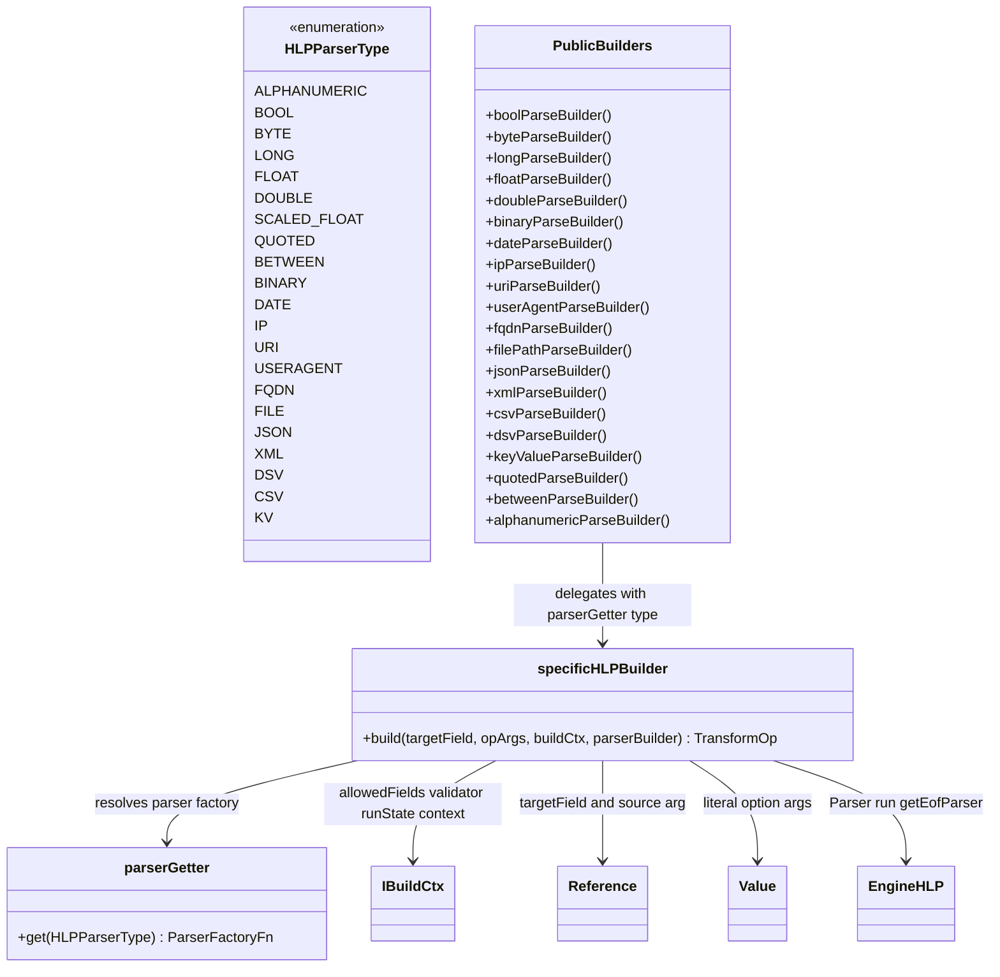
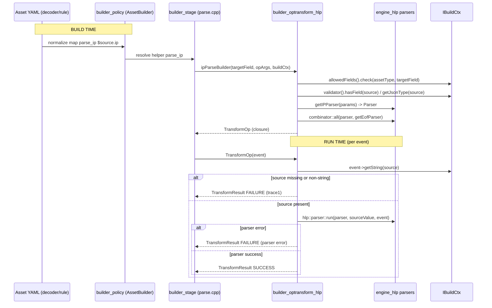

# `builder_optransform_hlp` Module

## Introduction

The `builder_optransform_hlp` module is a leaf component of the Wazuh **Engine** that exposes the High-Level Parser
(HLP) library as a family of **transform operators** (`+parse_*`) usable inside decoder/rule assets of the Wazuh
security analytics engine. It is the "glue" layer that turns the low-level, type-specific parsers implemented in
[`engine_hlp`](engine_hlp.md) into runtime `TransformOp` closures that the [`engine_builder`](engine_builder.md)
pipeline can execute against incoming events.

In short: whenever an asset declares something like:

```yaml
check:
  - event.original: exists
normalize:
  - map:
      - parse_ip: $source.ip
  - map:
      - parse_date: [$event.timestamp, "%Y-%m-%dT%H:%M:%S%z"]
```

the `parse_ip` / `parse_date` / `parse_json` / ... helper functions are resolved to the builders implemented in this
module.

This document describes the internal architecture of the module, how it fits within the broader engine build
pipeline, and the data flow of a single parse operation from asset compilation to event transformation.

---

## 1. Purpose & Scope

| Concern | Description |
|---|---|
| **What** | Implements the C++ builder functions for all `parse_<type>` HLP-backed transform helpers (`alphanumeric`, `between`, `binary`, `bool`, `byte`, `csv`, `date`, `double`, `dsv`, `file`, `float`, `fqdn`, `ip`, `json`, `key_value`, `long`, `quoted`, `uri`, `useragent`, `xml`). |
| **Where** | `src/engine/source/builder/src/builders/optransform/hlp.cpp` (and its header `hlp.hpp`) inside the `builder_optransform` sub-module of [`engine_builder`](engine_builder.md). |
| **Why** | Decouples the *parsing algorithms* (owned by [`engine_hlp`](engine_hlp.md)) from the *asset DSL binding* (owned by the builder), allowing new HLP parsers to be exposed as operators with minimal boilerplate through a single generic factory (`specificHLPBuilder`). |
| **Not in scope** | Actual character-level parsing logic (see `engine_hlp`), generic map/filter helper operators (see `builder_opmap` / `builder_opfilter`), array-manipulation transform (`builder_optransform_array`), and Windows-specific SID transform (`builder_optransform_windows`). |

---

## 2. Position in the System



Related documentation:
* [`engine_builder`](engine_builder.md) — parent module: policy/asset compilation pipeline.
* [`builder_core`](engine_builder.md) — `IBuildCtx`, `Registry`, `BuilderDeps` used to obtain validator, allowed
  fields and run-state during the build phase.
* [`builder_argument_helper`](engine_builder.md) — `Reference`/`Value` argument types and `assertRef`/`assertSize`/
  `assertValue` helpers consumed here.
* [`engine_hlp`](engine_hlp.md) — the actual parser implementations (`getIPParser`, `getDateParser`,
  `getJSONParser`, etc.) that this module wires into the asset DSL.
* [`builder_optransform_array`](engine_builder.md) — sibling transform operator for array append operations.
* [`builder_optransform_windows`](engine_builder.md) — sibling transform operator for Windows SID list helpers.
* [`engine_base`](engine_builder.md) — base `Result`/expression primitives shared across the engine.
* [`Schemf (Schema Validation)`](engine_builder.md) — schema type-checking used to validate the source field type.

---

## 3. Core Responsibilities

1. **Operator catalog**: Defines one public `TransformOp` builder function per supported HLP data type
   (`boolParseBuilder`, `ipParseBuilder`, `dateParseBuilder`, `jsonParseBuilder`, `csvParseBuilder`, etc.). Each of
   these is registered under a `parse_<type>` helper name in the [`Registry`](engine_builder.md) during engine
   startup (see `register.hpp` in `builder_core`).
2. **Generic factory (`detail::specificHLPBuilder`)**: A single factory function that:
   * Validates argument count/shape (`utils::assertSize`, `utils::assertRef`, `utils::assertValue`).
   * Confirms the target field is allowed for the asset type via `IBuildCtx::allowedFields()`.
   * Converts extra literal arguments into `hlp::Options` for the underlying parser.
   * Builds the actual `hlp::parser::Parser` using the parser-specific factory function (obtained through
     `parserGetter`), and wraps it with an EOF parser so that parsing must consume the **entire** source string.
   * Performs an (optional) static schema check ensuring the *source* reference is of JSON type `String`.
   * Returns a lambda (`TransformOp`) that, at **runtime**, reads the source field from the event, executes the HLP
     parser, and reports success/failure with tracing.
3. **Parser type dispatch (`parserGetter`)**: Internal `enum class HLPParserType` plus a `switch` mapping each
   enumerator to the corresponding `hlp::parsers::get<Type>Parser` factory function exposed by `engine_hlp`.

---

## 4. Architecture Diagram (Internal)



---

## 5. Data Flow: Build Time vs Run Time



---

## 6. Key Types & Their Relationships

| Type | Owning module | Role in this module |
|---|---|---|
| `IBuildCtx` | `builder_core` (see [`engine_builder`](engine_builder.md)) | Supplies `allowedFields()`, `validator()`, `runState()`, and `context()` (asset name, operator name) needed to build and validate the operator. |
| `Reference` / `Value` | `builder_argument_helper` (see [`engine_builder`](engine_builder.md)) | Represent, respectively, a `$field` reference (source/target) and a literal option value (e.g. date format string, DSV delimiter). |
| `hlp::Params` / `hlp::parser::Parser` | `engine_hlp` | Runtime parser configuration (`name`, `targetField`, `stop`, `options`) and the resulting composable parser function. |
| `hlp::abstractParser::Result<T>` | `engine_hlp` | Generic parse-result wrapper (success flag, remaining input, extracted value, nested sub-results) produced internally by each concrete parser; consumed transitively via `hlp::parser::run`. |
| `TransformOp` / `TransformResult` | `builder_core` types (`builder::builders` namespace) | The functional contract every builder in this file must return: a callable taking a `base::Event` and yielding success/failure with tracing. |
| `utils::assertSize` / `assertRef` / `assertValue` | `builder_argument_helper` | Compile-time-like (but runtime) guards ensuring the DSL invocation has the correct arity/types before constructing the operator. |

---

## 7. Supported Operators (Catalog)

| Helper name (asset DSL) | Builder function | HLP parser type |
|---|---|---|
| `parse_bool` | `boolParseBuilder` | `BOOL` |
| `parse_byte` | `byteParseBuilder` | `BYTE` |
| `parse_long` | `longParseBuilder` | `LONG` |
| `parse_float` | `floatParseBuilder` | `FLOAT` |
| `parse_double` | `doubleParseBuilder` | `DOUBLE` |
| `parse_binary` | `binaryParseBuilder` | `BINARY` |
| `parse_date` | `dateParseBuilder` | `DATE` |
| `parse_ip` | `ipParseBuilder` | `IP` |
| `parse_uri` | `uriParseBuilder` | `URI` |
| `parse_useragent` | `userAgentParseBuilder` | `USERAGENT` |
| `parse_fqdn` | `fqdnParseBuilder` | `FQDN` |
| `parse_file` | `filePathParseBuilder` | `FILE` |
| `parse_json` | `jsonParseBuilder` | `JSON` |
| `parse_xml` | `xmlParseBuilder` | `XML` |
| `parse_csv` | `csvParseBuilder` | `CSV` |
| `parse_dsv` | `dsvParseBuilder` | `DSV` |
| `parse_key_value` | `keyValueParseBuilder` | `KV` |
| `parse_quoted` | `quotedParseBuilder` | `QUOTED` |
| `parse_between` | `betweenParseBuilder` | `BETWEEN` |
| `parse_alphanumeric` | `alphanumericParseBuilder` | `ALPHANUMERIC` |

> Note: `HLPParserType::TEXT` and `SCALED_FLOAT` exist in the internal enum/dispatch table but currently have no
> dedicated public builder function exposed from this file (reserved for future helpers or used internally by other
> builders).

---

## 8. Build-Time Validation Rules

For every `parse_<type>` invocation, `detail::specificHLPBuilder` enforces:

1. **Arity**: at least 1 argument (the source reference), up to `utils::MAX_OP_ARGS`.
2. **First argument must be a reference** (`utils::assertRef(opArgs, 0)`) — i.e., `$some.field`, not a literal.
3. **Target field allow-list**: the *target* field (where the parsed result is written) must be permitted for the
   asset's type according to `IBuildCtx::allowedFields()` (see `builder_argument_helper` → `AllowedFields`).
4. **Extra options must be literal values** (`utils::assertValue`), and each must be a JSON string — these become
   `hlp::Options` passed to the specific parser (e.g., date format, DSV delimiter/quote/escape characters).
5. **Optional schema check**: if the *source* field is present in the schema (`validator().hasField`), its declared
   JSON type must be `String`; otherwise the build fails immediately with a descriptive error.
6. **EOF enforcement**: the constructed parser is combined with `hlp::parsers::getEofParser` via
   `hlp::parser::combinator::all`, guaranteeing that trailing, un-parsed characters cause a parse failure rather than
   being silently ignored.

---

## 9. Runtime Behavior

At event-processing time, the generated `TransformOp`:

1. Reads the source string via `event->getString(source)`. If absent/not-a-string → **FAILURE** with trace
   `"<op> -> Reference '<path>' is not a string or it doesn't exist"`.
2. Executes `hlp::parser::run(parser, sourceValue, *event)`, which internally runs the composed HLP parser and — on
   success — mutates `event` directly by setting the target field(s) (single or multiple, depending on parser
   semantics, e.g. `parse_uri` may set several sub-fields like scheme/host/path).
3. On parser error → **FAILURE** with trace `"<op> -> <error.message>"`.
4. On success → **SUCCESS** with trace `"<op> -> Success"`.

This mirrors the general `TransformOp` contract used across all `builder_optransform_*` and `builder_opmap_*`
modules (see [`engine_builder`](engine_builder.md) for the shared `RETURN_SUCCESS`/`RETURN_FAILURE` macros and
`TransformResult` type).

---

## 10. Extending the Module

To add support for a new HLP parser type as an asset-level helper:

1. Implement the parser factory in `engine_hlp` (e.g. `hlp::parsers::getMyNewParser`).
2. Add a new enumerator to `HLPParserType` and a corresponding case in `parserGetter`.
3. Add a public `TransformOp myNewParseBuilder(...)` function in `hlp.cpp`/`hlp.hpp` that simply delegates to
   `detail::specificHLPBuilder(targetField, opArgs, buildCtx, parserGetter(HLPParserType::MY_NEW))`.
4. Register the builder under a `parse_<name>` key in `register.hpp` (`builder_core`), so `builder_stage`/
   `builder_policy` can resolve it when compiling assets.

No changes to the generic validation/execution logic (`detail::specificHLPBuilder`) are required for new scalar
parsers — this is the core design benefit of the factory pattern used in this module.

---

## 11. Related Modules Summary

| Module | Relationship |
|---|---|
| [`engine_builder`](engine_builder.md) | Parent module; hosts `builder_core`, `builder_argument_helper`, `builder_opmap`, `builder_opfilter`, `builder_optransform`, `builder_stage`, `builder_policy`. |
| [`engine_hlp`](engine_hlp.md) | Supplies all concrete parser implementations dispatched by `parserGetter`. |
| `builder_optransform_array` | Sibling transform builder (array append semantics), documented alongside this module under `builder_optransform`. |
| `builder_optransform_windows` | Sibling transform builder (Windows SID list helper). |
| [`engine_base`](engine_builder.md) | Provides `base::Event`, `base::Error`/`base::OptError`, logging primitives used throughout. |
| `Schemf (Schema Validation)` | Provides `IValidator` used to check source/target field types against the declared schema. |
