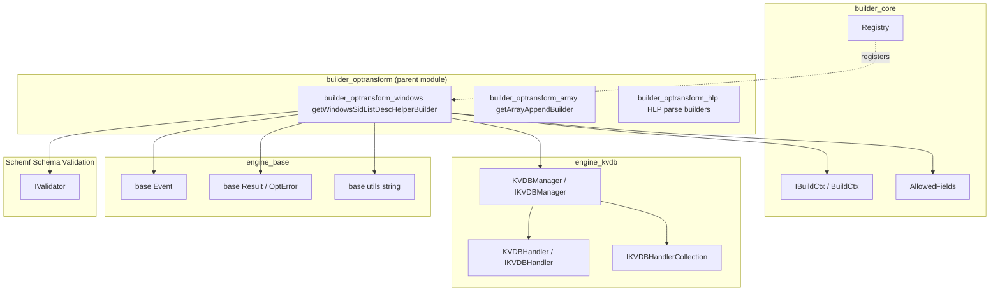
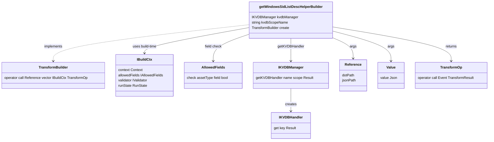
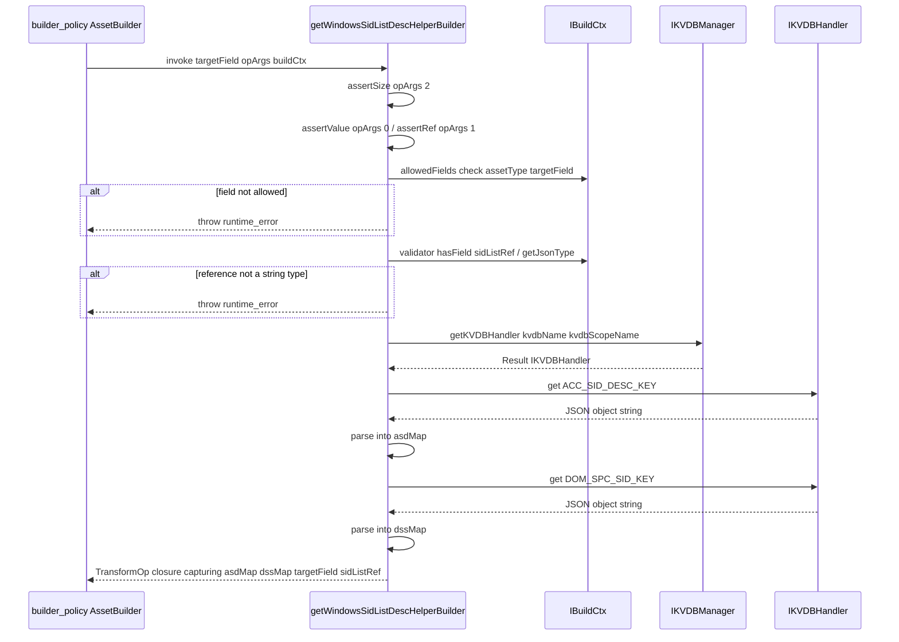
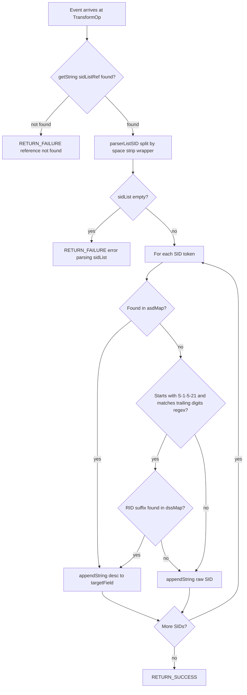
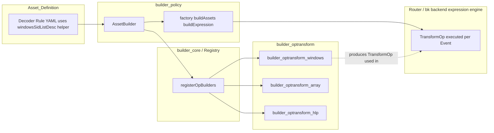

# builder_optransform_windows

## Introduction

`builder_optransform_windows` is a leaf module of the Wazuh **Engine** (see [Wazuh_Engine_Core_(C++).md](Wazuh_Engine_Core_(C++).md)) that implements a single, highly specialized **transform helper**: `windowsSidListDesc` (exposed through the factory function `getWindowsSidListDescHelperBuilder`). This helper enriches Windows Security Identifier (SID) lists found in log events with their human‑readable descriptions (well‑known account names or domain‑specific names), using data stored in the Engine's Key‑Value Database (KVDB) subsystem.

The module is intentionally small in scope — it contains exactly one translation unit, `windows.cpp`, and one public builder factory — but it demonstrates the full lifecycle of an Engine **transform operation (`optransform`)**: argument validation, schema/allowed-fields checks, KVDB handler acquisition, and the construction of a runtime lambda (`TransformOp`) that is invoked once per event during rule/decoder evaluation.

This document explains the module's responsibility, its internal logic, and how it fits into the broader `builder_optransform` family and the Engine's asset‑building pipeline.

---

## 1. Purpose & Core Functionality

Windows Security Event Logs frequently contain fields with **space separated lists of SIDs** in the form:

```
%{S-1-5-21-...-1001} %{S-1-5-32-544} %{S-1-5-18} ...
```

The `windowsSidListDesc` helper:

1. Parses that raw string into individual SID tokens (stripping the `%{ }` wrapper).
2. For each SID, looks it up in two KVDB-backed maps:
   - **Account SID Description map** (`ACC_SID_DESC_KEY`) — well-known/fixed SIDs (e.g., `S-1-5-18` → `LocalSystem`).
   - **Domain-Specific SID map** (`DOM_SPC_SID_KEY`) — domain-relative RIDs matched via a trailing numeric regex (e.g., `S-1-5-21-...-512` → `Domain Admins`).
3. Appends the resolved description (or the raw SID, if no description is found) to a target field in the event.

This is a **map/enrichment** style operation implemented as a `TransformOp`, following the same builder pattern used by other `optransform` helpers (see [builder_optransform_hlp.md](builder_optransform_hlp.md) and [builder_optransform_array.md](builder_optransform_array.md)).

### Core Component

| Component | Type | Description |
|---|---|---|
| `getWindowsSidListDescHelperBuilder` | Factory function (`TransformBuilder`) | Returns a closure that, given `(targetField, opArgs, buildCtx)`, validates configuration and produces the runtime `TransformOp` lambda that performs SID → description resolution for each event. |

---

## 2. Architecture Overview

The module sits at the intersection of three subsystems of the Engine:

- **Builder core** ([builder_core.md](builder_core.md)) — supplies `IBuildCtx`, `Registry`, and the asset-building context used at *build time* (schema validation, allowed-fields, run state).
- **KVDB subsystem** ([engine_kvdb.md](engine_kvdb.md)) — supplies `IKVDBManager` / `IKVDBHandler`, used to fetch the two description maps from persisted key-value databases.
- **Base runtime types** ([engine_base.md](engine_base.md)) — supplies `base::Event`, `base::Result`/`base::OptError`, and `base::utils::string` helpers used both at build time and run time.



---

## 3. Component Relationships & Dependencies

`windows.cpp` depends on several types defined in sibling files within `builder_optransform` and `builder_core`:

- `builder::builders::Reference` / `Value` (from `builders/argument.hpp`, see [builder_argument_helper.md](builder_argument_helper.md)) — represent the target field and helper arguments (KVDB name literal + SID-list field reference).
- `builder::builders::IBuildCtx` / `BuildCtx` (from `builders/ibuildCtx.hpp` / `buildCtx.hpp`, see [builder_core_context.md](builder_core_context.md)) — build-time context giving access to:
  - `context()` — asset name/opName metadata.
  - `allowedFields()` — per-asset-type field allow-list (`builder::AllowedFields`).
  - `validator()` — JSON schema validator (`schemf::IValidator`) used to check the referenced field's declared type.
  - `runState()` — shared runtime state object used for tracing (`RETURN_SUCCESS` / `RETURN_FAILURE` macros).
- `builder::builders::utils::assertSize/assertValue/assertRef` (from `builders/utils.hpp`) — argument-arity/type assertion helpers shared by all opfilter/opmap/optransform builders (see [builder_argument_helper.md](builder_argument_helper.md)).
- `kvdbManager::IKVDBManager` / `IKVDBHandler` (from `kvdb/kvdbManager.hpp`, `kvdb/kvdbHandler.hpp`, see [engine_kvdb.md](engine_kvdb.md)) — used to obtain a scoped handler to the named KVDB and issue `get(key)` calls.



This module is registered into the global builder `Registry` alongside all other op builders via `registerOpBuilders` (see [builder_core_registry.md](builder_core_registry.md)), making the `windowsSidListDesc` helper available for use in decoders/rules through the `builder_policy` asset-building pipeline (see [builder_policy.md](builder_policy.md)).

---

## 4. Build-Time Processing Flow

The factory `getWindowsSidListDescHelperBuilder` performs **all validation and KVDB data loading once, at asset-build time** — not per event. This is a key performance characteristic: the two description maps (`asdMap`, `dssMap`) are fetched from the KVDB and parsed into `std::map<std::string, std::string>` structures that are captured by value in the returned `TransformOp` closure, avoiding repeated KVDB round-trips during event processing.



### Build-Time Validation Steps

1. **Argument arity** — exactly 2 arguments required: `assertSize(opArgs, 2)`.
2. **Argument types** — arg 0 must be a `Value` (KVDB name literal): `assertValue(opArgs, 0)`; arg 1 must be a `Reference` (path to the SID-list field): `assertRef(opArgs, 1)`.
3. **Allowed-fields check** — the `targetField` must be permitted for the asset's type (decoder/rule/output), verified through `buildCtx->allowedFields().check(assetType, targetField.dotPath())`.
4. **KVDB name type check** — the first argument's `json::Json` value must be a string.
5. **Schema type check** — if the referenced SID-list field is present in the schema, it must be of type `String`.
6. **KVDB handler acquisition** — `kvdbManager->getKVDBHandler(kvdbName, kvdbScopeName)`; failures raise a `runtime_error` that aborts asset construction.
7. **Description map loading** — both `ACC_SID_DESC_KEY` and `DOM_SPC_SID_KEY` are fetched and parsed as JSON objects into `std::map<std::string,std::string>`; empty maps or malformed objects raise a `runtime_error`.

Any failure in these steps causes **asset construction to fail immediately**, preventing a broken decoder/rule from being loaded into a running policy.

---

## 5. Runtime Processing Flow (Per-Event)

Once built, the `TransformOp` lambda executes for every event that reaches this transform stage:



### Key Runtime Behaviors

- **SID parsing** (`parserListSID`): splits the raw string on spaces and strips the `%{` / `}` wrapper from each token, tolerant of malformed short tokens (left unchanged if too short to contain the wrapper).
- **Resolution priority**:
  1. Exact match in the **account SID description map** (well-known SIDs).
  2. If the SID is domain-relative (`S-1-5-21` prefix) and ends with a 1–5 digit RID (`std::regex("\d{1,5}$")`), attempt lookup of that RID suffix in the **domain-specific SID map**.
  3. Fallback: append the raw, unresolved SID string.
- **Result construction**: descriptions/raw SIDs are appended (not overwritten) to `targetField` using `event->appendString(...)`, allowing the target to accumulate multiple resolved names, one per input SID.
- **Tracing**: `RETURN_SUCCESS` / `RETURN_FAILURE` macros use the pre-computed trace strings (`successTrace`, `referenceNotFoundTrace`, `failureRefErrorParsing`) together with `buildCtx->runState()` to integrate with the Engine's tracing/tester infrastructure (see [engine_api_router_tester.md](engine_api_router_tester.md) for how traces surface via the Tester API).

---

## 6. Data Model: KVDB-Backed Description Maps

The helper relies on two well-known KVDB keys (constants referenced as `detail::ACC_SID_DESC_KEY` and `detail::DOM_SPC_SID_KEY`), each expected to store a **flat JSON object** mapping SID strings (or RID suffixes) to human-readable names:

```json
// ACC_SID_DESC_KEY example
{
  "S-1-5-18": "LocalSystem",
  "S-1-5-19": "LocalService",
  "S-1-5-20": "NetworkService"
}
```

```json
// DOM_SPC_SID_KEY example (RID suffix -> name)
{
  "512": "Domain Admins",
  "513": "Domain Users",
  "544": "Administrators"
}
```

These maps are provisioned into the KVDB ahead of time (e.g., via the `engine_kvdb` CLI tools — see [engine_kvdb.md](engine_kvdb.md) and its `engine-suite` commands `db_upsert`, `manager_create`, etc.) and read once per asset build via `IKVDBHandler::get(key)`.

---

## 7. Error Handling Summary

| Failure Point | Detection | Result |
|---|---|---|
| Wrong argument count/type | `assertSize` / `assertValue` / `assertRef` | Throws `runtime_error` at build time |
| Target field not allowed for asset type | `AllowedFields::check` | Throws `runtime_error` at build time |
| KVDB name argument not a string | `json::Json::isString()` | Throws `runtime_error` at build time |
| SID-list reference not declared as `String` in schema | `IValidator::getJsonType` | Throws `runtime_error` at build time |
| KVDB handler acquisition failure | `IKVDBManager::getKVDBHandler` returns error | Throws `runtime_error` at build time |
| Description map fetch/parse failure (missing key, not an object, empty object, non-string values) | `parseDbJsonToMap` | Throws `runtime_error` at build time |
| SID-list field missing on event | `event->getString(sidListRef)` returns `nullopt` | `RETURN_FAILURE` at runtime (per-event) |
| SID-list parses to empty vector | `parserListSID` returns empty | `RETURN_FAILURE` at runtime (per-event) |
| Individual SID unresolved | No match in either map | Raw SID appended (not a failure) |

Build-time errors are fatal to asset loading (surfaced through the `builder_core` / `builder_policy` construction pipeline — see [builder_policy.md](builder_policy.md) and [engine_api_catalog.md](engine_api_catalog.md) validation flows). Runtime errors only fail the affected event's processing through this stage, following the standard `TransformResult` / trace contract shared by all `optransform` helpers.

---

## 8. Position in the Wazuh Engine



The `windowsSidListDesc` helper is one of many building blocks registered through `registerOpBuilders`/`registerStageBuilders` (in `builder_core_registry`) that the `AssetBuilder` ([builder_policy.md](builder_policy.md)) uses to compile a decoder or rule's YAML `check`/`normalize` stages into an executable `base::Expression` tree. At runtime, the compiled expression is executed by the backend controller (`bk` module — see [engine_bk.md](engine_bk.md)) as part of the `Router`'s per-event pipeline ([Router.md](Router.md)).

---

## 9. Related Documentation

- Parent module: [builder_optransform.md](builder_optransform.md) — overview of all transform (`optransform`) helper builders (array append, HLP parsers, Windows SID description).
- Sibling module: [builder_optransform_array.md](builder_optransform_array.md) — `getArrayAppendBuilder`, a structurally similar transform helper for array manipulation.
- Sibling module: [builder_optransform_hlp.md](builder_optransform_hlp.md) — High-Level Parser (HLP) based transform builders.
- [builder_core.md](builder_core.md) — `IBuildCtx`/`BuildCtx`, `Registry`, and the shared build-context contract used by all builders.
- [builder_argument_helper.md](builder_argument_helper.md) — `Reference`/`Value` argument types and `assertSize`/`assertValue`/`assertRef` utilities.
- [engine_kvdb.md](engine_kvdb.md) — KVDB Manager/Handler used to store and retrieve the SID description maps.
- [engine_base.md](engine_base.md) — `base::Event`, `base::Result`, and shared string utilities.
- [Schemf_(Schema_Validation).md](Schemf_(Schema_Validation).md) — `IValidator` used for schema type checks on the target/reference fields.
- [builder_policy.md](builder_policy.md) — Asset/Policy building pipeline that consumes registered op builders like this one.
- [engine_bk.md](engine_bk.md) / [Router.md](Router.md) — Runtime expression execution and event routing that ultimately invokes the `TransformOp` produced by this module.
