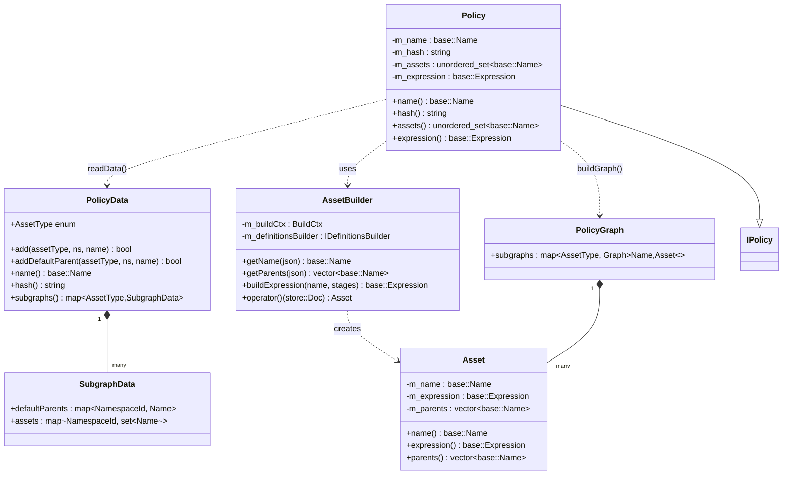
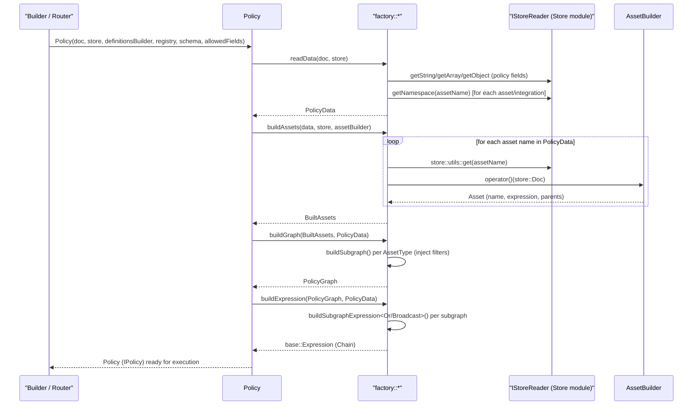
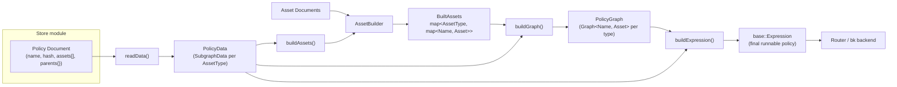

# Builder Policy Module

## 1. Purpose

The `builder_policy` module is the **policy assembly engine** of the Wazuh Engine's `builder` component. It is responsible for transforming a *policy document* (retrieved from the [Store](Store.md)) — which merely lists asset names, namespaces and default parent relationships — into a fully-built, executable [`base::Expression`](engine_base_expression.md) tree that the engine's runtime ([Router](Router.md) / [bk backend](engine_bk.md)) can evaluate against incoming events.

In short, this module answers the question: *"Given a policy that references a set of decoders, rules, filters and outputs, how do I read them from the store, build each one, wire them together according to their parent/child relationships, and produce a single runnable expression?"*

It sits at the very top of the asset-building pipeline inside `engine_builder`:

```
Store documents  →  builder_policy (PolicyData, AssetBuilder, Policy)  →  base::Expression (runnable)
```

The resulting `Policy` object implements the `IPolicy` interface (defined in [builder_core](builder_core.md)) and is consumed by the [Router](Router.md) to route and process events.

## 2. Architecture Overview

The module has two conceptual layers:

1. **Data layer** — `PolicyData` / `SubgraphData` — a lightweight, in-memory representation of *which* assets (by name) belong to the policy, grouped by type (`DECODER`, `RULE`, `OUTPUT`, `FILTER`) and namespace, along with default parent-child wiring rules.
2. **Build layer** — `AssetBuilder`, `factory::buildAssets`, `factory::buildGraph`, `factory::buildExpression`, and the top-level `Policy` class — which read the actual asset documents from the store, build each one into an `Asset` (name + `base::Expression` + parents), arrange them into per-type dependency graphs, and finally collapse those graphs into a single composite `base::Expression`.

### 2.1 Component Diagram



### 2.2 Build Pipeline (Sequence)

The `Policy` constructor orchestrates the whole pipeline using the free functions declared in `factory.hpp`/`factory.cpp`:



## 3. Core Components

### 3.1 `Asset` (`asset.hpp`)

A minimal, immutable value type representing one **built** asset (decoder, rule, output, or filter):

- `m_name`: the asset's `base::Name`.
- `m_expression`: the already-built `base::Expression` for the asset's logic (parsing/filtering/mapping stages), produced by the lower-level builders in [builder_opfilter](builder_opfilter.md), [builder_opmap](builder_opmap.md), [builder_optransform](builder_optransform.md) and [builder_stage](builder_stage.md).
- `m_parents`: the list of parent asset names this asset depends on (used to wire the dependency graph).

`Asset` has no build logic of its own — it is a plain data holder produced by `AssetBuilder`.

### 3.2 `AssetBuilder` (`assetBuilder.hpp`)

Implements `IAssetBuilder` (declared alongside `IRegistry` in [builder_core](builder_core.md)). Given a raw `store::Doc` for a single asset, it:

1. Extracts and validates the asset **name** (`getName`) and **parent list** (`getParents`).
2. Iterates the asset's stage fields (e.g. `parse`, `check`, `normalize`) and delegates to the shared `BuildCtx` / `Registry` (see [builder_core_registry](builder_core_registry.md) and [builder_stage](builder_stage.md)) to compile each stage into a `base::Expression` via `buildExpression`.
3. Returns a fully-populated `Asset`.

It depends on:
- `builders::BuildCtx` — the build context/state shared across all builder stages ([builder_core_context](builder_core_context.md)).
- `defs::IDefinitionsBuilder` — resolves `definitions` fields ([engine_defs](engine_defs.md)).

### 3.3 `PolicyData`, `SubgraphData`, `Params` (`factory.hpp`)

`PolicyData` is the in-memory model of a policy **before** any asset is built:

- `AssetType` enum: `DECODER`, `RULE`, `OUTPUT`, `FILTER` — defines both categorization and *build/graph order*.
- `SubgraphData`: per-asset-type container holding, for each namespace (`store::NamespaceId`), the set of asset names belonging to that namespace and the *default parent* to use when an asset declares no explicit parent.
- `add(assetType, ns, name)` / `addDefaultParent(...)`: mutators used while parsing the policy document (or when constructing `PolicyData` directly from `Params`, useful for testing/tools).

`readData(doc, store)` (free function) parses the raw policy `store::Doc`:
- Reads `name` and `hash` (policy identity/versioning fields).
- Reads default parents per namespace (`policy/parents`).
- Reads the flat asset list (`policy/assets`), resolving each entry's namespace via the store, and classifying each name as decoder/rule/output/filter/**integration**. Integration names are expanded recursively via `addIntegrationAssets`/`addIntegrationSubgraph`, which read the integration's document and add its referenced decoders/rules/outputs while enforcing namespace consistency and type consistency.

### 3.4 Build & Graph Factory Functions (`factory.cpp` / `factory.hpp`)

| Function | Responsibility |
|---|---|
| `buildAssets(data, store, assetBuilder)` | For every asset name registered in `PolicyData`, fetches its document from the store and invokes `AssetBuilder` to produce an `Asset`. If an asset declares no explicit parent, the subgraph's default parent (if any, and if different from itself) is attached. Result: `BuiltAssets` = `map<AssetType, map<Name, Asset>>`. |
| `buildSubgraph(name, subgraphData, filtersData, assets, filters)` | Builds a single `Graph<base::Name, Asset>` for one asset type: adds an input root node, connects each asset to its parent(s) (or to the root if parentless), then **injects filters** as intermediate nodes wherever a filter's parent matches an existing node — enabling filters to gate any subgraph edge. Performs integrity checks (all referenced parents/children must exist). |
| `buildGraph(assets, data)` | Iterates all asset types (skipping `FILTER`, which is injected rather than graphed on its own) and calls `buildSubgraph` for each, producing the aggregate `PolicyGraph`. |
| `buildSubgraphExpression<ChildOperator>(subgraph)` (template, header-only) | Recursively converts a `Graph<Name, Asset>` into a `base::Expression` tree. Nodes with children become `Implication(condition=asset, consequence=ChildOperator(children...))`; leaf nodes become the asset's own expression. `ChildOperator` is `base::Or` for decoders (first-match semantics) and `base::Broadcast` for rules/outputs (fan-out semantics). Includes an optional reverse-order feature flag for decoder evaluation order (`WAZUH_REVERSE_ORDER_DECODERS`). |
| `buildExpression(graph, data)` | Combines all per-type subgraph expressions into one top-level `base::Chain` named after the policy — this is the final, executable policy expression. |

### 3.5 `Policy` (`policy.hpp`)

The public-facing class, implementing the `IPolicy` interface consumed by the rest of the engine (notably [Router](Router.md) and [builder_core](builder_core.md)). Its constructor performs the **entire pipeline** described in §2.2:

1. `readData()` → `PolicyData`
2. `buildAssets()` → `BuiltAssets`
3. `buildGraph()` → `PolicyGraph`
4. `buildExpression()` → `base::Expression`

Exposed accessors:
- `name()` / `hash()` — policy identity/versioning.
- `assets()` — the flat set of asset names composing the policy (for introspection/tracing).
- `expression()` — the final runnable `base::Expression`.
- `getGraphivzStr()` — reserved for Graphviz visualization export (not yet implemented).

`Policy` depends on collaborators from sibling modules:
- `store::IStoreReader` — [Store](Store.md)
- `defs::IDefinitionsBuilder` — [engine_defs](engine_defs.md)
- `builders::RegistryType` / `schemf::IValidator` / `IAllowedFields` — [builder_core](builder_core.md), [Schemf_(Schema_Validation)](Schemf_(Schema_Validation).md)

## 4. Data Flow Summary



## 5. Relationship to Other Modules

- **Upstream dependencies** (what `builder_policy` consumes):
  - [builder_core](builder_core.md) — `Builder`, `BuildCtx`, `Registry`, `IPolicy`, `IBuildCtx` orchestration types.
  - [builder_stage](builder_stage.md), [builder_opfilter](builder_opfilter.md), [builder_opmap](builder_opmap.md), [builder_optransform](builder_optransform.md) — the stage/operator builders invoked indirectly (via `BuildCtx`/`Registry`) while `AssetBuilder` compiles each asset's expression.
  - [engine_base_expression](engine_base_expression.md) — `base::Expression`, `base::Chain`, `base::Or`, `base::Broadcast`, `base::Implication` primitives used to assemble the final expression tree.
  - [Store](Store.md) — `IStoreReader`, `store::Doc`, `store::utils::get`, namespace resolution.
  - [engine_defs](engine_defs.md) — `IDefinitionsBuilder` for resolving asset-local definitions.
  - [Schemf_(Schema_Validation)](Schemf_(Schema_Validation).md) — schema validator injected into `Policy` for field validation during build.

- **Downstream consumers** (what uses `builder_policy`):
  - [Router](Router.md) — loads `Policy` instances (via `IPolicy`) into `Environment`s to route and process events (see `EnvironmentBuilder`).
  - `engine_api_policy` (API layer, see the parent `engine_api` documentation) — manages policy CRUD operations and ultimately triggers policy (re)builds through this module.

## 6. Error Handling

Nearly every function in this module is **fail-fast**: malformed policy documents, missing assets, dangling parent references, namespace mismatches, or duplicated asset entries all raise `std::runtime_error` with a descriptive message (via `fmt::format`). This ensures that an invalid policy is rejected atomically at build time rather than producing a partially-built, unsafe expression tree.
