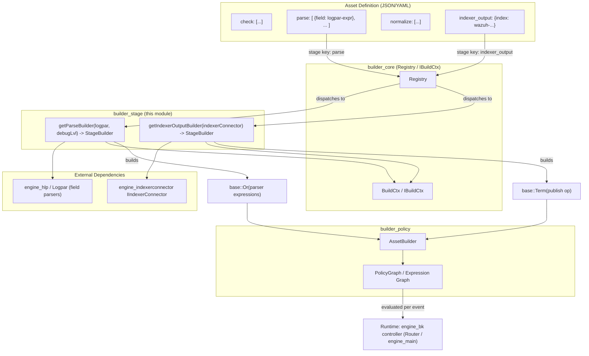
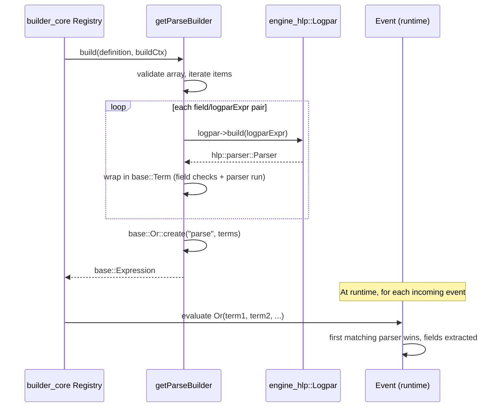
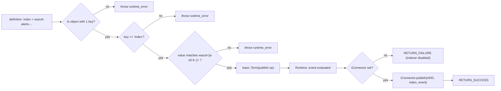
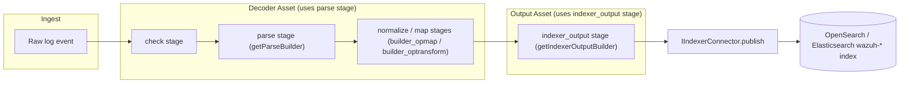

# Builder Stage Module

## 1. Purpose

The **`builder_stage`** module provides the concrete implementations of two **stage builders** used by the Wazuh
Engine's asset compilation pipeline (see [`engine_builder`](engine_builder.md)): the **`parse`** stage and the
**`indexer_output`** stage.

A *stage* is a named section inside an asset definition (decoder, rule, filter or output YAML/JSON document) that
performs a specific, self-contained operation on the event being processed — for example extracting structured
fields from a raw log line, or publishing the final, enriched event to an external index. Each stage is compiled
once (at policy-build time) into a `base::Expression` that is later evaluated many times at runtime against
incoming events, as part of the expression graph built by [`builder_policy`](builder_policy.md) and executed by
[`engine_bk`](engine_bk.md) / [`Router`](Router.md).

`builder_stage` sits alongside its sibling stage-related packages `builder_opfilter`, `builder_opmap`, and
`builder_optransform` (all children of [`engine_builder`](engine_builder.md)), but instead of providing *operators*
(building blocks used inside conditions/transformations), it provides **whole-stage** builders that are registered
directly against reserved stage keys (`parse`, `indexer_output`) in the [`builder_core`](builder_core.md) `Registry`.

## 2. Core Components

| Component | File | Responsibility |
|---|---|---|
| `getParseBuilder` | `src/engine/source/builder/src/builders/stage/parse.cpp` | Factory that returns a `StageBuilder` implementing the `parse` stage: applies one or more [Logpar/HLP](engine_hlp.md) parser expressions to fields of the event, in an OR-chain (first successful parser wins). |
| `getIndexerOutputBuilder` | `src/engine/source/builder/src/builders/stage/indexerOutput.cpp` | Factory that returns a `StageBuilder` implementing the `indexer_output` stage: validates a target index name and publishes the final event JSON to an [`IIndexerConnector`](engine_indexerconnector.md) (OpenSearch/Elasticsearch). |

Both factories follow the same pattern used across the engine builder sub-system: they are **higher-order
functions** that capture module-specific dependencies (a `Logpar` instance, an `IIndexerConnector` instance) and
return a `StageBuilder` — a `std::function<base::Expression(const json::Json&, const std::shared_ptr<const
IBuildCtx>&)>` — which the [`builder_core`](builder_core.md) `Registry`/`register.hpp` machinery calls whenever it
encounters the corresponding stage key while building an asset.

## 3. Architecture Overview

### Registration flow

Both builders are **not** self-registering; they must be explicitly instantiated with their runtime dependencies
(a `Logpar` instance for parsing, an `IIndexerConnector` for output) and handed to the `Registry` during engine
start-up, typically from `register.hpp`/`registerStageBuilders` (see [`builder_core`](builder_core.md)) or directly
from [`engine_main`](engine_main.md) wiring code. This dependency-injection pattern keeps `builder_stage` decoupled
from concrete parser/connector implementations, which live in [`engine_hlp`](engine_hlp.md) and
[`engine_indexerconnector`](engine_indexerconnector.md) respectively.

## 4. Component Details

### 4.1 `getParseBuilder` — the `parse` stage

**File:** `src/engine/source/builder/src/builders/stage/parse.cpp`

Purpose: compile the `parse` stage of an asset (typically a decoder) into an expression that tries a list of
field/parser-expression pairs, in order, until one succeeds.

Key behavior:
- Validates that the stage `definition` is a **non-empty array**; each array item must be a **single-key object**
  mapping a target `field` (JSON pointer path) to a **Logpar expression string** (e.g. `%{url%}` style HLP syntax).
- Resolves any [`Definitions`](engine_defs.md) placeholders in the logpar expression via
  `buildCtx->definitions().replace(...)`.
- Compiles each logpar expression into an `hlp::parser::Parser` using the injected `Logpar` instance
  (see [`engine_hlp`](engine_hlp.md) and [`engine_logpar`](engine_logpar.md)).
- Wraps each parser in a `base::Term<base::EngineOp>` that:
  1. Fails if the target `field` does not exist on the event.
  2. Fails if the field is not a string.
  3. Runs the compiled HLP parser against the field value, mapping extracted captures back onto the event.
  4. Emits detailed success/failure trace strings (three distinct failure reasons) for diagnostics/tracing,
     consumed by tools such as [`engine_test`](engine_test.md) and the router's asset-trace mechanism
     (see [`Router`](Router.md) `AssetTrace`).
- Combines all per-field parser expressions with `base::Or::create("parse", parsersExpressions)`, so the overall
  `parse` stage succeeds if **any** listed field/parser pair succeeds (typical decoder pattern: "try to parse this
  log with format A, else format B, ...").
- A `debugLvl` parameter (0 or 1) is validated at builder-construction time (currently reserved for future/verbose
  tracing behavior).

### 4.2 `getIndexerOutputBuilder` — the `indexer_output` stage

**File:** `src/engine/source/builder/src/builders/stage/indexerOutput.cpp`

Purpose: compile the `indexer_output` stage (typically used in output assets) into an expression that publishes
the current event to a specific index in the configured indexer backend.

Key behavior:
- Validates that the stage `definition` is an **object with exactly one key**, and that key must be
  `syntax::asset::INDEXER_OUTPUT_INDEX_KEY` (the `index` field).
- Validates the `index` value is a string and matches the pattern `wazuh-[a-z0-9.-]+` (must start with `wazuh-` and
  contain only lowercase alphanumeric characters, hyphens, and dots) — enforcing the platform's index naming
  convention.
- Builds a `base::Term<base::EngineOp>` that:
  - If no `IIndexerConnector` was injected (`iConnector` is null), the term **fails** with a
    "indexer connector is disabled" trace — allowing the engine to run with indexing disabled without breaking
    asset compilation.
  - Otherwise, serializes a JSON payload `{"operation": "ADD", "index": "<indexName>", "data": <event>}` and calls
    `iConnector->publish(...)`, then reports success.
- The returned `StageBuilder` is produced by `getIndexerOutputBuilder(indexerPtr)`, which simply closes over the
  injected `std::shared_ptr<IIndexerConnector>` and forwards to an internal `indexerOutputBuilder(...)` function.

## 5. Data Flow in Context

## 6. Relationship to Other Modules

- **[`engine_builder`](engine_builder.md)** — parent module; overall builder architecture, of which
  `builder_stage` is a leaf package alongside `builder_core`, `builder_opfilter`, `builder_opmap`,
  `builder_optransform`, and `builder_policy`.
- **[`builder_core`](builder_core.md)** — supplies `IBuildCtx`/`BuildCtx` (build-time context, including
  `definitions()` used for template substitution and `runState()` used for trace generation), the `Registry`
  where stage builders are registered, and `register.hpp`/`registerStageBuilders` which wires concrete
  `StageBuilder` instances (including those from this module) into the registry.
- **[`builder_policy`](builder_policy.md)** — consumes the `base::Expression` produced by these stage builders
  when assembling the full per-asset and per-policy expression graph (`AssetBuilder`, `factory.cpp`).
- **[`engine_hlp`](engine_hlp.md)** / **[`engine_logpar`](engine_logpar.md)** — provide the `Logpar` class and the
  underlying High-Level Parsers (HLP) that `getParseBuilder` compiles and executes.
- **[`engine_indexerconnector`](engine_indexerconnector.md)** — provides `IIndexerConnector`, the interface used
  by `getIndexerOutputBuilder` to publish events to the search/indexing backend.
- **[`engine_base`](engine_base.md)** — provides the foundational `base::Expression`, `base::Term`, `base::Or`,
  and `base::EngineOp` primitives used to build the returned expressions.
- **[`Router`](Router.md)** / **[`engine_bk`](engine_bk.md)** — execute the compiled expression graphs
  (including these stages) at runtime against live events.
- **[`engine_test`](engine_test.md)** — surfaces the trace strings produced by the `parse` stage's failure/success
  messages when running assets in test/tester mode.

## 7. Design Notes

- Both builders throw `std::runtime_error` (with descriptive messages) on malformed asset definitions, ensuring
  configuration errors are caught at **policy build time** rather than at runtime.
- Neither builder holds mutable state beyond what is captured at construction time (`Logpar`/`IIndexerConnector`
  shared pointers and a `debugLvl`), making the resulting `StageBuilder` instances safe to reuse across multiple
  asset builds.
- The `indexer_output` stage is intentionally tolerant of a missing indexer connector (fails gracefully at
  runtime instead of throwing at build time), which allows the engine to be built and tested without a live
  indexer backend.
