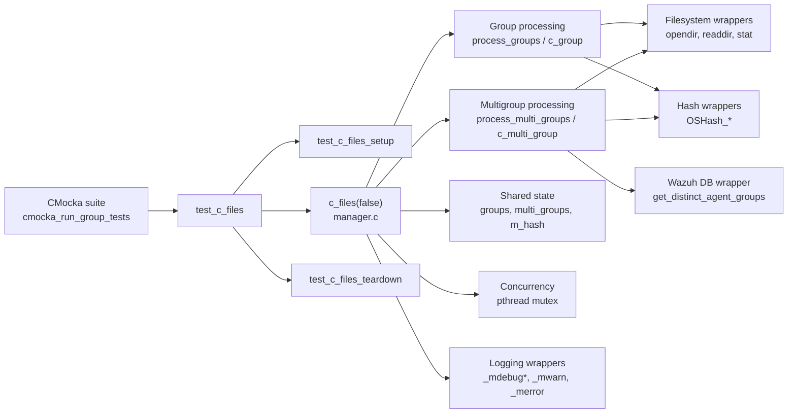
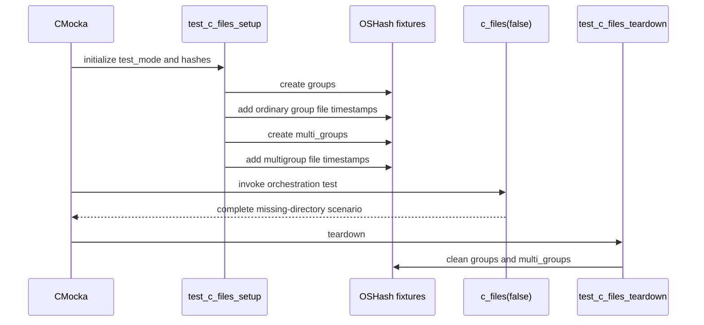
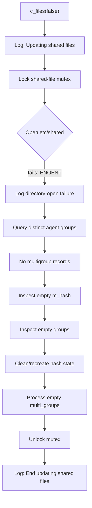
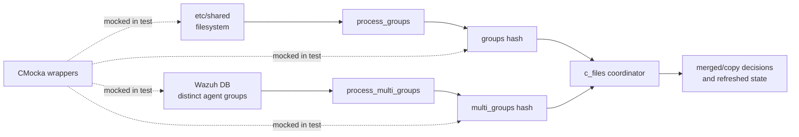
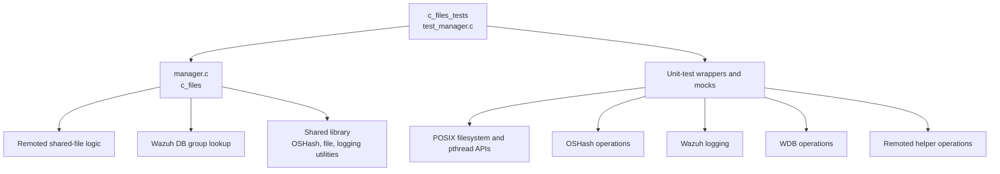

# `c_files_tests`

## Introduction

`c_files_tests` documents the CMocka coverage for the `c_files(false)` orchestration path in Wazuh Remoted. The test verifies that shared-file processing can start, coordinate its shared state, handle a missing `etc/shared` directory, rebuild or inspect group hash state, and release its mutex cleanly without crashing.

The test is implemented in `src/unit_tests/remoted/test_manager.c` and is registered as `test_c_files` with `test_c_files_setup` and `test_c_files_teardown`. The source file also contains tests for lower-level group, multigroup, file-copy, and control-message behavior; those are neighboring concerns rather than the primary scope of this module.

## Purpose and scope

The production function under test is `c_files(false)`, implemented through the Remoted manager code. At a high level, it coordinates the refresh of shared files used by agent groups:

- serializes shared-state updates with a pthread mutex;
- discovers or processes ordinary agent groups;
- obtains distinct agent-group information from Wazuh DB;
- processes multigroup data;
- maintains hash tables containing group and file metadata; and
- cleans up temporary or replaced hash state before unlocking.

The current unit test selects the empty/error path. It simulates an unavailable `etc/shared` directory and no distinct agent groups, then checks the observable orchestration sequence. It does not validate the contents of merged files; those behaviors are covered by adjacent `c_group`, `c_multi_group`, `validate_shared_files`, and `copy_directory` tests in the same source file.

## Position in the system

Remoted is responsible for agent communication and for maintaining shared configuration files. Group directories under `etc/shared` contain files that are merged or copied into agent-specific state. Wazuh DB provides the agent-to-group relationship needed to determine which multigroup combinations exist.

`c_files_tests` sits at the unit-test boundary around the manager orchestration layer. Production dependencies are replaced by wrappers so the test can observe filesystem access, hash operations, logging, mutex operations, and Wazuh DB queries without requiring a running manager or real filesystem state.

For broader context, see [test_manager_remoted.md](test_manager_remoted.md), [remoted.md](remoted.md), [wazuh_db.md](wazuh_db.md), and [shared_lib.md](shared_lib.md).

## Architecture



### Component responsibilities

| Component | Responsibility in this module |
| --- | --- |
| `test_c_files` | Defines the scenario, wrapper expectations, and invocation of `c_files(false)`. |
| `test_c_files_setup` | Creates representative `groups` and `multi_groups` hash fixtures and initializes test mode. |
| `test_c_files_teardown` | Releases the fixture hashes and restores test-mode state. |
| `manager.c::c_files` | Orchestrates the shared-file update and coordinates ordinary groups and multigroups. |
| `process_groups` / `process_multi_groups` | Discover group state and determine which group data requires processing. |
| `OSHash` tables | Hold group metadata, file timestamps, and multigroup metadata. |
| Wazuh DB wrapper | Supplies distinct agent-group combinations for multigroup processing. |
| Filesystem and logging wrappers | Make failure paths deterministic and observable. |

## Test fixture lifecycle

The fixture contains both ordinary and multigroup records even though the main test overrides several calls to exercise the missing-directory path. This makes the setup reusable by the adjacent manager tests and ensures the global state has the same shape as production state.



### Fixture contents

`groups` includes `test_default` and `test_test_default`. Each group owns an `f_time` hash with one synthetic file timestamp. `multi_groups` similarly includes `test_default2` and `test_test_default2`. The test uses these objects to model the state that `c_files` normally compares while refreshing shared files.

The teardown calls `OSHash_Clean` with `free_group`, so every fixture must remain compatible with the production group cleanup contract. New fixture fields should therefore be initialized and freed consistently with `group_t` ownership rules.

## `test_c_files` scenario

The test establishes the following expectations before calling `c_files(false)`:

1. A debug message announces the beginning of shared-file processing: `Updating shared files.`
2. The shared-state mutex is locked.
3. The `etc/shared` directory cannot be opened.
4. The corresponding error is logged with the `strerror` text `No such file or directory`.
5. Wazuh DB returns no distinct agent-group data.
6. The current manager hash, ordinary group hash, and multigroup hash have no entries to process.
7. Temporary hash state is cleaned and a replacement hash is created where expected by the implementation.
8. The mutex is unlocked.
9. A debug message announces completion: `End updating shared files.`



The test is intentionally interaction-oriented. It does not assert a returned value or a generated file because the purpose of this case is to verify orchestration and graceful handling of unavailable shared-file storage.

## Data flow and dependencies



The production data flow is file- and database-driven. The unit test replaces both inputs: `opendir` fails immediately, and `get_distinct_agent_groups` returns `NULL`. This isolates the coordinator’s failure handling from the correctness of directory traversal and Wazuh DB serialization.

## Dependency map



The most important dependency boundary is the direct inclusion of `../../remoted/manager.c` in the test translation unit. That gives the test direct access to the implementation under test while allowing wrapper symbols to control external behavior. Changes to manager internals, global variables, or wrapper signatures can therefore affect this test even when the public Remoted API is unchanged.

## Mocking and isolation strategy

The test uses CMocka expectations and linker-level wrappers rather than real external services. Important mocked interactions include:

- `opendir` and `strerror` for the missing shared directory;
- `OSHash_Begin`, `OSHash_Clean`, and `OSHash_Create` for state traversal and replacement;
- `get_distinct_agent_groups` for Wazuh DB group discovery;
- pthread mutex lock and unlock calls for serialization;
- Wazuh logging functions for observable progress and error reporting.

This strategy gives the test deterministic control over error branches and makes call ordering part of the contract. When modifying `c_files`, update expectations together with the implementation if the intended orchestration changes. Avoid adding real filesystem or database access to this unit test; those belong in integration coverage.

## Covered behavior versus neighboring coverage

The `c_files_tests` case covers the coordinator’s empty/error path. The same `test_manager.c` source provides more detailed behavioral coverage:

| Concern | Representative tests in the source |
| --- | --- |
| Group merge and change detection | `test_c_group_*`, `test_group_changed_*`, `test_ftime_changed_*` |
| Multigroup discovery and regeneration | `test_c_multi_group_*`, `test_process_multi_groups_*` |
| Directory traversal and validation | `test_validate_shared_files_*`, `test_copy_directory_*` |
| Group lifecycle cleanup | `test_process_deleted_groups_*`, `test_process_deleted_multi_groups_*` |
| Agent control messages | `test_validate_control_msg_*`, `test_save_controlmsg_*` |

Use the dedicated module documentation for those areas when available instead of expanding this document into a duplicate of the full manager test suite.

## Maintenance guidance

- Preserve the setup/teardown pairing when adding tests that mutate global hashes.
- If a test changes `test_mode`, restore it before teardown completes.
- Keep mutex expectations balanced: every expected lock must have a corresponding unlock, including failure paths.
- Use explicit wrapper expectations for new filesystem or WDB branches so failures remain deterministic.
- Treat log strings as part of the current test contract; update them only when the user-visible diagnostic is intentionally changed.
- Add separate tests for generated contents, recursive copying, or invalid-file recovery rather than overloading `test_c_files`.

## Execution

The test belongs to the Remoted unit-test target and is executed through the CMocka registration in `main`:

```c
cmocka_unit_test_setup_teardown(test_c_files,
                                test_c_files_setup,
                                test_c_files_teardown)
```

The complete test array is run with `test_setup_group` and `test_teardown_group`. Build and invocation details are owned by the Remoted test target; consult [test_manager_remoted.md](test_manager_remoted.md) for the surrounding target and suite documentation.

## References

- Source under test: `src/unit_tests/remoted/test_manager.c`
- Remoted implementation: `src/remoted/manager.c`
- Related suite: [test_manager_remoted.md](test_manager_remoted.md)
- Remoted module: [remoted.md](remoted.md)
- Wazuh DB module: [wazuh_db.md](wazuh_db.md)
- Shared utilities and data structures: [shared_lib.md](shared_lib.md)
- Wrapper and mock infrastructure: [wrappers.md](wrappers.md)
