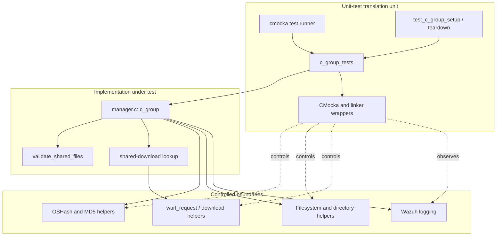
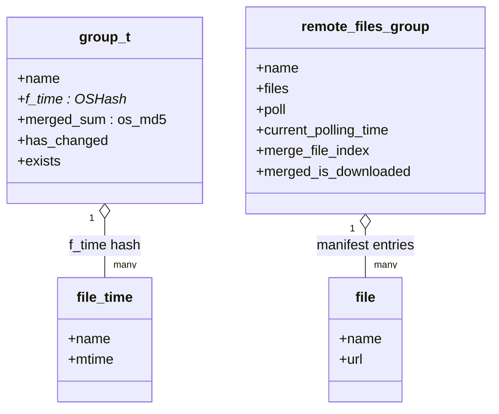
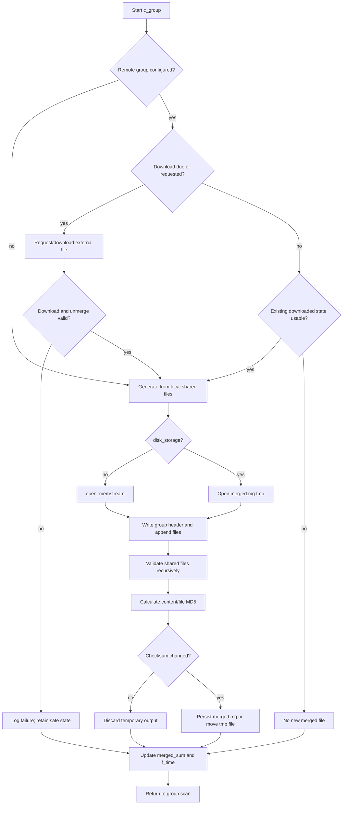
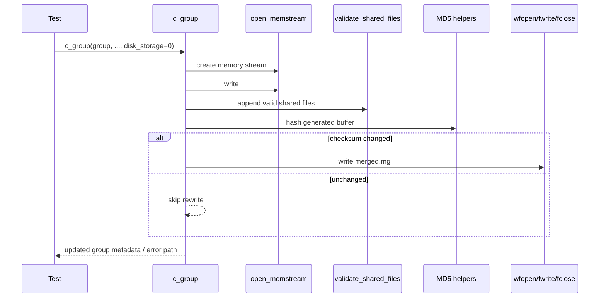
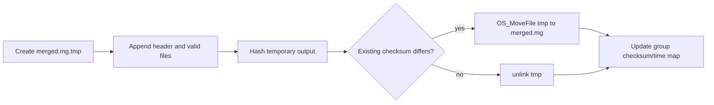
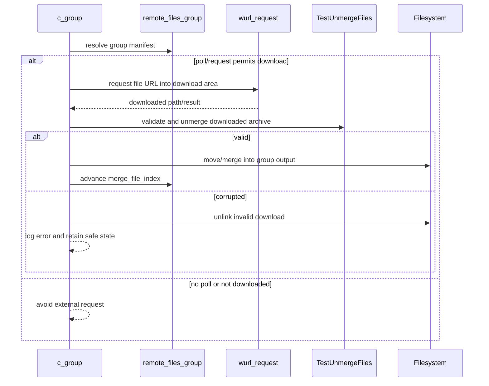
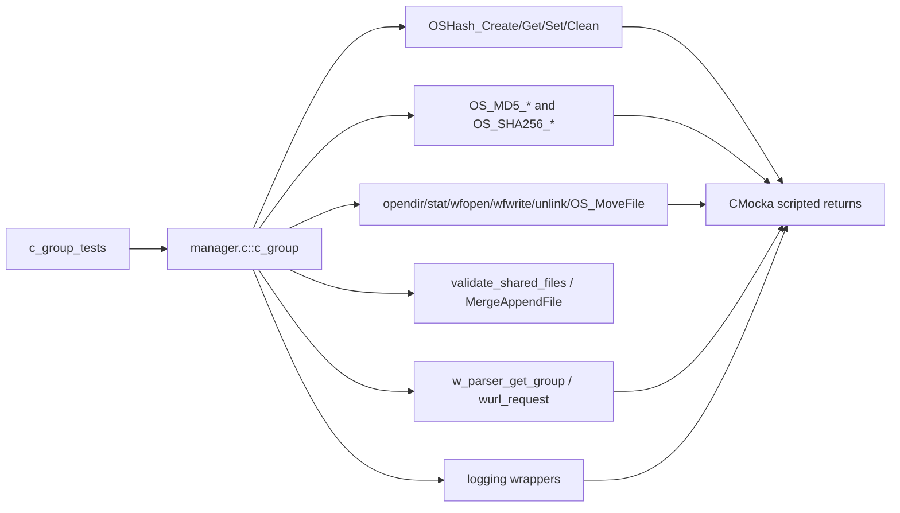

# `c_group_tests`

## Introduction

`c_group_tests` documents the CMocka coverage for `c_group()`, the Remoted manager routine that builds or refreshes a group’s `merged.mg` shared-configuration file. The tests exercise both in-memory and disk-backed merge paths, file-change detection, checksum updates, externally downloaded shared files, polling, and failure handling.

The tests are implemented in `src/unit_tests/remoted/test_manager.c`. That translation unit directly includes `src/remoted/manager.c`, so the suite can call implementation-level functions and inspect their global state. The source also contains tests for the wider manager; those are referenced below rather than duplicated.

For the production context, see [Remoted group management](remoted_group_management.md). For suite-wide fixtures and wrapper conventions, see [`test_manager_remoted_test_infrastructure`](test_manager_remoted_test_infrastructure.md).

## Scope and role

The `c_group()` path sits below the periodic `c_files()` coordinator:

Its responsibilities are to:

- create a merged representation beginning with the group header (`#<group>`);
- include eligible files from `etc/shared/<group>` and, when configured, `ar.conf`;
- track per-file modification times in an `OSHash` and calculate the merged MD5;
- avoid rewriting an unchanged merged file;
- support memory-stream and temporary-file persistence modes;
- incorporate files downloaded through the shared-download manifest; and
- preserve consistent group metadata when filesystem, hashing, or merge operations fail.

`c_group_tests` does not test the complete scan orchestration, recursive validation algorithm, or agent transmission protocol. Those concerns are covered by [c_files tests](c_files_tests.md), the validation/copy tests in the same source suite, and [Remoted group management](remoted_group_management.md).

## Architecture

The test is deliberately white-box. Direct inclusion of `manager.c` exposes static implementation details, while wrappers replace environmental operations. Consequently, changes to global variables, helper signatures, log messages, or internal branch ordering can require test updates even when the external Remoted API is unchanged.

## Components and state

| Component | Role in the tests |
|---|---|
| `test_c_group_*` | Configure one scenario, invoke `c_group()`, and assert return/state and wrapper interactions. |
| `test_c_group_setup` | Creates representative `group_t` state, file-time hashes, and controlled global values. |
| `test_c_group_teardown` | Frees group-owned hashes and restores state after each case. |
| `group_t` | Holds the group name, `f_time` map, `merged_sum`, and change/existence flags. |
| `OSHash *f_time` | Maps file names to modification-time records used by change detection. |
| `os_md5 merged_sum` | Records the checksum of the generated or downloaded merged content. |
| `remote_files_group` | Describes manifest-backed files, polling state, download state, and merge index. |
| `invalid_files` | Tracks files that failed binary/validity checks so repeated scans can avoid unsafe merges. |
| `disk_storage` | Selects memory-stream generation or temporary-file generation. |

The high-level data relationship is:

## `c_group()` processing model

The tests show that the routine is both a generator and a cache-maintenance operation. A successful merge updates the checksum and file-time map; an unchanged merge avoids unnecessary persistence; an error is observable through logs and mocked calls rather than by silently fabricating a new merged file.

## Persistence paths

### Memory-stream path

When `disk_storage` is disabled, the routine uses `open_memstream()` to assemble the merged content. It writes the group header, optionally appends `ar.conf`, calls the shared-file validation/append logic, computes an MD5 over the resulting buffer, and writes the final file only when the checksum differs.

Covered failures include memory-stream creation, stream finalization, MD5 calculation, append failures, file opening, and file writing/truncation.

### Disk-backed path

When `disk_storage` is enabled, output is generated in a temporary merged file. The implementation compares the temporary result with the existing merged file and uses `OS_MoveFile` when replacement is required. If no change is detected, the temporary file is removed instead of replacing the stable output.

The disk-specific tests verify success, unchanged output, downloaded-file handling, and failures in temporary creation, truncation, append, and move operations.

## External shared-file flow

`c_group()` consults the shared-download configuration represented by `remote_files_group`. The download tests model the request boundary without contacting a real content server.

The suite covers:

- one downloaded file and all-files download mode;
- polling enabled versus disabled/ not yet due;
- a corrupted downloaded file rejected by `TestUnmergeFiles`;
- moving a downloaded result into the group’s shared area; and
- a configured remote group for which no new shared file should be created.

The manifest parser and lifecycle that populate `remote_files_group` are documented by the production [Remoted group management](remoted_group_management.md) module.

## Test inventory

| Test | Scenario and expected contract |
|---|---|
| `test_c_group_no_changes` | Existing memory-backed group has no file changes; preserves the cached merge state and avoids unnecessary rewrite. |
| `test_c_group_no_changes_disk` | Same unchanged decision through the temporary-file/disk path. |
| `test_c_group_changes` | Changed local file causes a new merged result and updated checksum/time state. |
| `test_c_group_changes_disk` | Changed local file causes replacement of disk-backed output. |
| `test_c_group_fail` | Exercises memory-path construction or merge failure and verifies safe error handling. |
| `test_c_group_fail_disk` | Exercises disk-path failure, including temporary output handling. |
| `test_c_group_no_create_shared_file` | Remote configuration exists but conditions do not permit creation of a new shared file. |
| `test_c_group_downloaded_file` | Downloads and incorporates a configured external file. |
| `test_c_group_downloaded_file_no_poll` | Verifies that polling state prevents an unnecessary download. |
| `test_c_group_downloaded_file_is_corrupted` | Rejects an invalid downloaded file and cleans up the failed artifact. |
| `test_c_group_download_all_files` | Processes the manifest’s all-files path rather than a single indexed file. |
| `test_c_group_setup` / `test_c_group_teardown` | Establish and release the reusable group/hash fixture. |

The exact wrapper expectations in the source are part of the behavioral contract: paths, checksum inputs, merge indexes, and error logs are asserted to ensure that the correct branch—not merely a successful return—is reached.

## Dependency and mocking map

Important isolation rules:

- Do not use the real `etc/shared` tree in these unit tests; directory listings and file attributes are wrapped.
- Keep hash creation and cleanup paired with the fixture that owns the hash.
- Program every download response and cleanup result explicitly, especially for corrupted files.
- Preserve balanced setup/teardown when modifying `disk_storage`, `invalid_files`, or remote-download globals.
- Treat diagnostic strings as observable behavior when the test asserts `_mdebug*`, `_mwarn`, or `_merror` calls.

The common wrapper boundary is described in [`test_manager_remoted_test_infrastructure`](test_manager_remoted_test_infrastructure.md) and [Shared library](shared_lib.md).

## Failure and edge-case coverage

| Failure/edge | Observable behavior tested |
|---|---|
| No local change | Cached checksum/time state remains valid; no redundant output replacement. |
| New or modified file | Merge is rebuilt and metadata changes. |
| Missing source/output directory | Error is logged and the function returns through a controlled path. |
| Memory stream unavailable | Merge aborts without dereferencing an invalid stream. |
| Temporary file or write failure | Disk output is not falsely reported as successfully replaced. |
| Append/truncate failure | Partial merge is handled and the failure is logged. |
| Download not due | Polling state prevents a request. |
| Corrupt download | Unmerge validation fails, the artifact is removed where possible, and state is retained safely. |
| Path/file/hash helper failure | The relevant wrapper call and diagnostic are verified. |

Recursive file classification, hidden-file handling, binary-file tracking, and nested-directory behavior are intentionally delegated to the `validate_shared_files` tests in the same `test_manager.c` suite. The top-level coordinator is covered by [c_files tests](c_files_tests.md).

## Maintenance guidance

When changing `c_group()`:

1. Update the relevant memory and disk test together; the two paths intentionally have different persistence semantics.
2. Add or adjust download expectations for request, validation, move, unlink, and polling state.
3. Keep assertions on `merged_sum` and `f_time` aligned with the intended cache invalidation behavior.
4. Add a failure case whenever a new filesystem, hash, or download result changes control flow.
5. Keep this document focused on `c_group`; link new orchestration or recursive-validation behavior to the neighboring module documents.

## Execution and references

The tests are registered in `main()` with CMocka setup/teardown and run as part of the Remoted manager unit-test target. The source registration includes the `test_c_group_*` cases alongside the broader manager suite.

References:

- Test source: `src/unit_tests/remoted/test_manager.c`
- Production implementation: `src/remoted/manager.c`
- Production group-management context: [remoted_group_management.md](remoted_group_management.md)
- Orchestration tests: [c_files_tests.md](c_files_tests.md)
- Complete manager harness: [test_manager_remoted_test_infrastructure.md](test_manager_remoted_test_infrastructure.md)
- Shared utility boundaries: [shared_lib.md](shared_lib.md)
