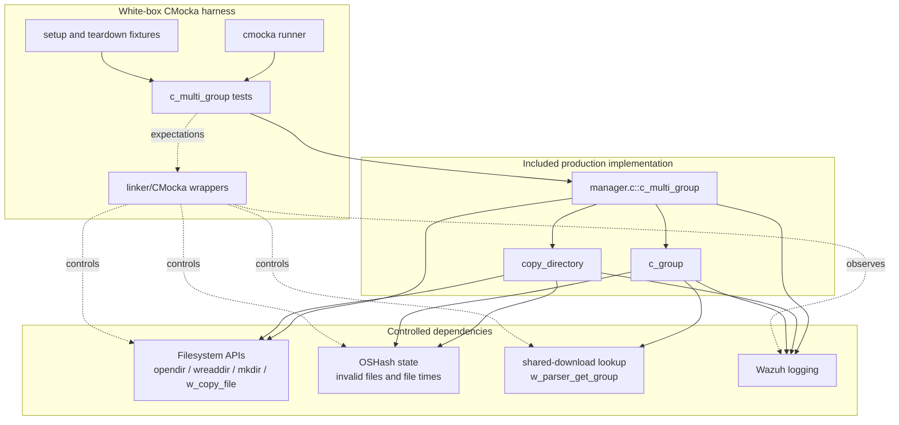
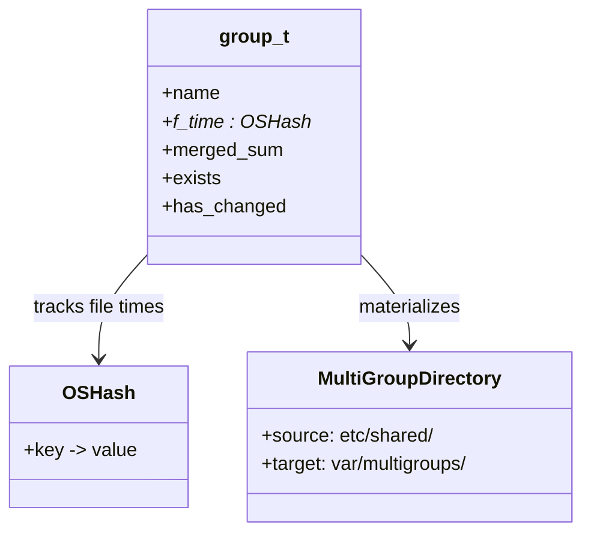
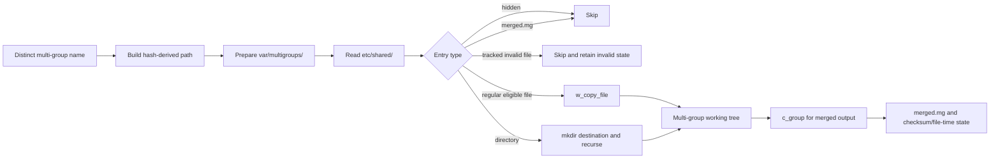
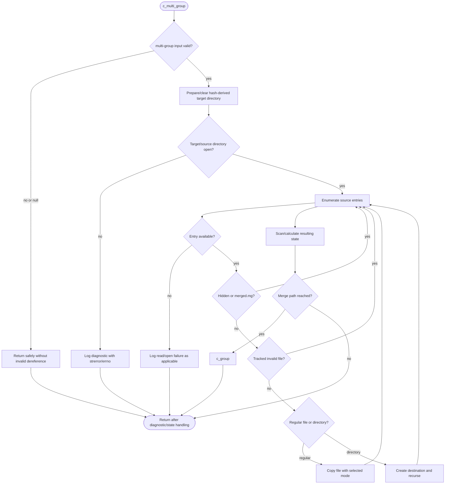
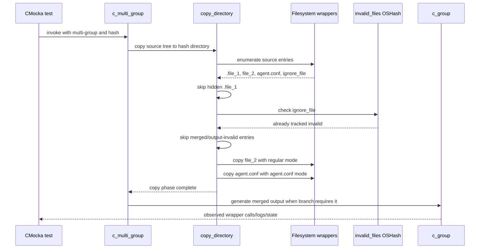

# `c_multi_group_tests`

## Introduction

`c_multi_group_tests` documents the CMocka coverage for `c_multi_group()`, the Remoted manager routine that prepares the filesystem representation of a multi-group configuration. A multi-group combines the shared configuration of several agent groups, stores the intermediate content under a hash-derived directory, and then builds the corresponding merged configuration.

The tests are implemented in `src/unit_tests/remoted/test_manager.c`, which directly includes `src/remoted/manager.c`. This makes the suite a white-box test of implementation-level behavior: filesystem calls, hash-table lookups, recursive copy operations, logging, and calls into `c_group()` are all observable through wrappers.

For the broader merge algorithm, see [`c_group_tests`](c_group_tests.md). For fixture construction, wrapper conventions, and global-state isolation, see [`test_manager_remoted_test_infrastructure`](test_manager_remoted_test_infrastructure.md). The production responsibilities and on-disk model are described in [Remoted Group Management](remoted_group_management.md).

## Scope and role

The module covers the narrow boundary between multi-group discovery and merged-file generation:

- preparing the multi-group working directory;
- handling missing or unreadable source/target directories;
- copying eligible files from `etc/shared/<multi-group>` into the multi-group area;
- recursively creating destination subdirectories;
- skipping hidden entries and the generated `merged.mg` file;
- recognizing an already-tracked invalid file; and
- delegating final merged-file generation to `c_group()` when the scan reaches that path.

It does not duplicate tests for multi-group discovery, stale-entry deletion, checksum comparison, or the full `c_group()` merge matrix. Those behaviors are exercised by adjacent sections of `test_manager.c` and documented by the linked modules above.

## Test inventory

The registered tests are:

| Test | Behavior under test | Main controlled boundary |
| --- | --- | --- |
| `test_c_multi_group_hash_multigroup_null` | Accepts a null multi-group name/hash input without dereferencing invalid state. | Direct argument/state handling |
| `test_c_multi_group_open_directory_fail` | Reports failure when the source shared directory cannot be opened. | `cldir_ex_ignore`, `opendir`, `strerror`, logging |
| `test_c_multi_group_call_copy_directory` | Enters the copy path, handles a deleted source group folder, and then handles target scanning failure. | `wreaddir`, `copy_directory`, directory APIs |
| `test_c_multi_group_read_dir_fail_no_entry` | Distinguishes an empty/failed directory read from a normal multi-group scan. | `wreaddir`, `opendir`, `errno` |
| `test_c_multi_group_Ignore_hidden_files` | Copies normal files, preserves the special mode for `agent.conf`, skips hidden files and `merged.mg`, and skips a tracked invalid file. | `w_copy_file`, `OSHash_Get`, directory traversal |
| `test_c_multi_group_subdir_fail` | Handles an unavailable source subdirectory without continuing as if it were valid. | Recursive directory handling and logging |
| `test_c_multi_group_call_c_group` | Reaches the final `c_group()` call and exposes a memory-stream creation failure. | `OSHash_Create`, `w_parser_get_group`, `open_memstream` |
| `test_c_multi_group_teardown` | Cleans the global `multi_groups` hash and restores test mode. Used as fixture support rather than as a registered case. | Global-state teardown |

The test names use a capital `I` in `Ignore` because that is the source-level function name; it is not a separate framework feature.

## Architecture

Because `manager.c` is included directly, the tests can invoke the static routine without starting `remoted`. The trade-off is intentional coupling: changes to internal globals, wrapper signatures, path construction, or diagnostic text can change this module even when no public API changes.

## Components and state

| Component | Responsibility in this test slice |
| --- | --- |
| `multi_groups` | Global `OSHash` of multi-group records, keyed by the comma-separated group name. It is cleaned by the module teardown. |
| `group_t` | Records a multi-group’s name, file-time hash, merged checksum, existence flag, and change state. |
| `hash_multigroup` | Hash-derived directory identifier used below `var/multigroups`. The tests use fixed strings such as `multi_group_hash_test`. |
| `f_time` | Output file-time hash passed by reference to `c_multi_group()` and later used for change detection. |
| `invalid_files` | Tracks files that failed validity checks; a tracked invalid entry is not copied again in the hidden/invalid-file scenario. |
| `etc/shared/<name>` | Source tree containing the shared files for the multi-group. |
| `var/multigroups/<hash>` | Working tree where the selected files are copied before merged output is generated. |
| `merged.mg` | Generated output excluded from the source-copy pass because it is an output artifact, not an input file. |

The production-level relationship is:

## Data flow: source tree to merged configuration

The copy test demonstrates the mode distinction asserted by the suite: regular shared files use mode `0x63`, while `agent.conf` uses mode `0x61`. The exact values are implementation constants expressed in the test as hexadecimal; maintainers should update the test and this description together if the permission policy changes.

## `c_multi_group()` process flow

The failure tests deliberately program wrapper results rather than touching real directories. This verifies that the routine logs the failure and follows its safe exit path for `ENOENT`, `ENOTDIR`, and unavailable source listings.

## Component interaction: representative successful copy

## Error and edge-case semantics

The module’s assertions are mostly interaction assertions. They verify the operation attempted, the path and mode passed to the wrapper, and the diagnostic emitted for a failed operation.

- A null multi-group argument is a no-op safety case.
- An unavailable source directory produces the “group folder was deleted” warning from the copy path.
- A failed target scan reports the directory error using the current `errno` text.
- Hidden entries are ignored rather than copied.
- `merged.mg` is ignored because copying it would feed generated output back into its own input set.
- An entry already present in `invalid_files` is not copied as a valid input.
- Nested directories are created with mode `0770`; a failed `mkdir` is logged and the recursion does not pretend creation succeeded.
- A failed `open_memstream()` in the delegated `c_group()` path is observable as an error log, proving that multi-group preparation does not mask merge failures.

These tests do not assert that a real `merged.mg` is written. That responsibility belongs to the broader [`c_group_tests`](c_group_tests.md) matrix, which covers memory-stream and disk-backed persistence, checksums, downloaded files, and append/truncate failures.

## Fixture and isolation notes

`test_c_multi_group_teardown` is important even though it is not registered as an independent CMocka test. It switches out of test mode, frees `multi_groups` with the production group cleaner when the hash exists, and restores test mode for subsequent cases. This prevents one test’s global hash entries from changing the branch behavior of another.

The suite-wide wrapper and fixture rules are documented in [`test_manager_remoted_test_infrastructure`](test_manager_remoted_test_infrastructure.md). In particular, maintainers should preserve the expected order of `OSHash_Clean`, directory enumeration, and cleanup calls when changing the implementation: the white-box tests use that order to detect leaks and accidental reuse of global state.

## Maintenance guidance

When changing multi-group behavior, update this module when the change affects:

- path layout under `var/multigroups`;
- input filtering (`.hidden` files, `merged.mg`, invalid files);
- recursive directory creation or copy modes;
- error logging and errno handling;
- the point at which `c_group()` is invoked; or
- ownership/cleanup of `multi_groups`, `f_time`, or `invalid_files`.

Changes limited to merged-content generation, checksum persistence, or external download polling should primarily be reflected in [`c_group_tests`](c_group_tests.md) and the production [Remoted Group Management](remoted_group_management.md) documentation.

## References

- [`c_group_tests`](c_group_tests.md) — merged group-file generation and persistence.
- [`test_manager_remoted_test_infrastructure`](test_manager_remoted_test_infrastructure.md) — CMocka fixtures, wrappers, and global-state isolation.
- [Remoted Group Management](remoted_group_management.md) — production architecture, multi-group discovery, and agent distribution context.
