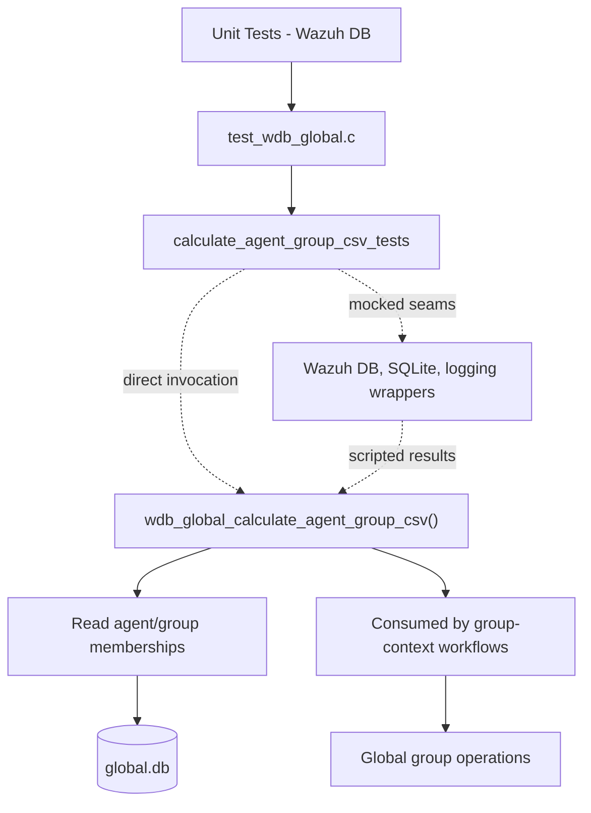
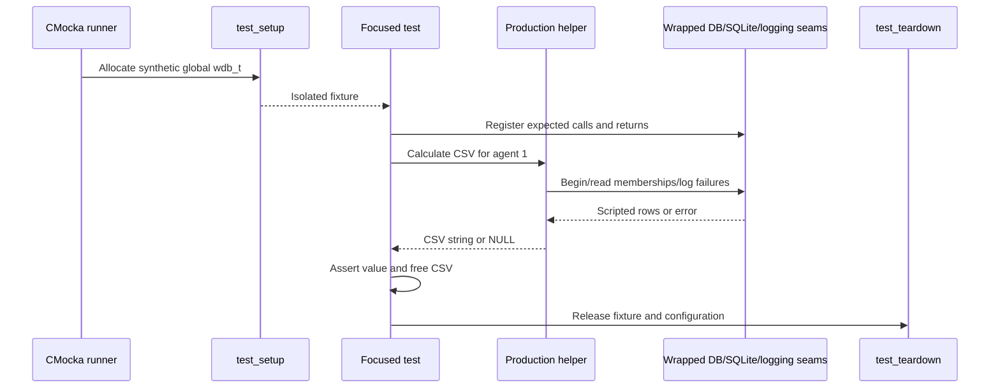
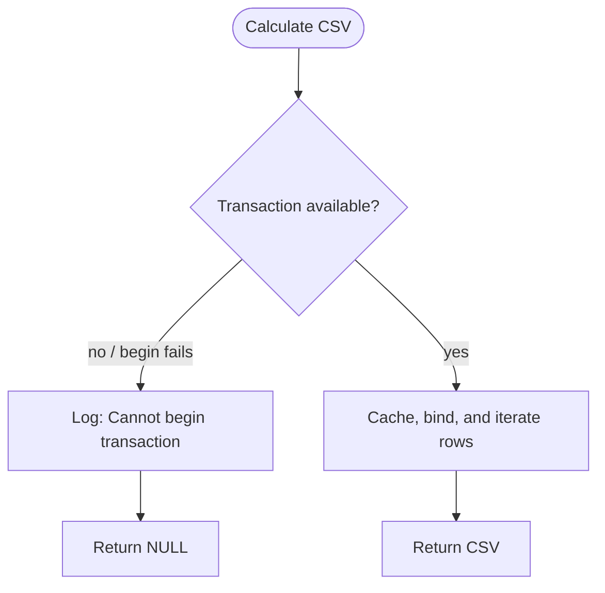

# `calculate_agent_group_csv_tests`

## Introduction

`calculate_agent_group_csv_tests` is the focused CMocka coverage for
`wdb_global_calculate_agent_group_csv()` in
`src/unit_tests/wazuh_db/test_wdb_global.c`. The production helper reads an
agent's group memberships from the global Wazuh DB and converts the ordered
group names into a comma-separated string used by the agent group context.

This module contains two tests. They invoke the production helper directly and
replace transaction, statement-cache, SQLite, and logging boundaries with
linker wrappers. The production database implementation is documented in
[`wazuh_db_global.md`](wazuh_db_global.md); the complete neighboring test
coverage is in [`test_wdb_global.md`](test_wdb_global.md).

## Scope and responsibilities

| Test | Scenario | Expected result |
|---|---|---|
| `test_wdb_global_calculate_agent_group_csv_success` | The group-membership query returns `group1` followed by `group2`, then reaches `SQLITE_DONE`. | Allocated string `"group1,group2"` |
| `test_wdb_global_calculate_agent_group_csv_unable_to_get_group` | The helper cannot begin the transaction needed to read memberships. | `NULL`; diagnostic `Cannot begin transaction` |

The tests verify output construction and the immediate transaction failure
path. They do not test group assignment, group validation, hash calculation, or
group-context persistence; those behaviors are covered by
[`assign_agent_group_tests.md`](assign_agent_group_tests.md),
[`test_wdb_global.md`](test_wdb_global.md), and
[`add_global_group_hash_to_response_tests.md`](add_global_group_hash_to_response_tests.md).

## Position in the system

The helper belongs to the global database/group-management layer. Higher-level
operations such as deleting a group or setting an agent's groups recalculate
the CSV before persisting the agent's group context. In production, callers
reach this code through Wazuh DB operations; the focused test bypasses that
transport and supplies a synthetic `wdb_t`.



## Test harness architecture

Both cases are registered in `main()` with
`cmocka_unit_test_setup_teardown`. The shared fixture allocates a minimal
`wdb_t`, sets its database ID to `global`, allocates a placeholder SQLite
handle, initializes Wazuh DB configuration, and allocates an output buffer.
Teardown frees the fixture and calls `wdb_free_conf()`.

Shared fixture and wrapper behavior is documented in
[`test_wdb_global_test_infrastructure.md`](test_wdb_global_test_infrastructure.md)
and [`Unit_Test_Wrappers_&_Mocks.md`](Unit_Test_Wrappers_&_Mocks.md).



## Production interaction under test

The success case demonstrates the read-side path. Because the fixture marks
`wdb->transaction` as active, the helper starts at statement caching, binds the
agent ID as parameter 1, and consumes rows from the membership statement. Each
row supplies a group name from SQLite column 0. The names are appended in query
order with commas between adjacent values. When `wdb_step()` returns
`SQLITE_DONE`, the helper returns the heap-allocated CSV.

```mermaid
flowchart LR
    Start([Agent ID]) --> Tx["Ensure/read within WDB transaction"]
    Tx --> Cache["Cache group-membership statement"]
    Cache --> Bind["Bind agent ID"]
    Bind --> Step{wdb_step()}
    Step -->|SQLITE_ROW| Name["Read column 0 group name"]
    Name --> Append["Append name to CSV\ninsert comma when needed"]
    Append --> Step
    Step -->|SQLITE_DONE| Return["Return allocated CSV"]
    Tx -.failure.-> Null([NULL])
    Cache -.failure.-> Null
    Bind -.failure.-> Null
    Step -.SQL error.-> Null
```

The test scripts the following interaction for `agent_id = 1`:

```mermaid
sequenceDiagram
    participant T as Test
    participant F as calculate_agent_group_csv
    participant DB as WDB/SQLite wrappers

    T->>F: agent_id = 1
    F->>DB: wdb_stmt_cache()
    DB-->>F: OS_SUCCESS
    F->>DB: sqlite3_bind_int(index=1, value=1)
    DB-->>F: SQLITE_OK
    F->>DB: wdb_step()
    DB-->>F: SQLITE_ROW; column 0 = group1
    F->>DB: wdb_step()
    DB-->>F: SQLITE_ROW; column 0 = group2
    F->>DB: wdb_step()
    DB-->>F: SQLITE_DONE
    F-->>T: "group1,group2"
```

The test creates a cJSON array containing the same two names, but the
production helper's exercised input is the scripted SQLite row/column stream.
The array is test-owned and explicitly deleted after the assertion; it does
not represent the helper's return type.

## Failure behavior

`test_wdb_global_calculate_agent_group_csv_unable_to_get_group` sets
`data->wdb->transaction = 0` and makes `wdb_begin2()` return `OS_INVALID`.
The wrapper expectation verifies the debug message `Cannot begin transaction`.
The helper stops before statement caching or SQLite binding and returns `NULL`.



This is a fail-fast contract: callers must treat a null result as an inability
to reconstruct the agent's group context, rather than as an empty group list.
The distinction matters to callers that subsequently decide whether to update
the stored group CSV/hash; see [`wazuh_db_global.md`](wazuh_db_global.md).

## Dependency map

| Dependency | Role in this module |
|---|---|
| `wdb_global_calculate_agent_group_csv()` | Function under test; builds the CSV from group rows. |
| `wdb_begin2()` | Controls the transaction-start failure case. |
| `wdb_stmt_cache()` | Controls prepared-statement setup in the success case. |
| `sqlite3_bind_int()` | Verifies agent ID binding at parameter index 1. |
| `wdb_step()` | Supplies two rows and the terminal `SQLITE_DONE`. |
| `sqlite3_column_text()` | Supplies `group1` and `group2` from column 0. |
| Debug logging wrapper | Verifies the transaction failure diagnostic. |
| cJSON and allocation helpers | Build test data and manage fixture/result ownership. |

The wrapper implementations and linker-isolation policy are shared with the
other global-operation tests and should not be duplicated here. See
[`test_wdb_global_test_infrastructure.md`](test_wdb_global_test_infrastructure.md)
and [`Unit_Test_Wrappers_&_Mocks.md`](Unit_Test_Wrappers_&_Mocks.md).

## Observable contracts

The two tests establish these maintainership-relevant contracts:

- group names preserve database row order;
- the CSV separator is inserted only between names, producing
  `group1,group2` rather than a leading or trailing comma;
- the agent ID is bound as the first SQLite parameter;
- iteration terminates normally on `SQLITE_DONE`;
- transaction setup failure returns `NULL` and emits the expected diagnostic;
- a successful CSV is heap allocated and must be released by its caller.

## Source references

- `src/unit_tests/wazuh_db/test_wdb_global.c`
- `src/wazuh_db/wdb_global.c`
- `src/wazuh_db/wdb.h`
- `src/unit_tests/wrappers/wazuh/wazuh_db/wdb_wrappers.h`
- [`test_wdb_global.md`](test_wdb_global.md)
- [`wazuh_db_global.md`](wazuh_db_global.md)
