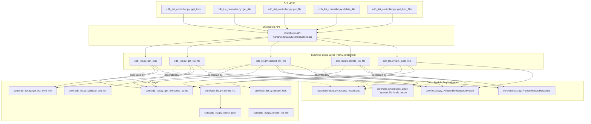
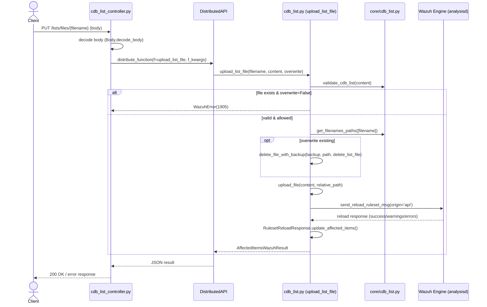

# CDB List Module

## 1. Introduction & Purpose

The **CDB List Module** provides full lifecycle management for Wazuh **CDB (Constant Database) lists** — simple `key:value` flat-file lookup tables used extensively by the Wazuh ruleset (e.g., `<list>` fields in decoder/rule configurations, `lookup` operations, blacklist/whitelist checks). Typical use cases include lists of malicious IPs, usernames, file hashes, or any other key-value dataset that rules need to reference at detection time.

This module exposes REST API endpoints to:

- **List** all CDB lists and their paths (`GET /lists`, `GET /lists/files`)
- **Read** the content of a specific CDB list, in JSON or raw format (`GET /lists/files/{filename}`)
- **Create/Update** a CDB list file (`PUT /lists/files/{filename}`)
- **Delete** a CDB list file (`DELETE /lists/files/{filename}`)

Every write operation (upload/delete) triggers a **ruleset reload** in the Wazuh Engine so that changes take effect immediately without requiring a manager restart.

The module is a small but complete example of the standard **3-layer Wazuh Framework architecture**: API Controller → Framework Business Logic (RBAC-wrapped) → Core I/O utilities. For general information about this shared architecture pattern, request routing, and RBAC enforcement, see [api_core_infrastructure.md](api_core_infrastructure.md) and [security_rbac_module.md](security_rbac_module.md).

---

## 2. Architecture Overview

### 2.1 Layered Structure

The module is composed of exactly three files, each corresponding to one architectural layer:

| Layer | File | Responsibility |
|---|---|---|
| **API Controller** | `api/api/controllers/cdb_list_controller.py` | Handles HTTP requests/responses, parameter parsing, and dispatches work via the Distributed API (DAPI). |
| **Business Logic** | `framework/wazuh/cdb_list.py` | Implements RBAC-protected operations (list, read, upload, delete), orchestrates validation, backup/restore, and ruleset reload. |
| **Core I/O** | `framework/wazuh/core/cdb_list.py` | Low-level file parsing, CDB format validation, and path-safety checks (protecting against path traversal). |

### 2.2 Component Diagram



> Note: `check_path` is used to validate that a requested relative path stays within `etc/lists/` (preventing directory traversal such as `../../etc/passwd`), while `create_list_file` handles low-level file writing with proper permission bits.

### 2.3 Request Flow (Upload Example)



---

## 3. Core Components

### 3.1 API Controller — `api/api/controllers/cdb_list_controller.py`

Async FastAPI/Connexion-style controller functions. Each function builds an `f_kwargs` dictionary from request parameters and delegates execution to a `DistributedAPI` instance (`request_type='local_master'`), which is the standard mechanism used across all Wazuh API modules to support both single-node and clustered execution. See [cluster_dapi.md](cluster_dapi.md) for details on how `DistributedAPI` routes requests across master/worker nodes.

| Function | HTTP Endpoint | Delegates to |
|---|---|---|
| `get_lists` | `GET /lists` | `wazuh.cdb_list.get_lists` |
| `get_file` | `GET /lists/files/{filename}` | `wazuh.cdb_list.get_list_file` |
| `put_file` | `PUT /lists/files/{filename}` | `wazuh.cdb_list.upload_list_file` |
| `delete_file` | `DELETE /lists/files/{filename}` | `wazuh.cdb_list.delete_list_file` |
| `get_lists_files` | `GET /lists/files` | `wazuh.cdb_list.get_path_lists` |

Notable behaviors:
- `get_file` supports a `raw` query parameter: when `True`, the response `Content-Type` is `text/plain` (raw file contents); otherwise a structured JSON (`AffectedItemsWazuhResult`) is returned.
- `put_file` validates that the request body's content type is `application/octet-stream` and decodes it using `Body.decode_body` with specific error codes (`1911`/`1912`) for decoding failures.

### 3.2 Business Logic — `framework/wazuh/cdb_list.py`

All functions are decorated with `@expose_resources` (see [security_rbac_module.md](security_rbac_module.md#preprocessor--decorators)), which enforces RBAC permission checks (`lists:read`, `lists:update`, `lists:delete`) scoped to specific resources such as `list:file:{filename}` before the function body executes.

| Function | RBAC Action | Description |
|---|---|---|
| `get_lists` | `lists:read` | Returns parsed key-value content of one or more CDB lists, supporting pagination, sorting, search, and query filtering via `process_array`. |
| `get_list_file` | `lists:read` | Returns a single list's content (dict or raw string). |
| `upload_list_file` | `lists:update` | Validates format, checks for path collisions, creates automatic backups when overwriting, writes the file, and triggers a ruleset reload. |
| `delete_list_file` | `lists:delete` | Removes a CDB list file (and its compiled `.cdb` counterpart) and triggers a ruleset reload. |
| `get_path_lists` | `lists:read` | Returns only the file paths (filename + relative dirname) of all CDB lists, without content — useful for lightweight enumeration. |

**Key design elements:**
- **Backup & Restore Safety**: `upload_list_file` creates a `.backup` copy before overwriting an existing file. If any exception occurs during the write or reload process, the backup is restored via `safe_move`, ensuring the CDB list is never left in a corrupted intermediate state.
- **Ruleset Reload Integration**: Both `upload_list_file` and `delete_list_file` call `send_reload_ruleset_msg` (from `framework/wazuh/core/analysis.py`) after modifying files, and wrap the response in a `RulesetReloadResponse` object. This class parses success/warning/error state from the Engine and either appends a warning message to the result or raises a `WazuhError(1811)` if the reload fails. See [engine_module.md](engine_module.md) for details on the underlying Engine communication.
- **Result Aggregation**: All functions return a `wazuh.core.results.AffectedItemsWazuhResult`, the standard Wazuh pattern for reporting partial success/failure across multiple affected items (see [framework_core_utils.md](framework_core_utils.md#results)).

### 3.3 Core I/O — `framework/wazuh/core/cdb_list.py`

Contains the lowest-level utilities with no RBAC or API awareness — pure file and format manipulation.

| Function | Purpose |
|---|---|
| `check_path` | Validates a relative path against the regex `^(etc/lists/)[\w\.\-/]+$`, blocking `./` and `../` sequences to prevent path traversal (raises `WazuhError(1801)`). |
| `create_list_file` | Writes list content to disk line-by-line (skipping blank lines) and sets file permissions (default `0o660`). |
| `iterate_lists` | Recursively walks the CDB lists directory tree, returning either full content or just filenames (`only_names=True`), skipping `.cdb` compiled files and `.swp` temp files. |
| `split_key_value_with_quotes` | Handles parsing edge cases where the key and/or value in a `key:value` line are wrapped in double quotes (to allow embedded colons). |
| `get_list_from_file` | Reads and parses a CDB list file into a dict (or returns raw text if `raw=True`); maps OS-level errors (`ENOENT`, `EACCES`, `EISDIR`) to specific `WazuhError` codes (`1802`, `1803`, `1804`). |
| `validate_cdb_list` | Validates the entire textual content of a list against the CDB format regex before allowing it to be persisted; raises `WazuhError(1800)` (bad format) or `WazuhError(1112)` (empty content). |
| `delete_list` | Deletes both the source list file and its compiled `.cdb` binary counterpart (if present), using the shared `delete_wazuh_file` utility (see [framework_core_utils.md](framework_core_utils.md)). |
| `get_filenames_paths` | Resolves a list of filenames into their full absolute paths by recursively searching under `etc/lists/` (`root_directory` defaults to `common.USER_LISTS_PATH`). |

**CDB Format Validation Rules** (`validate_cdb_list`):
```
key:value
"key:with:colons":value
"key":"value:with:colons"
```
Any line where the key or value contains a colon (`:`) **must** be wrapped in double quotes; otherwise `WazuhError(1800)` is raised.

---

## 4. Error Codes Reference

| Code | Meaning |
|---|---|
| `1800` | Bad format in CDB list content. |
| `1801` | Invalid/unsafe list path (path traversal attempt). |
| `1802` | CDB list file not found. |
| `1803` | Permission error reading list file. |
| `1804` | Error reading list file (e.g., path is a directory). |
| `1805` | Filename collision with an existing file in a different subdirectory. |
| `1806` | Error creating CDB list file. |
| `1811` | Ruleset reload failed after list modification. |
| `1112` | Empty CDB list content submitted. |
| `1905` | File already exists and `overwrite=False`. |

---

## 5. Interactions with Other Modules

- **[security_rbac_module.md](security_rbac_module.md)**: Supplies the `@expose_resources` decorator and the underlying RBAC permission model (`lists:read`, `lists:update`, `lists:delete`) that gate every business-logic function.
- **[cluster_dapi.md](cluster_dapi.md)** (part of `cluster_module`): Provides `DistributedAPI`, the mechanism the controller uses to route requests to the correct cluster node (master-only execution, since CDB list files are managed centrally).
- **[engine_module.md](engine_module.md)**: The `RulesetReloadResponse` class and `send_reload_ruleset_msg` function interface with the Wazuh Engine's ruleset reload socket API, ensuring updated lists are picked up by the detection pipeline without a full restart.
- **[framework_core_utils.md](framework_core_utils.md)**: Supplies generic utilities reused here — `process_array` (pagination/sorting/search), `AffectedItemsWazuhResult` (standard result container), `upload_file`/`safe_move`/`delete_file_with_backup` (safe file operations), and `to_relative_path`.
- **[api_core_infrastructure.md](api_core_infrastructure.md)**: The controller relies on shared API infrastructure (authentication, request parsing helpers like `parse_api_param`, JSON encoding) documented there.
- **[rule_module.md](rule_module.md)** / **[decoder_module.md](decoder_module.md)**: Rules and decoders are the primary consumers of CDB lists at runtime (via `<list>` lookups), making this module a supporting/configuration component for the detection engine's rule/decoder ecosystem.

---

## 6. Data Model Summary

A CDB list resource, as returned by `get_lists`, has the shape:

```json
{
  "relative_dirname": "etc/lists/amazon",
  "filename": "aws-eventnames",
  "items": [
    { "key": "AssumeRole", "value": "authentication" },
    { "key": "ConsoleLogin", "value": "authentication" }
  ]
}
```

`get_path_lists` returns the same objects without the `items` field, for lightweight discovery/enumeration use cases.
