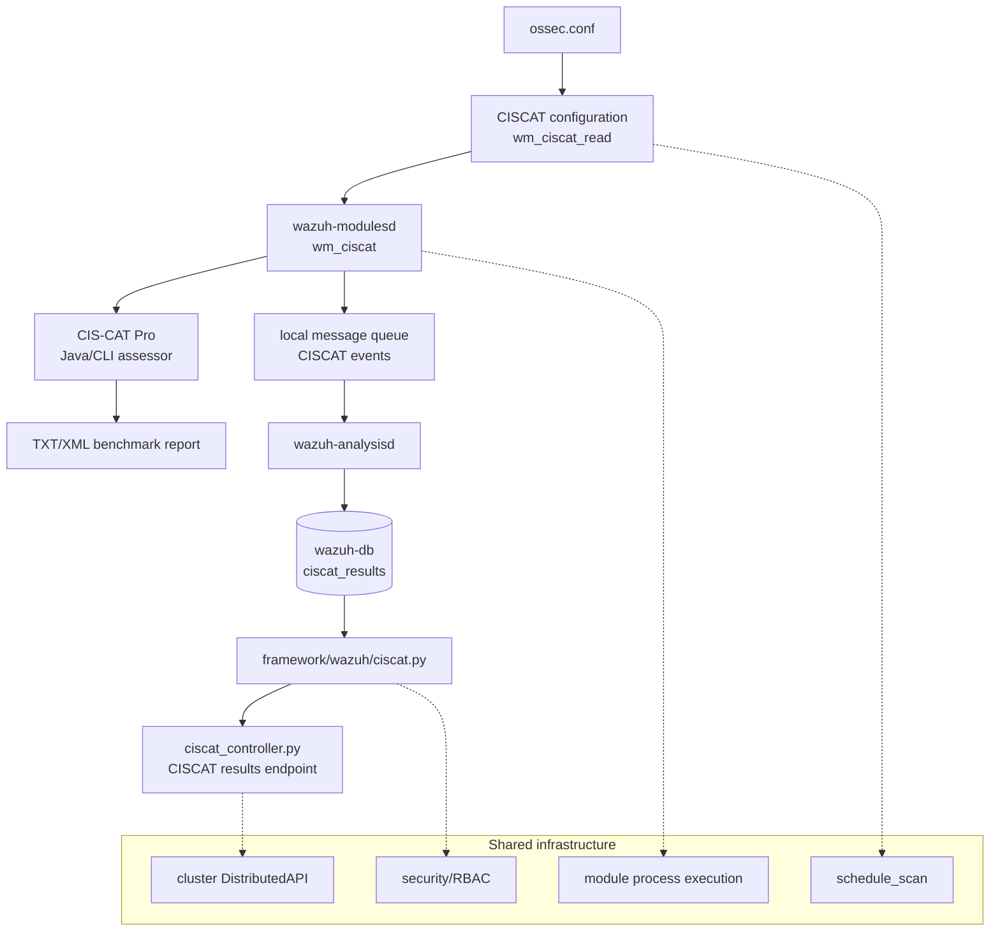
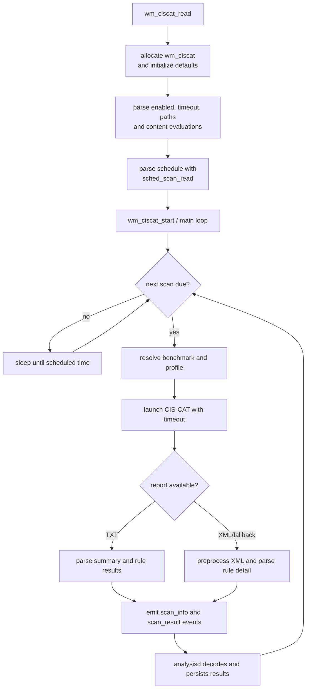
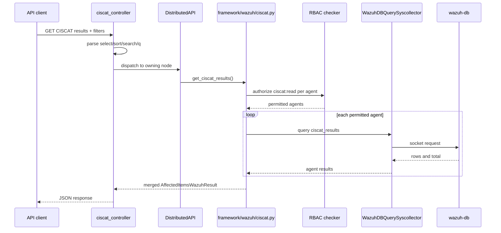
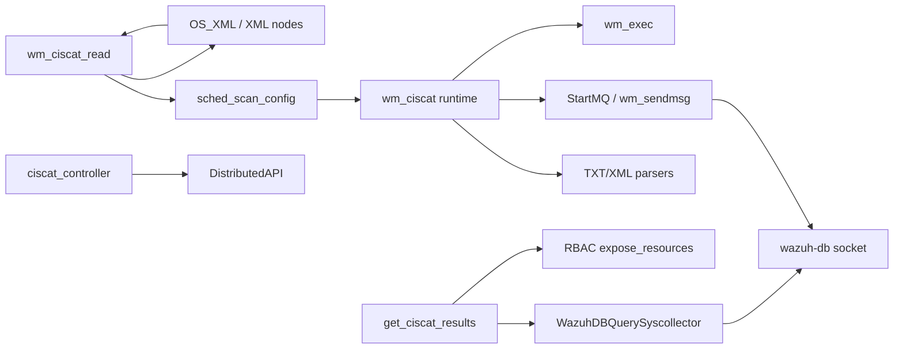
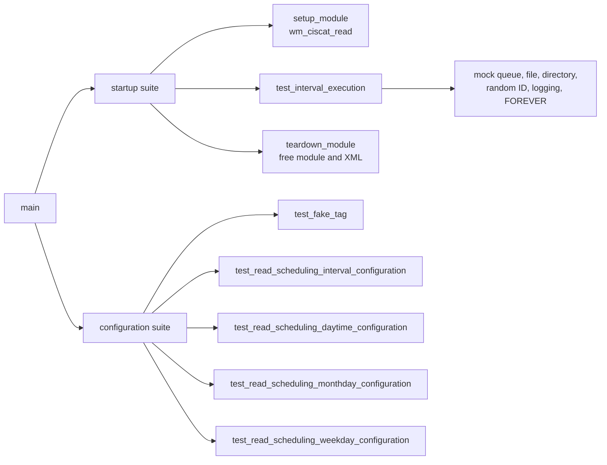

# CISCAT module

The CISCAT module integrates CIS-CAT benchmark assessment into Wazuh. It has two
closely related responsibilities:

1. The native `wazuh-modulesd` component (`wm_ciscat`) schedules and runs CIS-CAT
   against configured XCCDF content, then publishes scan results.
2. The Python API/framework path reads the persisted results and exposes them to
   API clients for filtering, sorting, pagination, and RBAC-controlled access.

The supplied unit test focuses on configuration parsing and scheduling behavior;
the runtime and API components are represented by the module tree and linked
documentation below.

## Position in Wazuh

The native daemon belongs to the compliance-scanner group beside OpenSCAP and
SCA. See [wazuh_modules_core_compliance_scanners_ciscat.md](wazuh_modules_core_compliance_scanners_ciscat.md)
for the detailed native implementation and
[wazuh_modules_core_compliance_scanners.md](wazuh_modules_core_compliance_scanners.md)
for sibling relationships. Generic module lifecycle behavior is documented in
[wazuh_modules_core_lifecycle.md](wazuh_modules_core_lifecycle.md).

## Native runtime

### Configuration model

`wm_ciscat` stores module-wide settings and a linked list of benchmark evaluations.
The important fields are:

| Setting | Meaning |
| --- | --- |
| `disabled` | Disables the module when set to `yes`. |
| `timeout` | Maximum execution time for an assessment. |
| `scan-on-start` | Controls whether the first scan runs immediately. |
| `interval` | Recurring interval such as `3m` or `1h`. |
| `time` | Time of day for calendar-based schedules. |
| `day` | Day of month; scheduling is normalized to a monthly interval. |
| `wday` | Day of week; scheduling is normalized to a weekly interval. |
| `java_path` | Directory containing the Java runtime used by CIS-CAT. |
| `ciscat_path` | CIS-CAT installation/root directory. |
| `content type="xccdf" path="..."` | Benchmark file and optional profile. |

The test fixture in `test_wm_ciscat.c` uses one XCCDF benchmark and verifies that
the parser accepts the above settings. OVAL content is not the normal supported
assessment path.

Scheduling is delegated to the shared `sched_scan_config` implementation rather
than reimplemented in CISCAT. See
[shared_lib_system_utils_config_scheduling.md](shared_lib_system_utils_config_scheduling.md).

### Execution flow

At startup the native module validates its evaluation list, restores scheduling
state, and opens the message queue. Each cycle generates a scan identifier,
executes every configured evaluation, and sends:

- `scan_info`: benchmark/profile, host, timestamp, counters, and score.
- `scan_result`: rule identifier, title, group, result, and—when available—
  description, rationale, and remediation.

The report parser prefers the text report and can fall back to XML to recover
richer rule metadata. Process execution, queue primitives, and daemon mechanics
are shared with other wodles; see
[shared_lib.md](shared_lib.md) and
[wazuh_modules_core.md](wazuh_modules_core.md).

## API and persistence path

The API business layer maps public fields to the persisted `ciscat_results`
columns:

| API field | Stored field |
| --- | --- |
| `scan.id` | `scan_id` |
| `scan.time` | `scan_time` |
| `benchmark`, `profile` | same name |
| `pass`, `fail`, `error` | same name |
| `unknown`, `notchecked`, `score` | same name |

The controller is `api/api/controllers/ciscat_controller.py::get_agents_ciscat_results`;
the framework implementation is
`framework/wazuh/ciscat.py::get_ciscat_results`. It validates agent existence,
applies RBAC, queries each agent database, tags rows with `agent_id`, and merges
the results. Detailed API conventions are in [ciscat_module.md](ciscat_module.md).

The same low-level query and database communication concepts are shared with
[syscollector_module.md](syscollector_module.md),
[framework_core_communication.md](framework_core_communication.md), and
[wazuh_db.md](wazuh_db.md).

## Component dependencies

Key boundaries:

- XML parsing and configuration ownership are shared with the configuration
  subsystem; see [Configuration_Data_Structures_(C_Headers).md](Configuration_Data_Structures_(C_Headers).md).
- Scheduling is shared and tested independently; CISCAT only supplies the
  configured values.
- Persistence is downstream of the native module. CISCAT does not directly
  write SQLite; decoded events reach `wazuh-db` through the normal analysis path.
- The API does not run a benchmark. It is a read-only projection over stored
  results.

## Test coverage

`src/unit_tests/wazuh_modules/ciscat/test_wm_ciscat.c` uses CMocka and groups
tests into startup and parser-only suites.

The tests verify:

- Unknown tags fail with an explicit configuration error.
- `1h` becomes a 3600-second interval.
- A month-day schedule stores `scan_day=5`, `interval=1`, and
  `month_interval=true`, while warning that the interval is normalized to `1M`.
- A Wednesday schedule stores the expected weekday and 604800-second interval,
  with normalization to `1w`.
- A time-only schedule retains the default interval and stores the requested time.
- The runtime loop reports a missing benchmark file and performs cleanup without
  touching real queues or processes, because queue, filesystem, random, and loop
  behavior are mocked.

The test source is `src/unit_tests/wazuh_modules/ciscat/test_wm_ciscat.c` in the
repository; its test names correspond directly to the cases listed above.

## Operational considerations

- Verify `ciscat_path`, `java_path`, benchmark paths, and profiles on the target
  agent. A missing benchmark prevents a useful assessment and is logged by the
  module.
- Keep the execution timeout aligned with benchmark size; CIS-CAT is an external
  process and can exceed short intervals.
- Treat schedule normalization as intentional: day-of-month and weekday schedules
  are converted to monthly and weekly intervals by shared scheduling logic.
- API consumers should expect partial results when some requested agents do not
  exist or are not authorized.

## Related modules

- [ciscat_module.md](ciscat_module.md) — detailed API/framework implementation.
- [wazuh_modules_core_compliance_scanners_ciscat.md](wazuh_modules_core_compliance_scanners_ciscat.md) — detailed native scanner implementation.
- [wazuh_modules_core_compliance_scanners_sca.md](wazuh_modules_core_compliance_scanners_sca.md) — sibling compliance scanner.
- [wazuh_modules_core_compliance_scanners_oscap.md](wazuh_modules_core_compliance_scanners_oscap.md) — sibling external scanner.
- [security_rbac_module.md](security_rbac_module.md) — authorization model used by the API path.
- [cluster_module.md](cluster_module.md) — distributed API routing.
